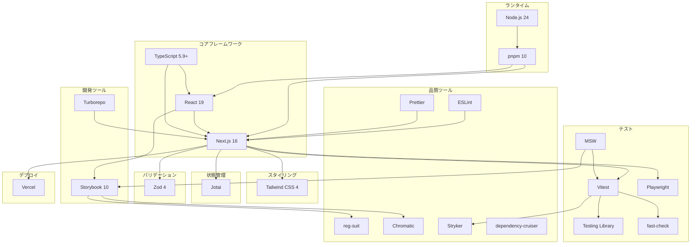
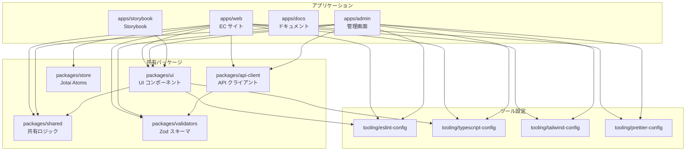
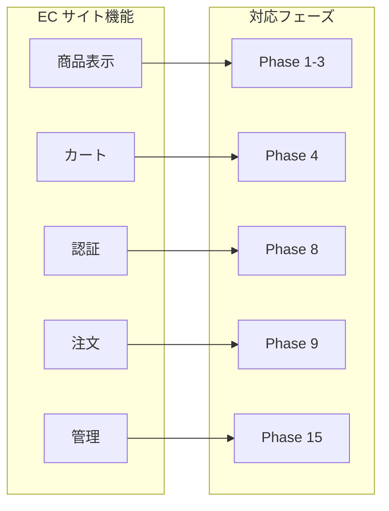
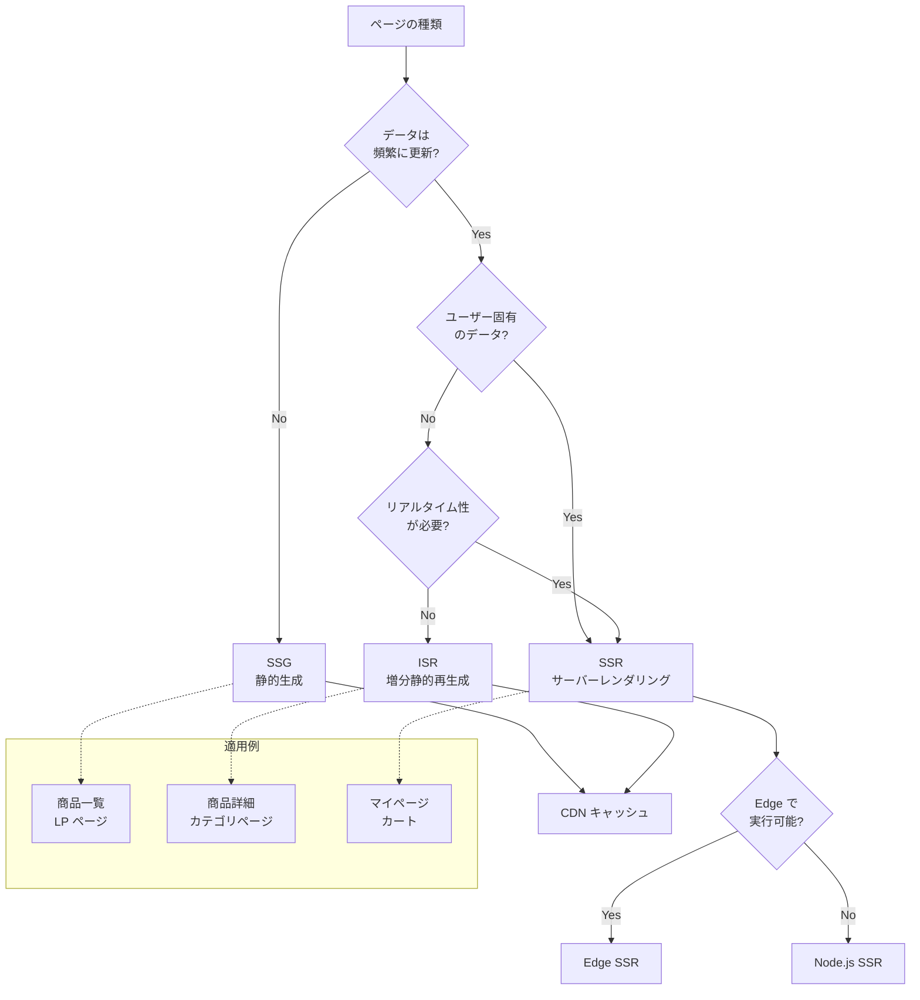
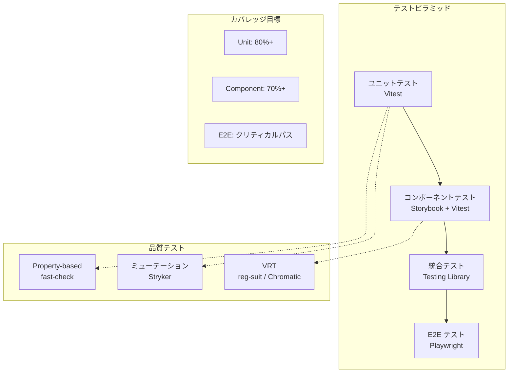
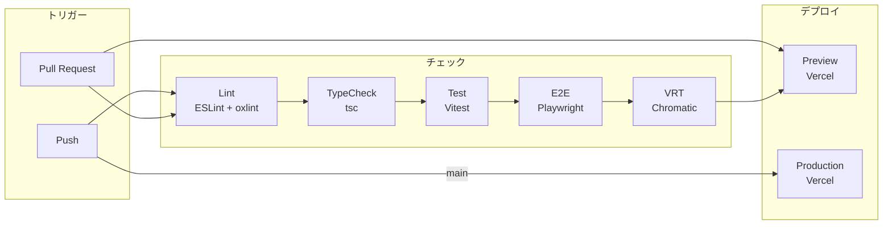
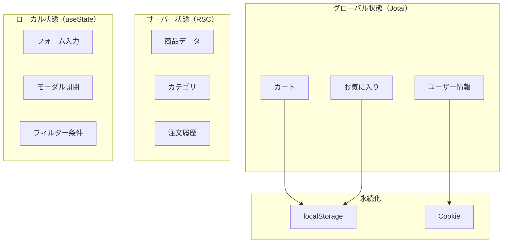

# 技術関連図

フェーズ間の依存関係と技術スタックの関連を可視化しています。

---

## フェーズ依存関係図

```mermaid
flowchart TD
    subgraph Part0["Part 0: プロジェクト基盤"]
        P0[Phase 0: モノレポ + Git/CI + Vercel]
    end

    subgraph Part1["Part 1: 基礎固め"]
        P1[Phase 1: React 基礎]
        P2[Phase 2: Next.js App Router]
        P3[Phase 3: コンポーネント設計]
    end

    subgraph Part2["Part 2: データと状態"]
        P4[Phase 4: Jotai 状態管理]
        P5[Phase 5: データ取得 + MSW]
    end

    subgraph Part3["Part 3: テスト"]
        P6[Phase 6: TDD]
    end

    subgraph Part4["Part 4: フルスタック"]
        P7[Phase 7: フォーム + Zod]
        P8[Phase 8: 認証]
        P9[Phase 9: 注文フロー]
    end

    subgraph Part5["Part 5: 最適化と SEO"]
        P10[Phase 10: パフォーマンス]
        P11[Phase 11: SEO + SSG + LP]
    end

    subgraph Part6["Part 6: 品質とツール"]
        P12[Phase 12: VRT + Stryker]
    end

    subgraph Part7["Part 7: 最新機能"]
        P13[Phase 13: React 19 / Next.js 16]
        P14[Phase 14: Error Handling]
    end

    subgraph Part8["Part 8: 管理画面"]
        P15[Phase 15: Admin Panel]
    end

    subgraph Part9["Part 9: 拡張機能"]
        P16[Phase 16: i18n]
        P17[Phase 17: Analytics]
        P18[Phase 18: PWA]
    end

    P0 --> P1
    P1 --> P2
    P2 --> P3
    P3 --> P4
    P4 --> P5
    P5 --> P6
    P6 --> P7
    P7 --> P8
    P8 --> P9
    P9 --> P10
    P10 --> P11
    P11 --> P12
    P12 --> P13
    P13 --> P14
    P14 --> P15
    P15 --> P16
    P16 --> P17
    P17 --> P18
```

---

## 技術スタック依存図

---

## モノレポ パッケージ依存図

---

## EC サイト機能とフェーズの対応

---

## レンダリング戦略の選択フロー

---

## テスト戦略ピラミッド

---

## CI/CD パイプライン

---

## 状態管理のスコープ

