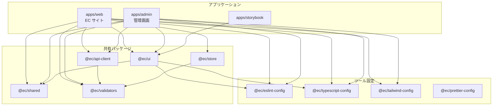

# モノレポ構成

Turborepo + pnpm workspace を使用した EC サイト向けモノレポ構成の詳細です。

---

## ディレクトリ構造

```text
ec-monorepo/
├── turbo.json                   # Turborepo 設定
├── pnpm-workspace.yaml          # pnpm ワークスペース設定
├── package.json                 # ルート package.json
├── .github/
│   └── workflows/
│       ├── ci.yml               # CI パイプライン
│       └── deploy.yml           # デプロイ
│
├── apps/                        # アプリケーション
│   ├── web/                     # メイン EC サイト（Next.js）
│   │   ├── app/
│   │   │   ├── (shop)/          # 顧客向けページ
│   │   │   │   ├── page.tsx
│   │   │   │   ├── products/
│   │   │   │   ├── cart/
│   │   │   │   └── checkout/
│   │   │   ├── api/             # API Routes
│   │   │   └── layout.tsx
│   │   ├── package.json
│   │   ├── next.config.ts
│   │   └── tsconfig.json
│   │
│   ├── admin/                   # 管理画面（Next.js）
│   │   ├── app/
│   │   │   ├── (dashboard)/
│   │   │   │   ├── products/
│   │   │   │   ├── orders/
│   │   │   │   └── users/
│   │   │   └── layout.tsx
│   │   ├── package.json
│   │   └── tsconfig.json
│   │
│   ├── docs/                    # ドキュメントサイト（任意）
│   │   └── ...
│   │
│   └── storybook/               # Storybook（独立アプリ）
│       ├── .storybook/
│       │   ├── main.ts
│       │   └── preview.ts
│       └── package.json
│
├── packages/                    # 共有パッケージ
│   ├── ui/                      # 共有 UI コンポーネント
│   │   ├── src/
│   │   │   ├── components/
│   │   │   │   ├── Button/
│   │   │   │   │   ├── Button.tsx
│   │   │   │   │   ├── Button.stories.tsx
│   │   │   │   │   ├── Button.test.tsx
│   │   │   │   │   └── index.ts
│   │   │   │   ├── Card/
│   │   │   │   ├── Modal/
│   │   │   │   ├── Form/
│   │   │   │   │   ├── Input/
│   │   │   │   │   ├── Select/
│   │   │   │   │   └── Checkbox/
│   │   │   │   └── ...
│   │   │   └── index.ts
│   │   ├── package.json
│   │   └── tsconfig.json
│   │
│   ├── shared/                  # 共有ビジネスロジック
│   │   ├── src/
│   │   │   ├── hooks/           # 共有カスタムフック
│   │   │   │   ├── useDebounce.ts
│   │   │   │   ├── useMediaQuery.ts
│   │   │   │   └── index.ts
│   │   │   ├── utils/           # ユーティリティ関数
│   │   │   │   ├── format.ts    # 通貨、日付フォーマット
│   │   │   │   ├── validation.ts
│   │   │   │   └── index.ts
│   │   │   ├── types/           # 共有型定義
│   │   │   │   ├── product.ts
│   │   │   │   ├── user.ts
│   │   │   │   ├── order.ts
│   │   │   │   └── index.ts
│   │   │   └── constants/       # 定数
│   │   │       ├── routes.ts
│   │   │       └── index.ts
│   │   └── package.json
│   │
│   ├── api-client/              # API クライアント
│   │   ├── src/
│   │   │   ├── client.ts        # fetch ラッパー
│   │   │   ├── endpoints/
│   │   │   │   ├── products.ts
│   │   │   │   ├── orders.ts
│   │   │   │   ├── users.ts
│   │   │   │   └── index.ts
│   │   │   └── types/           # API レスポンス型
│   │   └── package.json
│   │
│   ├── validators/              # Zod スキーマ
│   │   ├── src/
│   │   │   ├── product.ts
│   │   │   ├── user.ts
│   │   │   ├── order.ts
│   │   │   ├── address.ts
│   │   │   └── index.ts
│   │   └── package.json
│   │
│   └── store/                   # Jotai Atoms
│       ├── src/
│       │   ├── cart/
│       │   │   ├── atoms.ts
│       │   │   ├── actions.ts
│       │   │   └── index.ts
│       │   ├── user/
│       │   ├── favorites/
│       │   └── index.ts
│       └── package.json
│
└── tooling/                     # 開発ツール設定
    ├── eslint-config/           # 共有 ESLint 設定
    │   ├── base.js
    │   ├── next.js
    │   ├── react.js
    │   └── package.json
    │
    ├── typescript-config/       # 共有 TypeScript 設定
    │   ├── base.json
    │   ├── next.json
    │   ├── react-library.json
    │   └── package.json
    │
    ├── tailwind-config/         # 共有 Tailwind 設定
    │   ├── tailwind.config.ts
    │   └── package.json
    │
    └── prettier-config/         # 共有 Prettier 設定
        ├── index.js
        └── package.json
```

---

## 設定ファイル例

### turbo.json

```json
{
  "$schema": "https://turbo.build/schema.json",
  "ui": "tui",
  "globalDependencies": ["**/.env.*local"],
  "tasks": {
    "build": {
      "dependsOn": ["^build"],
      "outputs": [".next/**", "!.next/cache/**", "dist/**"]
    },
    "lint": {
      "dependsOn": ["^build"]
    },
    "typecheck": {
      "dependsOn": ["^build"]
    },
    "test": {
      "dependsOn": ["^build"]
    },
    "test:watch": {
      "cache": false,
      "persistent": true
    },
    "dev": {
      "cache": false,
      "persistent": true
    },
    "storybook": {
      "cache": false,
      "persistent": true
    }
  }
}
```

### pnpm-workspace.yaml

```yaml
packages:
  - "apps/*"
  - "packages/*"
  - "tooling/*"
```

### ルート package.json

```json
{
  "name": "ec-monorepo",
  "private": true,
  "scripts": {
    "dev": "turbo dev",
    "dev:web": "turbo dev --filter=web",
    "dev:admin": "turbo dev --filter=admin",
    "build": "turbo build",
    "lint": "turbo lint",
    "typecheck": "turbo typecheck",
    "test": "turbo test",
    "storybook": "turbo storybook --filter=storybook"
  },
  "devDependencies": {
    "turbo": "^2.3.0"
  },
  "packageManager": "pnpm@10.0.0",
  "engines": {
    "node": ">=24.0.0",
    "pnpm": ">=10.0.0"
  }
}
```

### apps/web/package.json

```json
{
  "name": "web",
  "version": "0.0.1",
  "private": true,
  "scripts": {
    "dev": "next dev --port 3000",
    "build": "next build",
    "start": "next start",
    "lint": "eslint . --max-warnings 0",
    "typecheck": "tsc --noEmit",
    "test": "vitest"
  },
  "dependencies": {
    "@ec/ui": "workspace:*",
    "@ec/shared": "workspace:*",
    "@ec/api-client": "workspace:*",
    "@ec/validators": "workspace:*",
    "@ec/store": "workspace:*",
    "next": "^16.0.0",
    "react": "^19.0.0",
    "react-dom": "^19.0.0"
  },
  "devDependencies": {
    "@ec/eslint-config": "workspace:*",
    "@ec/typescript-config": "workspace:*",
    "@ec/tailwind-config": "workspace:*"
  }
}
```

### packages/ui/package.json

```json
{
  "name": "@ec/ui",
  "version": "0.0.1",
  "private": true,
  "exports": {
    ".": "./src/index.ts",
    "./Button": "./src/components/Button/index.ts",
    "./Card": "./src/components/Card/index.ts"
  },
  "scripts": {
    "lint": "eslint . --max-warnings 0",
    "typecheck": "tsc --noEmit",
    "test": "vitest"
  },
  "dependencies": {
    "@ec/shared": "workspace:*"
  },
  "peerDependencies": {
    "react": "^19.0.0",
    "react-dom": "^19.0.0"
  },
  "devDependencies": {
    "@ec/eslint-config": "workspace:*",
    "@ec/typescript-config": "workspace:*"
  }
}
```

---

## パッケージ間の依存関係



---

## Turborepo のメリット

### 1. ビルドキャッシュ

```bash
# 初回ビルド
$ turbo build
# ... 60秒かかる

# 変更なしで再ビルド（キャッシュヒット）
$ turbo build
# ... 1秒で完了
```

### 2. タスクの並列実行

```bash
# 依存関係を考慮して並列実行
$ turbo build --concurrency=10

# 特定のパッケージのみビルド
$ turbo build --filter=web

# 依存パッケージも含めてビルド
$ turbo build --filter=web...
```

### 3. リモートキャッシュ（Vercel）

```bash
# Vercel とリンク
$ npx turbo login
$ npx turbo link

# CI でもキャッシュを共有
TURBO_TOKEN=${{ secrets.TURBO_TOKEN }}
TURBO_TEAM=${{ vars.TURBO_TEAM }}
```

---

## モノレポのメリット（EC サイト観点）

| メリット           | 説明                              | EC サイトでの例          |
| ------------------ | --------------------------------- | ------------------------ |
| UI 一貫性          | web と admin で同じコンポーネント | Button, Modal, DataTable |
| 型共有             | 商品・注文などの型を一元管理      | Product, Order, User 型  |
| バリデーション共有 | フロント・バックで同じスキーマ    | Zod スキーマ             |
| ビルド高速化       | キャッシュで差分ビルド            | CI 時間短縮              |
| 設定共有           | ESLint/TS/Tailwind 設定一元管理   | コード品質統一           |
| 原子的変更         | 複数パッケージを1つのPRで更新     | 型変更 + UI変更を同時に  |

---

## 開発フロー

### 新しいコンポーネントの追加

```bash
# 1. UI パッケージにコンポーネント作成
packages/ui/src/components/NewComponent/
├── NewComponent.tsx
├── NewComponent.stories.tsx
├── NewComponent.test.tsx
└── index.ts

# 2. エクスポートを追加
# packages/ui/src/index.ts
export * from './components/NewComponent';

# 3. アプリで使用
# apps/web/app/page.tsx
import { NewComponent } from '@ec/ui';
```

### 共有型の追加

```bash
# 1. 型を定義
# packages/shared/src/types/newType.ts
export type NewType = {
  id: string;
  name: string;
};

# 2. エクスポート
# packages/shared/src/types/index.ts
export * from './newType';

# 3. 全パッケージで使用可能
import { NewType } from '@ec/shared';
```

### 開発サーバーの起動

```bash
# 全アプリを起動
pnpm dev

# web のみ起動（依存パッケージも監視）
pnpm dev:web

# admin のみ起動
pnpm dev:admin

# Storybook 起動
pnpm storybook
```

---

## Vercel でのデプロイ設定

### web アプリ

```bash
# Root Directory: apps/web
# Build Command: cd ../.. && turbo build --filter=web
# Install Command: pnpm install
```

### admin アプリ

```bash
# Root Directory: apps/admin
# Build Command: cd ../.. && turbo build --filter=admin
# Install Command: pnpm install
```

### 環境変数

```bash
# Vercel Dashboard で設定
TURBO_TOKEN=xxx           # リモートキャッシュ用
TURBO_TEAM=xxx            # チーム名
```

---

## CI/CD 設定例

### .github/workflows/ci.yml

```yaml
name: CI

on:
  push:
    branches: [main]
  pull_request:

jobs:
  build:
    runs-on: ubuntu-latest

    steps:
      - uses: actions/checkout@v4

      - uses: pnpm/action-setup@v4
        with:
          version: 10

      - uses: actions/setup-node@v4
        with:
          node-version: 24
          cache: "pnpm"

      - run: pnpm install

      - run: pnpm lint
      - run: pnpm typecheck
      - run: pnpm test
      - run: pnpm build

    env:
      TURBO_TOKEN: ${{ secrets.TURBO_TOKEN }}
      TURBO_TEAM: ${{ vars.TURBO_TEAM }}
```
