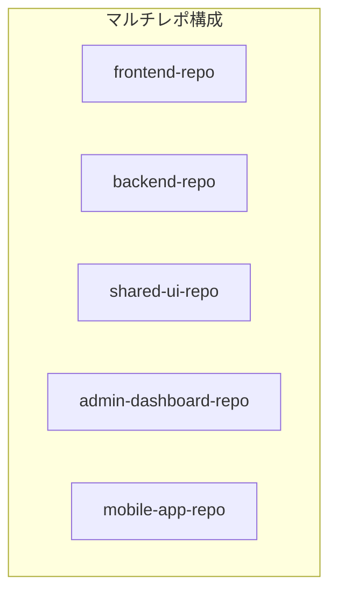
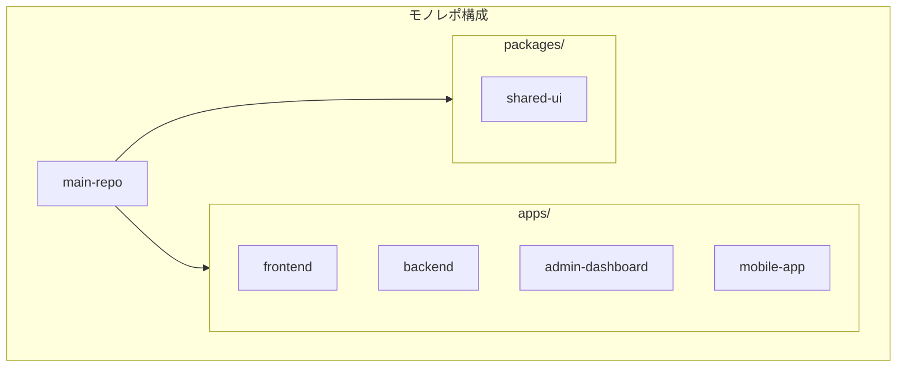
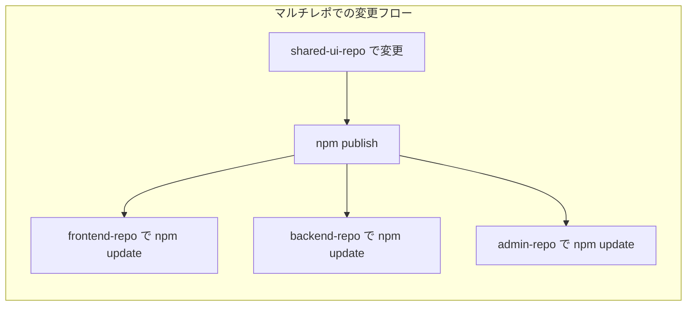
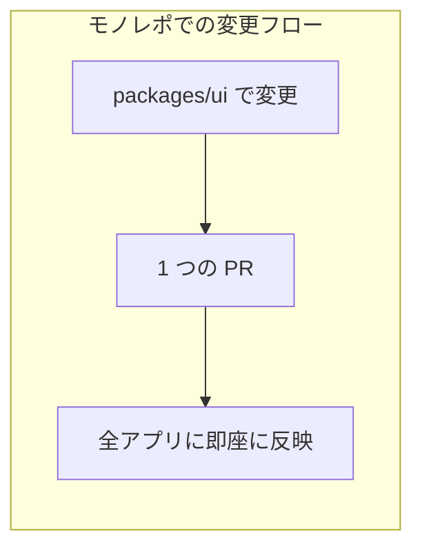

# モノレポの概念とメリット

## 目次

- [モノレポとは](#モノレポとは)
  - [名前の由来](#名前の由来)
- [マルチレポ vs モノレポ](#マルチレポ-vs-モノレポ)
  - [マルチレポ（Multirepo / Polyrepo）](#マルチレポmultirepo--polyrepo)
  - [モノレポ（Monorepo）](#モノレポmonorepo)
- [モノレポのメリット](#モノレポのメリット)
  - [1. コードの共有が簡単](#1-コードの共有が簡単)
  - [2. 一貫した設定](#2-一貫した設定)
  - [3. 原子的な変更（Atomic Changes）](#3-原子的な変更atomic-changes)
  - [4. ビルドの最適化](#4-ビルドの最適化)
  - [5. リファクタリングが容易](#5-リファクタリングが容易)
- [モノレポのデメリット](#モノレポのデメリット)
  - [1. リポジトリが大きくなる](#1-リポジトリが大きくなる)
  - [2. 権限管理が難しい](#2-権限管理が難しい)
  - [3. CI/CD の複雑化](#3-cicd-の複雑化)
  - [4. 学習コスト](#4-学習コスト)
- [EC サイトでモノレポを使うメリット](#ec-サイトでモノレポを使うメリット)
  - [実際の例](#実際の例)
- [モノレポを採用している企業](#モノレポを採用している企業)
- [モノレポ管理ツールの比較](#モノレポ管理ツールの比較)
- [まとめ](#まとめ)
  - [モノレポを選ぶべき場合](#モノレポを選ぶべき場合)
  - [マルチレポを選ぶべき場合](#マルチレポを選ぶべき場合)
- [次のステップ](#次のステップ)

## モノレポとは

**モノレポ（Monorepo）** とは、複数のプロジェクトやパッケージを **1 つのリポジトリ** で管理する手法です。

### 名前の由来

- **Mono** = 単一の
- **Repo** = リポジトリ（Repository）

***

## マルチレポ vs モノレポ

### マルチレポ（Multirepo / Polyrepo）



特徴は以下のとおりです。

- 各プロジェクトが独立したリポジトリ
- チームごとに自由度が高い
- 依存関係の管理が複雑になりやすい

### モノレポ（Monorepo）



特徴は以下のとおりです。

- すべてのプロジェクトが1つのリポジトリ
- コードの共有が容易
- 一貫したツール設定が可能

***

## モノレポのメリット

### 1. コードの共有が簡単

```typescript
// apps/web/page.tsx
import { Button } from "@ec/ui"; // 同じリポジトリ内のパッケージ
import { Product } from "@ec/shared/types";
import { productSchema } from "@ec/validators";
```

- npm公開なしで内部パッケージとして使用可能
- 型定義も即座に共有される

### 2. 一貫した設定

```text
tooling/
├── eslint-config/       # 全プロジェクトで同じ ESLint ルール
├── typescript-config/   # 同じ TypeScript 設定
├── tailwind-config/     # 同じデザイントークン
└── prettier-config/     # 同じフォーマットルール
```

- 設定の重複を排除
- コーディングスタイルの統一

### 3. 原子的な変更（Atomic Changes）

**マルチレポの場合:**



1. shared-ui-repoでButtonを変更
2. npmに公開
3. frontend-repoでnpm update
4. backend-repoでnpm update
5. admin-dashboard-repoでnpm update

**モノレポの場合:**



1. packages/uiでButtonを変更
2. 1つのPRですべてのアプリが更新される

### 4. ビルドの最適化

Turborepoなどのツールを使うと、以下のような最適化が可能です。

- キャッシュ - 変更のないパッケージはビルドをスキップ
- 並列実行 - 依存関係を考慮して並列ビルド
- リモートキャッシュ - CIでもキャッシュを共有

```bash
# 初回ビルド
$ turbo build
# ... 60秒

# 変更なしで再ビルド（キャッシュヒット）
$ turbo build
# ... 1秒
```

### 5. リファクタリングが容易

- 型の変更が全プロジェクトへ即座に反映
- IDEの「参照を検索」が全コードベースを対象にできる
- 破壊的変更の影響範囲がすぐわかる

***

## モノレポのデメリット

### 1. リポジトリが大きくなる

- cloneに時間がかかる可能性
- 対策: sparse checkout、shallow clone

### 2. 権限管理が難しい

- 全員がすべてのコードにアクセス可能
- 対策: CODEOWNERSファイル、GitHubの保護ルール

### 3. CI/CD の複雑化

- 変更に関係ないプロジェクトもビルドしてしまう可能性
- 対策: Turborepoの差分検出、`--filter` オプション

### 4. 学習コスト

- ワークスペースの概念を理解する必要
- ツール（Turborepo, pnpm）の習得

***

## EC サイトでモノレポを使うメリット

| メリット      | 具体例                                  |
| --------- | ------------------------------------ |
| UI の一貫性   | web と admin で同じ Button, Modal を使用    |
| 型の共有      | `Product`, `Order`, `User` 型を一元管理    |
| バリデーション共有 | Zod スキーマをフロント・バックエンドで再利用             |
| 設定の統一     | ESLint/TypeScript/Tailwind を全プロジェクトで |

### 実際の例

```typescript
// packages/shared/src/types/product.ts
export type Product = {
  id: string;
  name: string;
  price: number;
  description: string;
  imageUrl: string;
  categoryId: string;
};

// apps/web/app/products/page.tsx
import type { Product } from "@ec/shared/types";

// apps/admin/app/products/page.tsx
import type { Product } from "@ec/shared/types"; // 同じ型を使用
```

***

## モノレポを採用している企業

| 企業/プロジェクト | 使用ツール     | 規模      |
| --------- | --------- | ------- |
| Google    | 独自ツール     | 数十億行    |
| Meta      | 独自ツール     | 数百万ファイル |
| Microsoft | 独自ツール     | 大規模     |
| Vercel    | Turborepo | 中規模     |
| Shopify   | 独自ツール     | 大規模     |

***

## モノレポ管理ツールの比較

| ツール       | 特徴                | 適したプロジェクト    |
| --------- | ----------------- | ------------ |
| Turborepo | 高速、シンプル、Vercel 製  | 中小規模、Next.js |
| Nx        | 多機能、プラグイン豊富       | 大規模、エンタープライズ |
| Lerna     | 老舗、npm 公開に強い      | ライブラリ公開      |
| Rush      | Microsoft 製、大規模向け | 超大規模         |

**このプロジェクトでは Turborepo を使用します。**

その理由は以下の通りです。

- Next.jsとの相性が良い（同じVercel製）
- 設定がシンプル
- キャッシュ機能が強力
- Vercelでのリモートキャッシュが無料

***

## まとめ

### モノレポを選ぶべき場合

- 複数のアプリ間でコードを共有したい
- チーム間で設定を統一したい
- 型安全にコードを共有したい
- ビルドを高速化したい

### マルチレポを選ぶべき場合

- プロジェクト間の依存がほぼない
- チームが独立して作業している
- 外部に公開するライブラリ開発

***

## 次のステップ

モノレポの概念を理解したら、[Turborepo セットアップ](./02-turborepo-setup.md) に進んで実際にセットアップしましょう。
