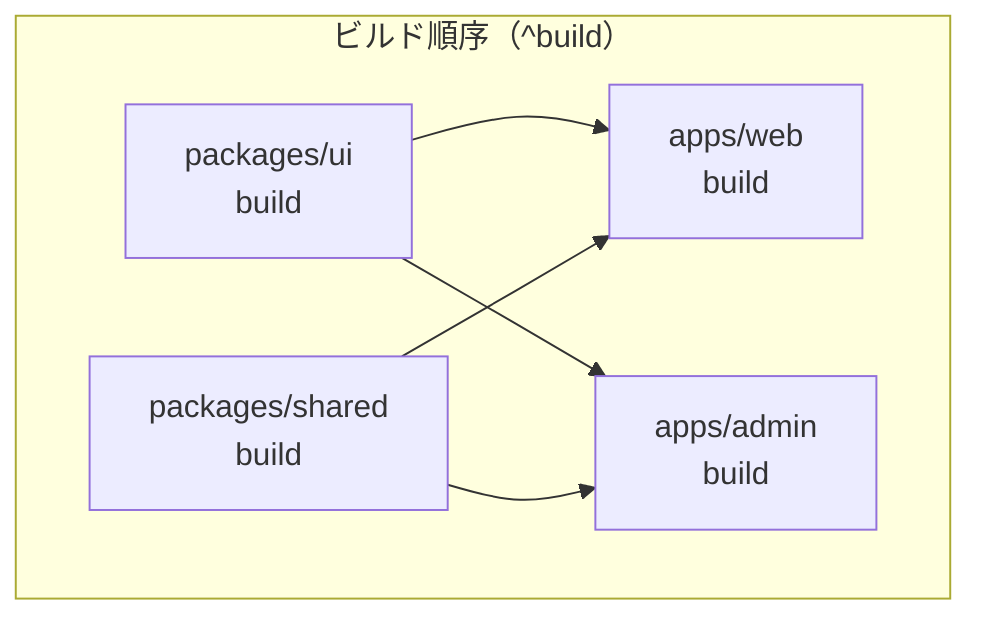
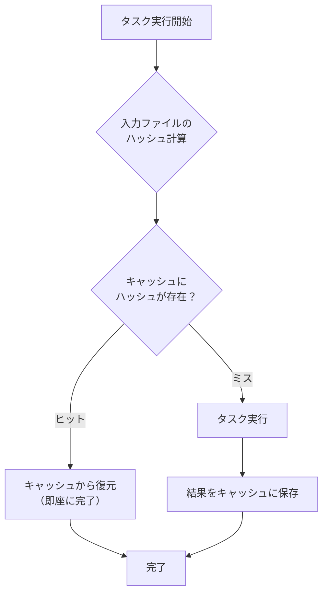

# Turborepo セットアップ

## 目次

- [Turborepo とは](#turborepo-とは)
  - [主な特徴](#主な特徴)
- [インストール方法](#インストール方法)
  - [方法 1: 既存プロジェクトに追加](#方法-1-既存プロジェクトに追加)
  - [方法 2: 新規プロジェクトを作成](#方法-2-新規プロジェクトを作成)
- [turbo.json の設定](#turbojson-の設定)
  - [基本構成](#基本構成)
  - [設定の解説](#設定の解説)
  - [タスク設定の詳細](#タスク設定の詳細)
- [依存関係の理解](#依存関係の理解)
  - [`dependsOn` の記法](#dependson-の記法)
  - [実行順序の例](#実行順序の例)
- [コマンドの実行](#コマンドの実行)
  - [基本コマンド](#基本コマンド)
  - [フィルター（--filter）](#フィルター--filter)
  - [並列実行](#並列実行)
- [キャッシュの仕組み](#キャッシュの仕組み)
  - [ローカルキャッシュ](#ローカルキャッシュ)
  - [リモートキャッシュ（Vercel）](#リモートキャッシュvercel)
- [ルート package.json の設定](#ルート-packagejson-の設定)
- [よく使うコマンド集](#よく使うコマンド集)
- [トラブルシューティング](#トラブルシューティング)
  - [キャッシュが効かない](#キャッシュが効かない)
  - [依存関係のエラー](#依存関係のエラー)
  - [タスクが見つからない](#タスクが見つからない)
- [ベストプラクティス](#ベストプラクティス)
  - [1. 出力ファイルを正確に指定](#1-出力ファイルを正確に指定)
  - [2. 開発タスクはキャッシュ無効](#2-開発タスクはキャッシュ無効)
  - [3. 環境変数の依存を明示](#3-環境変数の依存を明示)
- [次のステップ](#次のステップ)

## Turborepo とは

**Turborepo** は、JavaScript/TypeScript モノレポ向けの高性能ビルドシステムです。
Vercel が開発しており、Next.js との相性が非常に良いです。

### 主な特徴

- インクリメンタルビルド - 変更されたパッケージのみ再ビルド
- キャッシュ - ローカル・リモートでビルド結果をキャッシュ
- 並列実行 - 依存関係を考慮した最適な並列ビルド
- シンプルな設定 - `turbo.json` 1 ファイルで設定完了

---

## インストール方法

### 方法 1: 既存プロジェクトに追加

```bash
# グローバルインストール（推奨）
pnpm add -g turbo

# または、プロジェクトの devDependencies に追加
pnpm add -D turbo --workspace-root
```

### 方法 2: 新規プロジェクトを作成

```bash
# create-turbo を使用
pnpm dlx create-turbo@latest

# プロンプトに従って設定
# - プロジェクト名を入力
# - パッケージマネージャーで pnpm を選択
```

---

## turbo.json の設定

プロジェクトルートに `turbo.json` を作成します。

### 基本構成

```json
{
  "$schema": "https://turbo.build/schema.json",
  "ui": "tui",
  "globalDependencies": ["**/.env.*local"],
  "tasks": {
    "build": {
      "dependsOn": ["^build"],
      "outputs": [".next/**", "!.next/cache/**", "dist/**"]
    },
    "lint": {
      "dependsOn": ["^build"]
    },
    "typecheck": {
      "dependsOn": ["^build"]
    },
    "test": {
      "dependsOn": ["^build"]
    },
    "test:watch": {
      "cache": false,
      "persistent": true
    },
    "dev": {
      "cache": false,
      "persistent": true
    },
    "storybook": {
      "cache": false,
      "persistent": true
    }
  }
}
```

### 設定の解説

| プロパティ           | 説明                                           |
| -------------------- | ---------------------------------------------- |
| `$schema`            | JSON スキーマ（エディタ補完用）                |
| `ui`                 | `tui` でターミナル UI を有効化                 |
| `globalDependencies` | 変更時にすべてのキャッシュを無効化するファイル |
| `tasks`              | 実行可能なタスクの定義                         |

### タスク設定の詳細

```json
{
  "build": {
    "dependsOn": ["^build"],
    "outputs": [".next/**", "!.next/cache/**", "dist/**"],
    "inputs": ["src/**", "package.json", "tsconfig.json"]
  }
}
```

| プロパティ   | 説明                                          |
| ------------ | --------------------------------------------- |
| `dependsOn`  | このタスク実行前に完了すべきタスク            |
| `^build`     | 依存パッケージの build を先に実行             |
| `outputs`    | キャッシュ対象の出力ファイル                  |
| `inputs`     | 変更検知対象のファイル（省略時は全ファイル）  |
| `cache`      | `false` でキャッシュを無効化                  |
| `persistent` | `true` で長時間実行タスク（dev サーバーなど） |

---

## 依存関係の理解

### `dependsOn` の記法

```json
{
  "tasks": {
    "build": {
      "dependsOn": ["^build"] // 依存パッケージの build を先に実行
    },
    "test": {
      "dependsOn": ["build"] // 自パッケージの build を先に実行
    },
    "deploy": {
      "dependsOn": ["build", "test", "lint"] // 複数タスクを先に実行
    }
  }
}
```

### 実行順序の例

`^build` により、依存パッケージ（ui, shared）が先にビルドされます。



---

## コマンドの実行

### 基本コマンド

```bash
# 全パッケージでビルド
turbo build

# 全パッケージでテスト
turbo test

# 全パッケージで開発サーバー起動
turbo dev
```

### フィルター（--filter）

特定のパッケージのみ実行できます。

```bash
# web アプリのみビルド
turbo build --filter=web

# web アプリとその依存パッケージをビルド
turbo build --filter=web...

# @ec/ui パッケージのみ
turbo build --filter=@ec/ui

# apps ディレクトリ内のみ
turbo build --filter=./apps/*
```

### 並列実行

```bash
# 最大 10 並列で実行
turbo build --concurrency=10

# CPU コア数に応じて自動調整（デフォルト）
turbo build --concurrency=auto
```

---

## キャッシュの仕組み

Turborepo のキャッシュは、入力ファイルのハッシュ値に基づいて動作します。



### ローカルキャッシュ

キャッシュは `node_modules/.cache/turbo/` に保存されます。

キャッシュヒット時は実行をスキップします。

```bash
$ turbo build
• Packages in scope: @ec/ui, @ec/shared, web, admin
• Running build in 4 packages
• Remote caching disabled

 web:build: cache hit, replaying logs ← キャッシュヒット
 @ec/ui:build: cache hit, replaying logs
 @ec/shared:build: cache hit, replaying logs
 admin:build: cache hit, replaying logs
```

### リモートキャッシュ（Vercel）

CI/CD でもキャッシュを共有できます。

```bash
# Vercel とリンク
npx turbo login
npx turbo link

# CI 環境では環境変数で設定
TURBO_TOKEN=xxx
TURBO_TEAM=your-team
```

---

## ルート package.json の設定

```json
{
  "name": "ec-monorepo",
  "private": true,
  "scripts": {
    "dev": "turbo dev",
    "dev:web": "turbo dev --filter=web",
    "dev:admin": "turbo dev --filter=admin",
    "build": "turbo build",
    "lint": "turbo lint",
    "typecheck": "turbo typecheck",
    "test": "turbo test",
    "storybook": "turbo storybook --filter=storybook"
  },
  "devDependencies": {
    "turbo": "^2.3.0"
  },
  "packageManager": "pnpm@10.0.0",
  "engines": {
    "node": ">=24.0.0",
    "pnpm": ">=10.0.0"
  }
}
```

---

## よく使うコマンド集

| コマンド                      | 説明                           |
| ----------------------------- | ------------------------------ |
| `turbo build`                 | 全パッケージをビルド           |
| `turbo dev`                   | 全パッケージで開発サーバー起動 |
| `turbo dev --filter=web`      | web のみ開発サーバー           |
| `turbo build --filter=web...` | web と依存パッケージをビルド   |
| `turbo lint`                  | 全パッケージでリント           |
| `turbo test`                  | 全パッケージでテスト           |
| `turbo run build test lint`   | 複数タスクを実行               |
| `turbo build --dry-run`       | 実行計画を表示（実行しない）   |
| `turbo build --graph`         | 依存グラフを表示               |

---

## トラブルシューティング

### キャッシュが効かない

```bash
# キャッシュをクリア
turbo clean

# キャッシュを無視して実行
turbo build --force
```

### 依存関係のエラー

```bash
# 依存グラフを確認
turbo build --graph

# 詳細ログを表示
turbo build --verbose
```

### タスクが見つからない

```bash
# 各パッケージの package.json に scripts があるか確認
# 例: "build": "next build"
```

---

## ベストプラクティス

### 1. 出力ファイルを正確に指定

```json
{
  "build": {
    "outputs": [".next/**", "!.next/cache/**"]
  }
}
```

### 2. 開発タスクはキャッシュ無効

```json
{
  "dev": {
    "cache": false,
    "persistent": true
  }
}
```

### 3. 環境変数の依存を明示

```json
{
  "globalDependencies": ["**/.env.*local"],
  "tasks": {
    "build": {
      "env": ["DATABASE_URL", "API_KEY"]
    }
  }
}
```

---

## 次のステップ

Turborepo の設定が完了したら、[pnpm ワークスペース設定](./03-pnpm-workspace.md) でパッケージ管理を設定しましょう。
