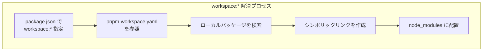
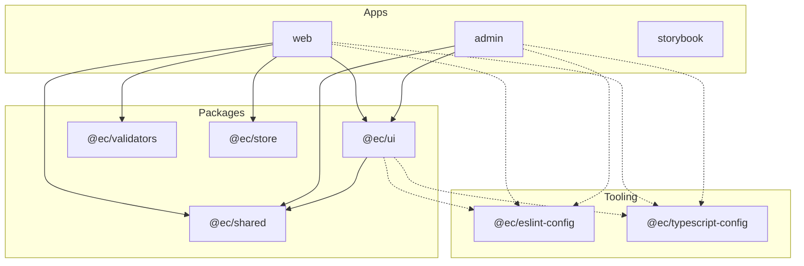

# pnpm ワークスペース設定

## 目次

- [pnpm とは](#pnpm-とは)
  - [npm/yarn との違い](#npmyarn-との違い)
- [pnpm のインストール](#pnpm-のインストール)
  - [方法 1: npm 経由](#方法-1-npm-経由)
  - [方法 2: corepack 経由（推奨）](#方法-2-corepack-経由推奨)
  - [方法 3: mise 経由](#方法-3-mise-経由)
  - [バージョン確認](#バージョン確認)
- [ワークスペースの設定](#ワークスペースの設定)
  - [pnpm-workspace.yaml](#pnpm-workspaceyaml)
  - [ディレクトリ構成](#ディレクトリ構成)
- [workspace プロトコル](#workspace-プロトコル)
  - [内部パッケージの参照](#内部パッケージの参照)
  - [workspace プロトコルの種類](#workspace-プロトコルの種類)
- [カタログ機能（pnpm 9+）](#カタログ機能pnpm-9)
  - [カタログとは](#カタログとは)
  - [pnpm-workspace.yaml でのカタログ定義](#pnpm-workspaceyaml-でのカタログ定義)
  - [カタログの使用](#カタログの使用)
  - [カタログのメリット](#カタログのメリット)
- [よく使うコマンド](#よく使うコマンド)
  - [インストール](#インストール)
  - [フィルター（--filter）](#フィルター--filter)
  - [実行](#実行)
- [各パッケージの package.json](#各パッケージの-packagejson)
  - [apps/web/package.json](#appswebpackagejson)
  - [packages/ui/package.json](#packagesuipackagejson)
- [exports フィールド](#exports-フィールド)
  - [サブパスエクスポート](#サブパスエクスポート)
  - [使用例](#使用例)
- [依存関係の管理](#依存関係の管理)
  - [依存の確認](#依存の確認)
  - [アップデート](#アップデート)
  - [重複の検出](#重複の検出)
- [トラブルシューティング](#トラブルシューティング)
  - [ロックファイルの問題](#ロックファイルの問題)
  - [キャッシュの問題](#キャッシュの問題)
  - [幽霊依存（Phantom Dependencies）](#幽霊依存phantom-dependencies)
- [ベストプラクティス](#ベストプラクティス)
  - [1. private: true を設定](#1-private-true-を設定)
  - [2. カタログでバージョン統一](#2-カタログでバージョン統一)
  - [3. peerDependencies の活用](#3-peerdependencies-の活用)
  - [4. engines フィールド](#4-engines-フィールド)
- [次のステップ](#次のステップ)

## pnpm とは

**pnpm** は、高速でディスク効率の良いパッケージマネージャーです。
モノレポのワークスペース機能が標準で組み込まれています。

### npm/yarn との違い

| 特徴       | npm | yarn | pnpm |
| -------- | --- | ---- | ---- |
| ディスク使用量  | 大   | 大    | 小    |
| インストール速度 | 普通  | 速い   | 最速   |
| 厳格な依存管理  | なし  | なし   | あり   |
| ワークスペース  | あり  | あり   | あり   |
| カタログ機能   | なし  | なし   | あり   |

***

## pnpm のインストール

### 方法 1: npm 経由

```bash
npm install -g pnpm
```

### 方法 2: corepack 経由（推奨）

```bash
# Node.js 16.13+ に同梱
corepack enable
corepack prepare pnpm@latest --activate
```

### 方法 3: mise 経由

```bash
# mise でインストール
mise use -g pnpm@10
```

### バージョン確認

```bash
pnpm --version
# 10.0.0
```

***

## ワークスペースの設定

### pnpm-workspace.yaml

プロジェクトルートに `pnpm-workspace.yaml` を作成します。

```yaml
packages:
  - "apps/*"
  - "packages/*"
  - "tooling/*"
```

### ディレクトリ構成

```text
ec-monorepo/
├── pnpm-workspace.yaml    # ワークスペース設定
├── package.json           # ルート package.json
├── pnpm-lock.yaml         # ロックファイル（自動生成）
│
├── apps/
│   ├── web/
│   │   └── package.json   # name: "web"
│   ├── admin/
│   │   └── package.json   # name: "admin"
│   └── storybook/
│       └── package.json   # name: "storybook"
│
├── packages/
│   ├── ui/
│   │   └── package.json   # name: "@ec/ui"
│   ├── shared/
│   │   └── package.json   # name: "@ec/shared"
│   └── validators/
│       └── package.json   # name: "@ec/validators"
│
└── tooling/
    ├── eslint-config/
    │   └── package.json   # name: "@ec/eslint-config"
    └── typescript-config/
        └── package.json   # name: "@ec/typescript-config"
```

***

## workspace プロトコル

pnpmは `workspace:*` プロトコルを使って、モノレポ内のパッケージ間の依存関係を管理します。



### 内部パッケージの参照

`workspace:*` を使って内部パッケージを参照します。

```json
// apps/web/package.json
{
  "name": "web",
  "dependencies": {
    "@ec/ui": "workspace:*",
    "@ec/shared": "workspace:*",
    "@ec/validators": "workspace:*"
  },
  "devDependencies": {
    "@ec/eslint-config": "workspace:*",
    "@ec/typescript-config": "workspace:*"
  }
}
```

### workspace プロトコルの種類

| プロトコル         | 説明                |
| ------------- | ----------------- |
| `workspace:*` | 最新バージョンを使用（推奨）    |
| `workspace:^` | セマンティックバージョニングで参照 |
| `workspace:~` | パッチバージョンの更新のみ許可   |

***

## カタログ機能（pnpm 9+）

### カタログとは

共通の依存関係のバージョンを一元管理する機能です。

### pnpm-workspace.yaml でのカタログ定義

```yaml
packages:
  - "apps/*"
  - "packages/*"
  - "tooling/*"

catalog:
  # React 関連
  react: "^19.0.0"
  react-dom: "^19.0.0"

  # Next.js 関連
  next: "^16.0.0"

  # 開発ツール
  typescript: "^5.9.0"
  eslint: "^9.0.0"
  prettier: "^3.0.0"

  # テスト
  vitest: "^4.0.0"
  "@testing-library/react": "^16.0.0"
```

### カタログの使用

```json
// apps/web/package.json
{
  "dependencies": {
    "react": "catalog:",
    "react-dom": "catalog:",
    "next": "catalog:"
  },
  "devDependencies": {
    "typescript": "catalog:",
    "eslint": "catalog:"
  }
}
```

### カタログのメリット

- バージョンの一元管理
- 全パッケージで同じバージョンを保証
- アップデートが容易

***

## よく使うコマンド

### インストール

```bash
# 全パッケージの依存をインストール
pnpm install

# 新しい依存を追加（ルート）
pnpm add -D turbo --workspace-root

# 特定のパッケージに依存を追加
pnpm add react --filter web
pnpm add -D vitest --filter @ec/ui
```

### フィルター（--filter）

```bash
# 特定のパッケージでコマンド実行
pnpm --filter web dev
pnpm --filter @ec/ui build

# 複数パッケージ
pnpm --filter web --filter admin build

# ワイルドカード
pnpm --filter "./apps/*" build
pnpm --filter "@ec/*" test

# 依存パッケージも含む
pnpm --filter web... build
```

### 実行

```bash
# スクリプトの実行
pnpm run build
pnpm run dev

# 略記法（run は省略可能）
pnpm build
pnpm dev

# 全パッケージで実行
pnpm -r build
pnpm -r test
```

***

## 各パッケージの package.json

### apps/web/package.json

```json
{
  "name": "web",
  "version": "0.0.1",
  "private": true,
  "scripts": {
    "dev": "next dev --port 3000",
    "build": "next build",
    "start": "next start",
    "lint": "eslint . --max-warnings 0",
    "typecheck": "tsc --noEmit",
    "test": "vitest"
  },
  "dependencies": {
    "@ec/ui": "workspace:*",
    "@ec/shared": "workspace:*",
    "@ec/validators": "workspace:*",
    "@ec/store": "workspace:*",
    "react": "catalog:",
    "react-dom": "catalog:",
    "next": "catalog:"
  },
  "devDependencies": {
    "@ec/eslint-config": "workspace:*",
    "@ec/typescript-config": "workspace:*",
    "typescript": "catalog:"
  }
}
```

### packages/ui/package.json

```json
{
  "name": "@ec/ui",
  "version": "0.0.1",
  "private": true,
  "exports": {
    ".": "./src/index.ts",
    "./Button": "./src/components/Button/index.ts",
    "./Card": "./src/components/Card/index.ts"
  },
  "scripts": {
    "lint": "eslint . --max-warnings 0",
    "typecheck": "tsc --noEmit",
    "test": "vitest"
  },
  "dependencies": {
    "@ec/shared": "workspace:*"
  },
  "peerDependencies": {
    "react": "catalog:",
    "react-dom": "catalog:"
  },
  "devDependencies": {
    "@ec/eslint-config": "workspace:*",
    "@ec/typescript-config": "workspace:*"
  }
}
```

***

## exports フィールド

### サブパスエクスポート

```json
{
  "exports": {
    ".": "./src/index.ts",
    "./Button": "./src/components/Button/index.ts",
    "./Card": "./src/components/Card/index.ts",
    "./hooks": "./src/hooks/index.ts"
  }
}
```

### 使用例

```typescript
// メインエクスポートから
import { Button, Card } from "@ec/ui";

// サブパスから（ツリーシェイキングに有利）
import { Button } from "@ec/ui/Button";
import { Card } from "@ec/ui/Card";
```

***

## 依存関係の管理

モノレポ内のパッケージ間の依存関係を可視化すると以下のようになります。



> 実線は `dependencies`、破線は `devDependencies` を表します。

### 依存の確認

```bash
# 依存関係のリスト
pnpm list

# 依存関係のツリー
pnpm list --depth=2

# 特定パッケージの依存
pnpm list --filter web
```

### アップデート

```bash
# 全パッケージの依存を更新
pnpm update

# 対話的に更新
pnpm update --interactive

# 特定のパッケージを更新
pnpm update react --filter web
```

### 重複の検出

```bash
# 重複した依存を表示
pnpm dedupe --check

# 重複を解消
pnpm dedupe
```

***

## トラブルシューティング

### ロックファイルの問題

```bash
# ロックファイルを再生成
rm pnpm-lock.yaml
pnpm install
```

### キャッシュの問題

```bash
# pnpm のキャッシュをクリア
pnpm store prune
```

### 幽霊依存（Phantom Dependencies）

pnpmは厳格な依存管理のため、他のパッケージマネージャーで動いていたコードがエラーになることがあります。

```text
Error: Cannot find module 'some-package'
```

解決策として、明示的に依存を追加します。

```bash
pnpm add some-package
```

***

## ベストプラクティス

### 1. private: true を設定

内部パッケージには `private: true` を設定し、npmへの誤公開を防ぎます。

```json
{
  "name": "@ec/ui",
  "private": true
}
```

### 2. カタログでバージョン統一

同じ依存関係はcatalog: で参照し、バージョンを統一します。

### 3. peerDependencies の活用

共有パッケージでは `peerDependencies` を使用します。

```json
{
  "peerDependencies": {
    "react": "^19.0.0"
  }
}
```

### 4. engines フィールド

Node.jsとpnpmのバージョンを固定します。

```json
{
  "engines": {
    "node": ">=24.0.0",
    "pnpm": ">=10.0.0"
  }
}
```

***

## 次のステップ

pnpmワークスペースの設定が完了したら、[共有設定パッケージ](./04-shared-tooling.md) でESLintやTypeScriptの設定を共有しましょう。
