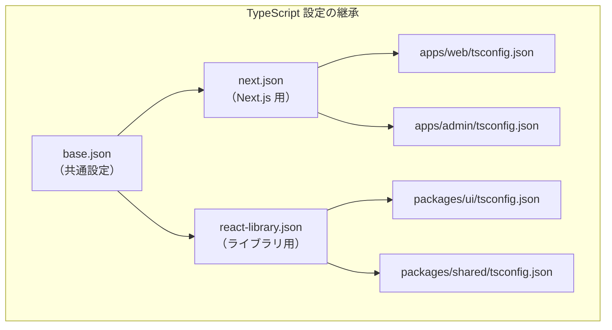

# 共有設定パッケージ

## 目次

- [概要](#概要)
  - [tooling ディレクトリ構成](#tooling-ディレクトリ構成)
- [ESLint 設定](#eslint-設定)
  - [tooling/eslint-config/package.json](#toolingeslint-configpackagejson)
  - [tooling/eslint-config/base.js](#toolingeslint-configbasejs)
  - [tooling/eslint-config/next.js](#toolingeslint-confignextjs)
  - [tooling/eslint-config/react.js](#toolingeslint-configreactjs)
  - [使用例（apps/web/eslint.config.mjs）](#使用例appswebeslintconfigmjs)
- [TypeScript 設定](#typescript-設定)
  - [tooling/typescript-config/package.json](#toolingtypescript-configpackagejson)
  - [tooling/typescript-config/base.json](#toolingtypescript-configbasejson)
  - [tooling/typescript-config/next.json](#toolingtypescript-confignextjson)
  - [tooling/typescript-config/react-library.json](#toolingtypescript-configreact-libraryjson)
  - [使用例（apps/web/tsconfig.json）](#使用例appswebtsconfigjson)
  - [使用例（packages/ui/tsconfig.json）](#使用例packagesuitsconfigjson)
- [Tailwind CSS 設定](#tailwind-css-設定)
  - [tooling/tailwind-config/package.json](#toolingtailwind-configpackagejson)
  - [tooling/tailwind-config/tailwind.config.ts](#toolingtailwind-configtailwindconfigts)
  - [使用例（apps/web/tailwind.config.ts）](#使用例appswebtailwindconfigts)
- [Prettier 設定](#prettier-設定)
  - [tooling/prettier-config/package.json](#toolingprettier-configpackagejson)
  - [tooling/prettier-config/index.js](#toolingprettier-configindexjs)
  - [使用例（apps/web/prettier.config.js）](#使用例appswebprettierconfigjs)
- [ルート package.json での設定](#ルート-packagejson-での設定)
  - [package.json（ルート）](#packagejsonルート)
- [パッケージ間の依存関係](#パッケージ間の依存関係)
- [よくあるパターン](#よくあるパターン)
  - [1. 設定の拡張](#1-設定の拡張)
  - [2. TypeScript パスエイリアスの共有](#2-typescript-パスエイリアスの共有)
  - [3. Tailwind のコンテンツパス](#3-tailwind-のコンテンツパス)
- [トラブルシューティング](#トラブルシューティング)
  - [ESLint が設定を見つけられない](#eslint-が設定を見つけられない)
  - [TypeScript のパスが解決されない](#typescript-のパスが解決されない)
  - [Tailwind のスタイルが適用されない](#tailwind-のスタイルが適用されない)
- [次のステップ](#次のステップ)

## 概要

モノレポでは、ESLint、TypeScript、Tailwind、Prettier などの設定を共有パッケージとして管理します。
これにより、全プロジェクトで一貫した設定を維持できます。

### tooling ディレクトリ構成

```text
tooling/
├── eslint-config/           # 共有 ESLint 設定
│   ├── base.js              # 基本設定
│   ├── next.js              # Next.js 用
│   ├── react.js             # React ライブラリ用
│   └── package.json
│
├── typescript-config/       # 共有 TypeScript 設定
│   ├── base.json            # 基本設定
│   ├── next.json            # Next.js 用
│   ├── react-library.json   # React ライブラリ用
│   └── package.json
│
├── tailwind-config/         # 共有 Tailwind 設定
│   ├── tailwind.config.ts   # 設定ファイル
│   └── package.json
│
└── prettier-config/         # 共有 Prettier 設定
    ├── index.js             # 設定ファイル
    └── package.json
```

***

## ESLint 設定

### tooling/eslint-config/package.json

```json
{
  "name": "@ec/eslint-config",
  "version": "0.0.1",
  "private": true,
  "exports": {
    "./base": "./base.js",
    "./next": "./next.js",
    "./react": "./react.js"
  },
  "dependencies": {
    "@eslint/js": "^9.0.0",
    "eslint-config-prettier": "^9.1.0",
    "eslint-plugin-react": "^7.35.0",
    "eslint-plugin-react-hooks": "^5.0.0",
    "typescript-eslint": "^8.0.0"
  },
  "peerDependencies": {
    "eslint": "^9.0.0"
  }
}
```

### tooling/eslint-config/base.js

```javascript
import js from "@eslint/js";
import tseslint from "typescript-eslint";
import prettierConfig from "eslint-config-prettier";

export default [
  js.configs.recommended,
  ...tseslint.configs.recommended,
  prettierConfig,
  {
    rules: {
      // TypeScript
      "@typescript-eslint/no-unused-vars": ["error", { argsIgnorePattern: "^_" }],
      "@typescript-eslint/no-explicit-any": "warn",

      // 一般
      "no-console": ["warn", { allow: ["warn", "error"] }],
    },
  },
  {
    ignores: ["node_modules/", "dist/", ".next/", "coverage/"],
  },
];
```

### tooling/eslint-config/next.js

```javascript
import baseConfig from "./base.js";
import nextPlugin from "@next/eslint-plugin-next";
import reactPlugin from "eslint-plugin-react";
import hooksPlugin from "eslint-plugin-react-hooks";

export default [
  ...baseConfig,
  {
    plugins: {
      "@next/next": nextPlugin,
      react: reactPlugin,
      "react-hooks": hooksPlugin,
    },
    rules: {
      // React
      "react/react-in-jsx-scope": "off",
      "react/prop-types": "off",

      // React Hooks
      "react-hooks/rules-of-hooks": "error",
      "react-hooks/exhaustive-deps": "warn",

      // Next.js
      "@next/next/no-html-link-for-pages": "error",
      "@next/next/no-img-element": "warn",
    },
    settings: {
      react: {
        version: "detect",
      },
    },
  },
];
```

### tooling/eslint-config/react.js

```javascript
import baseConfig from "./base.js";
import reactPlugin from "eslint-plugin-react";
import hooksPlugin from "eslint-plugin-react-hooks";

export default [
  ...baseConfig,
  {
    plugins: {
      react: reactPlugin,
      "react-hooks": hooksPlugin,
    },
    rules: {
      "react/react-in-jsx-scope": "off",
      "react/prop-types": "off",
      "react-hooks/rules-of-hooks": "error",
      "react-hooks/exhaustive-deps": "warn",
    },
    settings: {
      react: {
        version: "detect",
      },
    },
  },
];
```

### 使用例（apps/web/eslint.config.mjs）

```javascript
import nextConfig from "@ec/eslint-config/next";

export default [...nextConfig];
```

***

## TypeScript 設定

TypeScript では、ベース設定から用途別に継承する構造を採用しています。



### tooling/typescript-config/package.json

```json
{
  "name": "@ec/typescript-config",
  "version": "0.0.1",
  "private": true,
  "exports": {
    "./base": "./base.json",
    "./next": "./next.json",
    "./react-library": "./react-library.json"
  }
}
```

### tooling/typescript-config/base.json

```json
{
  "$schema": "https://json.schemastore.org/tsconfig",
  "compilerOptions": {
    "target": "ES2022",
    "lib": ["ES2022"],
    "module": "ESNext",
    "moduleResolution": "bundler",
    "resolveJsonModule": true,
    "esModuleInterop": true,
    "allowSyntheticDefaultImports": true,

    "strict": true,
    "strictNullChecks": true,
    "noUncheckedIndexedAccess": true,
    "noImplicitOverride": true,
    "noEmit": true,

    "declaration": true,
    "declarationMap": true,
    "sourceMap": true,

    "skipLibCheck": true,
    "isolatedModules": true,
    "verbatimModuleSyntax": true
  }
}
```

### tooling/typescript-config/next.json

```json
{
  "$schema": "https://json.schemastore.org/tsconfig",
  "extends": "./base.json",
  "compilerOptions": {
    "lib": ["ES2022", "DOM", "DOM.Iterable"],
    "jsx": "preserve",
    "plugins": [{ "name": "next" }],
    "allowJs": true,
    "incremental": true
  }
}
```

### tooling/typescript-config/react-library.json

```json
{
  "$schema": "https://json.schemastore.org/tsconfig",
  "extends": "./base.json",
  "compilerOptions": {
    "lib": ["ES2022", "DOM", "DOM.Iterable"],
    "jsx": "react-jsx"
  }
}
```

### 使用例（apps/web/tsconfig.json）

```json
{
  "extends": "@ec/typescript-config/next",
  "compilerOptions": {
    "baseUrl": ".",
    "paths": {
      "@/*": ["./*"]
    }
  },
  "include": ["next-env.d.ts", "**/*.ts", "**/*.tsx", ".next/types/**/*.ts"],
  "exclude": ["node_modules"]
}
```

### 使用例（packages/ui/tsconfig.json）

```json
{
  "extends": "@ec/typescript-config/react-library",
  "compilerOptions": {
    "baseUrl": ".",
    "paths": {
      "@/*": ["./src/*"]
    }
  },
  "include": ["src/**/*.ts", "src/**/*.tsx"],
  "exclude": ["node_modules", "dist"]
}
```

***

## Tailwind CSS 設定

### tooling/tailwind-config/package.json

```json
{
  "name": "@ec/tailwind-config",
  "version": "0.0.1",
  "private": true,
  "exports": {
    ".": "./tailwind.config.ts"
  },
  "devDependencies": {
    "tailwindcss": "^4.0.0"
  }
}
```

### tooling/tailwind-config/tailwind.config.ts

```typescript
import type { Config } from "tailwindcss";

const config: Config = {
  content: [
    "./app/**/*.{js,ts,jsx,tsx,mdx}",
    "./src/**/*.{js,ts,jsx,tsx,mdx}",
    "./components/**/*.{js,ts,jsx,tsx,mdx}",
    "../../packages/ui/src/**/*.{js,ts,jsx,tsx,mdx}",
  ],
  theme: {
    extend: {
      colors: {
        // ブランドカラー
        primary: {
          50: "#eff6ff",
          100: "#dbeafe",
          500: "#3b82f6",
          600: "#2563eb",
          700: "#1d4ed8",
        },
        // アクセントカラー
        accent: {
          500: "#f59e0b",
          600: "#d97706",
        },
      },
      fontFamily: {
        sans: ["Inter", "Noto Sans JP", "ui-sans-serif", "system-ui", "sans-serif"],
      },
      spacing: {
        18: "4.5rem",
        112: "28rem",
        128: "32rem",
      },
      animation: {
        "fade-in": "fadeIn 0.3s ease-in-out",
        "slide-up": "slideUp 0.3s ease-out",
      },
      keyframes: {
        fadeIn: {
          "0%": { opacity: "0" },
          "100%": { opacity: "1" },
        },
        slideUp: {
          "0%": { transform: "translateY(10px)", opacity: "0" },
          "100%": { transform: "translateY(0)", opacity: "1" },
        },
      },
    },
  },
  plugins: [],
};

export default config;
```

### 使用例（apps/web/tailwind.config.ts）

```typescript
import baseConfig from "@ec/tailwind-config";
import type { Config } from "tailwindcss";

const config: Config = {
  ...baseConfig,
  content: [
    "./app/**/*.{js,ts,jsx,tsx,mdx}",
    "./components/**/*.{js,ts,jsx,tsx,mdx}",
    "../../packages/ui/src/**/*.{js,ts,jsx,tsx,mdx}",
  ],
};

export default config;
```

***

## Prettier 設定

### tooling/prettier-config/package.json

```json
{
  "name": "@ec/prettier-config",
  "version": "0.0.1",
  "private": true,
  "main": "index.js",
  "exports": {
    ".": "./index.js"
  },
  "peerDependencies": {
    "prettier": "^3.0.0"
  }
}
```

### tooling/prettier-config/index.js

```javascript
/** @type {import("prettier").Config} */
const config = {
  semi: true,
  singleQuote: false,
  tabWidth: 2,
  trailingComma: "es5",
  printWidth: 80,
  useTabs: false,
  bracketSpacing: true,
  arrowParens: "always",
  endOfLine: "lf",
  plugins: ["prettier-plugin-tailwindcss"],
};

module.exports = config;
```

### 使用例（apps/web/prettier.config.js）

```javascript
module.exports = require("@ec/prettier-config");
```

または `.prettierrc.js`:

```javascript
module.exports = {
  ...require("@ec/prettier-config"),
  // プロジェクト固有の設定があれば追加
};
```

***

## ルート package.json での設定

### package.json（ルート）

```json
{
  "name": "ec-monorepo",
  "private": true,
  "scripts": {
    "lint": "turbo lint",
    "lint:fix": "turbo lint -- --fix",
    "format": "prettier --write .",
    "format:check": "prettier --check .",
    "typecheck": "turbo typecheck"
  },
  "devDependencies": {
    "turbo": "^2.3.0",
    "prettier": "^3.0.0"
  },
  "prettier": "@ec/prettier-config"
}
```

***

## パッケージ間の依存関係

```mermaid
graph TD
    subgraph Apps
        WEB[apps/web]
        ADMIN[apps/admin]
        SB[apps/storybook]
    end

    subgraph Tooling
        ESL[@ec/eslint-config]
        TS[@ec/typescript-config]
        TW[@ec/tailwind-config]
        PRT[@ec/prettier-config]
    end

    WEB --> ESL
    WEB --> TS
    WEB --> TW

    ADMIN --> ESL
    ADMIN --> TS
    ADMIN --> TW

    SB --> ESL
    SB --> TS
```

***

## よくあるパターン

### 1. 設定の拡張

共有設定をベースに、プロジェクト固有の設定を追加できます。

```javascript
// apps/web/eslint.config.mjs
import nextConfig from "@ec/eslint-config/next";

export default [
  ...nextConfig,
  {
    rules: {
      // このプロジェクト固有のルール
      "no-console": "off",
    },
  },
];
```

### 2. TypeScript パスエイリアスの共有

各プロジェクトで `@/*` エイリアスを使用できます。

```json
{
  "compilerOptions": {
    "baseUrl": ".",
    "paths": {
      "@/*": ["./*"]
    }
  }
}
```

### 3. Tailwind のコンテンツパス

モノレポでは、共有パッケージのパスも含める必要があります。

```typescript
content: ["./app/**/*.{js,ts,jsx,tsx,mdx}", "../../packages/ui/src/**/*.{js,ts,jsx,tsx,mdx}"];
```

***

## トラブルシューティング

### ESLint が設定を見つけられない

```bash
# 依存関係を再インストール
pnpm install

# ESLint のキャッシュをクリア
rm -rf .eslintcache
```

### TypeScript のパスが解決されない

`tsconfig.json` の `extends` パスが正しいか確認してください。

```json
{
  "extends": "@ec/typescript-config/next"
}
```

### Tailwind のスタイルが適用されない

`content` にすべてのファイルパスが含まれているか確認。

***

## 次のステップ

共有設定パッケージの作成が完了したら、[Git ワークフロー概要](./05-git-workflow.md) でブランチ戦略とコミット規約を学びましょう。
