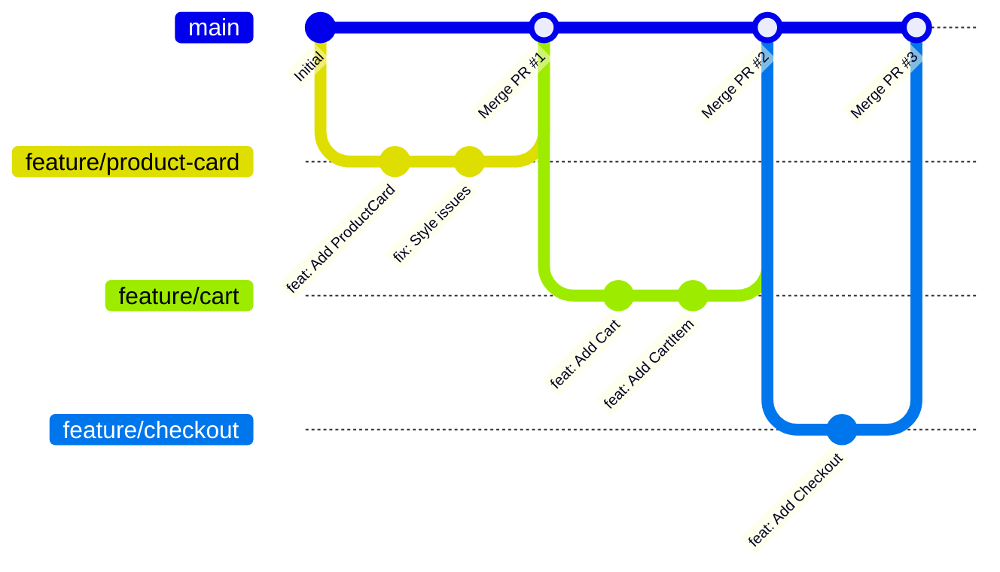
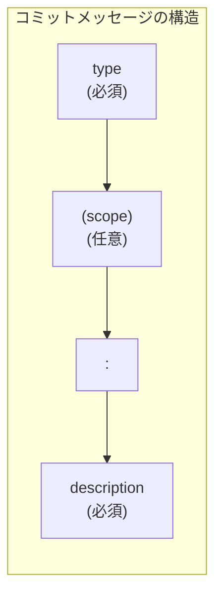
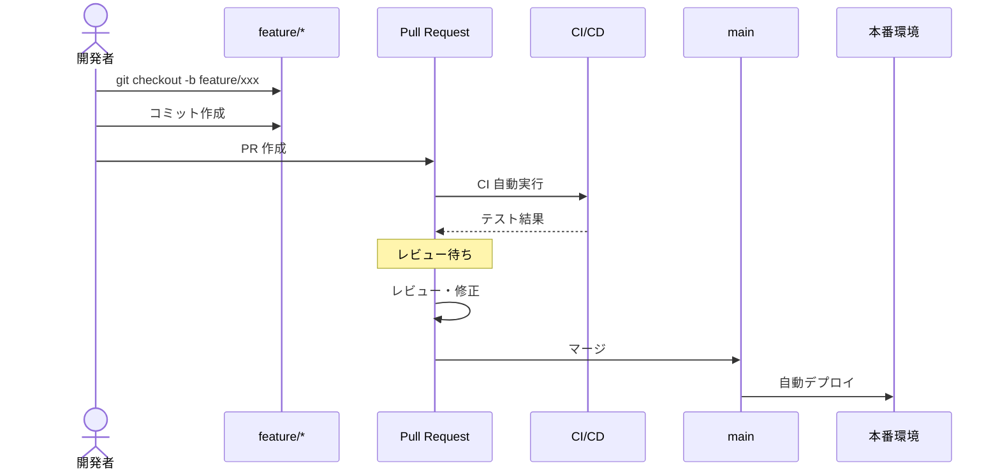

# Git ワークフロー概要

## ブランチ戦略

チーム開発では、一貫したブランチ戦略が重要です。
このプロジェクトでは **GitHub Flow** を採用します。

---

## GitHub Flow

### 概要

シンプルで理解しやすいブランチ戦略です。



### ルール

1. `main` ブランチは常にデプロイ可能な状態
2. 新機能・修正は `main` からブランチを切る
3. 作業が完了したら Pull Request を作成
4. レビュー後、`main` にマージ
5. マージ後すぐにデプロイ

### ブランチ命名規則

```text
feature/機能名     # 新機能
fix/バグ名         # バグ修正
docs/ドキュメント名 # ドキュメント更新
refactor/対象     # リファクタリング
chore/タスク名    # 雑務（依存更新など）
test/テスト名     # テスト追加
```

### 例

```bash
# 新機能
git checkout -b feature/product-card
git checkout -b feature/shopping-cart

# バグ修正
git checkout -b fix/cart-total-calculation
git checkout -b fix/login-validation

# ドキュメント
git checkout -b docs/readme-update
git checkout -b docs/api-documentation

# リファクタリング
git checkout -b refactor/button-component
```

---

## Conventional Commits

### コンベンショナルコミットとは

コミットメッセージに一貫した形式を持たせる規約です。

### 形式

```text
<type>(<scope>): <description>

[optional body]

[optional footer(s)]
```

コミットメッセージの構造は以下のようになっています。



例: `feat(ui): Button コンポーネントを追加`

### type（種類）

| type       | 説明                           | 例                                  |
| ---------- | ------------------------------ | ----------------------------------- |
| `feat`     | 新機能                         | feat: 商品カード追加                |
| `fix`      | バグ修正                       | fix: カート合計の計算エラー         |
| `docs`     | ドキュメントのみ               | docs: README 更新                   |
| `style`    | コードの意味に影響しない変更   | style: フォーマット修正             |
| `refactor` | バグ修正でも機能追加でもない   | refactor: Button コンポーネント整理 |
| `perf`     | パフォーマンス改善             | perf: 画像の遅延読み込み            |
| `test`     | テストの追加・修正             | test: カート機能のテスト追加        |
| `build`    | ビルドシステム・依存関係の変更 | build: Next.js 16 へアップグレード  |
| `ci`       | CI 設定の変更                  | ci: GitHub Actions ワークフロー追加 |
| `chore`    | その他の変更                   | chore: 依存パッケージ更新           |
| `revert`   | コミットの取り消し             | revert: feat: 商品カード追加        |

### scope（スコープ）

変更の影響範囲を示します（オプション）。

```text
feat(ui): Button コンポーネント追加
fix(cart): 合計金額の計算修正
docs(readme): セットアップ手順を追加
test(auth): ログインテスト追加
```

### 例

```bash
# 新機能
git commit -m "feat(ui): ProductCard コンポーネントを追加"

# バグ修正
git commit -m "fix(cart): 数量が 0 になる問題を修正"

# 破壊的変更（!マーク）
git commit -m "feat(api)!: 商品 API のレスポンス形式を変更"

# 本文付き
git commit -m "feat(auth): ログイン機能を実装

- Cookie ベースの認証
- セッション管理
- リダイレクト処理

Closes #123"
```

---

## commitlint の設定

### インストール

```bash
pnpm add -D @commitlint/cli @commitlint/config-conventional --workspace-root
```

### 設定ファイル

```javascript
// commitlint.config.js
export default {
  extends: ["@commitlint/config-conventional"],
  rules: {
    "type-enum": [
      2,
      "always",
      [
        "feat",
        "fix",
        "docs",
        "style",
        "refactor",
        "perf",
        "test",
        "build",
        "ci",
        "chore",
        "revert",
      ],
    ],
    "scope-enum": [
      2,
      "always",
      ["ui", "web", "admin", "shared", "validators", "store", "auth", "cart"],
    ],
    "subject-case": [2, "never", ["start-case", "pascal-case", "upper-case"]],
  },
};
```

### Husky との連携

```bash
# Husky をインストール
pnpm add -D husky --workspace-root

# Husky を初期化
pnpm exec husky init

# commit-msg フックを追加
echo 'pnpm exec commitlint --edit "$1"' > .husky/commit-msg
```

---

## secretlint の設定

シークレット（API キー、パスワードなど）の誤コミットを防ぎます。

### インストール

```bash
pnpm add -D secretlint @secretlint/secretlint-rule-preset-recommend --workspace-root
```

### 設定ファイル

```json
// .secretlintrc.json
{
  "rules": [
    {
      "id": "@secretlint/secretlint-rule-preset-recommend"
    }
  ]
}
```

### pre-commit フック

```bash
# .husky/pre-commit
pnpm exec secretlint "**/*"
```

---

## Pull Request のベストプラクティス

PR（Pull Request）は以下のライフサイクルで進行します。



### PR テンプレート

```markdown
<!-- .github/pull_request_template.md -->

## 概要

<!-- 変更内容の概要を記述 -->

## 変更の種類

- [ ] 新機能（feat）
- [ ] バグ修正（fix）
- [ ] リファクタリング
- [ ] ドキュメント更新
- [ ] テスト追加・修正
- [ ] その他

## 関連 Issue

<!-- 関連する Issue があれば記載 -->

Closes #

## スクリーンショット

<!-- UI 変更がある場合は添付 -->

## テスト

- [ ] ユニットテストを追加/更新した
- [ ] ローカルで動作確認した

## チェックリスト

- [ ] コードはリンターを通過している
- [ ] 型チェックが通っている
- [ ] セルフレビューを行った
```

### レビューの観点

1. **機能**: 要件を満たしているか
2. **コード品質**: 読みやすいか、保守しやすいか
3. **パフォーマンス**: 明らかな問題がないか
4. **セキュリティ**: 脆弱性がないか
5. **テスト**: 十分にカバーされているか

---

## Git Hooks の設定

### .husky/pre-commit

```bash
#!/bin/sh
. "$(dirname "$0")/_/husky.sh"

# リント
pnpm lint

# 型チェック
pnpm typecheck

# シークレットチェック
pnpm exec secretlint "**/*"
```

### .husky/commit-msg

```bash
#!/bin/sh
. "$(dirname "$0")/_/husky.sh"

# コミットメッセージのリント
pnpm exec commitlint --edit "$1"
```

---

## Issue と Project の管理

### Issue テンプレート

```yaml
# .github/ISSUE_TEMPLATE/feature.yml
name: 機能要望
description: 新しい機能のリクエスト
labels: ["enhancement"]
body:
  - type: textarea
    id: description
    attributes:
      label: 概要
      description: 機能の概要を記述してください
    validations:
      required: true
  - type: textarea
    id: solution
    attributes:
      label: 解決策
      description: どのように実装すべきか
```

### ラベル

| ラベル             | 説明         |
| ------------------ | ------------ |
| `bug`              | バグ報告     |
| `enhancement`      | 機能追加     |
| `documentation`    | ドキュメント |
| `good first issue` | 初心者向け   |
| `help wanted`      | 助けが必要   |
| `priority: high`   | 優先度高     |

---

## よく使う Git コマンド

### ブランチ操作

```bash
# ブランチ一覧
git branch -a

# ブランチ作成・切り替え
git checkout -b feature/new-feature

# リモートブランチを取得
git fetch origin
git checkout -b feature/xxx origin/feature/xxx

# ブランチ削除
git branch -d feature/xxx        # マージ済み
git branch -D feature/xxx        # 強制削除
```

### コミット

```bash
# ステージング
git add .
git add -p                       # 対話的にステージング

# コミット
git commit -m "feat: 新機能追加"
git commit --amend               # 直前のコミットを修正

# コミット履歴
git log --oneline -10
```

### リベース

```bash
# main の最新を取り込む
git fetch origin
git rebase origin/main

# コンフリクト解決後
git add .
git rebase --continue

# リベース中止
git rebase --abort
```

### その他

```bash
# 変更を一時退避
git stash
git stash pop

# 特定のコミットを取り込む
git cherry-pick <commit-hash>

# 変更を確認
git diff
git diff --staged
```

---

## 次のステップ

Git ワークフローを理解したら、[GitHub Actions による CI/CD](./06-github-actions.md) でパイプラインを構築しましょう。
