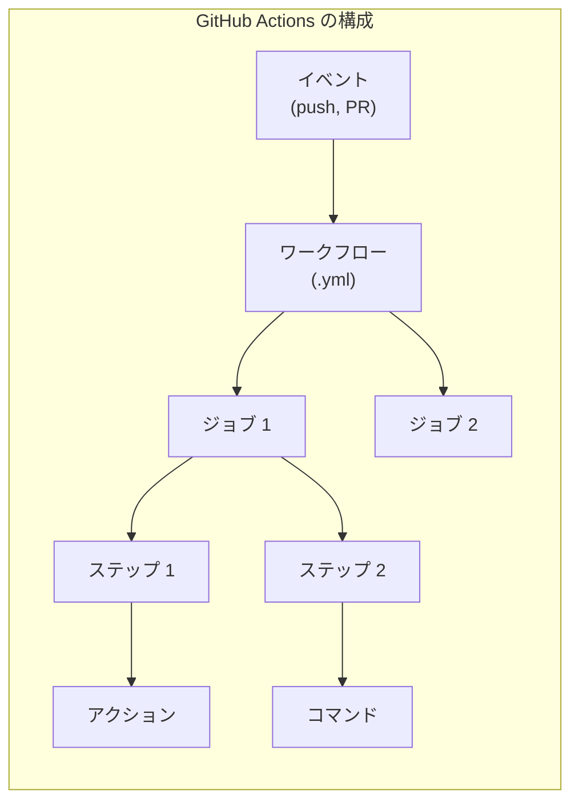
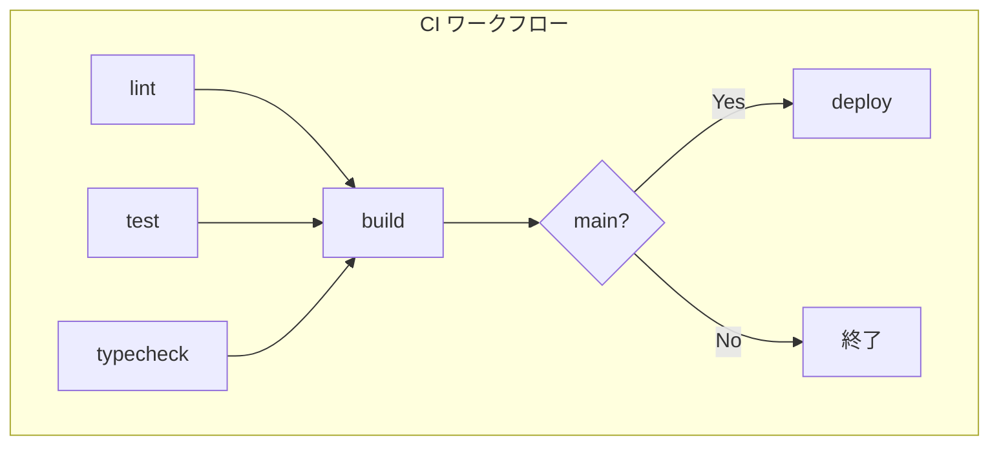

# GitHub Actions による CI/CD

## 目次

- [GitHub Actions とは](#github-actions-とは)
- [基本概念](#基本概念)
  - [ワークフロー（Workflow）](#ワークフローworkflow)
  - [ジョブ（Job）](#ジョブjob)
  - [ステップ（Step）](#ステップstep)
  - [アクション（Action）](#アクションaction)
- [基本的なワークフロー構造](#基本的なワークフロー構造)
- [EC サイト向け CI ワークフロー](#ec-サイト向け-ci-ワークフロー)
  - [完全な CI 設定](#完全な-ci-設定)
- [E2E テストワークフロー](#e2e-テストワークフロー)
- [Storybook / Chromatic ワークフロー](#storybook--chromatic-ワークフロー)
- [設定の詳細解説](#設定の詳細解説)
  - [トリガー（on）](#トリガーon)
  - [並行実行制御（concurrency）](#並行実行制御concurrency)
  - [環境変数](#環境変数)
  - [シークレットと変数](#シークレットと変数)
  - [キャッシュ](#キャッシュ)
- [ジョブの依存関係](#ジョブの依存関係)
  - [実行フロー](#実行フロー)
- [マトリックスビルド](#マトリックスビルド)
- [再利用可能なワークフロー](#再利用可能なワークフロー)
  - [共通ワークフローの定義](#共通ワークフローの定義)
  - [呼び出し](#呼び出し)
- [よくあるアクション](#よくあるアクション)
- [トラブルシューティング](#トラブルシューティング)
  - [ログの確認](#ログの確認)
  - [デバッグモード](#デバッグモード)
  - [よくあるエラー](#よくあるエラー)
- [次のステップ](#次のステップ)

## GitHub Actions とは

**GitHub Actions** は、GitHubに組み込まれたCI/CDプラットフォームです。
リポジトリ内のイベント（push, PRなど）をトリガーにワークフローを実行できます。

***

## 基本概念

GitHub Actionsの構成要素は以下のようになっています。



### ワークフロー（Workflow）

自動化されたプロセス全体。`.github/workflows/` にYAMLファイルとして定義します。

### ジョブ（Job）

ワークフロー内の実行単位。並列または順次実行できます。

### ステップ（Step）

ジョブ内の個々のタスク。コマンドまたはアクションを実行します。

### アクション（Action）

再利用可能なタスク。マーケットプレイスで公開されているものを使用できます。

***

## 基本的なワークフロー構造

```yaml
# .github/workflows/ci.yml
name: CI # ワークフロー名

on: # トリガー
  push:
    branches: [main]
  pull_request:
    branches: [main]

jobs: # ジョブ定義
  build: # ジョブ名
    runs-on: ubuntu-latest # 実行環境

    steps: # ステップ
      - uses: actions/checkout@v4 # アクションを使用
      - name: Run tests # ステップ名
        run: npm test # コマンド実行
```

***

## EC サイト向け CI ワークフロー

### 完全な CI 設定

```yaml
# .github/workflows/ci.yml
name: CI

on:
  push:
    branches: [main]
  pull_request:

concurrency:
  group: ${{ github.workflow }}-${{ github.ref }}
  cancel-in-progress: true

env:
  TURBO_TOKEN: ${{ secrets.TURBO_TOKEN }}
  TURBO_TEAM: ${{ vars.TURBO_TEAM }}

jobs:
  lint:
    name: Lint
    runs-on: ubuntu-latest
    steps:
      - uses: actions/checkout@v4

      - uses: pnpm/action-setup@v4
        with:
          version: 10

      - uses: actions/setup-node@v4
        with:
          node-version: 24
          cache: "pnpm"

      - run: pnpm install --frozen-lockfile
      - run: pnpm lint

  typecheck:
    name: Type Check
    runs-on: ubuntu-latest
    steps:
      - uses: actions/checkout@v4

      - uses: pnpm/action-setup@v4
        with:
          version: 10

      - uses: actions/setup-node@v4
        with:
          node-version: 24
          cache: "pnpm"

      - run: pnpm install --frozen-lockfile
      - run: pnpm typecheck

  test:
    name: Test
    runs-on: ubuntu-latest
    steps:
      - uses: actions/checkout@v4

      - uses: pnpm/action-setup@v4
        with:
          version: 10

      - uses: actions/setup-node@v4
        with:
          node-version: 24
          cache: "pnpm"

      - run: pnpm install --frozen-lockfile
      - run: pnpm test

  build:
    name: Build
    runs-on: ubuntu-latest
    needs: [lint, typecheck, test]
    steps:
      - uses: actions/checkout@v4

      - uses: pnpm/action-setup@v4
        with:
          version: 10

      - uses: actions/setup-node@v4
        with:
          node-version: 24
          cache: "pnpm"

      - run: pnpm install --frozen-lockfile
      - run: pnpm build
```

***

## E2E テストワークフロー

```yaml
# .github/workflows/e2e.yml
name: E2E Tests

on:
  push:
    branches: [main]
  pull_request:

jobs:
  e2e:
    name: Playwright Tests
    runs-on: ubuntu-latest
    steps:
      - uses: actions/checkout@v4

      - uses: pnpm/action-setup@v4
        with:
          version: 10

      - uses: actions/setup-node@v4
        with:
          node-version: 24
          cache: "pnpm"

      - run: pnpm install --frozen-lockfile

      - name: Install Playwright Browsers
        run: pnpm exec playwright install --with-deps

      - name: Build
        run: pnpm build

      - name: Run E2E tests
        run: pnpm test:e2e

      - name: Upload test results
        uses: actions/upload-artifact@v4
        if: always()
        with:
          name: playwright-report
          path: playwright-report/
          retention-days: 30
```

***

## Storybook / Chromatic ワークフロー

```yaml
# .github/workflows/chromatic.yml
name: Chromatic

on:
  push:
    branches: [main]
  pull_request:

jobs:
  chromatic:
    name: Visual Regression Tests
    runs-on: ubuntu-latest
    steps:
      - uses: actions/checkout@v4
        with:
          fetch-depth: 0 # Chromatic に必要

      - uses: pnpm/action-setup@v4
        with:
          version: 10

      - uses: actions/setup-node@v4
        with:
          node-version: 24
          cache: "pnpm"

      - run: pnpm install --frozen-lockfile

      - name: Build Storybook
        run: pnpm build-storybook

      - name: Publish to Chromatic
        uses: chromaui/action@latest
        with:
          projectToken: ${{ secrets.CHROMATIC_PROJECT_TOKEN }}
          buildScriptName: build-storybook
```

***

## 設定の詳細解説

### トリガー（on）

```yaml
on:
  # push 時
  push:
    branches: [main, develop]
    paths:
      - "apps/**"
      - "packages/**"
    paths-ignore:
      - "**.md"

  # PR 時
  pull_request:
    types: [opened, synchronize, reopened]

  # 手動実行
  workflow_dispatch:
    inputs:
      environment:
        description: "Deploy environment"
        required: true
        default: "staging"

  # スケジュール実行
  schedule:
    - cron: "0 0 * * *" # 毎日 0:00 UTC
```

### 並行実行制御（concurrency）

```yaml
concurrency:
  group: ${{ github.workflow }}-${{ github.ref }}
  cancel-in-progress: true # 同じ PR の古いワークフローをキャンセル
```

### 環境変数

```yaml
env:
  # ワークフロー全体で使用
  NODE_ENV: production

jobs:
  build:
    env:
      # ジョブ固有
      DATABASE_URL: ${{ secrets.DATABASE_URL }}

    steps:
      - name: Build
        env:
          # ステップ固有
          API_KEY: ${{ secrets.API_KEY }}
        run: pnpm build
```

### シークレットと変数

| 種類        | 用途      | 例           |
| --------- | ------- | ----------- |
| `secrets` | 機密情報    | API キー、トークン |
| `vars`    | 設定値（公開） | 環境名、URL     |

設定場所はリポジトリのSettings → Secrets and variables → Actionsです。

### キャッシュ

```yaml
- uses: actions/setup-node@v4
  with:
    node-version: 24
    cache: "pnpm" # pnpm の依存をキャッシュ

# カスタムキャッシュ
- uses: actions/cache@v4
  with:
    path: |
      ~/.cache/turbo
      .next/cache
    key: ${{ runner.os }}-turbo-${{ hashFiles('**/pnpm-lock.yaml') }}
    restore-keys: |
      ${{ runner.os }}-turbo-
```

***

## ジョブの依存関係

```yaml
jobs:
  lint:
    runs-on: ubuntu-latest
    # 依存なし、すぐに実行

  test:
    runs-on: ubuntu-latest
    # 依存なし、lint と並列実行

  build:
    runs-on: ubuntu-latest
    needs: [lint, test] # lint と test の完了後に実行

  deploy:
    runs-on: ubuntu-latest
    needs: build
    if: github.ref == 'refs/heads/main' # main ブランチのみ
```

### 実行フロー



***

## マトリックスビルド

複数の条件で並列テストできます。

```yaml
jobs:
  test:
    strategy:
      matrix:
        node-version: [20, 22, 24]
        os: [ubuntu-latest, macos-latest]
      fail-fast: false # 1 つ失敗しても継続

    runs-on: ${{ matrix.os }}
    steps:
      - uses: actions/checkout@v4
      - uses: actions/setup-node@v4
        with:
          node-version: ${{ matrix.node-version }}
      - run: pnpm test
```

***

## 再利用可能なワークフロー

### 共通ワークフローの定義

```yaml
# .github/workflows/reusable-build.yml
name: Reusable Build

on:
  workflow_call:
    inputs:
      node-version:
        required: false
        type: string
        default: "24"
    secrets:
      TURBO_TOKEN:
        required: true

jobs:
  build:
    runs-on: ubuntu-latest
    steps:
      - uses: actions/checkout@v4
      - uses: pnpm/action-setup@v4
        with:
          version: 10
      - uses: actions/setup-node@v4
        with:
          node-version: ${{ inputs.node-version }}
          cache: "pnpm"
      - run: pnpm install --frozen-lockfile
      - run: pnpm build
        env:
          TURBO_TOKEN: ${{ secrets.TURBO_TOKEN }}
```

### 呼び出し

```yaml
# .github/workflows/ci.yml
jobs:
  build:
    uses: ./.github/workflows/reusable-build.yml
    with:
      node-version: "24"
    secrets:
      TURBO_TOKEN: ${{ secrets.TURBO_TOKEN }}
```

***

## よくあるアクション

| アクション                          | 用途              |
| ------------------------------ | --------------- |
| `actions/checkout@v4`          | リポジトリのチェックアウト   |
| `actions/setup-node@v4`        | Node.js のセットアップ |
| `pnpm/action-setup@v4`         | pnpm のセットアップ    |
| `actions/cache@v4`             | キャッシュ           |
| `actions/upload-artifact@v4`   | 成果物のアップロード      |
| `actions/download-artifact@v4` | 成果物のダウンロード      |

***

## トラブルシューティング

### ログの確認

1. Actionsタブで該当のワークフローを選択
2. 失敗したジョブをクリック
3. 失敗したステップのログを展開

### デバッグモード

```yaml
- name: Debug
  run: |
    echo "GitHub Context:"
    echo "${{ toJson(github) }}"
    echo "Env:"
    env
```

### よくあるエラー

| エラー                         | 原因        | 解決策                |
| --------------------------- | --------- | ------------------ |
| `Node.js version not found` | バージョン未対応  | 対応バージョンを指定         |
| `pnpm-lock.yaml not found`  | ロックファイルなし | `pnpm install` を実行 |
| `Secret not found`          | シークレット未設定 | Settings で設定       |
| `Permission denied`         | 権限不足      | `permissions` を追加  |

***

## 次のステップ

GitHub Actionsの設定が完了したら、[Vercel セットアップ](./07-vercel-setup.md) でデプロイ環境を整えましょう。
