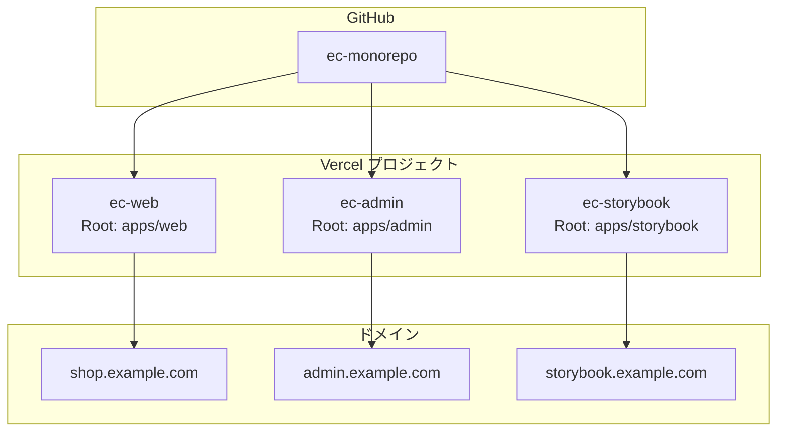
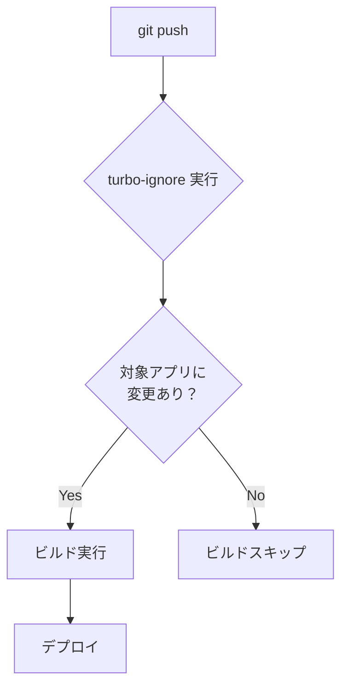

# モノレポでの Vercel 設定

## 目次

- [概要](#概要)
- [複数アプリのデプロイ](#複数アプリのデプロイ)
  - [プロジェクトの作成](#プロジェクトの作成)
  - [手順](#手順)
- [ビルドコマンドの設定](#ビルドコマンドの設定)
  - [推奨設定](#推奨設定)
  - [各アプリの package.json](#各アプリの-packagejson)
- [vercel.json の配置](#verceljson-の配置)
  - [ルートの vercel.json](#ルートの-verceljson)
  - [各アプリの vercel.json](#各アプリの-verceljson)
- [turbo-ignore による最適化](#turbo-ignore-による最適化)
  - [turbo-ignore とは](#turbo-ignore-とは)
  - [インストール](#インストール)
  - [設定](#設定)
  - [動作](#動作)
- [リモートキャッシュの設定](#リモートキャッシュの設定)
  - [Turborepo と Vercel の連携](#turborepo-と-vercel-の連携)
  - [環境変数の設定](#環境変数の設定)
  - [GitHub Actions での設定](#github-actions-での設定)
  - [キャッシュヒット時](#キャッシュヒット時)
- [環境変数の共有](#環境変数の共有)
  - [プロジェクト間で共有](#プロジェクト間で共有)
  - [共通の環境変数](#共通の環境変数)
  - [環境別の設定](#環境別の設定)
- [プレビューデプロイの設定](#プレビューデプロイの設定)
  - [各プロジェクトでプレビュー](#各プロジェクトでプレビュー)
  - [プレビューブランチの設定](#プレビューブランチの設定)
- [ドメインの設定](#ドメインの設定)
  - [サブドメイン構成](#サブドメイン構成)
  - [DNS 設定](#dns-設定)
- [依存関係の可視化](#依存関係の可視化)
  - [Turborepo の依存グラフ](#turborepo-の依存グラフ)
  - [依存関係によるビルド順序](#依存関係によるビルド順序)
- [ベストプラクティス](#ベストプラクティス)
  - [1. 共有パッケージの変更に注意](#1-共有パッケージの変更に注意)
  - [2. 環境変数の命名規則](#2-環境変数の命名規則)
  - [3. ビルド時間の最適化](#3-ビルド時間の最適化)
  - [4. プロジェクト名の命名](#4-プロジェクト名の命名)
- [トラブルシューティング](#トラブルシューティング)
  - [依存パッケージがビルドされない](#依存パッケージがビルドされない)
  - [キャッシュが効かない](#キャッシュが効かない)
  - [環境変数が見つからない](#環境変数が見つからない)
- [完成形の構成](#完成形の構成)
- [次のステップ](#次のステップ)

## 概要

モノレポ構成では、1つのリポジトリから複数のアプリケーションをデプロイします。
VercelはTurborepoモノレポをネイティブサポートしています。



***

## 複数アプリのデプロイ

### プロジェクトの作成

1つのリポジトリから複数のVercelプロジェクトを作成します。

| Vercel プロジェクト | Root Directory | ドメイン                  |
| ------------- | -------------- | --------------------- |
| ec-web        | apps/web       | shop.example.com      |
| ec-admin      | apps/admin     | admin.example.com     |
| ec-storybook  | apps/storybook | storybook.example.com |

### 手順

1. **web アプリのプロジェクト作成**

```text
Vercel Dashboard → Add New Project
├── Import Git Repository: ec-monorepo
├── Root Directory: apps/web
├── Build Command: cd ../.. && turbo build --filter=web
└── Framework: Next.js
```

2. **admin アプリのプロジェクト作成**

```text
Vercel Dashboard → Add New Project
├── Import Git Repository: ec-monorepo
├── Root Directory: apps/admin
├── Build Command: cd ../.. && turbo build --filter=admin
└── Framework: Next.js
```

3. **storybook のプロジェクト作成**

```text
Vercel Dashboard → Add New Project
├── Import Git Repository: ec-monorepo
├── Root Directory: apps/storybook
├── Build Command: cd ../.. && turbo build --filter=storybook
└── Framework: Other
└── Output Directory: storybook-static
```

***

## ビルドコマンドの設定

### 推奨設定

Root Directoryを設定している場合、ルートからのコマンド実行が必要です。

```bash
# apps/web から実行
cd ../.. && turbo build --filter=web
```

### 各アプリの package.json

```json
// apps/web/package.json
{
  "name": "web",
  "scripts": {
    "build": "next build",
    "dev": "next dev --port 3000"
  }
}
```

```json
// apps/admin/package.json
{
  "name": "admin",
  "scripts": {
    "build": "next build",
    "dev": "next dev --port 3001"
  }
}
```

```json
// apps/storybook/package.json
{
  "name": "storybook",
  "scripts": {
    "build": "storybook build -o storybook-static",
    "storybook": "storybook dev -p 6006"
  }
}
```

***

## vercel.json の配置

### ルートの vercel.json

```json
// vercel.json（ルート）
{
  "$schema": "https://openapi.vercel.sh/vercel.json",
  "installCommand": "pnpm install",
  "ignoreCommand": "turbo-ignore"
}
```

### 各アプリの vercel.json

```json
// apps/web/vercel.json
{
  "$schema": "https://openapi.vercel.sh/vercel.json",
  "framework": "nextjs",
  "buildCommand": "cd ../.. && turbo build --filter=web"
}
```

```json
// apps/admin/vercel.json
{
  "$schema": "https://openapi.vercel.sh/vercel.json",
  "framework": "nextjs",
  "buildCommand": "cd ../.. && turbo build --filter=admin"
}
```

***

## turbo-ignore による最適化

### turbo-ignore とは

変更がないアプリのビルドをスキップする機能です。



### インストール

```bash
pnpm add -D turbo --workspace-root
```

### 設定

```json
// vercel.json（ルート）
{
  "ignoreCommand": "npx turbo-ignore"
}
```

### 動作

```text
PR: packages/ui を変更

apps/web      → packages/ui に依存   → ビルド実行 ✓
apps/admin    → packages/ui に依存   → ビルド実行 ✓
apps/storybook → packages/ui に依存  → ビルド実行 ✓
```

```text
PR: apps/admin のみ変更

apps/web      → 変更なし → スキップ ⏭
apps/admin    → 変更あり → ビルド実行 ✓
apps/storybook → 変更なし → スキップ ⏭
```

***

## リモートキャッシュの設定

### Turborepo と Vercel の連携

```bash
# ローカルで認証
npx turbo login
npx turbo link
```

### 環境変数の設定

Vercel Dashboardで以下を設定します。

```text
TURBO_TOKEN: <token>
TURBO_TEAM: <team-slug>
```

### GitHub Actions での設定

```yaml
env:
  TURBO_TOKEN: ${{ secrets.TURBO_TOKEN }}
  TURBO_TEAM: ${{ vars.TURBO_TEAM }}
```

### キャッシュヒット時

```text
web:build: cache hit, replaying logs 9a8b7c6d5e4f3210
admin:build: cache hit, replaying logs 1234567890abcdef

 Tasks:    2 successful, 2 total
Cached:    2 cached, 2 total
  Time:    1.234s
```

***

## 環境変数の共有

### プロジェクト間で共有

Vercelでは、環境変数はプロジェクトごとに設定が必要です。

### 共通の環境変数

```text
# ec-web プロジェクト
NEXT_PUBLIC_API_URL=https://api.example.com
DATABASE_URL=postgresql://...

# ec-admin プロジェクト（同じ値を設定）
NEXT_PUBLIC_API_URL=https://api.example.com
DATABASE_URL=postgresql://...
```

### 環境別の設定

```text
# ec-web プロジェクト
Production:
  NEXT_PUBLIC_API_URL=https://api.example.com

Preview:
  NEXT_PUBLIC_API_URL=https://staging-api.example.com
```

***

## プレビューデプロイの設定

### 各プロジェクトでプレビュー

1つのPRで複数のプレビューが作成されます。

```text
PR #123: feat/product-card

Deployments:
├── ec-web:      https://ec-web-abc123.vercel.app
├── ec-admin:    https://ec-admin-abc123.vercel.app
└── ec-storybook: https://ec-storybook-abc123.vercel.app
```

### プレビューブランチの設定

```text
Project Settings → Git → Preview Branches

Pattern: feature/*, fix/*, develop
```

***

## ドメインの設定

### サブドメイン構成

```text
example.com       → メインサイト（リダイレクト）
shop.example.com  → ec-web
admin.example.com → ec-admin
docs.example.com  → ec-storybook
```

### DNS 設定

```text
shop.example.com   CNAME  cname.vercel-dns.com
admin.example.com  CNAME  cname.vercel-dns.com
docs.example.com   CNAME  cname.vercel-dns.com
```

***

## 依存関係の可視化

### Turborepo の依存グラフ

```bash
turbo build --graph
```

```text
digraph G {
  "web" -> "@ec/ui"
  "web" -> "@ec/shared"
  "web" -> "@ec/validators"
  "web" -> "@ec/store"

  "admin" -> "@ec/ui"
  "admin" -> "@ec/shared"
  "admin" -> "@ec/validators"

  "storybook" -> "@ec/ui"

  "@ec/ui" -> "@ec/shared"
  "@ec/store" -> "@ec/validators"
}
```

### 依存関係によるビルド順序

```text
1. @ec/shared    (依存なし)
2. @ec/validators (依存なし)
3. @ec/ui        (@ec/shared に依存)
4. @ec/store     (@ec/validators に依存)
5. web, admin    (並列実行可能)
```

***

## ベストプラクティス

### 1. 共有パッケージの変更に注意

`packages/*` の変更は全アプリに影響するため、慎重にレビュー。

### 2. 環境変数の命名規則

```text
# クライアントで使用（ブラウザに公開される）
NEXT_PUBLIC_API_URL
NEXT_PUBLIC_SITE_NAME

# サーバーのみ（シークレット）
DATABASE_URL
API_SECRET_KEY
```

### 3. ビルド時間の最適化

```json
// turbo.json
{
  "tasks": {
    "build": {
      "dependsOn": ["^build"],
      "outputs": [".next/**", "!.next/cache/**"]
    }
  }
}
```

### 4. プロジェクト名の命名

```text
<org>-<app>-<env>
例:
- ec-web-production
- ec-admin-staging
```

***

## トラブルシューティング

### 依存パッケージがビルドされない

```text
Error: Cannot find module '@ec/ui'
```

以下を確認してください。

```bash
# turbo.json の dependsOn を確認
"build": {
  "dependsOn": ["^build"]  # ^ を忘れずに
}
```

### キャッシュが効かない

```bash
# キャッシュをクリアして再ビルド
turbo build --force
```

### 環境変数が見つからない

```text
Error: Environment variable not found: DATABASE_URL
```

以下を確認してください。

1. Vercel Dashboardで環境変数を確認
2. 正しい環境（Production/Preview/Development）に設定されているか確認
3. `vercel env pull` で同期

***

## 完成形の構成

```text
GitHub Repository: ec-monorepo
├── Vercel Project: ec-web
│   ├── Production: shop.example.com
│   ├── Preview: pr-*.ec-web.vercel.app
│   └── Root: apps/web
│
├── Vercel Project: ec-admin
│   ├── Production: admin.example.com
│   ├── Preview: pr-*.ec-admin.vercel.app
│   └── Root: apps/admin
│
└── Vercel Project: ec-storybook
    ├── Production: storybook.example.com
    ├── Preview: pr-*.ec-storybook.vercel.app
    └── Root: apps/storybook

Turborepo Remote Cache: 有効
turbo-ignore: 有効（変更のないアプリはスキップ）
```

***

## 次のステップ

モノレポでのVercel設定が完了したら、[演習 1: モノレポ初期セットアップ](./exercises/01-setup-monorepo.md) で実際にセットアップを行いましょう。
