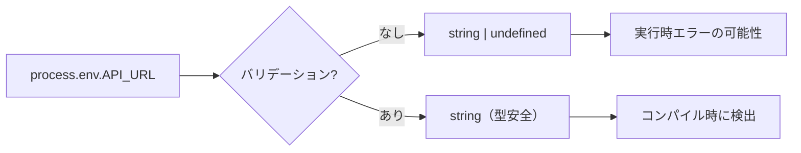

# 環境変数の型安全な管理

## 目次

- [概要](#概要)
  - [なぜ環境変数のバリデーションが必要か](#なぜ環境変数のバリデーションが必要か)
- [@t3-oss/env-nextjs とは](#t3-ossenv-nextjs-とは)
  - [特徴](#特徴)
- [インストール](#インストール)
- [基本的なセットアップ](#基本的なセットアップ)
  - [env.ts の作成](#envts-の作成)
  - [ファイル構成](#ファイル構成)
- [サーバー環境変数とクライアント環境変数](#サーバー環境変数とクライアント環境変数)
  - [サーバー専用変数](#サーバー専用変数)
  - [クライアント公開変数](#クライアント公開変数)
- [使用方法](#使用方法)
  - [Server Components での使用](#server-components-での使用)
  - [Client Components での使用](#client-components-での使用)
  - [API Routes / Server Actions での使用](#api-routes--server-actions-での使用)
- [よくあるスキーマパターン](#よくあるスキーマパターン)
  - [URL の検証](#url-の検証)
  - [ポート番号の検証](#ポート番号の検証)
  - [オプション変数](#オプション変数)
  - [環境ごとのデフォルト値](#環境ごとのデフォルト値)
- [EC サイトでの活用例](#ec-サイトでの活用例)
- [トラブルシューティング](#トラブルシューティング)
  - [ビルド時にエラーが出る](#ビルド時にエラーが出る)
  - [クライアントで undefined になる](#クライアントで-undefined-になる)
- [まとめ](#まとめ)
- [次のステップ](#次のステップ)

## 概要

環境変数はアプリケーションの設定を外部化するための重要な仕組みです。
`@t3-oss/env-nextjs` を使うことで、環境変数を型安全に管理し、実行時エラーを防ぐことができます。

### なぜ環境変数のバリデーションが必要か



- 型安全性 - `string | undefined` ではなく、確実に `string` として扱える
- ビルド時検証 - 必須の環境変数が未設定の場合、ビルドが失敗する
- ドキュメント化 - どの環境変数が必要かがコードで明示される
- IDEサポート - 自動補完とエラー検出が効く

***

## @t3-oss/env-nextjs とは

Next.js向けに最適化された環境変数バリデーションライブラリです。
Zodスキーマを使って環境変数を検証し、型安全なオブジェクトとして提供します。

### 特徴

- Zodベースのスキーマ定義
- サーバー/クライアント環境変数の分離
- Next.jsの `NEXT_PUBLIC_` プレフィックス規約に対応
- ビルド時と実行時の両方でバリデーション
- Tree-shaking対応（サーバー変数はクライアントバンドルに含まれない）

***

## インストール

```bash
pnpm add @t3-oss/env-nextjs zod
```

***

## 基本的なセットアップ

### env.ts の作成

```typescript
// lib/env.ts
import { createEnv } from "@t3-oss/env-nextjs";
import { z } from "zod/v4";

export const env = createEnv({
  /**
   * サーバーサイドでのみ使用する環境変数
   */
  server: {
    DATABASE_URL: z.string().url(),
    API_SECRET_KEY: z.string().min(1),
    NODE_ENV: z.enum(["development", "test", "production"]),
  },

  /**
   * クライアントサイドで公開する環境変数
   * NEXT_PUBLIC_ プレフィックスが必須
   */
  client: {
    NEXT_PUBLIC_API_URL: z.string().url(),
    NEXT_PUBLIC_SITE_NAME: z.string().min(1),
  },

  /**
   * 実行時の値を指定
   * Edge Runtime では process.env を直接使えないため必須
   */
  runtimeEnv: {
    DATABASE_URL: process.env.DATABASE_URL,
    API_SECRET_KEY: process.env.API_SECRET_KEY,
    NODE_ENV: process.env.NODE_ENV,
    NEXT_PUBLIC_API_URL: process.env.NEXT_PUBLIC_API_URL,
    NEXT_PUBLIC_SITE_NAME: process.env.NEXT_PUBLIC_SITE_NAME,
  },

  /**
   * CI 環境などでバリデーションをスキップしたい場合
   */
  skipValidation: !!process.env.SKIP_ENV_VALIDATION,
});
```

### ファイル構成

```text
lib/
└── env.ts          # 環境変数の定義とエクスポート

.env.local          # ローカル開発用（Git 管理外）
.env.example        # サンプルファイル（Git 管理）
```

***

## サーバー環境変数とクライアント環境変数

### サーバー専用変数

サーバーサイドでのみアクセス可能な変数です。
データベース接続情報やAPIシークレットなど、機密性の高い情報を格納します。

```typescript
server: {
  DATABASE_URL: z.string().url(),
  STRIPE_SECRET_KEY: z.string().startsWith("sk_"),
  JWT_SECRET: z.string().min(32),
}
```

### クライアント公開変数

ブラウザでもアクセス可能な変数です。
`NEXT_PUBLIC_` プレフィックスが必須で、ビルド時にバンドルへ含まれます。

```typescript
client: {
  NEXT_PUBLIC_API_URL: z.string().url(),
  NEXT_PUBLIC_GA_ID: z.string().optional(),
  NEXT_PUBLIC_STRIPE_PUBLISHABLE_KEY: z.string().startsWith("pk_"),
}
```

***

## 使用方法

### Server Components での使用

```typescript
// app/products/page.tsx
import { env } from "@/lib/env";

export default async function ProductsPage(): Promise<React.ReactElement> {
  // サーバー変数にアクセス可能
  const response = await fetch(`${env.NEXT_PUBLIC_API_URL}/products`, {
    headers: {
      Authorization: `Bearer ${env.API_SECRET_KEY}`,
    },
  });

  const products = await response.json();

  return <ProductList products={products} />;
}
```

### Client Components での使用

```typescript
// components/analytics.tsx
"use client";

import { env } from "@/lib/env";

export function Analytics(): React.ReactElement | null {
  // クライアント変数のみアクセス可能
  // env.API_SECRET_KEY にアクセスするとエラー
  const gaId = env.NEXT_PUBLIC_GA_ID;

  if (!gaId) return null;

  return <script src={`https://www.googletagmanager.com/gtag/js?id=${gaId}`} />;
}
```

### API Routes / Server Actions での使用

```typescript
// app/api/checkout/route.ts
import { env } from "@/lib/env";
import { NextResponse } from "next/server";

export async function POST(request: Request): Promise<NextResponse> {
  // サーバー変数にアクセス可能
  const stripe = new Stripe(env.STRIPE_SECRET_KEY);

  // ...
}
```

***

## よくあるスキーマパターン

### URL の検証

```typescript
NEXT_PUBLIC_API_URL: z.string().url(),
```

### ポート番号の検証

```typescript
PORT: z.string().transform((s) => parseInt(s, 10)).pipe(z.number().min(1).max(65535)),
```

### オプション変数

```typescript
SENTRY_DSN: z.string().url().optional(),
```

### 環境ごとのデフォルト値

```typescript
LOG_LEVEL: z.enum(["debug", "info", "warn", "error"]).default("info"),
```

***

## EC サイトでの活用例

```typescript
// lib/env.ts
import { createEnv } from "@t3-oss/env-nextjs";
import { z } from "zod/v4";

export const env = createEnv({
  server: {
    // データベース
    DATABASE_URL: z.string().url(),

    // 決済
    STRIPE_SECRET_KEY: z.string().startsWith("sk_"),
    STRIPE_WEBHOOK_SECRET: z.string().startsWith("whsec_"),

    // 認証
    JWT_SECRET: z.string().min(32),
    SESSION_SECRET: z.string().min(32),

    // メール
    SMTP_HOST: z.string().min(1),
    SMTP_PORT: z.string().transform(Number),
    SMTP_USER: z.string().email(),
    SMTP_PASSWORD: z.string().min(1),
  },

  client: {
    // API
    NEXT_PUBLIC_API_URL: z.string().url(),

    // 決済（公開キー）
    NEXT_PUBLIC_STRIPE_PUBLISHABLE_KEY: z.string().startsWith("pk_"),

    // Analytics
    NEXT_PUBLIC_GA_ID: z.string().optional(),

    // サイト設定
    NEXT_PUBLIC_SITE_NAME: z.string().default("EC サイト"),
    NEXT_PUBLIC_SITE_URL: z.string().url(),
  },

  runtimeEnv: {
    DATABASE_URL: process.env.DATABASE_URL,
    STRIPE_SECRET_KEY: process.env.STRIPE_SECRET_KEY,
    STRIPE_WEBHOOK_SECRET: process.env.STRIPE_WEBHOOK_SECRET,
    JWT_SECRET: process.env.JWT_SECRET,
    SESSION_SECRET: process.env.SESSION_SECRET,
    SMTP_HOST: process.env.SMTP_HOST,
    SMTP_PORT: process.env.SMTP_PORT,
    SMTP_USER: process.env.SMTP_USER,
    SMTP_PASSWORD: process.env.SMTP_PASSWORD,
    NEXT_PUBLIC_API_URL: process.env.NEXT_PUBLIC_API_URL,
    NEXT_PUBLIC_STRIPE_PUBLISHABLE_KEY:
      process.env.NEXT_PUBLIC_STRIPE_PUBLISHABLE_KEY,
    NEXT_PUBLIC_GA_ID: process.env.NEXT_PUBLIC_GA_ID,
    NEXT_PUBLIC_SITE_NAME: process.env.NEXT_PUBLIC_SITE_NAME,
    NEXT_PUBLIC_SITE_URL: process.env.NEXT_PUBLIC_SITE_URL,
  },
});
```

***

## トラブルシューティング

### ビルド時にエラーが出る

```text
❌ Invalid environment variables:
  DATABASE_URL: Required
```

必須の環境変数が設定されていません。`.env.local` またはCIの環境変数設定を確認してください。

### クライアントで undefined になる

`NEXT_PUBLIC_` プレフィックスを付け忘れていないか確認してください。
また、`client` ではなく `server` に定義していないか確認してください。

***

## まとめ

- 環境変数は `@t3-oss/env-nextjs` で型安全に管理する
- サーバー変数とクライアント変数を明確に分離する
- Zodスキーマで形式を検証し、実行時エラーを防ぐ
- `.env.example` をコミットして必要な変数をドキュメント化する

***

## 次のステップ

環境変数の管理方法を理解したら、[演習 1: モノレポ初期セットアップ](./exercises/01-setup-monorepo.md) に進んで実際にプロジェクトを構築しましょう。
