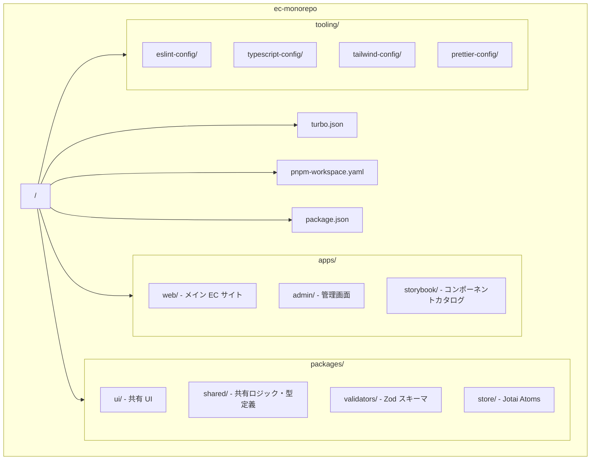

# Phase 0: プロジェクト基盤構築

## 目次

- [概要](#概要)
- [難易度](#難易度)
- [所要時間目安](#所要時間目安)
- [前提知識](#前提知識)
- [学習目標](#学習目標)
- [目次](#目次-1)
- [演習問題](#演習問題)
- [セットアップするモノレポ構成](#セットアップするモノレポ構成)
- [使用ツール](#使用ツール)
- [関連する EC サイト機能](#関連する-ec-サイト機能)
- [推奨学習リソース](#推奨学習リソース)
  - [公式ドキュメント](#公式ドキュメント)
  - [参考記事](#参考記事)
- [自己チェックリスト](#自己チェックリスト)
- [次のフェーズ](#次のフェーズ)

## 概要

モノレポ構成でプロジェクトをセットアップし、開発基盤を整えるフェーズです。
最初に基盤をしっかり作ることで、後のフェーズでの開発がスムーズになります。

***

## 難易度

難易度: 2/5（低〜中）

設定ファイルの理解が中心のため、コーディング自体の難易度は低めですが、ツールの概念理解が重要です。

***

## 所要時間目安

約 4〜6 時間です。

***

## 前提知識

- Git の基本操作（clone, commit, push, branch）
- ターミナル/コマンドラインの基本操作
- npm/yarn の基本的な使い方
- GitHub アカウントを持っていること

***

## 学習目標

このフェーズを完了すると、以下ができるようになります。

- [ ] モノレポの概念とメリットを説明できる
- [ ] Turborepo を使ったモノレポをセットアップできる
- [ ] pnpm ワークスペースを設定できる
- [ ] 共有設定パッケージ（ESLint, TypeScript, Tailwind, Prettier）を作成できる
- [ ] GitHub Actions で基本的な CI パイプラインを構築できる
- [ ] Vercel にプロジェクトをデプロイできる
- [ ] モノレポ構成で複数アプリを Vercel にデプロイできる

***

## 目次

- [演習問題](#演習問題)
- [セットアップするモノレポ構成](#セットアップするモノレポ構成)
- [使用ツール](#使用ツール)
- [関連する EC サイト機能](#関連する-ec-サイト機能)
- [推奨学習リソース](#推奨学習リソース)
  - [公式ドキュメント](#公式ドキュメント)
  - [参考記事](#参考記事)
- [自己チェックリスト](#自己チェックリスト)
- [次のフェーズ](#次のフェーズ)

## 演習問題

- [演習 1: モノレポ初期セットアップ](./exercises/01-setup-monorepo.md)
- [演習 2: Vercel へデプロイ](./exercises/02-deploy-vercel.md)

***

## セットアップするモノレポ構成

***

## 使用ツール

| ツール            | バージョン | 用途               |
| -------------- | ----- | ---------------- |
| Turborepo      | 2.3+  | モノレポビルドシステム      |
| pnpm           | 10+   | パッケージマネージャー      |
| Node.js        | 24+   | JavaScript ランタイム |
| GitHub Actions | -     | CI/CD パイプライン     |
| Vercel         | -     | デプロイ・ホスティング      |
| commitlint     | -     | コミットメッセージ規約      |
| secretlint     | -     | シークレット漏洩防止       |
| mise           | -     | ランタイムバージョン管理     |

***

## 関連する EC サイト機能

このフェーズで直接 EC 機能は実装しませんが、以下の基盤を整えます。

- 開発環境 - すべてのフェーズで使用するモノレポ構成
- CI/CD - コード品質を維持するためのパイプライン
- デプロイ - 実際にサイトを公開するためのインフラ

***

## 推奨学習リソース

### 公式ドキュメント

- [Turborepo ドキュメント](https://turbo.build/repo/docs)
- [pnpm Workspaces](https://pnpm.io/workspaces)
- [Vercel ドキュメント](https://vercel.com/docs)
- [GitHub Actions ドキュメント](https://docs.github.com/en/actions)

### 参考記事

- [Turborepo を使ったモノレポ入門](https://zenn.dev/topics/turborepo)
- [pnpm workspace の使い方](https://zenn.dev/topics/pnpm)

***

## 自己チェックリスト

Phase 0 を完了する前に、以下を確認してください。

- [ ] モノレポとマルチレポの違いを説明できる
- [ ] Turborepo のキャッシュ機能のメリットを理解している
- [ ] pnpm workspace の設定ファイルを書ける
- [ ] `workspace:*` プロトコルの意味を説明できる
- [ ] 共有設定パッケージの構成を理解している
- [ ] GitHub Actions のワークフローファイルを読める
- [ ] Vercel でプロジェクトをデプロイできる
- [ ] PR ごとのプレビューデプロイが動作している

***

## 次のフェーズ

Phase 0 を完了したら、[Phase 1: React 基礎 + Storybook 入門](../phase-01-react-basics/README.md) に進みましょう。
