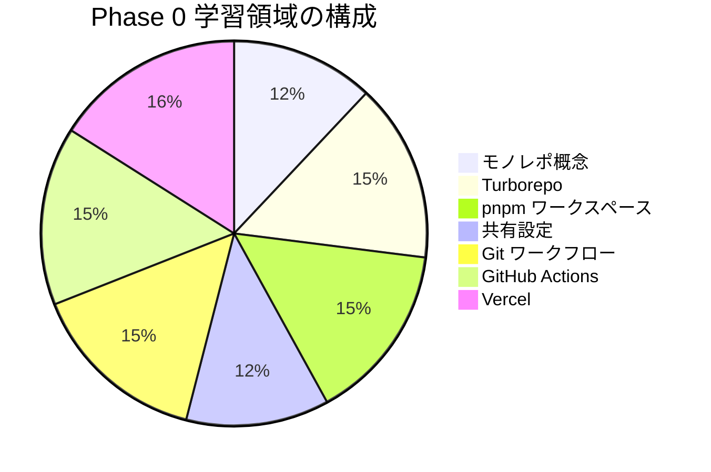

# Phase 0: 自己チェックリスト

Phase 0の理解度を確認するためのチェックリストです。
各項目を確認し、自信を持って「はい」と答えられるか確認してください。

## 目次

- [学習領域の概要](#学習領域の概要)
- [モノレポの概念](#モノレポの概念)
  - [理解度チェック](#理解度チェック)
  - [確認質問](#確認質問)
- [Turborepo](#turborepo)
  - [理解度チェック](#理解度チェック-1)
  - [確認質問](#確認質問-1)
- [pnpm ワークスペース](#pnpm-ワークスペース)
  - [理解度チェック](#理解度チェック-2)
  - [確認質問](#確認質問-2)
- [共有設定パッケージ](#共有設定パッケージ)
  - [理解度チェック](#理解度チェック-3)
  - [確認質問](#確認質問-3)
- [Git ワークフロー](#git-ワークフロー)
  - [理解度チェック](#理解度チェック-4)
  - [確認質問](#確認質問-4)
- [GitHub Actions](#github-actions)
  - [理解度チェック](#理解度チェック-5)
  - [確認質問](#確認質問-5)
- [Vercel](#vercel)
  - [理解度チェック](#理解度チェック-6)
  - [確認質問](#確認質問-6)
- [モノレポでの Vercel](#モノレポでの-vercel)
  - [理解度チェック](#理解度チェック-7)
  - [確認質問](#確認質問-7)
- [実践確認](#実践確認)
  - [操作チェック](#操作チェック)
- [総合評価](#総合評価)
  - [達成度の目安](#達成度の目安)
- [次のステップ](#次のステップ)

## 学習領域の概要

***

## モノレポの概念

### 理解度チェック

- [ ] モノレポとマルチレポの違いを説明できる
- [ ] モノレポのメリットを3つ以上挙げられる
- [ ] モノレポのデメリットを2つ以上挙げられる
- [ ] ECサイトでモノレポを使うメリットを説明できる

### 確認質問

1. 「原子的な変更（Atomic Changes）」とは何ですか？

   **回答例**: 複数のパッケージにまたがる変更を1つのPR/コミットで行えること

2. Turborepoのキャッシュ機能はどのように動作しますか？

   **回答例**: ビルド結果をハッシュで管理し、入力が同じなら再ビルドをスキップ

***

## Turborepo

### 理解度チェック

- [ ] `turbo.json` の基本構造を説明できる
- [ ] `dependsOn` の `^` の意味を理解している
- [ ] `--filter` オプションの使い方を知っている
- [ ] ローカルキャッシュとリモートキャッシュの違いを説明できる

### 確認質問

1. `"dependsOn": ["^build"]` と `"dependsOn": ["build"]` の違いは？

   **回答例**: `^build` は依存パッケージのbuildを先に実行、`build` は自パッケージのbuildを先に実行

2. `turbo build --filter=web...` の `...` は何を意味しますか？

   **回答例**: webとその依存パッケージすべてをビルド対象に含める

***

## pnpm ワークスペース

### 理解度チェック

- [ ] `pnpm-workspace.yaml` の書き方を理解している
- [ ] `workspace:*` プロトコルの意味を説明できる
- [ ] カタログ機能（`catalog:`）の目的を理解している
- [ ] `--filter` オプションの使い方を知っている

### 確認質問

1. なぜ `workspace:*` を使うのですか？

   **回答例**: npmへの公開なしで内部パッケージを参照するため

2. `peerDependencies` と `dependencies` の違いは？

   **回答例**: peerDependenciesは使用側が提供すべき依存、dependenciesはパッケージ自身が提供する依存

***

## 共有設定パッケージ

### 理解度チェック

- [ ] ESLint設定を共有パッケージとして作成できる
- [ ] TypeScript設定の `extends` の仕組みを理解している
- [ ] Tailwind CSSのコンテンツパスの設定方法を知っている
- [ ] Prettier設定の共有方法を理解している

### 確認質問

1. なぜ設定を共有パッケージにするのですか？

   **回答例**: 全プロジェクトで一貫した設定を維持し、重複を排除するため

2. TypeScriptの `paths` エイリアスはどこで設定しますか？

   **回答例**: 各プロジェクトの `tsconfig.json` で設定（共有設定には含めない）

***

## Git ワークフロー

### 理解度チェック

- [ ] GitHub Flowのルールを説明できる
- [ ] Conventional Commitsの形式を理解している
- [ ] ブランチ命名規則に従ってブランチを作成できる
- [ ] commitlintの設定方法を知っている

### 確認質問

1. `feat(ui): ボタンコンポーネントを追加` の各部分の意味は？

   **回答例**: feat=新機能、ui=スコープ（影響範囲）、説明=変更内容

2. `feat!:` の `!` は何を意味しますか？

   **回答例**: 破壊的変更（Breaking Change）を示す

***

## GitHub Actions

### 理解度チェック

- [ ] ワークフロー、ジョブ、ステップの関係を説明できる
- [ ] `on` セクションでトリガーを設定できる
- [ ] `needs` を使ってジョブの依存関係を設定できる
- [ ] シークレットと変数の違いを理解している

### 確認質問

1. `concurrency` の `cancel-in-progress: true` は何をしますか？

   **回答例**: 同じグループの古いワークフローをキャンセルする

2. マトリックスビルドはどのような場合に使いますか？

   **回答例**: 複数のNode.jsバージョンやOSでテストする場合

***

## Vercel

### 理解度チェック

- [ ] VercelにNext.jsプロジェクトをデプロイできる
- [ ] 環境変数の設定方法を知っている
- [ ] プレビューデプロイの仕組みを理解している
- [ ] Vercel CLIの基本コマンドを使える

### 確認質問

1. `NEXT_PUBLIC_` プレフィックスの付いた環境変数の特徴は？

   **回答例**: クライアントサイド（ブラウザ）で使用可能になる

2. `vercel.json` の `ignoreCommand` は何に使いますか？

   **回答例**: turbo-ignoreなどで変更のないアプリのビルドをスキップする

***

## モノレポでの Vercel

### 理解度チェック

- [ ] 1つのリポジトリから複数のプロジェクトをデプロイできる
- [ ] Root Directoryの設定方法を知っている
- [ ] turbo-ignoreの仕組みを理解している
- [ ] Turborepoリモートキャッシュの設定方法を知っている

### 確認質問

1. モノレポで複数アプリをデプロイする場合、Vercelプロジェクトはいくつ作成しますか？

   **回答例**: アプリの数だけ（web, admin, storybook → 3プロジェクト）

2. `cd ../.. && turbo build --filter=web` というビルドコマンドはなぜ必要ですか？

   **回答例**: Root Directoryがapps/webの場合、ルートに戻ってturboを実行するため

***

## 実践確認

### 操作チェック

- [ ] `pnpm install` で全パッケージの依存関係をインストールできる
- [ ] `pnpm dev` で開発サーバーを起動できる
- [ ] `pnpm build` でビルドが成功する
- [ ] `pnpm typecheck` で型チェックが通る
- [ ] Vercelにデプロイが成功している
- [ ] PRでプレビューデプロイが作成される
- [ ] GitHub ActionsのCIが成功する

***

## 総合評価

### 達成度の目安

| 達成率       | 評価                  |
| --------- | ------------------- |
| 90% 以上    | 完璧！Phase 1 に進みましょう  |
| 70% - 89% | 良好。不安な部分を復習してから進む   |
| 50% - 69% | 該当するドキュメントを再読してください |
| 50% 未満    | 最初からもう一度取り組みましょう    |

***

## 次のステップ

チェックリストを確認して理解度に自信が持てたら、[Phase 1: React 基礎 + Storybook 入門](../phase-01-react-basics/README.md) に進みましょう。
