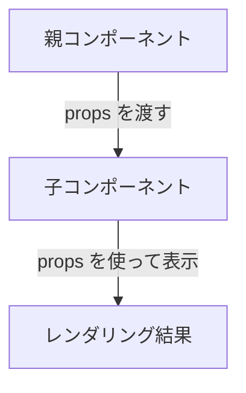
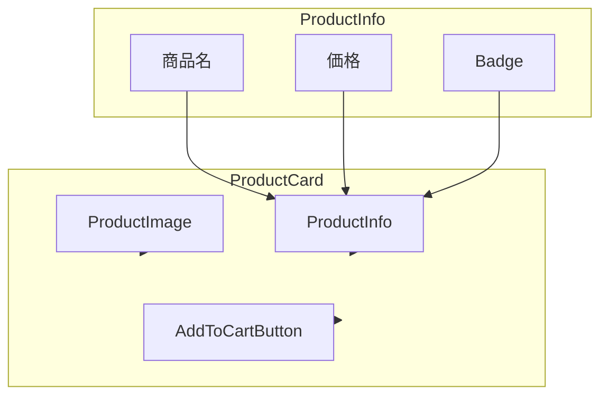
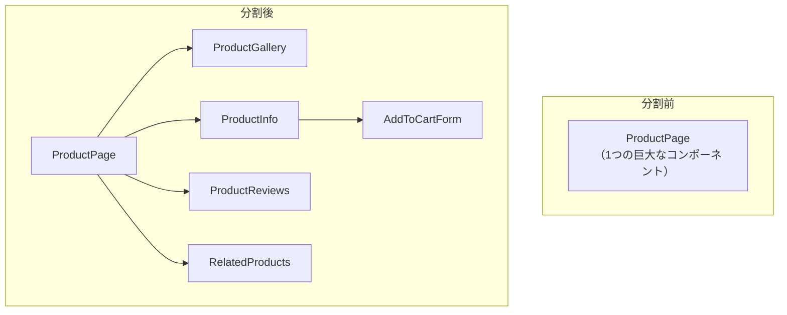

# コンポーネントと props

## 目次

- [コンポーネントとは](#コンポーネントとは)
  - [関数コンポーネント](#関数コンポーネント)
- [コンポーネントの命名規則](#コンポーネントの命名規則)
  - [PascalCase（必須）](#pascalcase必須)
  - [ファイル命名](#ファイル命名)
- [props とは](#props-とは)
  - [基本的な props の渡し方](#基本的な-props-の渡し方)
- [props の分割代入](#props-の分割代入)
  - [複数の props](#複数の-props)
- [TypeScript での props 型定義](#typescript-での-props-型定義)
  - [type を使う（推奨）](#type-を使う推奨)
  - [オブジェクト型の props](#オブジェクト型の-props)
- [オプショナル props](#オプショナル-props)
- [children プロパティ](#children-プロパティ)
  - [React.ReactNode とは](#reactreactnode-とは)
- [コンポーネントの合成](#コンポーネントの合成)
  - [実装例](#実装例)
- [props の読み取り専用性](#props-の読み取り専用性)
- [コンポーネントの分割粒度](#コンポーネントの分割粒度)
  - [分割の目安](#分割の目安)
  - [EC サイトでの例](#ec-サイトでの例)
- [よくある間違い](#よくある間違い)
  - [1. props の型定義漏れ](#1-props-の型定義漏れ)
  - [2. 過度な props drilling](#2-過度な-props-drilling)
- [まとめ](#まとめ)
- [次のステップ](#次のステップ)

## コンポーネントとは

**コンポーネント** は、UIを独立した再利用可能な部品に分割するための仕組みです。
Reactでは、関数がコンポーネントとして機能します。

### 関数コンポーネント

```tsx
// 最もシンプルなコンポーネント
function Greeting(): React.ReactElement {
  return <h1>こんにちは!</h1>;
}

// 使用例
function App(): React.ReactElement {
  return (
    <div>
      <Greeting />
      <Greeting />
      <Greeting />
    </div>
  );
}
```

***

## コンポーネントの命名規則

### PascalCase（必須）

コンポーネント名は **必ず大文字で始める**（PascalCase）必要があります。

```tsx
// OK: 大文字始まり
function ProductCard(): React.ReactElement { ... }
function CartButton(): React.ReactElement { ... }
function HeaderNavigation(): React.ReactElement { ... }

// NG: 小文字始まり（HTML 要素として解釈される）
function productCard(): React.ReactElement { ... }  // 動作しない
```

### ファイル命名

コンポーネントファイルもPascalCaseまたはkebab-caseで命名します。

```text
// PascalCase（コンポーネントファイル）
ProductCard.tsx
CartButton.tsx

// kebab-case（許容される）
product-card.tsx
cart-button.tsx
```

***

## props とは

**props（プロパティ）** は、親コンポーネントから子コンポーネントにデータを渡す仕組みです。



### 基本的な props の渡し方

```tsx
// 親コンポーネント
function App(): React.ReactElement {
  return <Greeting name="田中" />;
}

// 子コンポーネント（props を受け取る）
function Greeting(props: { name: string }): React.ReactElement {
  return <h1>こんにちは、{props.name}さん!</h1>;
}
```

***

## props の分割代入

propsは分割代入で受け取るのが一般的です。

```tsx
// 分割代入なし
function Greeting(props: { name: string }): React.ReactElement {
  return <h1>こんにちは、{props.name}さん!</h1>;
}

// 分割代入あり（推奨）
function Greeting({ name }: { name: string }): React.ReactElement {
  return <h1>こんにちは、{name}さん!</h1>;
}
```

### 複数の props

```tsx
type GreetingProps = {
  name: string;
  age: number;
  isVip: boolean;
};

function Greeting({ name, age, isVip }: GreetingProps): React.ReactElement {
  return (
    <div>
      <h1>こんにちは、{name}さん!</h1>
      <p>年齢: {age}歳</p>
      {isVip && <span className="vip-badge">VIP会員</span>}
    </div>
  );
}

// 使用例
<Greeting
  name="田中"
  age={30}
  isVip={true}
/>;
```

***

## TypeScript での props 型定義

### type を使う（推奨）

```tsx
type ProductCardProps = {
  id: string;
  name: string;
  price: number;
  imageUrl: string;
  inStock: boolean;
};

function ProductCard({ id, name, price, imageUrl, inStock }: ProductCardProps): React.ReactElement {
  return (
    <article
      className="product-card"
      data-product-id={id}
    >
      
      <h3>{name}</h3>
      <p>¥{price.toLocaleString()}</p>
      {!inStock && <span>売り切れ</span>}
    </article>
  );
}
```

### オブジェクト型の props

```tsx
type Product = {
  id: string;
  name: string;
  price: number;
  imageUrl: string;
  inStock: boolean;
};

type ProductCardProps = {
  product: Product;
};

function ProductCard({ product }: ProductCardProps): React.ReactElement {
  return (
    <article className="product-card">
      
      <h3>{product.name}</h3>
      <p>¥{product.price.toLocaleString()}</p>
    </article>
  );
}

// 使用例
const sampleProduct: Product = {
  id: "1",
  name: "Tシャツ",
  price: 2980,
  imageUrl: "/images/tshirt.jpg",
  inStock: true,
};

<ProductCard product={sampleProduct} />;
```

***

## オプショナル props

`?` をつけることで、省略可能なpropsを定義できます。

```tsx
type ButtonProps = {
  label: string;
  variant?: "primary" | "secondary" | "danger"; // 省略可能
  size?: "small" | "medium" | "large"; // 省略可能
  disabled?: boolean; // 省略可能
};

function Button({
  label,
  variant = "primary", // デフォルト値
  size = "medium", // デフォルト値
  disabled = false, // デフォルト値
}: ButtonProps): React.ReactElement {
  return (
    <button
      type="button"
      className={`btn btn-${variant} btn-${size}`}
      disabled={disabled}
    >
      {label}
    </button>
  );
}

// 使用例
<Button label="送信" />
<Button label="キャンセル" variant="secondary" />
<Button label="削除" variant="danger" size="small" />
```

***

## children プロパティ

`children` は特別なpropsで、コンポーネントの開始タグと終了タグの間に渡された要素を受け取ります。

```tsx
type CardProps = {
  title: string;
  children: React.ReactNode;
};

function Card({ title, children }: CardProps): React.ReactElement {
  return (
    <div className="card">
      <h2 className="card-title">{title}</h2>
      <div className="card-body">{children}</div>
    </div>
  );
}

// 使用例
<Card title="お知らせ">
  <p>本日は10%オフセール実施中!</p>
  <button type="button">詳細を見る</button>
</Card>;
```

### React.ReactNode とは

`children` の型として使用される `React.ReactNode` は、以下のすべてを含みます。

- JSX要素
- 文字列
- 数値
- `null` / `undefined`
- 配列
- Fragment

```tsx
// これらはすべて有効な children
<Card title="テスト">
  <p>JSX要素</p>
</Card>

<Card title="テスト">
  文字列だけでもOK
</Card>

<Card title="テスト">
  {null}  {/* 何も表示しない */}
</Card>
```

***

## コンポーネントの合成

小さなコンポーネントを組み合わせて、大きなコンポーネントを作ります。



### 実装例

```tsx
// Badge コンポーネント
type BadgeProps = {
  label: string;
  variant: "sale" | "new" | "soldout";
};

function Badge({ label, variant }: BadgeProps): React.ReactElement {
  return <span className={`badge badge-${variant}`}>{label}</span>;
}

// ProductImage コンポーネント
type ProductImageProps = {
  src: string;
  alt: string;
  isSoldOut: boolean;
};

function ProductImage({ src, alt, isSoldOut }: ProductImageProps): React.ReactElement {
  return (
    <div className="product-image">
      
      {isSoldOut && <div className="sold-out-overlay">SOLD OUT</div>}
    </div>
  );
}

// ProductInfo コンポーネント
type ProductInfoProps = {
  name: string;
  price: number;
  originalPrice?: number;
  isNew: boolean;
};

function ProductInfo({ name, price, originalPrice, isNew }: ProductInfoProps): React.ReactElement {
  const hasDiscount = originalPrice !== undefined && originalPrice > price;

  return (
    <div className="product-info">
      <h3>{name}</h3>
      <div className="badges">
        {isNew && (
          <Badge
            label="NEW"
            variant="new"
          />
        )}
        {hasDiscount && (
          <Badge
            label="SALE"
            variant="sale"
          />
        )}
      </div>
      <div className="price">
        {hasDiscount && <span className="original-price">¥{originalPrice.toLocaleString()}</span>}
        <span className="current-price">¥{price.toLocaleString()}</span>
      </div>
    </div>
  );
}

// ProductCard コンポーネント（合成）
type Product = {
  id: string;
  name: string;
  price: number;
  originalPrice?: number;
  imageUrl: string;
  inStock: boolean;
  isNew: boolean;
};

type ProductCardProps = {
  product: Product;
};

function ProductCard({ product }: ProductCardProps): React.ReactElement {
  return (
    <article className="product-card">
      <ProductImage
        src={product.imageUrl}
        alt={product.name}
        isSoldOut={!product.inStock}
      />
      <ProductInfo
        name={product.name}
        price={product.price}
        originalPrice={product.originalPrice}
        isNew={product.isNew}
      />
      <button
        type="button"
        className="add-to-cart-button"
        disabled={!product.inStock}
      >
        {product.inStock ? "カートに追加" : "売り切れ"}
      </button>
    </article>
  );
}
```

***

## props の読み取り専用性

propsは **読み取り専用** です。子コンポーネント内でpropsを変更してはいけません。

```tsx
// NG: props を変更しようとする
function BadComponent({ price }: { price: number }): React.ReactElement {
  price = price * 1.1; // エラー: 読み取り専用プロパティ
  return <p>¥{price}</p>;
}

// OK: ローカル変数に計算結果を格納
function GoodComponent({ price }: { price: number }): React.ReactElement {
  const priceWithTax = price * 1.1;
  return <p>¥{priceWithTax}</p>;
}
```

***

## コンポーネントの分割粒度

### 分割の目安

1. **再利用性**: 複数の場所で使われるUI
2. **複雑さ**: 1つのコンポーネントが大きくなりすぎた
3. **責務**: 異なる責務を持つ部分を分離

### EC サイトでの例



***

## よくある間違い

### 1. props の型定義漏れ

```tsx
// NG: 型がない
function ProductCard({ name, price }) {
  return (
    <div>
      {name}: ¥{price}
    </div>
  );
}

// OK: 型を定義
type ProductCardProps = {
  name: string;
  price: number;
};

function ProductCard({ name, price }: ProductCardProps): React.ReactElement {
  return (
    <div>
      {name}: ¥{price}
    </div>
  );
}
```

### 2. 過度な props drilling

```tsx
// NG: 深いネストで props をバケツリレー
function App({ user }: { user: User }): React.ReactElement {
  return <Page user={user} />;
}

function Page({ user }: { user: User }): React.ReactElement {
  return <Content user={user} />;
}

function Content({ user }: { user: User }): React.ReactElement {
  return <Header user={user} />;
}

function Header({ user }: { user: User }): React.ReactElement {
  return <span>{user.name}</span>;
}

// OK: 必要な場所にだけ渡す（または状態管理ライブラリを使用）
// → Phase 4 で Jotai を学びます
```

***

## まとめ

| 概念           | 説明                       |
| ------------ | ------------------------ |
| コンポーネント      | UI を分割する再利用可能な関数         |
| props        | 親から子へデータを渡す仕組み           |
| 分割代入         | props を受け取る推奨パターン        |
| 型定義          | TypeScript で props の型を定義 |
| children     | タグ間の要素を受け取る特別な props     |
| オプショナル props | `?` で省略可能にし、デフォルト値を設定    |
| 読み取り専用       | props は変更不可              |

***

## 次のステップ

コンポーネントとpropsを理解したら、[useState / useEffect](./03-state-hooks.md) に進んで、
コンポーネントの状態管理を学びましょう。
