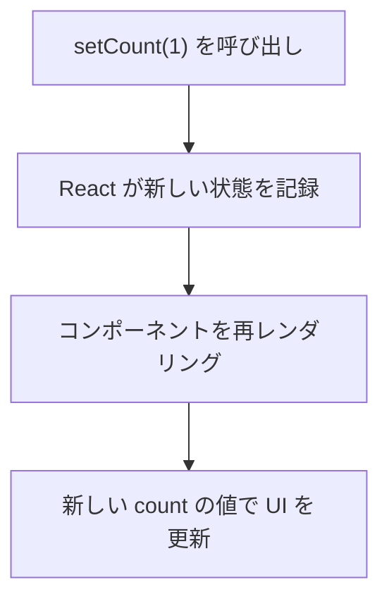
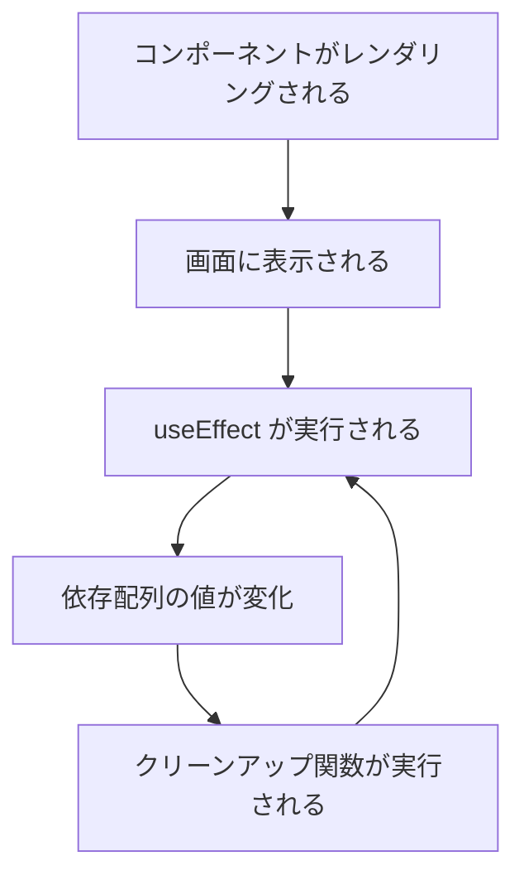

# useState / useEffect

## 目次

- [フック（Hooks）とは](#フックhooksとは)
  - [フックの基本ルール](#フックの基本ルール)
- [useState](#usestate)
  - [基本構文](#基本構文)
  - [基本的な使い方](#基本的な使い方)
  - [状態更新の仕組み](#状態更新の仕組み)
- [useState の型指定](#usestate-の型指定)
  - [基本型](#基本型)
  - [null を含む場合](#null-を含む場合)
  - [配列・オブジェクト](#配列オブジェクト)
- [状態の更新](#状態の更新)
  - [直接値を渡す](#直接値を渡す)
  - [前の状態を使って更新（関数型更新）](#前の状態を使って更新関数型更新)
  - [なぜ関数型更新が重要か](#なぜ関数型更新が重要か)
- [オブジェクト・配列の状態更新](#オブジェクト配列の状態更新)
  - [イミュータブルな更新](#イミュータブルな更新)
  - [配列の更新パターン](#配列の更新パターン)
- [useEffect](#useeffect)
  - [基本構文](#基本構文-1)
  - [useEffect のタイミング](#useeffect-のタイミング)
- [依存配列のパターン](#依存配列のパターン)
  - [1. 依存配列なし（毎回実行）](#1-依存配列なし毎回実行)
  - [2. 空の依存配列（マウント時のみ）](#2-空の依存配列マウント時のみ)
  - [3. 依存配列あり（特定の値が変化した時）](#3-依存配列あり特定の値が変化した時)
- [useEffect の実践例](#useeffect-の実践例)
  - [API からデータを取得](#api-からデータを取得)
  - [イベントリスナーの登録と解除](#イベントリスナーの登録と解除)
  - [タイマーの設定と解除](#タイマーの設定と解除)
- [EC サイトでの実践例](#ec-サイトでの実践例)
  - [お気に入りトグル](#お気に入りトグル)
  - [数量セレクター](#数量セレクター)
  - [ローカルストレージとの同期](#ローカルストレージとの同期)
- [よくある間違い](#よくある間違い)
  - [1. 依存配列の漏れ](#1-依存配列の漏れ)
  - [2. useEffect 内での直接的な async](#2-useeffect-内での直接的な-async)
  - [3. 無限ループ](#3-無限ループ)
- [まとめ](#まとめ)
- [次のステップ](#次のステップ)

## フック（Hooks）とは

**フック** は、関数コンポーネントで状態管理やライフサイクル処理を行うための機能です。
React 16.8 で導入され、現在の React 開発の標準となっています。

### フックの基本ルール

1. **コンポーネントのトップレベルで呼び出す**（条件分岐やループ内で呼び出さない）
2. **React 関数コンポーネント内で呼び出す**（通常の JavaScript 関数では使えない）

```tsx
// OK: トップレベルで呼び出し
function Counter(): React.ReactElement {
  const [count, setCount] = useState(0);
  // ...
}

// NG: 条件分岐内で呼び出し
function BadCounter(): React.ReactElement {
  if (someCondition) {
    const [count, setCount] = useState(0); // エラー!
  }
}
```

---

## useState

### 基本構文

```tsx
const [状態変数, 更新関数] = useState(初期値);
```

### 基本的な使い方

```tsx
import { useState } from "react";

function Counter(): React.ReactElement {
  const [count, setCount] = useState(0);

  return (
    <div>
      <p>カウント: {count}</p>
      <button
        type="button"
        onClick={() => setCount(count + 1)}
      >
        +1
      </button>
    </div>
  );
}
```

### 状態更新の仕組み



---

## useState の型指定

TypeScript では、useState に型を指定できます。

### 基本型

```tsx
// 型推論される場合
const [count, setCount] = useState(0); // number
const [name, setName] = useState(""); // string
const [isOpen, setIsOpen] = useState(false); // boolean

// 明示的に型を指定する場合
const [count, setCount] = useState<number>(0);
const [name, setName] = useState<string>("");
const [isOpen, setIsOpen] = useState<boolean>(false);
```

### null を含む場合

```tsx
// 初期値が null の場合
const [user, setUser] = useState<User | null>(null);

// 使用時は null チェックが必要
if (user !== null) {
  console.log(user.name);
}
```

### 配列・オブジェクト

```tsx
type CartItem = {
  id: string;
  name: string;
  quantity: number;
};

// 配列
const [items, setItems] = useState<CartItem[]>([]);

// オブジェクト
const [product, setProduct] = useState<Product | null>(null);
```

---

## 状態の更新

### 直接値を渡す

```tsx
function Counter(): React.ReactElement {
  const [count, setCount] = useState(0);

  const handleClick = (): void => {
    setCount(10); // count を 10 に設定
  };

  return <button onClick={handleClick}>10に設定</button>;
}
```

### 前の状態を使って更新（関数型更新）

```tsx
function Counter(): React.ReactElement {
  const [count, setCount] = useState(0);

  const increment = (): void => {
    // 推奨: 前の値を使って更新
    setCount((prevCount) => prevCount + 1);
  };

  const incrementThree = (): void => {
    // 関数型更新なら連続呼び出しでも正しく動作
    setCount((prev) => prev + 1);
    setCount((prev) => prev + 1);
    setCount((prev) => prev + 1);
  };

  return (
    <div>
      <p>{count}</p>
      <button onClick={increment}>+1</button>
      <button onClick={incrementThree}>+3</button>
    </div>
  );
}
```

### なぜ関数型更新が重要か

```tsx
// NG: 同じ count を参照してしまう
const badIncrement = (): void => {
  setCount(count + 1); // count は 0
  setCount(count + 1); // count はまだ 0（再レンダリング前）
  setCount(count + 1); // count はまだ 0
  // 結果: 1 になる（3 ではない）
};

// OK: 関数型更新で最新の値を使用
const goodIncrement = (): void => {
  setCount((prev) => prev + 1); // 0 + 1 = 1
  setCount((prev) => prev + 1); // 1 + 1 = 2
  setCount((prev) => prev + 1); // 2 + 1 = 3
  // 結果: 3 になる
};
```

---

## オブジェクト・配列の状態更新

### イミュータブルな更新

React の状態は **直接変更（ミューテーション）してはいけません**。
必ず新しいオブジェクト/配列を作成して渡します。

```tsx
type Product = {
  id: string;
  name: string;
  price: number;
};

function ProductEditor(): React.ReactElement {
  const [product, setProduct] = useState<Product>({
    id: "1",
    name: "Tシャツ",
    price: 2980,
  });

  // NG: 直接変更（ミューテーション）
  const badUpdate = (): void => {
    product.price = 1980; // 変更が検知されない!
    setProduct(product); // 同じ参照なので再レンダリングされない
  };

  // OK: スプレッド構文で新しいオブジェクトを作成
  const goodUpdate = (): void => {
    setProduct({
      ...product,
      price: 1980,
    });
  };

  return (
    <div>
      <p>
        {product.name}: ¥{product.price}
      </p>
      <button onClick={goodUpdate}>割引適用</button>
    </div>
  );
}
```

### 配列の更新パターン

```tsx
type CartItem = {
  id: string;
  name: string;
  quantity: number;
};

function Cart(): React.ReactElement {
  const [items, setItems] = useState<CartItem[]>([]);

  // 追加
  const addItem = (newItem: CartItem): void => {
    setItems([...items, newItem]);
  };

  // 削除
  const removeItem = (id: string): void => {
    setItems(items.filter((item) => item.id !== id));
  };

  // 更新
  const updateQuantity = (id: string, quantity: number): void => {
    setItems(items.map((item) => (item.id === id ? { ...item, quantity } : item)));
  };

  return (
    <ul>
      {items.map((item) => (
        <li key={item.id}>
          {item.name} x {item.quantity}
          <button onClick={() => updateQuantity(item.id, item.quantity + 1)}>+</button>
          <button onClick={() => removeItem(item.id)}>削除</button>
        </li>
      ))}
    </ul>
  );
}
```

---

## useEffect

### 基本構文

```tsx
useEffect(() => {
  // 実行したい処理（副作用）
  return () => {
    // クリーンアップ処理（オプション）
  };
}, [依存配列]);
```

### useEffect のタイミング



---

## 依存配列のパターン

### 1. 依存配列なし（毎回実行）

```tsx
useEffect(() => {
  console.log("毎回のレンダリング後に実行");
});
```

### 2. 空の依存配列（マウント時のみ）

```tsx
useEffect(() => {
  console.log("コンポーネントのマウント時に1回だけ実行");
}, []);
```

### 3. 依存配列あり（特定の値が変化した時）

```tsx
useEffect(() => {
  console.log(`productId が ${productId} に変化した`);
  // API からデータを取得するなど
}, [productId]);
```

---

## useEffect の実践例

### API からデータを取得

```tsx
type Product = {
  id: string;
  name: string;
  price: number;
};

function ProductDetail({ productId }: { productId: string }): React.ReactElement {
  const [product, setProduct] = useState<Product | null>(null);
  const [isLoading, setIsLoading] = useState(true);
  const [error, setError] = useState<string | null>(null);

  useEffect(() => {
    const fetchProduct = async (): Promise<void> => {
      try {
        setIsLoading(true);
        setError(null);
        const response = await fetch(`/api/products/${productId}`);
        if (!response.ok) {
          throw new Error("商品が見つかりません");
        }
        const data = await response.json();
        setProduct(data);
      } catch (err) {
        setError(err instanceof Error ? err.message : "エラーが発生しました");
      } finally {
        setIsLoading(false);
      }
    };

    fetchProduct();
  }, [productId]); // productId が変わるたびに再取得

  if (isLoading) {
    return <p>読み込み中...</p>;
  }

  if (error !== null) {
    return <p>エラー: {error}</p>;
  }

  if (product === null) {
    return <p>商品が見つかりません</p>;
  }

  return (
    <div>
      <h1>{product.name}</h1>
      <p>¥{product.price.toLocaleString()}</p>
    </div>
  );
}
```

### イベントリスナーの登録と解除

```tsx
function WindowSize(): React.ReactElement {
  const [size, setSize] = useState({
    width: window.innerWidth,
    height: window.innerHeight,
  });

  useEffect(() => {
    const handleResize = (): void => {
      setSize({
        width: window.innerWidth,
        height: window.innerHeight,
      });
    };

    window.addEventListener("resize", handleResize);

    // クリーンアップ: コンポーネントがアンマウントされる時に実行
    return () => {
      window.removeEventListener("resize", handleResize);
    };
  }, []); // 空の依存配列 = マウント時に1回だけ

  return (
    <p>
      ウィンドウサイズ: {size.width} x {size.height}
    </p>
  );
}
```

### タイマーの設定と解除

```tsx
function Countdown({ seconds }: { seconds: number }): React.ReactElement {
  const [remaining, setRemaining] = useState(seconds);

  useEffect(() => {
    if (remaining <= 0) {
      return;
    }

    const timerId = setInterval(() => {
      setRemaining((prev) => prev - 1);
    }, 1000);

    // クリーンアップ: タイマーを解除
    return () => {
      clearInterval(timerId);
    };
  }, [remaining]);

  return <div>{remaining > 0 ? <p>残り {remaining} 秒</p> : <p>セール終了!</p>}</div>;
}
```

---

## EC サイトでの実践例

### お気に入りトグル

```tsx
function FavoriteButton({ productId }: { productId: string }): React.ReactElement {
  const [isFavorite, setIsFavorite] = useState(false);

  const toggleFavorite = (): void => {
    setIsFavorite((prev) => !prev);
  };

  return (
    <button
      type="button"
      onClick={toggleFavorite}
      className={isFavorite ? "favorite-active" : "favorite-inactive"}
    >
      {isFavorite ? "♥ お気に入り済み" : "♡ お気に入りに追加"}
    </button>
  );
}
```

### 数量セレクター

```tsx
type QuantitySelectorProps = {
  initialQuantity?: number;
  max?: number;
  onChange: (quantity: number) => void;
};

function QuantitySelector({
  initialQuantity = 1,
  max = 10,
  onChange,
}: QuantitySelectorProps): React.ReactElement {
  const [quantity, setQuantity] = useState(initialQuantity);

  const increment = (): void => {
    if (quantity < max) {
      const newQuantity = quantity + 1;
      setQuantity(newQuantity);
      onChange(newQuantity);
    }
  };

  const decrement = (): void => {
    if (quantity > 1) {
      const newQuantity = quantity - 1;
      setQuantity(newQuantity);
      onChange(newQuantity);
    }
  };

  return (
    <div className="quantity-selector">
      <button
        type="button"
        onClick={decrement}
        disabled={quantity <= 1}
      >
        -
      </button>
      <span>{quantity}</span>
      <button
        type="button"
        onClick={increment}
        disabled={quantity >= max}
      >
        +
      </button>
    </div>
  );
}
```

### ローカルストレージとの同期

```tsx
function useLocalStorage<T>(key: string, initialValue: T): [T, (value: T) => void] {
  const [storedValue, setStoredValue] = useState<T>(() => {
    try {
      const item = window.localStorage.getItem(key);
      return item !== null ? JSON.parse(item) : initialValue;
    } catch {
      return initialValue;
    }
  });

  const setValue = (value: T): void => {
    setStoredValue(value);
    window.localStorage.setItem(key, JSON.stringify(value));
  };

  return [storedValue, setValue];
}

// 使用例
function CartIcon(): React.ReactElement {
  const [cartCount, setCartCount] = useLocalStorage("cartCount", 0);

  return (
    <div>
      <span>カート: {cartCount}点</span>
      <button onClick={() => setCartCount(cartCount + 1)}>追加</button>
    </div>
  );
}
```

---

## よくある間違い

### 1. 依存配列の漏れ

```tsx
// NG: productId を依存配列に含めていない
useEffect(() => {
  fetchProduct(productId);
}, []); // 警告: productId を含めるべき

// OK: 依存する値を含める
useEffect(() => {
  fetchProduct(productId);
}, [productId]);
```

### 2. useEffect 内での直接的な async

```tsx
// NG: useEffect のコールバック自体を async にする
useEffect(async () => {
  // エラー!
  const data = await fetchData();
}, []);

// OK: 内部で async 関数を定義して呼び出す
useEffect(() => {
  const fetchData = async (): Promise<void> => {
    const data = await fetch("/api/data");
    // ...
  };
  fetchData();
}, []);
```

### 3. 無限ループ

```tsx
// NG: 依存配列にオブジェクトを直接入れる
const options = { id: productId };
useEffect(() => {
  fetch(options);
}, [options]); // 毎回新しいオブジェクトが作られるので無限ループ

// OK: プリミティブ値を依存配列に
useEffect(() => {
  fetch({ id: productId });
}, [productId]);
```

---

## まとめ

| 概念           | 説明                                         |
| -------------- | -------------------------------------------- |
| useState       | コンポーネントに状態を追加するフック         |
| 関数型更新     | 前の状態を使って安全に更新                   |
| イミュータブル | 状態は直接変更せず、新しいオブジェクトを作成 |
| useEffect      | 副作用（API 呼び出し、購読など）を処理       |
| 依存配列       | useEffect の実行タイミングを制御             |
| クリーンアップ | useEffect の return で後処理を行う           |

---

## 次のステップ

useState と useEffect を理解したら、[イベントハンドリング](./04-events.md) に進んで、
ユーザー操作への応答方法を学びましょう。
