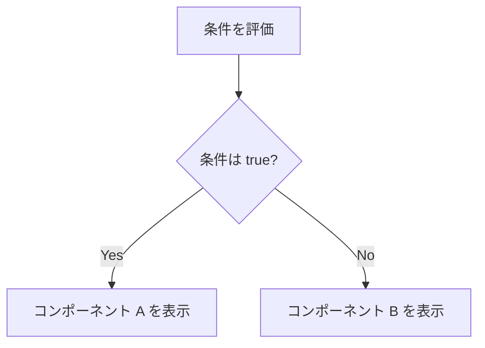
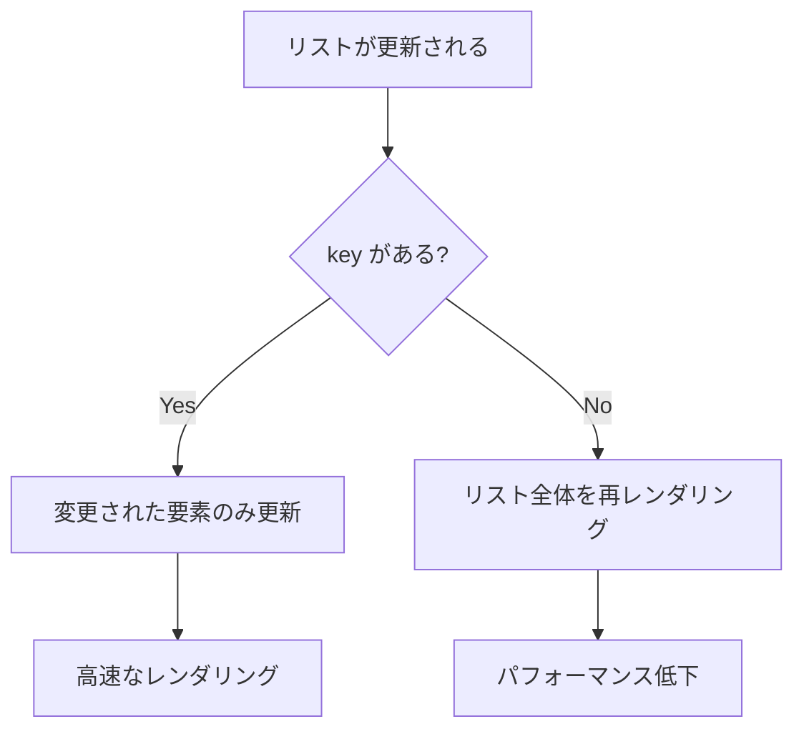

# 条件レンダリングとリスト

## 目次

- [条件レンダリングとは](#条件レンダリングとは)
- [条件レンダリングの方法](#条件レンダリングの方法)
  - [1. if 文（早期リターン）](#1-if-文早期リターン)
  - [2. 三項演算子](#2-三項演算子)
  - [3. && 演算子（短絡評価）](#3--演算子短絡評価)
- [早期リターンパターン](#早期リターンパターン)
  - [Before（ネストが深い）](#beforeネストが深い)
  - [After（早期リターン）](#after早期リターン)
- [複数条件のパターン](#複数条件のパターン)
  - [オブジェクトマッピング](#オブジェクトマッピング)
  - [switch 文](#switch-文)
- [リストレンダリング](#リストレンダリング)
  - [map を使った基本パターン](#map-を使った基本パターン)
  - [コンポーネントを使ったリスト](#コンポーネントを使ったリスト)
- [key の重要性](#key-の重要性)
  - [key とは](#key-とは)
  - [key の指定方法](#key-の指定方法)
  - [key のアンチパターン](#key-のアンチパターン)
  - [インデックスを key に使っても良い場合](#インデックスを-key-に使っても良い場合)
- [空リストの処理](#空リストの処理)
  - [空の場合のフォールバック](#空の場合のフォールバック)
  - [ローディング状態との組み合わせ](#ローディング状態との組み合わせ)
- [EC サイトでの実践例](#ec-サイトでの実践例)
  - [カテゴリフィルター](#カテゴリフィルター)
  - [商品一覧（フィルター付き）](#商品一覧フィルター付き)
  - [カート商品リスト](#カート商品リスト)
  - [ステップ表示（購入フロー）](#ステップ表示購入フロー)
- [よくある間違い](#よくある間違い)
  - [1. key を忘れる](#1-key-を忘れる)
  - [2. && 演算子で 0 や false が表示される](#2--演算子で-0-や-false-が表示される)
  - [3. map の戻り値を忘れる](#3-map-の戻り値を忘れる)
- [まとめ](#まとめ)
- [次のステップ](#次のステップ)

## 条件レンダリングとは

**条件レンダリング** は、条件によって表示内容を切り替える手法です。
ログイン状態、データの有無、ローディング状態などに応じて UI を変更できます。



---

## 条件レンダリングの方法

### 1. if 文（早期リターン）

```tsx
function ProductDetail({ product }: { product: Product | null }): React.ReactElement {
  // 早期リターンで null ケースを処理
  if (product === null) {
    return <p>商品が見つかりません</p>;
  }

  return (
    <div>
      <h1>{product.name}</h1>
      <p>¥{product.price.toLocaleString()}</p>
    </div>
  );
}
```

### 2. 三項演算子

```tsx
function StockStatus({ inStock }: { inStock: boolean }): React.ReactElement {
  return (
    <span className={inStock ? "text-green" : "text-red"}>{inStock ? "在庫あり" : "在庫切れ"}</span>
  );
}
```

### 3. && 演算子（短絡評価）

```tsx
function ProductCard({ product }: { product: Product }): React.ReactElement {
  return (
    <div>
      <h3>{product.name}</h3>
      {product.isNew && <span className="badge-new">NEW</span>}
      {product.discount > 0 && <span className="badge-sale">{product.discount}% OFF</span>}
    </div>
  );
}
```

---

## 早期リターンパターン

複雑な条件を扱う場合、早期リターンで読みやすくできます。

### Before（ネストが深い）

```tsx
function ProductPage({ productId }: { productId: string }): React.ReactElement {
  const { data, isLoading, error } = useProduct(productId);

  return (
    <div>
      {isLoading ? (
        <Loading />
      ) : error ? (
        <Error message={error.message} />
      ) : data ? (
        <ProductDetail product={data} />
      ) : (
        <NotFound />
      )}
    </div>
  );
}
```

### After（早期リターン）

```tsx
function ProductPage({ productId }: { productId: string }): React.ReactElement {
  const { data, isLoading, error } = useProduct(productId);

  if (isLoading) {
    return <Loading />;
  }

  if (error !== null) {
    return <Error message={error.message} />;
  }

  if (data === null) {
    return <NotFound />;
  }

  return <ProductDetail product={data} />;
}
```

---

## 複数条件のパターン

### オブジェクトマッピング

```tsx
type OrderStatus = "pending" | "processing" | "shipped" | "delivered" | "cancelled";

const STATUS_LABELS: Record<OrderStatus, string> = {
  pending: "注文確認中",
  processing: "準備中",
  shipped: "発送済み",
  delivered: "配達完了",
  cancelled: "キャンセル",
};

const STATUS_COLORS: Record<OrderStatus, string> = {
  pending: "text-yellow-600",
  processing: "text-blue-600",
  shipped: "text-purple-600",
  delivered: "text-green-600",
  cancelled: "text-red-600",
};

function OrderStatusBadge({ status }: { status: OrderStatus }): React.ReactElement {
  return <span className={`badge ${STATUS_COLORS[status]}`}>{STATUS_LABELS[status]}</span>;
}
```

### switch 文

```tsx
function PriceDisplay({ type, price }: { type: string; price: number }): React.ReactElement {
  const renderPrice = (): React.ReactNode => {
    switch (type) {
      case "sale":
        return <span className="font-bold text-red-600">¥{price}</span>;
      case "member":
        return <span className="text-blue-600">会員価格: ¥{price}</span>;
      case "regular":
        return <span>¥{price}</span>;
      default:
        return <span>価格未定</span>;
    }
  };

  return <div className="price">{renderPrice()}</div>;
}
```

---

## リストレンダリング

### map を使った基本パターン

```tsx
type Product = {
  id: string;
  name: string;
  price: number;
};

function ProductList({ products }: { products: Product[] }): React.ReactElement {
  return (
    <ul>
      {products.map((product) => (
        <li key={product.id}>
          {product.name}: ¥{product.price}
        </li>
      ))}
    </ul>
  );
}
```

### コンポーネントを使ったリスト

```tsx
function ProductGrid({ products }: { products: Product[] }): React.ReactElement {
  return (
    <div className="product-grid">
      {products.map((product) => (
        <ProductCard
          key={product.id}
          product={product}
        />
      ))}
    </div>
  );
}
```

---

## key の重要性

### key とは

`key` は、React がリスト内の各要素を識別するための特別な属性です。
リストの変更（追加、削除、並び替え）を効率的に処理するために必要です。



### key の指定方法

```tsx
// OK: ユニークな ID を使用
{
  products.map((product) => (
    <ProductCard
      key={product.id}
      product={product}
    />
  ));
}

// OK: 複合キー
{
  orders.map((order) => (
    <OrderItem
      key={`${order.userId}-${order.orderId}`}
      order={order}
    />
  ));
}
```

### key のアンチパターン

```tsx
// NG: インデックスを key に使用
{
  products.map((product, index) => (
    <ProductCard
      key={index}
      product={product}
    />
  ));
}
// 問題: 並び替えや削除で不具合が発生する

// NG: ランダムな値を key に使用
{
  products.map((product) => (
    <ProductCard
      key={Math.random()}
      product={product}
    />
  ));
}
// 問題: 毎回新しい key が生成されるため、全要素が再レンダリングされる
```

### インデックスを key に使っても良い場合

以下の **すべての条件** を満たす場合のみ、インデックスを key に使用できます。

1. リストが静的で変更されない
2. リスト内の項目が並び替えられない
3. リスト内の項目が削除されない

```tsx
// OK: 静的な月のリスト
const months = ["1月", "2月", "3月", "4月", "5月", "6月"];

function MonthList(): React.ReactElement {
  return (
    <ul>
      {months.map((month, index) => (
        <li key={index}>{month}</li>
      ))}
    </ul>
  );
}
```

---

## 空リストの処理

### 空の場合のフォールバック

```tsx
function ProductList({ products }: { products: Product[] }): React.ReactElement {
  if (products.length === 0) {
    return (
      <div className="empty-state">
        <p>商品が見つかりませんでした</p>
        <button type="button">検索条件をクリア</button>
      </div>
    );
  }

  return (
    <div className="product-grid">
      {products.map((product) => (
        <ProductCard
          key={product.id}
          product={product}
        />
      ))}
    </div>
  );
}
```

### ローディング状態との組み合わせ

```tsx
type ProductListProps = {
  products: Product[];
  isLoading: boolean;
};

function ProductList({ products, isLoading }: ProductListProps): React.ReactElement {
  if (isLoading) {
    return <ProductListSkeleton />;
  }

  if (products.length === 0) {
    return <EmptyState message="商品がありません" />;
  }

  return (
    <div className="product-grid">
      {products.map((product) => (
        <ProductCard
          key={product.id}
          product={product}
        />
      ))}
    </div>
  );
}
```

---

## EC サイトでの実践例

### カテゴリフィルター

```tsx
type Category = {
  id: string;
  name: string;
  count: number;
};

type CategoryFilterProps = {
  categories: Category[];
  selectedId: string | null;
  onSelect: (id: string | null) => void;
};

function CategoryFilter({
  categories,
  selectedId,
  onSelect,
}: CategoryFilterProps): React.ReactElement {
  return (
    <div className="category-filter">
      <button
        type="button"
        className={selectedId === null ? "active" : ""}
        onClick={() => onSelect(null)}
      >
        すべて
      </button>
      {categories.map((category) => (
        <button
          key={category.id}
          type="button"
          className={selectedId === category.id ? "active" : ""}
          onClick={() => onSelect(category.id)}
        >
          {category.name} ({category.count})
        </button>
      ))}
    </div>
  );
}
```

### 商品一覧（フィルター付き）

```tsx
type Product = {
  id: string;
  name: string;
  price: number;
  categoryId: string;
  inStock: boolean;
};

type ProductGridProps = {
  products: Product[];
  showOutOfStock?: boolean;
};

function ProductGrid({ products, showOutOfStock = true }: ProductGridProps): React.ReactElement {
  const displayProducts = showOutOfStock ? products : products.filter((product) => product.inStock);

  if (displayProducts.length === 0) {
    return (
      <div className="empty-state">
        <p>条件に一致する商品がありません</p>
      </div>
    );
  }

  return (
    <div className="product-grid">
      {displayProducts.map((product) => (
        <ProductCard
          key={product.id}
          product={product}
        />
      ))}
    </div>
  );
}
```

### カート商品リスト

```tsx
type CartItem = {
  id: string;
  product: Product;
  quantity: number;
};

type CartListProps = {
  items: CartItem[];
  onUpdateQuantity: (id: string, quantity: number) => void;
  onRemove: (id: string) => void;
};

function CartList({ items, onUpdateQuantity, onRemove }: CartListProps): React.ReactElement {
  if (items.length === 0) {
    return (
      <div className="empty-cart">
        <p>カートに商品がありません</p>
        <a href="/products">商品を探す</a>
      </div>
    );
  }

  const total = items.reduce((sum, item) => sum + item.product.price * item.quantity, 0);

  return (
    <div className="cart">
      <ul className="cart-items">
        {items.map((item) => (
          <li
            key={item.id}
            className="cart-item"
          >
            
            <div className="item-info">
              <h4>{item.product.name}</h4>
              <p>¥{item.product.price.toLocaleString()}</p>
            </div>
            <div className="item-quantity">
              <button
                type="button"
                onClick={() => onUpdateQuantity(item.id, item.quantity - 1)}
                disabled={item.quantity <= 1}
              >
                -
              </button>
              <span>{item.quantity}</span>
              <button
                type="button"
                onClick={() => onUpdateQuantity(item.id, item.quantity + 1)}
              >
                +
              </button>
            </div>
            <p className="item-subtotal">
              ¥{(item.product.price * item.quantity).toLocaleString()}
            </p>
            <button
              type="button"
              onClick={() => onRemove(item.id)}
              className="remove-button"
            >
              削除
            </button>
          </li>
        ))}
      </ul>
      <div className="cart-total">
        <strong>合計: ¥{total.toLocaleString()}</strong>
      </div>
    </div>
  );
}
```

### ステップ表示（購入フロー）

```tsx
type Step = {
  id: number;
  label: string;
};

const CHECKOUT_STEPS: Step[] = [
  { id: 1, label: "カート確認" },
  { id: 2, label: "配送先入力" },
  { id: 3, label: "支払い方法" },
  { id: 4, label: "注文確認" },
  { id: 5, label: "完了" },
];

function CheckoutProgress({ currentStep }: { currentStep: number }): React.ReactElement {
  return (
    <nav className="checkout-progress">
      <ol>
        {CHECKOUT_STEPS.map((step) => {
          const isCompleted = step.id < currentStep;
          const isCurrent = step.id === currentStep;

          return (
            <li
              key={step.id}
              className={` ${isCompleted ? "completed" : ""} ${isCurrent ? "current" : ""} `}
            >
              <span className="step-number">{step.id}</span>
              <span className="step-label">{step.label}</span>
            </li>
          );
        })}
      </ol>
    </nav>
  );
}
```

---

## よくある間違い

### 1. key を忘れる

```tsx
// NG: key がない（警告が出る）
{
  products.map((product) => <ProductCard product={product} />);
}

// OK: key を指定
{
  products.map((product) => (
    <ProductCard
      key={product.id}
      product={product}
    />
  ));
}
```

### 2. && 演算子で 0 や false が表示される

```tsx
// NG: count が 0 の場合、"0" が表示されてしまう
{
  count && <span>カート: {count}点</span>;
}

// OK: 真偽値に変換
{
  count > 0 && <span>カート: {count}点</span>;
}

// または三項演算子
{
  count ? <span>カート: {count}点</span> : null;
}
```

### 3. map の戻り値を忘れる

```tsx
// NG: return がない（undefined の配列になる）
{
  products.map((product) => {
    <ProductCard
      key={product.id}
      product={product}
    />;
  });
}

// OK: return を追加
{
  products.map((product) => {
    return (
      <ProductCard
        key={product.id}
        product={product}
      />
    );
  });
}

// OK: アロー関数で暗黙的に return
{
  products.map((product) => (
    <ProductCard
      key={product.id}
      product={product}
    />
  ));
}
```

---

## まとめ

| 概念         | 説明                                     |
| ------------ | ---------------------------------------- |
| 三項演算子   | `条件 ? A : B` で表示を切り替え          |
| && 演算子    | `条件 && 要素` で条件付き表示            |
| 早期リターン | 複雑な条件をシンプルに処理               |
| map          | 配列をコンポーネントのリストに変換       |
| key          | リスト要素の識別子（ユニークな値を使用） |
| 空リスト処理 | フォールバック UI を表示                 |

---

## 次のステップ

条件レンダリングとリストを理解したら、[演習: ProductCard 実装](./exercises/01-product-card.md) に進んで、
実際にコンポーネントを作成しましょう。
