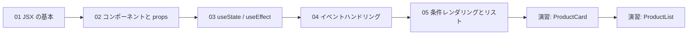
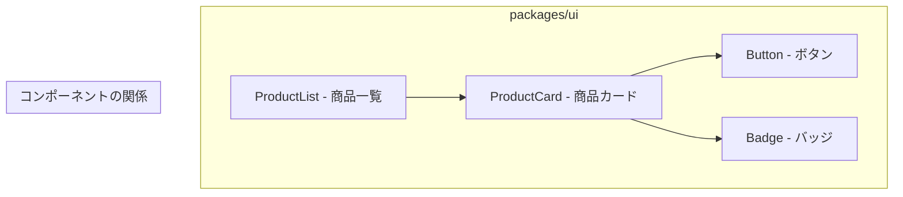

# Phase 1: React 基礎 + Storybook 入門

## 目次

- [概要](#概要)
- [難易度](#難易度)
- [所要時間目安](#所要時間目安)
- [前提知識](#前提知識)
- [学習目標](#学習目標)
- [作業場所](#作業場所)
- [目次](#目次-1)
  - [学習フロー](#学習フロー)
- [演習問題](#演習問題)
- [実装する EC 機能](#実装する-ec-機能)
- [使用ツール](#使用ツール)
- [関連する EC サイト機能](#関連する-ec-サイト機能)
- [推奨学習リソース](#推奨学習リソース)
  - [公式ドキュメント](#公式ドキュメント)
  - [チュートリアル](#チュートリアル)
- [自己チェックリスト](#自己チェックリスト)
- [次のフェーズ](#次のフェーズ)

## 概要

Reactの基本概念を理解し、Storybookでコンポーネント駆動開発を体験するフェーズです。
ECサイトの商品カードや商品一覧といった具体的なUIコンポーネントを作りながら、
Reactの基礎をマスターします。

***

## 難易度

難易度: 2/5（低〜中）

Reactの基本文法が中心のため、プログラミング経験があれば比較的取り組みやすい内容です。

***

## 所要時間目安

約6〜8時間です。

***

## 前提知識

- Phase 0を完了していること
- HTML / CSSの基本的な理解
- JavaScriptの基礎（変数、関数、配列、オブジェクト）
- TypeScriptの基本構文（型注釈、インターフェース）

***

## 学習目標

このフェーズを完了すると、以下ができるようになります。

- [ ] JSXの基本構文を理解し、コンポーネントを作成できる
- [ ] propsを使ってコンポーネントにデータを渡せる
- [ ] useStateで状態を管理できる
- [ ] useEffectでサイドエフェクトを処理できる
- [ ] イベントハンドラを設定して、ユーザー操作に応答できる
- [ ] 条件分岐とリストレンダリングを使いこなせる
- [ ] Storybookでコンポーネントを可視化しながら開発できる

***

## 作業場所

このフェーズでは主に以下のディレクトリで作業します。

```text
packages/ui/           # 共有 UI コンポーネントを作成
apps/storybook/        # Storybook でコンポーネントを確認
```

***

## 目次

1. [JSX の基本](./01-jsx-basics.md)
2. [コンポーネントと props](./02-components-props.md)
3. [useState / useEffect](./03-state-hooks.md)
4. [イベントハンドリング](./04-events.md)
5. [条件レンダリングとリスト](./05-conditional-lists.md)

### 学習フロー



***

## 演習問題

- [演習 1: ProductCard 実装](./exercises/01-product-card.md)
- [演習 2: ProductList 実装](./exercises/02-product-list.md)

***

## 実装する EC 機能

このフェーズで以下のコンポーネントを作成します。



| コンポーネント     | 説明                     |
| ----------- | ---------------------- |
| Button      | 汎用ボタン                  |
| Badge       | ラベル表示（セール、在庫切れなど）      |
| ProductCard | 商品カード（画像、名前、価格）        |
| ProductList | 商品一覧（ProductCard のリスト） |

***

## 使用ツール

| ツール          | バージョン | 用途             |
| ------------ | ----- | -------------- |
| React        | 19+   | UI ライブラリ       |
| TypeScript   | 5.9+  | 型安全な開発         |
| Storybook    | 10+   | コンポーネント開発・カタログ |
| Tailwind CSS | 4+    | スタイリング         |

***

## 関連する EC サイト機能

このフェーズで作成するコンポーネントは、以下のECサイト機能の基盤となります。

- 商品一覧ページ - ProductListを使用
- 商品詳細ページ - ProductCardのバリエーションを使用
- カート画面 - ProductCardの簡略版を使用
- お気に入りリスト - ProductListを使用

***

## 推奨学習リソース

### 公式ドキュメント

- [React 公式ドキュメント](https://react.dev/)
- [React 日本語ドキュメント](https://ja.react.dev/)
- [Storybook 公式ドキュメント](https://storybook.js.org/docs)
- [Tailwind CSS 公式ドキュメント](https://tailwindcss.com/docs)

### チュートリアル

- [React.dev - Learn React](https://react.dev/learn)
- [React.dev - Describing the UI](https://react.dev/learn/describing-the-ui)
- [React.dev - Adding Interactivity](https://react.dev/learn/adding-interactivity)

***

## 自己チェックリスト

Phase 1を完了する前に、以下を確認してください。

- [ ] JSXの基本構文を説明できる
- [ ] コンポーネントにpropsを渡して表示を変更できる
- [ ] useStateを使って状態を管理できる
- [ ] useEffectの依存配列の役割を説明できる
- [ ] イベントハンドラを設定できる
- [ ] 条件分岐でコンポーネントの表示を切り替えられる
- [ ] mapを使ってリストをレンダリングできる
- [ ] keyの役割を説明できる
- [ ] ProductCardコンポーネントを作成できた
- [ ] ProductListコンポーネントを作成できた
- [ ] Storybookでコンポーネントを確認できる

詳細なチェックリストは [checklist.md](./checklist.md) を参照してください。

***

## 次のフェーズ

Phase 1を完了したら、[Phase 2: Next.js App Router 基礎](../phase-02-nextjs-app-router/README.md) に進みましょう。
