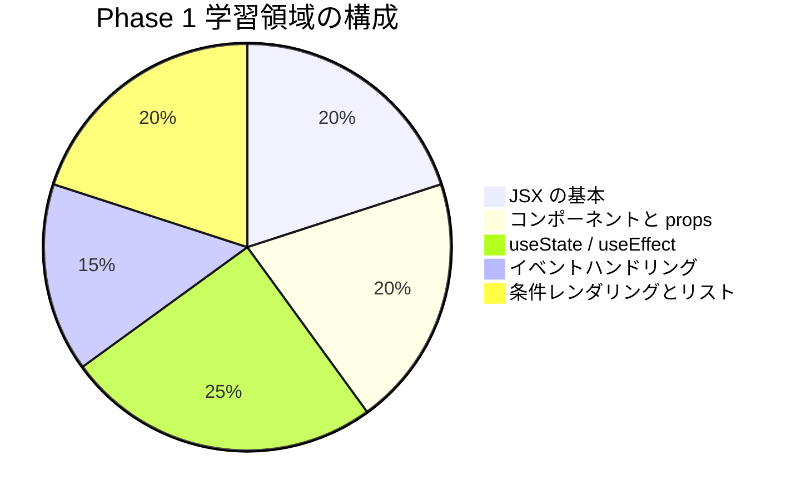

# Phase 1: 自己チェックリスト

Phase 1 の理解度を確認するためのチェックリストです。
各項目を確認し、自信を持って「はい」と答えられるか確認してください。

## 目次

- [学習領域の概要](#学習領域の概要)
- [JSX の基本](#jsx-の基本)
  - [理解度チェック](#理解度チェック)
  - [確認質問](#確認質問)
- [コンポーネントと props](#コンポーネントと-props)
  - [理解度チェック](#理解度チェック-1)
  - [確認質問](#確認質問-1)
- [useState / useEffect](#usestate--useeffect)
  - [理解度チェック](#理解度チェック-2)
  - [確認質問](#確認質問-2)
- [イベントハンドリング](#イベントハンドリング)
  - [理解度チェック](#理解度チェック-3)
  - [確認質問](#確認質問-3)
- [条件レンダリングとリスト](#条件レンダリングとリスト)
  - [理解度チェック](#理解度チェック-4)
  - [確認質問](#確認質問-4)
- [実践確認](#実践確認)
  - [演習チェック](#演習チェック)
  - [操作チェック](#操作チェック)
- [総合評価](#総合評価)
  - [達成度の目安](#達成度の目安)
- [よくある質問](#よくある質問)
  - [Q: コンポーネントが再レンダリングされるタイミングは？](#q-コンポーネントが再レンダリングされるタイミングは)
  - [Q: useEffect と useLayoutEffect の違いは？](#q-useeffect-と-uselayouteffect-の違いは)
  - [Q: なぜ useState の初期値に関数を渡すことがあるのか](#q-なぜ-usestate-の初期値に関数を渡すことがあるのか)
- [次のステップ](#次のステップ)

## 学習領域の概要



***

## JSX の基本

### 理解度チェック

- [ ] JSX とは何かを説明できる
- [ ] JSX の基本構文を理解している
- [ ] 式の埋め込み `{}` の使い方を知っている
- [ ] HTML との違い（className, htmlFor, style オブジェクト）を説明できる
- [ ] React.Fragment / `<></>` の使い方を知っている

### 確認質問

1. JSX で JavaScript の式を埋め込むにはどうしますか？

   **回答例**: 中括弧 `{}` で囲む（例: `{price * 1.1}`）

2. HTML の `class` 属性は JSX ではどう書きますか？

   **回答例**: `className` を使う（`class` は JavaScript の予約語のため）

3. `style` 属性を JSX で指定する方法は？

   **回答例**: オブジェクトで指定（`style={{ color: "red", fontSize: "16px" }}`）

***

## コンポーネントと props

### 理解度チェック

- [ ] 関数コンポーネントを作成できる
- [ ] コンポーネントの命名規則（PascalCase）を理解している
- [ ] props を受け取って使用できる
- [ ] props の分割代入ができる
- [ ] TypeScript で props の型を定義できる
- [ ] children プロパティを理解している
- [ ] オプショナル props とデフォルト値を設定できる

### 確認質問

1. コンポーネント名はなぜ大文字で始める必要がありますか？

   **回答例**: 小文字で始めると HTML 要素として解釈されるため

2. `children` プロパティとは何ですか？

   **回答例**: コンポーネントの開始タグと終了タグの間に渡された要素を受け取る特別な props

3. props は変更できますか？

   **回答例**: いいえ、props は読み取り専用である

***

## useState / useEffect

### 理解度チェック

- [ ] useState で状態を管理できる
- [ ] 状態更新時の再レンダリングを理解している
- [ ] 関数型更新（`setCount(prev => prev + 1)`）を使える
- [ ] オブジェクト/配列の状態をイミュータブルに更新できる
- [ ] useEffect の基本的な使い方を理解している
- [ ] 依存配列の役割を説明できる
- [ ] クリーンアップ関数の目的を理解している

### 確認質問

1. `setCount(count + 1)` と `setCount(prev => prev + 1)` の違いは？

   **回答例**: 関数型更新は最新の状態を確実に参照できる。連続呼び出しで正しく動作する

2. 依存配列が空 `[]` の場合、useEffect はいつ実行されますか？

   **回答例**: コンポーネントのマウント時に 1 回だけ実行される

3. なぜ配列の状態を直接変更してはいけないのですか？

   **回答例**: React が変更を検知できず、再レンダリングされないため

***

## イベントハンドリング

### 理解度チェック

- [ ] onClick, onChange などのイベントハンドラを設定できる
- [ ] イベントオブジェクトを受け取れる
- [ ] TypeScript でイベントの型を指定できる
- [ ] preventDefault() の使い方を知っている
- [ ] stopPropagation() の使い方を知っている
- [ ] インラインハンドラと名前付きハンドラの違いを理解している

### 確認質問

1. `onClick={handleClick()}` と `onClick={handleClick}` の違いは？

   **回答例**: 前者は関数を呼び出している（レンダリング時に実行）、後者は関数を渡している

2. フォーム送信時にページリロードを防ぐには？

   **回答例**: `event.preventDefault()` を呼び出す

3. 入力フィールドの値を取得するには？

   **回答例**: `event.target.value` を使用する

***

## 条件レンダリングとリスト

### 理解度チェック

- [ ] 三項演算子で条件分岐できる
- [ ] && 演算子で条件付き表示ができる
- [ ] 早期リターンパターンを使える
- [ ] map でリストをレンダリングできる
- [ ] key の重要性を説明できる
- [ ] key のアンチパターンを理解している
- [ ] 空リストの処理ができる

### 確認質問

1. リストレンダリングで key が必要な理由は？

   **回答例**: React がリスト内の各要素を識別し、効率的に更新するため

2. インデックスを key に使ってはいけない理由は？

   **回答例**: リストの並び替えや削除で不具合が発生するため（要素と key の対応がずれる）

3. `{count && <span>件数: {count}</span>}` で count が 0 の場合どうなりますか？

   **回答例**: "0" が表示されてしまう。`{count > 0 && ...}` とすべき

***

## 実践確認

### 演習チェック

- [ ] ProductCard コンポーネントを作成できた
- [ ] ProductCard で props を使って商品データを表示できた
- [ ] ProductCard でバッジ（NEW/SALE）を条件表示できた
- [ ] ProductCard で売り切れ状態を処理できた
- [ ] ProductList コンポーネントを作成できた
- [ ] ProductList で map を使ってリストレンダリングできた
- [ ] ProductList で key を正しく設定できた
- [ ] ProductList で空リストを処理できた
- [ ] Storybook でコンポーネントを確認できる

### 操作チェック

- [ ] `pnpm storybook` で Storybook が起動する
- [ ] ProductCard の各ストーリーが表示される
- [ ] ProductList の各ストーリーが表示される
- [ ] `pnpm typecheck` で型エラーがない
- [ ] `pnpm lint` でリントエラーがない

***

## 総合評価

### 達成度の目安

| 達成率       | 評価                  |
| --------- | ------------------- |
| 90% 以上    | Phase 2 に進みましょう     |
| 70% - 89% | 良好。不安な部分を復習してから進む   |
| 50% - 69% | 該当するドキュメントを再読してください |
| 50% 未満    | 最初からもう一度取り組みましょう    |

***

## よくある質問

### Q: コンポーネントが再レンダリングされるタイミングは？

**A**: 以下の場合に再レンダリングされます。

- props が変更された
- useState で管理している状態が変更された
- 親コンポーネントが再レンダリングされた

### Q: useEffect と useLayoutEffect の違いは？

**A**: useEffect は描画後に非同期で実行され、useLayoutEffect は描画前に同期で実行されます。
通常は useEffect を使用し、レイアウトの測定が必要な場合のみ useLayoutEffect を使います。

### Q: なぜ useState の初期値に関数を渡すことがあるのか

**A**: 初期値の計算コストが高い場合、関数を渡すと初回レンダリング時のみ実行される。

```tsx
// 毎回 JSON.parse が実行される
const [data, setData] = useState(JSON.parse(localStorage.getItem("data")));

// 初回のみ JSON.parse が実行される
const [data, setData] = useState(() => JSON.parse(localStorage.getItem("data")));
```

***

## 次のステップ

チェックリストを確認して理解度に自信が持てたら、[Phase 2: Next.js App Router 基礎](../phase-02-nextjs-app-router/README.md) に進みましょう。

Phase 2 では、Next.js の App Router を使ったルーティングとレイアウトを学び、
実際の EC サイトのページ構成を作成します。
