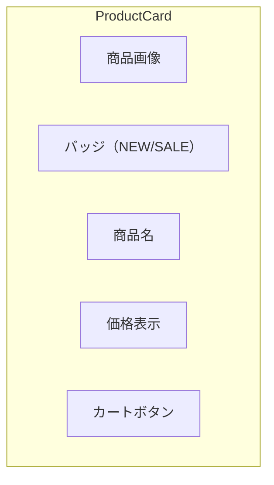

# 演習 1: ProductCard 実装

## 目次

- [目標](#目標)
- [前提条件](#前提条件)
- [完成イメージ](#完成イメージ)
- [ステップ 1: 型定義の確認](#ステップ-1-型定義の確認)
  - [Product 型](#product-型)
- [ステップ 2: 基本構造の作成](#ステップ-2-基本構造の作成)
  - [ファイルの作成](#ファイルの作成)
- [ステップ 3: バッジの追加](#ステップ-3-バッジの追加)
  - [NEW バッジと SALE バッジ](#new-バッジと-sale-バッジ)
- [ステップ 4: Tailwind CSS でスタイリング](#ステップ-4-tailwind-css-でスタイリング)
  - [スタイルの適用](#スタイルの適用)
- [ステップ 5: Storybook ストーリーの作成](#ステップ-5-storybook-ストーリーの作成)
  - [ストーリーファイルの作成](#ストーリーファイルの作成)
- [ステップ 6: イベントハンドラの追加](#ステップ-6-イベントハンドラの追加)
  - [カートに追加機能](#カートに追加機能)
- [確認チェックリスト](#確認チェックリスト)
- [発展課題](#発展課題)
  - [1. お気に入りボタンの追加](#1-お気に入りボタンの追加)
  - [2. 割引率の表示](#2-割引率の表示)
  - [3. カテゴリラベルの追加](#3-カテゴリラベルの追加)
  - [4. ホバーエフェクトの追加](#4-ホバーエフェクトの追加)
- [完了条件](#完了条件)

## 目標

ECサイトの **商品カードコンポーネント** を作成します。
このコンポーネントは、商品一覧ページで繰り返し使用される重要なUIパーツです。



***

## 前提条件

- Phase 1の学習コンテンツ（01〜05）を読了していること
- 開発環境がセットアップ済みであること

***

## 完成イメージ

```text
┌─────────────────────────┐
│  ┌───────────────────┐  │
│  │                   │  │
│  │    商品画像       │  │
│  │                   │  │
│  └───────────────────┘  │
│  [NEW] [SALE]           │
│                         │
│  商品名                 │
│  ¥12,800 → ¥9,980       │
│                         │
│  ┌───────────────────┐  │
│  │   カートに追加    │  │
│  └───────────────────┘  │
└─────────────────────────┘
```

***

## ステップ 1: 型定義の確認

### Product 型

まず、商品データの型を確認します。

```tsx
// packages/shared/src/types/product.ts（既存の場合）
// または types/product.ts に作成

export type Product = {
  id: string;
  name: string;
  price: number;
  originalPrice?: number;
  imageUrl: string;
  category: string;
  inStock: boolean;
  isNew: boolean;
};
```

***

## ステップ 2: 基本構造の作成

### ファイルの作成

`packages/ui/src/components/ProductCard/ProductCard.tsx` を作成します。

```tsx
import type { Product } from "@/types/product";

type ProductCardProps = {
  product: Product;
};

export function ProductCard({ product }: ProductCardProps): React.ReactElement {
  return (
    <article className="product-card">
      {/* 商品画像 */}
      <div className="product-card-image">
        
      </div>

      {/* 商品情報 */}
      <div className="product-card-info">
        <h3 className="product-card-name">{product.name}</h3>
        <p className="product-card-price">¥{product.price.toLocaleString()}</p>
      </div>

      {/* カートボタン */}
      <button
        type="button"
        className="product-card-button"
      >
        カートに追加
      </button>
    </article>
  );
}
```

***

## ステップ 3: バッジの追加

### NEW バッジと SALE バッジ

```tsx
export function ProductCard({ product }: ProductCardProps): React.ReactElement {
  const hasDiscount = product.originalPrice !== undefined && product.originalPrice > product.price;

  return (
    <article className="product-card">
      {/* 商品画像 */}
      <div className="product-card-image">
        
        {/* 売り切れオーバーレイ */}
        {!product.inStock && <div className="product-card-soldout">SOLD OUT</div>}
      </div>

      {/* バッジ */}
      <div className="product-card-badges">
        {product.isNew && <span className="badge badge-new">NEW</span>}
        {hasDiscount && <span className="badge badge-sale">SALE</span>}
      </div>

      {/* 商品情報 */}
      <div className="product-card-info">
        <h3 className="product-card-name">{product.name}</h3>
        <div className="product-card-price">
          {hasDiscount && (
            <span className="price-original">¥{product.originalPrice?.toLocaleString()}</span>
          )}
          <span className="price-current">¥{product.price.toLocaleString()}</span>
        </div>
      </div>

      {/* カートボタン */}
      <button
        type="button"
        className="product-card-button"
        disabled={!product.inStock}
      >
        {product.inStock ? "カートに追加" : "売り切れ"}
      </button>
    </article>
  );
}
```

***

## ステップ 4: Tailwind CSS でスタイリング

### スタイルの適用

```tsx
export function ProductCard({ product }: ProductCardProps): React.ReactElement {
  const hasDiscount = product.originalPrice !== undefined && product.originalPrice > product.price;

  return (
    <article className="group relative flex flex-col overflow-hidden rounded-lg border border-gray-200 bg-white shadow-sm transition-shadow hover:shadow-md">
      {/* 商品画像 */}
      <div className="relative aspect-square overflow-hidden bg-gray-100">
        
        {/* 売り切れオーバーレイ */}
        {!product.inStock && (
          <div className="absolute inset-0 flex items-center justify-center bg-black/50">
            <span className="text-lg font-bold text-white">SOLD OUT</span>
          </div>
        )}
      </div>

      {/* バッジ */}
      <div className="absolute top-2 left-2 flex flex-wrap gap-1">
        {product.isNew && (
          <span className="rounded bg-blue-600 px-2 py-0.5 text-xs font-semibold text-white">
            NEW
          </span>
        )}
        {hasDiscount && (
          <span className="rounded bg-red-600 px-2 py-0.5 text-xs font-semibold text-white">
            SALE
          </span>
        )}
      </div>

      {/* 商品情報 */}
      <div className="flex flex-1 flex-col p-4">
        <h3 className="mb-2 line-clamp-2 text-sm font-medium text-gray-900">{product.name}</h3>
        <div className="mt-auto flex items-baseline gap-2">
          {hasDiscount && (
            <span className="text-sm text-gray-500 line-through">
              ¥{product.originalPrice?.toLocaleString()}
            </span>
          )}
          <span className={`text-lg font-bold ${hasDiscount ? "text-red-600" : "text-gray-900"}`}>
            ¥{product.price.toLocaleString()}
          </span>
        </div>
      </div>

      {/* カートボタン */}
      <div className="p-4 pt-0">
        <button
          type="button"
          disabled={!product.inStock}
          className="w-full rounded-md bg-blue-600 px-4 py-2 text-sm font-semibold text-white transition-colors hover:bg-blue-700 disabled:cursor-not-allowed disabled:bg-gray-300"
        >
          {product.inStock ? "カートに追加" : "売り切れ"}
        </button>
      </div>
    </article>
  );
}
```

***

## ステップ 5: Storybook ストーリーの作成

### ストーリーファイルの作成

`stories/ProductCard.stories.tsx` を作成します。

```tsx
import type { Meta, StoryObj } from "@storybook/react";
import { ProductCard } from "@/components/ProductCard/ProductCard";

const meta: Meta<typeof ProductCard> = {
  title: "Components/ProductCard",
  component: ProductCard,
  parameters: {
    layout: "centered",
  },
  tags: ["autodocs"],
};

export default meta;
type Story = StoryObj<typeof meta>;

// 基本の商品
export const Default: Story = {
  args: {
    product: {
      id: "1",
      name: "プレミアムコットン Tシャツ",
      price: 3980,
      imageUrl: "https://via.placeholder.com/300x300?text=T-Shirt",
      category: "トップス",
      inStock: true,
      isNew: false,
    },
  },
};

// 新商品
export const NewProduct: Story = {
  args: {
    product: {
      id: "2",
      name: "2024年春 新作ジャケット",
      price: 12800,
      imageUrl: "https://via.placeholder.com/300x300?text=Jacket",
      category: "アウター",
      inStock: true,
      isNew: true,
    },
  },
};

// セール商品
export const OnSale: Story = {
  args: {
    product: {
      id: "3",
      name: "リネンブレンド パンツ",
      price: 5980,
      originalPrice: 8980,
      imageUrl: "https://via.placeholder.com/300x300?text=Pants",
      category: "ボトムス",
      inStock: true,
      isNew: false,
    },
  },
};

// 新商品 + セール
export const NewAndOnSale: Story = {
  args: {
    product: {
      id: "4",
      name: "限定コラボ スニーカー",
      price: 9800,
      originalPrice: 14800,
      imageUrl: "https://via.placeholder.com/300x300?text=Sneakers",
      category: "シューズ",
      inStock: true,
      isNew: true,
    },
  },
};

// 売り切れ
export const SoldOut: Story = {
  args: {
    product: {
      id: "5",
      name: "人気のトートバッグ",
      price: 4980,
      imageUrl: "https://via.placeholder.com/300x300?text=Bag",
      category: "バッグ",
      inStock: false,
      isNew: false,
    },
  },
};

// 長い商品名
export const LongName: Story = {
  args: {
    product: {
      id: "6",
      name: "2024年春夏コレクション 限定デザイン プレミアムオーガニックコットン使用 長袖シャツ",
      price: 7980,
      imageUrl: "https://via.placeholder.com/300x300?text=Shirt",
      category: "トップス",
      inStock: true,
      isNew: true,
    },
  },
};
```

***

## ステップ 6: イベントハンドラの追加

### カートに追加機能

```tsx
type ProductCardProps = {
  product: Product;
  onAddToCart?: (product: Product) => void;
};

export function ProductCard({ product, onAddToCart }: ProductCardProps): React.ReactElement {
  const hasDiscount = product.originalPrice !== undefined && product.originalPrice > product.price;

  const handleAddToCart = (): void => {
    onAddToCart?.(product);
  };

  return (
    <article className="group relative flex flex-col overflow-hidden rounded-lg border border-gray-200 bg-white shadow-sm transition-shadow hover:shadow-md">
      {/* ... 画像、バッジ、商品情報は同じ ... */}

      {/* カートボタン */}
      <div className="p-4 pt-0">
        <button
          type="button"
          disabled={!product.inStock}
          onClick={handleAddToCart}
          className="w-full rounded-md bg-blue-600 px-4 py-2 text-sm font-semibold text-white transition-colors hover:bg-blue-700 disabled:cursor-not-allowed disabled:bg-gray-300"
        >
          {product.inStock ? "カートに追加" : "売り切れ"}
        </button>
      </div>
    </article>
  );
}
```

***

## 確認チェックリスト

以下を確認してください。

- [ ] ProductCardコンポーネントが作成できた
- [ ] 商品画像が表示される
- [ ] 商品名と価格が表示される
- [ ] NEWバッジが条件に応じて表示される
- [ ] SALEバッジとセール価格が条件に応じて表示される
- [ ] 売り切れ時にオーバーレイとボタン無効化が機能する
- [ ] Storybookでコンポーネントが確認できる
- [ ] 各ストーリー（Default, NewProduct, OnSale, SoldOut）が正しく表示される
- [ ] カートに追加ボタンがクリックできる

***

## 発展課題

### 1. お気に入りボタンの追加

商品カードにお気に入りボタン（ハートアイコン）を追加してください。

```tsx
type ProductCardProps = {
  product: Product;
  isFavorite?: boolean;
  onToggleFavorite?: (productId: string) => void;
  onAddToCart?: (product: Product) => void;
};
```

### 2. 割引率の表示

セール商品に割引率（例: 30% OFF）を計算して表示してください。

### 3. カテゴリラベルの追加

商品カテゴリをバッジとして表示してください。

### 4. ホバーエフェクトの追加

マウスホバー時にクイックビューボタンを表示してください。

***

## 完了条件

以下がすべて動作すれば、この演習は完了です。

- [ ] ProductCardコンポーネントが正しく動作する
- [ ] Storybookで各バリエーションが確認できる
- [ ] TypeScriptの型エラーがない
- [ ] ESLintのエラーがない

次は [演習 2: ProductList 実装](./02-product-list.md) に進みましょう。
