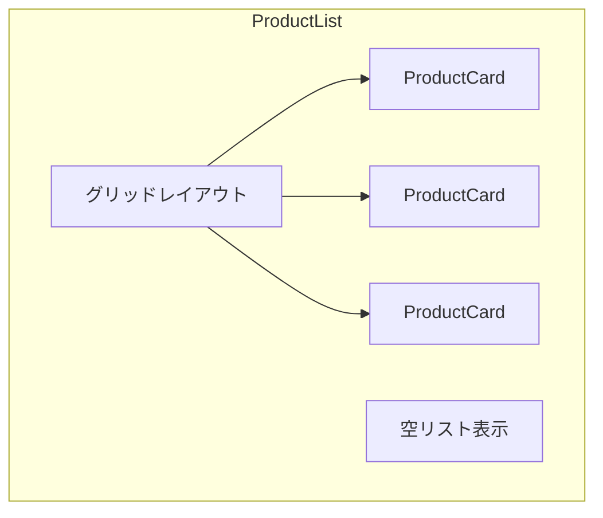

# 演習 2: ProductList 実装

## 目次

- [目標](#目標)
- [前提条件](#前提条件)
- [完成イメージ](#完成イメージ)
- [ステップ 1: ProductList コンポーネントの作成](#ステップ-1-productlist-コンポーネントの作成)
  - [ファイルの作成](#ファイルの作成)
- [ステップ 2: 空リストの処理](#ステップ-2-空リストの処理)
  - [空状態コンポーネントの追加](#空状態コンポーネントの追加)
  - [ProductList に組み込み](#productlist-に組み込み)
- [ステップ 3: グリッドレイアウトの適用](#ステップ-3-グリッドレイアウトの適用)
  - [Tailwind CSS でレスポンシブグリッド](#tailwind-css-でレスポンシブグリッド)
  - [レスポンシブブレークポイント](#レスポンシブブレークポイント)
- [ステップ 4: ローディング状態の追加](#ステップ-4-ローディング状態の追加)
  - [スケルトンコンポーネント](#スケルトンコンポーネント)
  - [ProductList に組み込み](#productlist-に組み込み-1)
- [ステップ 5: 商品件数の表示](#ステップ-5-商品件数の表示)
  - [ヘッダーコンポーネント](#ヘッダーコンポーネント)
  - [完成版 ProductList](#完成版-productlist)
- [ステップ 6: Storybook ストーリーの作成](#ステップ-6-storybook-ストーリーの作成)
  - [ストーリーファイルの作成](#ストーリーファイルの作成)
- [ステップ 7: インデックスファイルの作成](#ステップ-7-インデックスファイルの作成)
  - [エクスポートの整理](#エクスポートの整理)
- [確認チェックリスト](#確認チェックリスト)
- [発展課題](#発展課題)
  - [1. ソート機能の追加](#1-ソート機能の追加)
  - [2. 表示形式の切り替え](#2-表示形式の切り替え)
  - [3. ページネーションの追加](#3-ページネーションの追加)
  - [4. 無限スクロール](#4-無限スクロール)
- [完了条件](#完了条件)

## 目標

商品一覧を表示する **ProductList コンポーネント** を作成します。
演習 1 で作成した ProductCard を活用し、リストレンダリングを実践します。



---

## 前提条件

- 演習 1: ProductCard 実装を完了していること
- リストレンダリング（map、key）を理解していること

---

## 完成イメージ

```text
┌──────────────┬──────────────┬──────────────┐
│ ProductCard  │ ProductCard  │ ProductCard  │
├──────────────┼──────────────┼──────────────┤
│ ProductCard  │ ProductCard  │ ProductCard  │
├──────────────┼──────────────┼──────────────┤
│ ProductCard  │ ProductCard  │              │
└──────────────┴──────────────┴──────────────┘

商品が 0 件の場合:
┌────────────────────────────────────────────┐
│                                            │
│      商品が見つかりませんでした            │
│      [検索条件をクリア]                    │
│                                            │
└────────────────────────────────────────────┘
```

---

## ステップ 1: ProductList コンポーネントの作成

### ファイルの作成

`packages/ui/src/components/ProductList/ProductList.tsx` を作成します。

```tsx
import { ProductCard } from "@/components/ProductCard/ProductCard";
import type { Product } from "@/types/product";

type ProductListProps = {
  products: Product[];
};

export function ProductList({ products }: ProductListProps): React.ReactElement {
  return (
    <div className="product-list">
      {products.map((product) => (
        <ProductCard
          key={product.id}
          product={product}
        />
      ))}
    </div>
  );
}
```

---

## ステップ 2: 空リストの処理

### 空状態コンポーネントの追加

```tsx
type EmptyStateProps = {
  message?: string;
  onClear?: () => void;
};

function EmptyState({
  message = "商品が見つかりませんでした",
  onClear,
}: EmptyStateProps): React.ReactElement {
  return (
    <div className="flex flex-col items-center justify-center py-16 text-center">
      <svg
        className="mb-4 h-16 w-16 text-gray-300"
        fill="none"
        viewBox="0 0 24 24"
        stroke="currentColor"
      >
        <path
          strokeLinecap="round"
          strokeLinejoin="round"
          strokeWidth={1.5}
          d="M20 13V6a2 2 0 00-2-2H6a2 2 0 00-2 2v7m16 0v5a2 2 0 01-2 2H6a2 2 0 01-2-2v-5m16 0h-2.586a1 1 0 00-.707.293l-2.414 2.414a1 1 0 01-.707.293h-3.172a1 1 0 01-.707-.293l-2.414-2.414A1 1 0 006.586 13H4"
        />
      </svg>
      <p className="mb-4 text-gray-500">{message}</p>
      {onClear !== undefined && (
        <button
          type="button"
          onClick={onClear}
          className="rounded-md bg-gray-100 px-4 py-2 text-sm font-medium text-gray-700 hover:bg-gray-200"
        >
          検索条件をクリア
        </button>
      )}
    </div>
  );
}
```

### ProductList に組み込み

```tsx
type ProductListProps = {
  products: Product[];
  onAddToCart?: (product: Product) => void;
  onClearFilters?: () => void;
};

export function ProductList({
  products,
  onAddToCart,
  onClearFilters,
}: ProductListProps): React.ReactElement {
  if (products.length === 0) {
    return <EmptyState onClear={onClearFilters} />;
  }

  return (
    <div className="product-list">
      {products.map((product) => (
        <ProductCard
          key={product.id}
          product={product}
          onAddToCart={onAddToCart}
        />
      ))}
    </div>
  );
}
```

---

## ステップ 3: グリッドレイアウトの適用

### Tailwind CSS でレスポンシブグリッド

```tsx
export function ProductList({
  products,
  onAddToCart,
  onClearFilters,
}: ProductListProps): React.ReactElement {
  if (products.length === 0) {
    return <EmptyState onClear={onClearFilters} />;
  }

  return (
    <div className="grid grid-cols-1 gap-4 sm:grid-cols-2 md:grid-cols-3 lg:grid-cols-4">
      {products.map((product) => (
        <ProductCard
          key={product.id}
          product={product}
          onAddToCart={onAddToCart}
        />
      ))}
    </div>
  );
}
```

### レスポンシブブレークポイント

| ブレークポイント | 画面幅   | カラム数 |
| ---------------- | -------- | -------- |
| デフォルト       | 〜639px  | 1        |
| sm               | 640px〜  | 2        |
| md               | 768px〜  | 3        |
| lg               | 1024px〜 | 4        |

---

## ステップ 4: ローディング状態の追加

### スケルトンコンポーネント

```tsx
function ProductCardSkeleton(): React.ReactElement {
  return (
    <div className="animate-pulse overflow-hidden rounded-lg border border-gray-200 bg-white">
      <div className="aspect-square bg-gray-200" />
      <div className="p-4">
        <div className="mb-2 h-4 w-3/4 rounded bg-gray-200" />
        <div className="h-6 w-1/2 rounded bg-gray-200" />
      </div>
      <div className="p-4 pt-0">
        <div className="h-10 w-full rounded bg-gray-200" />
      </div>
    </div>
  );
}

function ProductListSkeleton({ count = 8 }: { count?: number }): React.ReactElement {
  return (
    <div className="grid grid-cols-1 gap-4 sm:grid-cols-2 md:grid-cols-3 lg:grid-cols-4">
      {Array.from({ length: count }).map((_, index) => (
        <ProductCardSkeleton key={index} />
      ))}
    </div>
  );
}
```

### ProductList に組み込み

```tsx
type ProductListProps = {
  products: Product[];
  isLoading?: boolean;
  onAddToCart?: (product: Product) => void;
  onClearFilters?: () => void;
};

export function ProductList({
  products,
  isLoading = false,
  onAddToCart,
  onClearFilters,
}: ProductListProps): React.ReactElement {
  if (isLoading) {
    return <ProductListSkeleton />;
  }

  if (products.length === 0) {
    return <EmptyState onClear={onClearFilters} />;
  }

  return (
    <div className="grid grid-cols-1 gap-4 sm:grid-cols-2 md:grid-cols-3 lg:grid-cols-4">
      {products.map((product) => (
        <ProductCard
          key={product.id}
          product={product}
          onAddToCart={onAddToCart}
        />
      ))}
    </div>
  );
}
```

---

## ステップ 5: 商品件数の表示

### ヘッダーコンポーネント

```tsx
type ProductListHeaderProps = {
  totalCount: number;
  displayCount?: number;
};

function ProductListHeader({
  totalCount,
  displayCount,
}: ProductListHeaderProps): React.ReactElement {
  const count = displayCount ?? totalCount;

  return (
    <div className="mb-4 flex items-center justify-between">
      <p className="text-sm text-gray-600">
        {totalCount > 0 ? (
          <>
            <span className="font-semibold">{count}</span> 件
            {displayCount !== undefined && displayCount !== totalCount && (
              <span className="text-gray-400"> / {totalCount} 件中</span>
            )}
          </>
        ) : (
          "0 件"
        )}
      </p>
    </div>
  );
}
```

### 完成版 ProductList

```tsx
type ProductListProps = {
  products: Product[];
  totalCount?: number;
  isLoading?: boolean;
  showHeader?: boolean;
  onAddToCart?: (product: Product) => void;
  onClearFilters?: () => void;
};

export function ProductList({
  products,
  totalCount,
  isLoading = false,
  showHeader = true,
  onAddToCart,
  onClearFilters,
}: ProductListProps): React.ReactElement {
  const displayCount = products.length;
  const total = totalCount ?? displayCount;

  if (isLoading) {
    return <ProductListSkeleton />;
  }

  if (products.length === 0) {
    return <EmptyState onClear={onClearFilters} />;
  }

  return (
    <div>
      {showHeader && (
        <ProductListHeader
          totalCount={total}
          displayCount={displayCount}
        />
      )}
      <div className="grid grid-cols-1 gap-4 sm:grid-cols-2 md:grid-cols-3 lg:grid-cols-4">
        {products.map((product) => (
          <ProductCard
            key={product.id}
            product={product}
            onAddToCart={onAddToCart}
          />
        ))}
      </div>
    </div>
  );
}
```

---

## ステップ 6: Storybook ストーリーの作成

### ストーリーファイルの作成

`stories/ProductList.stories.tsx` を作成します。

```tsx
import type { Meta, StoryObj } from "@storybook/react";
import { ProductList } from "@/components/ProductList/ProductList";
import type { Product } from "@/types/product";

const meta: Meta<typeof ProductList> = {
  title: "Components/ProductList",
  component: ProductList,
  parameters: {
    layout: "padded",
  },
  tags: ["autodocs"],
};

export default meta;
type Story = StoryObj<typeof meta>;

// サンプルデータ
const sampleProducts: Product[] = [
  {
    id: "1",
    name: "プレミアムコットン Tシャツ",
    price: 3980,
    imageUrl: "https://via.placeholder.com/300x300?text=T-Shirt",
    category: "トップス",
    inStock: true,
    isNew: false,
  },
  {
    id: "2",
    name: "2024年春 新作ジャケット",
    price: 12800,
    imageUrl: "https://via.placeholder.com/300x300?text=Jacket",
    category: "アウター",
    inStock: true,
    isNew: true,
  },
  {
    id: "3",
    name: "リネンブレンド パンツ",
    price: 5980,
    originalPrice: 8980,
    imageUrl: "https://via.placeholder.com/300x300?text=Pants",
    category: "ボトムス",
    inStock: true,
    isNew: false,
  },
  {
    id: "4",
    name: "限定コラボ スニーカー",
    price: 9800,
    originalPrice: 14800,
    imageUrl: "https://via.placeholder.com/300x300?text=Sneakers",
    category: "シューズ",
    inStock: true,
    isNew: true,
  },
  {
    id: "5",
    name: "人気のトートバッグ",
    price: 4980,
    imageUrl: "https://via.placeholder.com/300x300?text=Bag",
    category: "バッグ",
    inStock: false,
    isNew: false,
  },
  {
    id: "6",
    name: "オーガニックコットン シャツ",
    price: 7980,
    imageUrl: "https://via.placeholder.com/300x300?text=Shirt",
    category: "トップス",
    inStock: true,
    isNew: true,
  },
];

// デフォルト（複数商品）
export const Default: Story = {
  args: {
    products: sampleProducts,
  },
};

// 2商品
export const FewProducts: Story = {
  args: {
    products: sampleProducts.slice(0, 2),
  },
};

// 商品なし
export const Empty: Story = {
  args: {
    products: [],
  },
};

// ローディング中
export const Loading: Story = {
  args: {
    products: [],
    isLoading: true,
  },
};

// ヘッダーなし
export const WithoutHeader: Story = {
  args: {
    products: sampleProducts,
    showHeader: false,
  },
};

// フィルター後（件数表示）
export const Filtered: Story = {
  args: {
    products: sampleProducts.slice(0, 3),
    totalCount: sampleProducts.length,
  },
};

// イベントハンドラ付き
export const WithHandlers: Story = {
  args: {
    products: sampleProducts,
    onAddToCart: (product) => {
      console.log("カートに追加:", product.name);
    },
    onClearFilters: () => {
      console.log("フィルターをクリア");
    },
  },
};
```

---

## ステップ 7: インデックスファイルの作成

### エクスポートの整理

`packages/ui/src/components/ProductList/index.ts` を作成します。

```tsx
export { ProductList } from "./ProductList";
export type { ProductListProps } from "./ProductList";
```

`packages/ui/src/components/index.ts` に追加します。

```tsx
export * from "./ProductCard";
export * from "./ProductList";
```

---

## 確認チェックリスト

以下を確認してください。

- [ ] ProductList コンポーネントが作成できた
- [ ] map で ProductCard がリストレンダリングされる
- [ ] key に product.id が正しく設定されている
- [ ] 商品が 0 件の場合、空状態が表示される
- [ ] ローディング中にスケルトンが表示される
- [ ] レスポンシブなグリッドレイアウトが適用されている
- [ ] Storybook で各ストーリーが確認できる
- [ ] onAddToCart が ProductCard に渡されている

---

## 発展課題

### 1. ソート機能の追加

商品リストにソート機能（価格順、新着順など）を追加してください。

```tsx
type SortOption = "newest" | "price-asc" | "price-desc" | "name";

type ProductListProps = {
  products: Product[];
  sortBy?: SortOption;
  onSortChange?: (sort: SortOption) => void;
};
```

### 2. 表示形式の切り替え

グリッド表示とリスト表示を切り替えられるようにしてください。

### 3. ページネーションの追加

大量の商品を表示する場合のページネーションを実装してください。

### 4. 無限スクロール

ページネーションの代わりに無限スクロールを実装してください。

---

## 完了条件

以下がすべて動作すれば、この演習は完了です。

- [ ] ProductList コンポーネントが正しく動作する
- [ ] 空リスト、ローディング状態が適切に処理される
- [ ] Storybook で各バリエーションが確認できる
- [ ] TypeScript の型エラーがない
- [ ] ESLint のエラーがない

これで Phase 1 の演習は完了です。
[チェックリスト](../checklist.md) で理解度を確認してから、
[Phase 2: Next.js App Router 基礎](../../phase-02-nextjs-app-router/README.md) に進みましょう。
