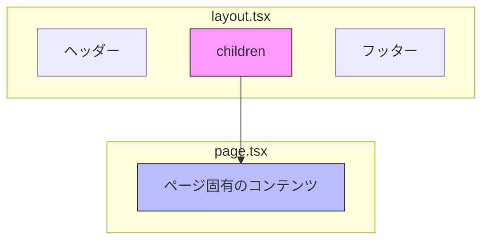
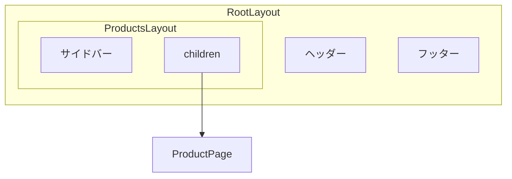
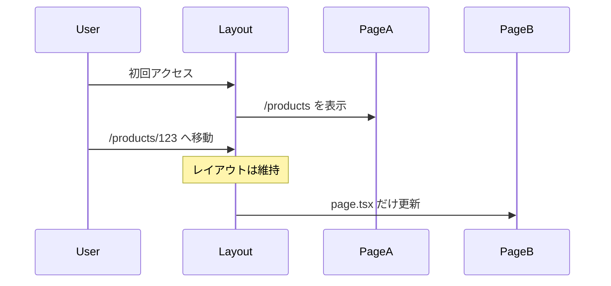

# layout.tsx と page.tsx

## 目次

- [概要](#概要)
- [layout.tsx と page.tsx の役割](#layouttsx-と-pagetsx-の役割)
- [ルートレイアウト](#ルートレイアウト)
  - [ルートレイアウトの必須要素](#ルートレイアウトの必須要素)
- [page.tsx の基本](#pagetsx-の基本)
- [ネストされたレイアウト](#ネストされたレイアウト)
  - [レイアウトのネスト構造](#レイアウトのネスト構造)
  - [ネストされたレイアウトの実装例](#ネストされたレイアウトの実装例)
- [レイアウトの状態保持](#レイアウトの状態保持)
  - [実用例：カート数の保持](#実用例カート数の保持)
- [EC サイトでのレイアウト構成](#ec-サイトでのレイアウト構成)
  - [典型的なレイアウト構成](#典型的なレイアウト構成)
  - [ルートグループ別レイアウト](#ルートグループ別レイアウト)
- [template.tsx との違い](#templatetsx-との違い)
- [Metadata の定義](#metadata-の定義)
  - [Metadata のマージ](#metadata-のマージ)
- [ベストプラクティス](#ベストプラクティス)
  - [1. ルートレイアウトはシンプルに](#1-ルートレイアウトはシンプルに)
  - [2. 機能別にレイアウトを分離](#2-機能別にレイアウトを分離)
  - [3. レイアウトで重い処理を避ける](#3-レイアウトで重い処理を避ける)
- [まとめ](#まとめ)
- [次のステップ](#次のステップ)

## 概要

App Router では、**layout.tsx** と **page.tsx** という2つの特別なファイルを使ってページを構成します。これにより、共通のヘッダー/フッターを一度だけ定義して、全ページで再利用できます。

---

## layout.tsx と page.tsx の役割



| ファイル     | 役割                                      | 再レンダリング             |
| ------------ | ----------------------------------------- | -------------------------- |
| `layout.tsx` | 共通 UI（ヘッダー、サイドバー、フッター） | ナビゲーション時に**維持** |
| `page.tsx`   | ページ固有のコンテンツ                    | ナビゲーション時に**更新** |

---

## ルートレイアウト

`app/layout.tsx` は**ルートレイアウト**と呼ばれ、必須のファイルです。全ページで共有される最上位のレイアウトを定義します。

```tsx
// app/layout.tsx
import type { Metadata } from "next";

export const metadata: Metadata = {
  title: "My EC Site",
  description: "Next.js で作る EC サイト",
};

export default function RootLayout({
  children,
}: {
  children: React.ReactNode;
}): React.ReactElement {
  return (
    <html lang="ja">
      <body>
        <header>
          <nav>ヘッダーナビゲーション</nav>
        </header>
        <main>{children}</main>
        <footer>フッター</footer>
      </body>
    </html>
  );
}
```

### ルートレイアウトの必須要素

- `<html>` タグ
- `<body>` タグ
- `children` を受け取って表示

---

## page.tsx の基本

`page.tsx` はルートごとの固有コンテンツを定義します。

```tsx
// app/page.tsx（トップページ）
export default function HomePage(): React.ReactElement {
  return (
    <div>
      <h1>ようこそ！</h1>
      <p>EC サイトへようこそ。</p>
    </div>
  );
}
```

```tsx
// app/products/page.tsx（商品一覧ページ）
export default function ProductsPage(): React.ReactElement {
  return (
    <div>
      <h1>商品一覧</h1>
      <ul>
        <li>商品 1</li>
        <li>商品 2</li>
        <li>商品 3</li>
      </ul>
    </div>
  );
}
```

---

## ネストされたレイアウト

サブディレクトリにも `layout.tsx` を配置できます。レイアウトはネストされ、親から子へと適用されます。

```text
app/
├── layout.tsx              # ルートレイアウト
├── page.tsx                # /
└── products/
    ├── layout.tsx          # 商品セクション用レイアウト
    ├── page.tsx            # /products
    └── [id]/
        └── page.tsx        # /products/123
```

### レイアウトのネスト構造



### ネストされたレイアウトの実装例

```tsx
// app/products/layout.tsx
export default function ProductsLayout({
  children,
}: {
  children: React.ReactNode;
}): React.ReactElement {
  return (
    <div className="flex">
      <aside className="w-64">
        <h2>カテゴリ</h2>
        <ul>
          <li>シャツ</li>
          <li>パンツ</li>
          <li>シューズ</li>
        </ul>
      </aside>
      <div className="flex-1">{children}</div>
    </div>
  );
}
```

---

## レイアウトの状態保持

レイアウトはナビゲーション時に再レンダリングされません。これにより、パフォーマンスが向上し、状態が保持されます。



### 実用例：カート数の保持

```tsx
// app/layout.tsx
"use client";

import { useState } from "react";

export default function RootLayout({
  children,
}: {
  children: React.ReactNode;
}): React.ReactElement {
  const [cartCount, setCartCount] = useState(0);

  return (
    <html lang="ja">
      <body>
        <header>
          <nav>
            <span>カート: {cartCount} 点</span>
          </nav>
        </header>
        <main>{children}</main>
      </body>
    </html>
  );
}
```

ページ間を移動しても、`cartCount` の状態は維持されます。

> ⚠️ ルートレイアウトを Client Component にすると、Server Components の利点（バンドルサイズ削減など）が失われます。実際のプロジェクトでは、状態管理には Jotai などのライブラリを使用し、レイアウトは Server Component のままにすることを推奨します。Phase 4 で状態管理について詳しく学びます。

---

## EC サイトでのレイアウト構成

### 典型的なレイアウト構成

```text
app/
├── layout.tsx                  # 共通（ヘッダー/フッター）
├── (main)/
│   ├── layout.tsx              # メインコンテンツ用
│   ├── page.tsx                # /
│   └── products/
│       ├── layout.tsx          # 商品セクション用（サイドバー）
│       └── page.tsx            # /products
├── (checkout)/
│   ├── layout.tsx              # チェックアウト専用（シンプル）
│   └── cart/
│       └── page.tsx            # /cart
└── (auth)/
    ├── layout.tsx              # 認証ページ用（センタリング）
    ├── login/
    │   └── page.tsx            # /login
    └── register/
        └── page.tsx            # /register
```

### ルートグループ別レイアウト

```tsx
// app/(main)/layout.tsx - 通常ページ用
export default function MainLayout({
  children,
}: {
  children: React.ReactNode;
}): React.ReactElement {
  return <div className="container mx-auto px-4">{children}</div>;
}
```

```tsx
// app/(auth)/layout.tsx - 認証ページ用
export default function AuthLayout({
  children,
}: {
  children: React.ReactNode;
}): React.ReactElement {
  return (
    <div className="flex min-h-screen items-center justify-center">
      <div className="w-full max-w-md">{children}</div>
    </div>
  );
}
```

---

## template.tsx との違い

`template.tsx` は `layout.tsx` と似ていますが、ナビゲーション時に**再マウント**されます。

| ファイル       | 再マウント | ユースケース                               |
| -------------- | ---------- | ------------------------------------------ |
| `layout.tsx`   | しない     | 共通 UI、状態保持                          |
| `template.tsx` | する       | ページ遷移アニメーション、ページビュー計測 |

```tsx
// app/template.tsx
"use client";

import { motion } from "framer-motion";

export default function Template({ children }: { children: React.ReactNode }): React.ReactElement {
  return (
    <motion.div
      initial={{ opacity: 0 }}
      animate={{ opacity: 1 }}
      exit={{ opacity: 0 }}
    >
      {children}
    </motion.div>
  );
}
```

---

## Metadata の定義

`layout.tsx` や `page.tsx` で `metadata` をエクスポートすると、ページの SEO 情報を設定できます。

```tsx
// app/products/page.tsx
import type { Metadata } from "next";

export const metadata: Metadata = {
  title: "商品一覧 | My EC Site",
  description: "豊富な品揃えの商品一覧ページです。",
};

export default function ProductsPage(): React.ReactElement {
  return <h1>商品一覧</h1>;
}
```

### Metadata のマージ

ネストされたレイアウトでは、`metadata` は親から子へマージされます。

```tsx
// app/layout.tsx
export const metadata: Metadata = {
  title: {
    default: "My EC Site",
    template: "%s | My EC Site",
  },
};

// app/products/page.tsx
export const metadata: Metadata = {
  title: "商品一覧", // → "商品一覧 | My EC Site" になる
};
```

---

## ベストプラクティス

### 1. ルートレイアウトはシンプルに

```tsx
// app/layout.tsx
export default function RootLayout({
  children,
}: {
  children: React.ReactNode;
}): React.ReactElement {
  return (
    <html lang="ja">
      <body>
        <Header />
        <main>{children}</main>
        <Footer />
      </body>
    </html>
  );
}
```

### 2. 機能別にレイアウトを分離

```text
(main)/layout.tsx     → 通常ページ
(checkout)/layout.tsx → シンプルなチェックアウト
(auth)/layout.tsx     → 認証ページ
(admin)/layout.tsx    → 管理画面
```

### 3. レイアウトで重い処理を避ける

レイアウトはナビゲーション時に再実行されないため、頻繁に更新されるデータの取得には適していません。また、すべてのページで共有されるため、特定のページでしか必要ないデータはページコンポーネントで取得してください。

```tsx
// NG: レイアウトで重いデータ取得
export default async function Layout({ children }) {
  const allProducts = await fetchAllProducts(); // 全ページで実行される
  return <div>{children}</div>;
}

// OK: 必要なページでのみ取得
export default function Layout({ children }) {
  return <div>{children}</div>;
}
```

---

## まとめ

| ポイント       | 説明                                   |
| -------------- | -------------------------------------- |
| `layout.tsx`   | 共通 UI を定義、ナビゲーション時に維持 |
| `page.tsx`     | ページ固有のコンテンツを定義           |
| ネスト         | レイアウトはネストして適用される       |
| 状態保持       | レイアウトの状態はページ間で維持       |
| `template.tsx` | 毎回再マウントが必要な場合に使用       |

---

## 次のステップ

layout.tsx と page.tsx を理解したら、次は [Server vs Client Components](./03-server-client.md) で、コンポーネントの種類と使い分けを学びましょう。
