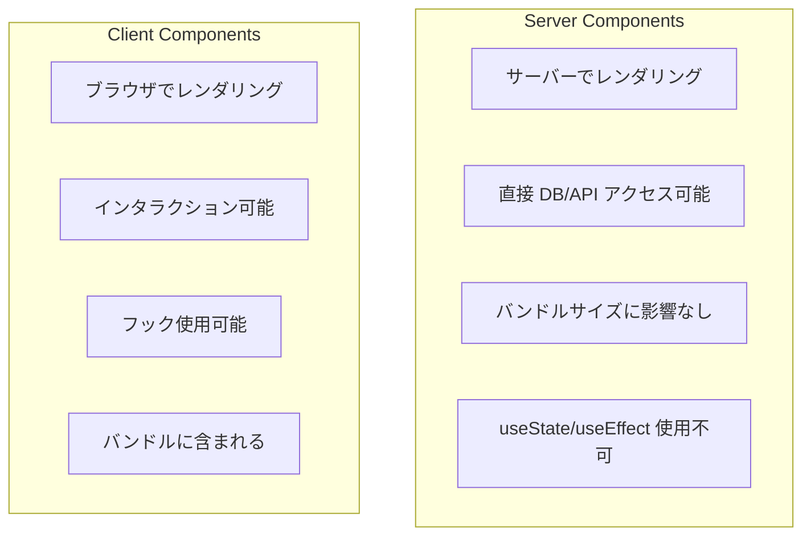
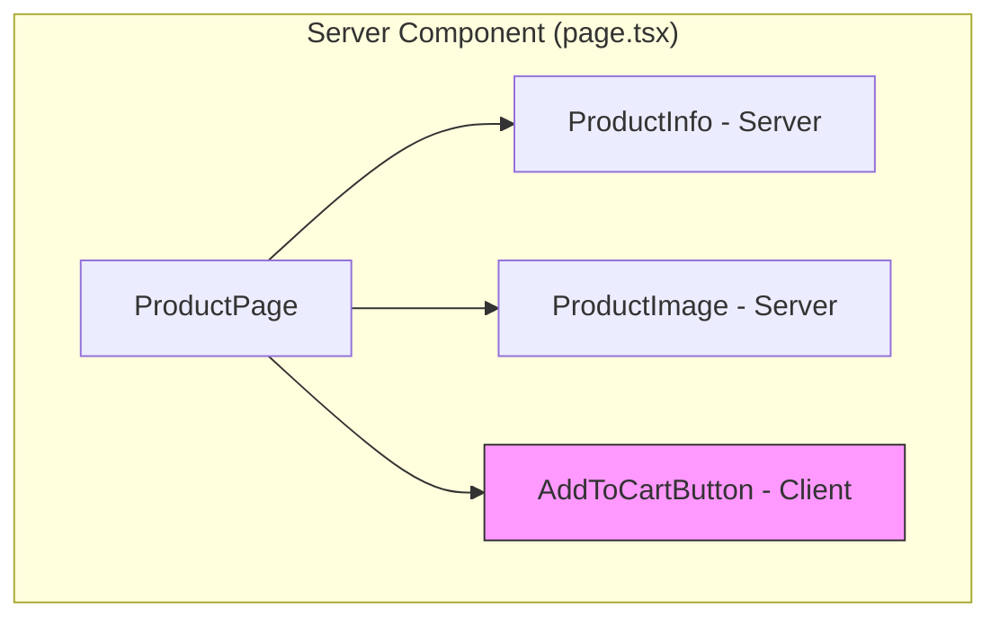
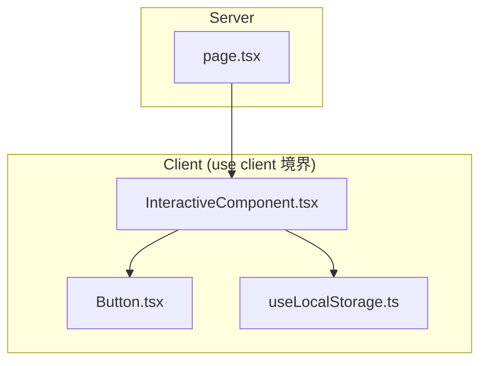

# Server Components vs Client Components

## 目次

- [概要](#概要)
- [Server Components と Client Components の違い](#server-components-と-client-components-の違い)
- [デフォルトは Server Components](#デフォルトは-server-components)
  - [Server Components のメリット](#server-components-のメリット)
- [Client Components の宣言](#client-components-の宣言)
  - [Client Components が必要な場面](#client-components-が必要な場面)
- [コンポーネントの組み合わせ](#コンポーネントの組み合わせ)
  - [実装例](#実装例)
- ["use client" の境界](#use-client-の境界)
  - [境界の例](#境界の例)
- [データの受け渡し](#データの受け渡し)
  - [Date の受け渡し](#date-の受け渡し)
- [パターン: Composition](#パターン-composition)
  - [children を使ったパターン](#children-を使ったパターン)
- [EC サイトでの使い分け](#ec-サイトでの使い分け)
  - [Server Components を使う場面](#server-components-を使う場面)
  - [Client Components を使う場面](#client-components-を使う場面)
  - [実践例：商品カード](#実践例商品カード)
- [よくある間違い](#よくある間違い)
  - [1. 不要な "use client"](#1-不要な-use-client)
  - [2. Server Component でフックを使う](#2-server-component-でフックを使う)
- [まとめ](#まとめ)
- [次のステップ](#次のステップ)

## 概要

React 18 と Next.js App Router では、コンポーネントが **Server Components** と **Client Components** の2種類に分かれます。適切に使い分けることで、パフォーマンスと UX を最適化できます。

---

## Server Components と Client Components の違い



| 特徴                                    | Server Components          | Client Components |
| --------------------------------------- | -------------------------- | ----------------- |
| 実行場所                                | サーバー                   | ブラウザ          |
| `useState` / `useEffect`                | 使用不可                   | 使用可能          |
| イベントハンドラ (`onClick` など)       | 使用不可                   | 使用可能          |
| ブラウザ API (`window`, `localStorage`) | 使用不可                   | 使用可能          |
| データ取得                              | 直接 `fetch` / DB アクセス | API 経由          |
| バンドルサイズ                          | 影響なし                   | 含まれる          |

---

## デフォルトは Server Components

App Router では、**全てのコンポーネントがデフォルトで Server Components** です。

```tsx
// app/products/page.tsx
// これは Server Component（デフォルト）

export default async function ProductsPage(): Promise<React.ReactElement> {
  // サーバーで実行される
  const products = await fetch("https://api.example.com/products");
  const data = await products.json();

  return (
    <div>
      <h1>商品一覧</h1>
      <ul>
        {data.map((product) => (
          <li key={product.id}>{product.name}</li>
        ))}
      </ul>
    </div>
  );
}
```

### Server Components のメリット

1. **バンドルサイズ削減**: JavaScript がブラウザに送られない
2. **高速な初期表示**: サーバーで HTML を生成
3. **機密情報の保護**: API キーなどをサーバーに隠せる
4. **直接データアクセス**: DB や外部 API に直接アクセス可能

---

## Client Components の宣言

Client Components にするには、ファイルの先頭に `"use client"` ディレクティブを追加します。

```tsx
// components/AddToCartButton.tsx
"use client";

import { useState } from "react";

type Props = {
  productId: string;
};

export function AddToCartButton({ productId }: Props): React.ReactElement {
  const [isAdding, setIsAdding] = useState(false);

  const handleClick = async (): Promise<void> => {
    setIsAdding(true);
    await fetch("/api/cart", {
      method: "POST",
      body: JSON.stringify({ productId }),
    });
    setIsAdding(false);
  };

  return (
    <button
      onClick={handleClick}
      disabled={isAdding}
    >
      {isAdding ? "追加中..." : "カートに追加"}
    </button>
  );
}
```

### Client Components が必要な場面

- `useState`, `useEffect`, `useContext` などのフックを使う
- `onClick`, `onChange` などのイベントハンドラを使う
- `window`, `document`, `localStorage` などのブラウザ API を使う
- クラスコンポーネントを使う

---

## コンポーネントの組み合わせ

Server Components と Client Components は自由に組み合わせられます。



### 実装例

```tsx
// app/products/[id]/page.tsx (Server Component)
import { AddToCartButton } from "@/components/AddToCartButton";

type Props = {
  params: Promise<{ id: string }>;
};

export default async function ProductPage({ params }: Props): Promise<React.ReactElement> {
  const { id } = await params;
  const product = await fetch(`https://api.example.com/products/${id}`);
  const data = await product.json();

  return (
    <div>
      <h1>{data.name}</h1>
      <p>{data.description}</p>
      <p>価格: ¥{data.price.toLocaleString()}</p>
      {/* Client Component を使用 */}
      <AddToCartButton productId={id} />
    </div>
  );
}
```

---

## "use client" の境界

`"use client"` はモジュールの境界を定義します。そのファイルと、そのファイルがインポートする全てのモジュールが Client Components になります。



### 境界の例

```tsx
// components/InteractiveComponent.tsx
"use client";

// ここより下のインポートも Client になる
import { Button } from "./Button";
import { useLocalStorage } from "@/hooks/useLocalStorage";

export function InteractiveComponent(): React.ReactElement {
  const [value, setValue] = useLocalStorage("key", "default");
  return <Button onClick={() => setValue("new")}>{value}</Button>;
}
```

---

## データの受け渡し

Server Components から Client Components へは、**シリアライズ可能な props** のみ渡せます。

```tsx
// OK: プリミティブ値、オブジェクト、配列
<ClientComponent
  name="商品名"
  price={1000}
  tags={["sale", "new"]}
  product={{ id: "1", name: "商品" }}
/>

// NG: 関数、クラスインスタンス、Date オブジェクト（直接）
<ClientComponent
  onClick={() => {}}     // エラー
  date={new Date()}      // エラー
  handler={myHandler}    // エラー
/>
```

### Date の受け渡し

```tsx
// Server Component
const createdAt = new Date();
<ClientComponent date={createdAt.toISOString()} />;

// Client Component
("use client");
type Props = { date: string };
function ClientComponent({ date }: Props) {
  const dateObj = new Date(date);
  return <span>{dateObj.toLocaleDateString()}</span>;
}
```

---

## パターン: Composition

Server Components の中で Client Components を使うときは、**Composition パターン**を活用します。

### children を使ったパターン

```tsx
// components/ClientWrapper.tsx
"use client";

type Props = {
  children: React.ReactNode;
};

export function ClientWrapper({ children }: Props): React.ReactElement {
  const [isOpen, setIsOpen] = useState(false);

  return (
    <div>
      <button onClick={() => setIsOpen(!isOpen)}>{isOpen ? "閉じる" : "開く"}</button>
      {isOpen && children}
    </div>
  );
}
```

```tsx
// app/page.tsx (Server Component)
import { ClientWrapper } from "@/components/ClientWrapper";
import { ServerContent } from "@/components/ServerContent";

export default function Page(): React.ReactElement {
  return (
    <ClientWrapper>
      {/* Server Component を children として渡す */}
      <ServerContent />
    </ClientWrapper>
  );
}
```

---

## EC サイトでの使い分け

### Server Components を使う場面

| コンポーネント | 理由             |
| -------------- | ---------------- |
| 商品一覧       | データ取得が中心 |
| 商品詳細       | SEO が重要       |
| カテゴリナビ   | 静的なリスト表示 |
| フッター       | 静的なコンテンツ |

### Client Components を使う場面

| コンポーネント     | 理由             |
| ------------------ | ---------------- |
| カートに追加ボタン | クリックイベント |
| 数量選択           | フォーム入力     |
| お気に入りボタン   | 状態管理         |
| 検索フォーム       | ユーザー入力     |
| モーダル/ドロワー  | インタラクション |

### 実践例：商品カード

```tsx
// components/ProductCard.tsx (Server Component)
import { AddToFavoriteButton } from "./AddToFavoriteButton";

type Props = {
  product: {
    id: string;
    name: string;
    price: number;
    imageUrl: string;
  };
};

export function ProductCard({ product }: Props): React.ReactElement {
  return (
    <div className="rounded-lg border p-4">
      
      <h3>{product.name}</h3>
      <p>¥{product.price.toLocaleString()}</p>
      {/* インタラクティブな部分だけ Client Component */}
      <AddToFavoriteButton productId={product.id} />
    </div>
  );
}
```

```tsx
// components/AddToFavoriteButton.tsx (Client Component)
"use client";

import { useState } from "react";

type Props = {
  productId: string;
};

export function AddToFavoriteButton({ productId }: Props): React.ReactElement {
  const [isFavorite, setIsFavorite] = useState(false);

  return <button onClick={() => setIsFavorite(!isFavorite)}>{isFavorite ? "♥" : "♡"}</button>;
}
```

---

## よくある間違い

### 1. 不要な "use client"

```tsx
// NG: インタラクションがないのに Client Component
"use client";

export function ProductInfo({ name, price }) {
  return (
    <div>
      <h1>{name}</h1>
      <p>¥{price}</p>
    </div>
  );
}

// OK: Server Component のまま
export function ProductInfo({ name, price }) {
  return (
    <div>
      <h1>{name}</h1>
      <p>¥{price}</p>
    </div>
  );
}
```

### 2. Server Component でフックを使う

```tsx
// NG: Server Component で useState
export default function Page() {
  const [count, setCount] = useState(0); // エラー！
  return <div>{count}</div>;
}

// OK: Client Component に分離
("use client");
export default function Page() {
  const [count, setCount] = useState(0);
  return <div>{count}</div>;
}
```

---

## まとめ

| ポイント            | 説明                                                 |
| ------------------- | ---------------------------------------------------- |
| デフォルトは Server | 全てのコンポーネントがデフォルトで Server Components |
| `"use client"`      | Client Components にするためのディレクティブ         |
| 最小限の Client     | インタラクションが必要な部分だけ Client に           |
| Composition         | Server の中に Client を組み込むパターン              |
| シリアライズ        | props はシリアライズ可能な値のみ                     |

---

## 次のステップ

Server と Client Components を理解したら、次は [loading/error/not-found](./04-special-files.md) で特殊なファイルを使った UX 向上を学びましょう。
