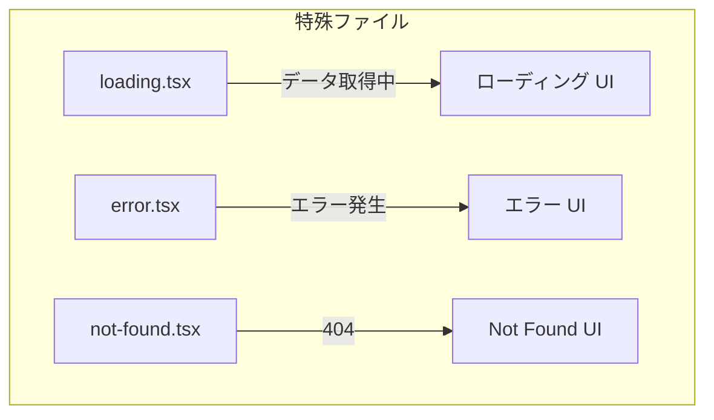
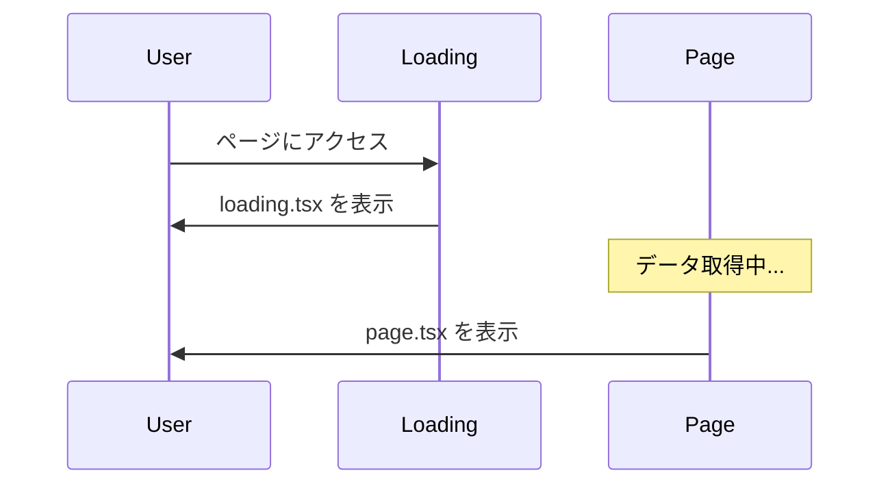
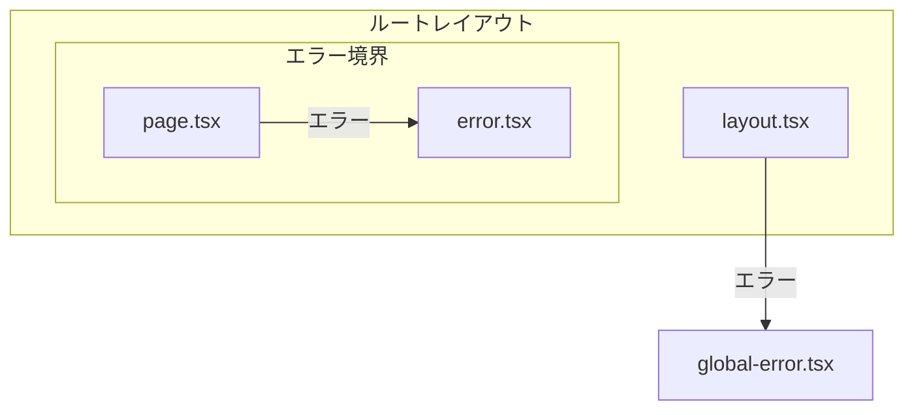
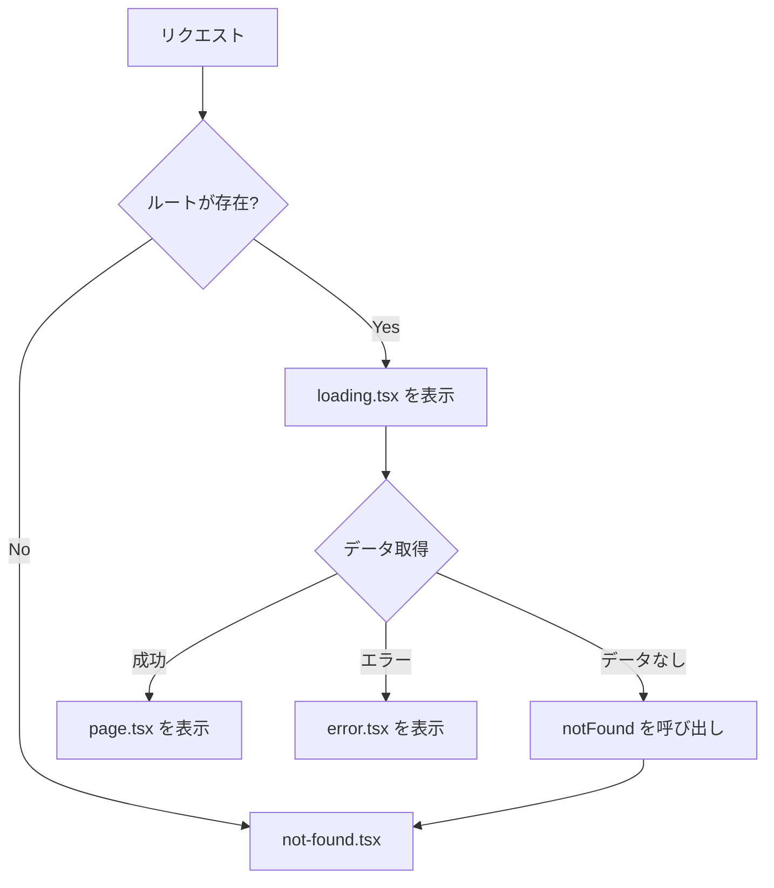

# loading / error / not-found

## 目次

- [概要](#概要)
- [特殊ファイルの一覧](#特殊ファイルの一覧)
- [loading.tsx](#loadingtsx)
  - [基本的な使い方](#基本的な使い方)
  - [仕組み](#仕組み)
  - [スケルトンローディング](#スケルトンローディング)
  - [ネストされた loading.tsx](#ネストされた-loadingtsx)
- [error.tsx](#errortsx)
  - [基本的な使い方](#基本的な使い方-1)
  - [error.tsx の特徴](#errortsx-の特徴)
  - [エラー境界の仕組み](#エラー境界の仕組み)
  - [global-error.tsx](#global-errortsx)
- [not-found.tsx](#not-foundtsx)
  - [基本的な使い方](#基本的な使い方-2)
  - [notFound() 関数の使用](#notfound-関数の使用)
  - [セグメント別の not-found.tsx](#セグメント別の-not-foundtsx)
- [EC サイトでの活用例](#ec-サイトでの活用例)
  - [商品一覧のローディング](#商品一覧のローディング)
  - [商品詳細のエラー](#商品詳細のエラー)
  - [商品が見つからない場合](#商品が見つからない場合)
- [ファイル構成のベストプラクティス](#ファイル構成のベストプラクティス)
  - [推奨構成](#推奨構成)
- [ファイルの適用順序](#ファイルの適用順序)
- [まとめ](#まとめ)
- [次のステップ](#次のステップ)

## 概要

App Routerでは、`loading.tsx`、`error.tsx`、`not-found.tsx` という特殊なファイルを使って、ローディング状態、エラー状態、404状態を宣言的に処理できます。これにより、ユーザー体験を向上できます。

***

## 特殊ファイルの一覧



| ファイル               | 役割          | 表示タイミング       |
| ------------------ | ----------- | ------------- |
| `loading.tsx`      | ローディング UI   | データ取得中        |
| `error.tsx`        | エラー UI      | ランタイムエラー発生時   |
| `not-found.tsx`    | 404 UI      | ページが見つからない時   |
| `global-error.tsx` | グローバルエラー UI | ルートレイアウトでのエラー |

***

## loading.tsx

`loading.tsx` を配置すると、ページのデータ取得中に自動的にローディングUIが表示されます。

### 基本的な使い方

```tsx
// app/products/loading.tsx
export default function Loading(): React.ReactElement {
  return (
    <div className="flex min-h-screen items-center justify-center">
      <div className="h-12 w-12 animate-spin rounded-full border-b-2 border-blue-500" />
    </div>
  );
}
```

### 仕組み

`loading.tsx` は内部的にReactのSuspenseを使っています。



### スケルトンローディング

より良いUXのために、スケルトンローディングを使用することが推奨されます。

```tsx
// app/products/loading.tsx
export default function Loading(): React.ReactElement {
  return (
    <div className="grid grid-cols-3 gap-4 p-4">
      {Array.from({ length: 6 }).map((_, i) => (
        <div
          key={i}
          className="animate-pulse"
        >
          <div className="mb-2 h-48 rounded-lg bg-gray-200" />
          <div className="mb-2 h-4 w-3/4 rounded bg-gray-200" />
          <div className="h-4 w-1/2 rounded bg-gray-200" />
        </div>
      ))}
    </div>
  );
}
```

### ネストされた loading.tsx

各ルートセグメントに `loading.tsx` を配置できます。

```text
app/
├── loading.tsx              # / のローディング
├── products/
│   ├── loading.tsx          # /products のローディング
│   └── [id]/
│       └── loading.tsx      # /products/[id] のローディング
```

***

## error.tsx

`error.tsx` を配置すると、ランタイムエラーが発生した際に、アプリケーション全体がクラッシュせずにエラー UIを表示できます。

### 基本的な使い方

```tsx
// app/products/error.tsx
"use client"; // error.tsx は必ず Client Component

import { useEffect } from "react";

type Props = {
  error: Error & { digest?: string };
  reset: () => void;
};

export default function Error({ error, reset }: Props): React.ReactElement {
  useEffect(() => {
    // エラーをログサービスに送信
    console.error(error);
  }, [error]);

  return (
    <div className="flex min-h-screen flex-col items-center justify-center">
      <h2 className="mb-4 text-2xl font-bold">エラーが発生しました</h2>
      <p className="mb-4 text-gray-600">{error.message}</p>
      <button
        onClick={reset}
        className="rounded bg-blue-500 px-4 py-2 text-white hover:bg-blue-600"
      >
        もう一度試す
      </button>
    </div>
  );
}
```

### error.tsx の特徴

| 特徴                  | 説明                  |
| ------------------- | ------------------- |
| Client Component 必須 | `"use client"` が必要  |
| `error` prop        | エラーオブジェクトを受け取る      |
| `reset` prop        | コンポーネントを再レンダリングする関数 |
| 境界                  | そのセグメント以下のエラーをキャッチ  |

### エラー境界の仕組み



### global-error.tsx

ルートレイアウトでのエラーをキャッチするには、`global-error.tsx` を使います。

```tsx
// app/global-error.tsx
"use client";

type Props = {
  error: Error & { digest?: string };
  reset: () => void;
};

export default function GlobalError({ error, reset }: Props): React.ReactElement {
  return (
    <html>
      <body>
        <h2>致命的なエラーが発生しました</h2>
        <button onClick={reset}>もう一度試す</button>
      </body>
    </html>
  );
}
```

***

## not-found.tsx

`not-found.tsx` は、存在しないページにアクセスした時や、`notFound()` 関数が呼ばれた時に表示されます。

### 基本的な使い方

```tsx
// app/not-found.tsx
import Link from "next/link";

export default function NotFound(): React.ReactElement {
  return (
    <div className="flex min-h-screen flex-col items-center justify-center">
      <h1 className="mb-4 text-6xl font-bold text-gray-300">404</h1>
      <h2 className="mb-4 text-2xl font-bold">ページが見つかりません</h2>
      <p className="mb-8 text-gray-600">お探しのページは存在しないか、移動した可能性があります。</p>
      <Link
        href="/"
        className="rounded-lg bg-blue-500 px-6 py-3 text-white hover:bg-blue-600"
      >
        トップページへ戻る
      </Link>
    </div>
  );
}
```

### notFound() 関数の使用

動的ルートで、データが見つからない場合に `notFound()` を呼び出せます。

```tsx
// app/products/[id]/page.tsx
import { notFound } from "next/navigation";

type Props = {
  params: Promise<{ id: string }>;
};

export default async function ProductPage({ params }: Props): Promise<React.ReactElement> {
  const { id } = await params;
  const product = await fetchProduct(id);

  if (!product) {
    notFound(); // not-found.tsx を表示
  }

  return <div>{product.name}</div>;
}
```

### セグメント別の not-found.tsx

```text
app/
├── not-found.tsx              # 全体の 404
├── products/
│   ├── not-found.tsx          # /products/* の 404
│   └── [id]/
│       └── page.tsx           # notFound() を呼び出す
```

***

## EC サイトでの活用例

### 商品一覧のローディング

```tsx
// app/products/loading.tsx
export default function ProductsLoading(): React.ReactElement {
  return (
    <div>
      <div className="mb-6 h-8 w-32 animate-pulse rounded bg-gray-200" />
      <div className="grid grid-cols-1 gap-6 md:grid-cols-3">
        {Array.from({ length: 9 }).map((_, i) => (
          <div
            key={i}
            className="animate-pulse rounded-lg border p-4"
          >
            <div className="mb-4 h-48 rounded bg-gray-200" />
            <div className="mb-2 h-4 w-3/4 rounded bg-gray-200" />
            <div className="mb-4 h-4 w-1/2 rounded bg-gray-200" />
            <div className="h-10 rounded bg-gray-200" />
          </div>
        ))}
      </div>
    </div>
  );
}
```

### 商品詳細のエラー

```tsx
// app/products/[id]/error.tsx
"use client";

type Props = {
  error: Error;
  reset: () => void;
};

export default function ProductError({ error, reset }: Props): React.ReactElement {
  return (
    <div className="py-12 text-center">
      <h2 className="mb-4 text-xl font-bold">商品情報を取得できませんでした</h2>
      <p className="mb-6 text-gray-600">ネットワーク接続を確認して、もう一度お試しください。</p>
      <button
        onClick={reset}
        className="rounded bg-blue-500 px-6 py-2 text-white hover:bg-blue-600"
      >
        再読み込み
      </button>
    </div>
  );
}
```

### 商品が見つからない場合

```tsx
// app/products/not-found.tsx
import Link from "next/link";

export default function ProductNotFound(): React.ReactElement {
  return (
    <div className="py-12 text-center">
      <h2 className="mb-4 text-2xl font-bold">商品が見つかりません</h2>
      <p className="mb-6 text-gray-600">
        この商品は販売終了したか、URL が間違っている可能性があります。
      </p>
      <Link
        href="/products"
        className="rounded bg-blue-500 px-6 py-2 text-white hover:bg-blue-600"
      >
        商品一覧へ戻る
      </Link>
    </div>
  );
}
```

***

## ファイル構成のベストプラクティス

### 推奨構成

```text
app/
├── layout.tsx
├── page.tsx
├── loading.tsx              # ルートのローディング
├── error.tsx                # ルートのエラー
├── not-found.tsx            # グローバル 404
├── global-error.tsx         # 致命的エラー
│
└── products/
    ├── layout.tsx
    ├── page.tsx
    ├── loading.tsx          # 商品一覧のローディング
    ├── error.tsx            # 商品一覧のエラー
    ├── not-found.tsx        # 商品が見つからない
    └── [id]/
        ├── page.tsx
        ├── loading.tsx      # 商品詳細のローディング
        └── error.tsx        # 商品詳細のエラー
```

***

## ファイルの適用順序



***

## まとめ

| ファイル               | 用途        | 必須の設定                     |
| ------------------ | --------- | ------------------------- |
| `loading.tsx`      | ローディング UI | なし                        |
| `error.tsx`        | エラー UI    | `"use client"`            |
| `not-found.tsx`    | 404 UI    | なし                        |
| `global-error.tsx` | 致命的エラー UI | `"use client"` + `<html>` |

***

## 次のステップ

特殊ファイルを理解したら、次は [動的ルート](./05-dynamic-routes.md) でURLパラメータを使ったページ作成を学びましょう。
