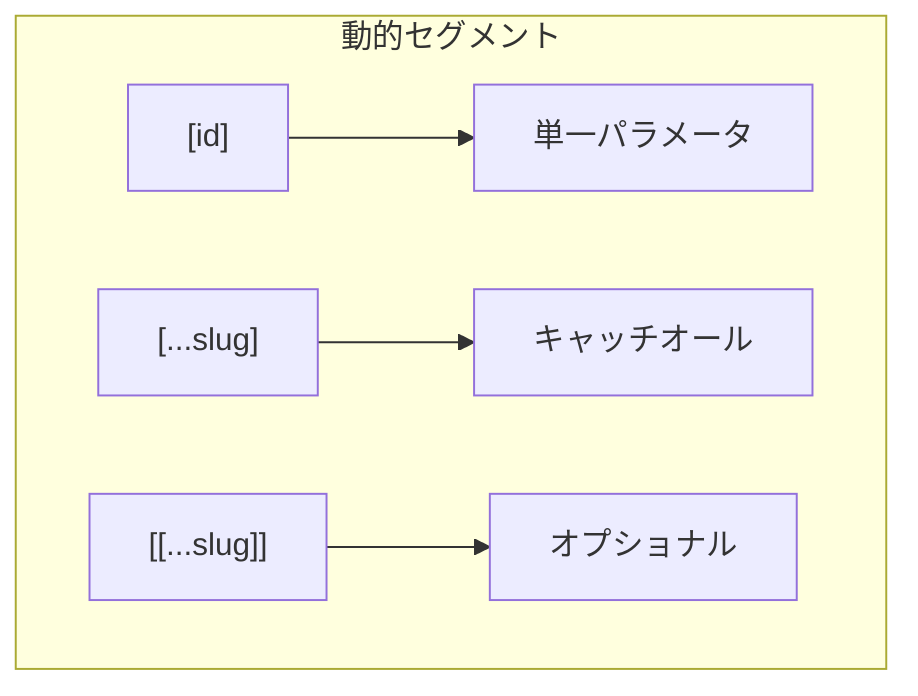
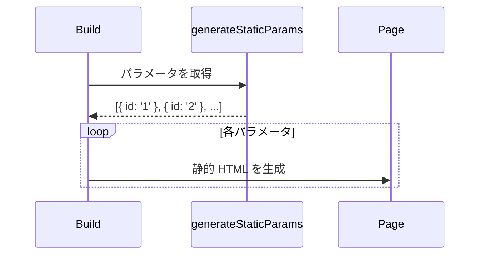

# 動的ルート

## 目次

- [概要](#概要)
- [動的ルートの基本](#動的ルートの基本)
  - [基本構文](#基本構文)
  - [パラメータの受け取り](#パラメータの受け取り)
- [動的セグメントの種類](#動的セグメントの種類)
- [単一パラメータ \[param\]](#単一パラメータ-param)
  - [商品詳細ページの例](#商品詳細ページの例)
  - [カテゴリページの例](#カテゴリページの例)
- [キャッチオールセグメント \[...param\]](#キャッチオールセグメント-param)
  - [使用例：ドキュメントページ](#使用例ドキュメントページ)
  - [EC サイトでの活用：階層カテゴリ](#ec-サイトでの活用階層カテゴリ)
- [オプショナルキャッチオール \[\[...param\]\]](#オプショナルキャッチオール-param)
- [複数の動的パラメータ](#複数の動的パラメータ)
- [searchParams（クエリパラメータ）](#searchparamsクエリパラメータ)
- [generateStaticParams](#generatestaticparams)
  - [静的生成のフロー](#静的生成のフロー)
- [動的メタデータ](#動的メタデータ)
- [EC サイトでの動的ルート構成](#ec-サイトでの動的ルート構成)
  - [推奨構成](#推奨構成)
- [ベストプラクティス](#ベストプラクティス)
  - [1. 意味のあるパラメータ名](#1-意味のあるパラメータ名)
  - [2. 型安全なパラメータ](#2-型安全なパラメータ)
  - [3. 存在確認を忘れない](#3-存在確認を忘れない)
- [まとめ](#まとめ)
- [次のステップ](#次のステップ)

## 概要

動的ルート（Dynamic Routes）を使うと、URLパラメータに基づいてページを動的に生成できます。ECサイトでは、商品詳細ページ（`/products/123`）やカテゴリページ（`/categories/shoes`）などで必須の機能です。

***

## 動的ルートの基本

### 基本構文

フォルダ名を `[param]` 形式にすると、その部分が動的になります。

```text
app/
└── products/
    └── [id]/
        └── page.tsx      # /products/1, /products/abc など
```

### パラメータの受け取り

Next.js 15以降では、`params` はPromiseとして渡されます。

```tsx
// app/products/[id]/page.tsx
type Props = {
  params: Promise<{ id: string }>;
};

export default async function ProductPage({ params }: Props): Promise<React.ReactElement> {
  const { id } = await params;

  return <div>商品 ID: {id}</div>;
}
```

***

## 動的セグメントの種類



| パターン          | 例                  | マッチする URL                             |
| ------------- | ------------------ | ------------------------------------- |
| `[id]`        | `products/[id]`    | `/products/1`, `/products/abc`        |
| `[...slug]`   | `docs/[...slug]`   | `/docs/a`, `/docs/a/b`, `/docs/a/b/c` |
| `[[...slug]]` | `shop/[[...slug]]` | `/shop`, `/shop/a`, `/shop/a/b`       |

***

## 単一パラメータ \[param]

最も一般的なパターンです。URLの一部を変数として受け取ります。

### 商品詳細ページの例

```tsx
// app/products/[id]/page.tsx
import { notFound } from "next/navigation";

type Product = {
  id: string;
  name: string;
  price: number;
  description: string;
};

async function getProduct(id: string): Promise<Product | null> {
  const res = await fetch(`https://api.example.com/products/${id}`);
  if (!res.ok) return null;
  return res.json();
}

type Props = {
  params: Promise<{ id: string }>;
};

export default async function ProductPage({ params }: Props): Promise<React.ReactElement> {
  const { id } = await params;
  const product = await getProduct(id);

  if (!product) {
    notFound();
  }

  return (
    <div>
      <h1>{product.name}</h1>
      <p className="text-2xl font-bold">¥{product.price.toLocaleString()}</p>
      <p>{product.description}</p>
    </div>
  );
}
```

### カテゴリページの例

```tsx
// app/categories/[slug]/page.tsx
type Props = {
  params: Promise<{ slug: string }>;
};

export default async function CategoryPage({ params }: Props): Promise<React.ReactElement> {
  const { slug } = await params;
  // slug: "shoes", "shirts", "pants" など

  const products = await fetch(`https://api.example.com/products?category=${slug}`).then((res) =>
    res.json()
  );

  return (
    <div>
      <h1>{slug} の商品一覧</h1>
      <ul>
        {products.map((product) => (
          <li key={product.id}>{product.name}</li>
        ))}
      </ul>
    </div>
  );
}
```

***

## キャッチオールセグメント \[...param]

複数のセグメントをまとめて受け取ります。

### 使用例：ドキュメントページ

```text
app/
└── docs/
    └── [...slug]/
        └── page.tsx
```

```tsx
// app/docs/[...slug]/page.tsx
type Props = {
  params: Promise<{ slug: string[] }>;
};

export default async function DocsPage({ params }: Props): Promise<React.ReactElement> {
  const { slug } = await params;
  // /docs/react/hooks → slug = ['react', 'hooks']
  // /docs/next/app-router/layouts → slug = ['next', 'app-router', 'layouts']

  return (
    <div>
      <nav>
        {slug.map((segment, i) => (
          <span key={i}>
            {i > 0 && " > "}
            {segment}
          </span>
        ))}
      </nav>
      <h1>{slug[slug.length - 1]}</h1>
    </div>
  );
}
```

### EC サイトでの活用：階層カテゴリ

```text
/categories/mens/shoes/sneakers
→ slug = ['mens', 'shoes', 'sneakers']
```

```tsx
// app/categories/[...slug]/page.tsx
type Props = {
  params: Promise<{ slug: string[] }>;
};

export default async function CategoryPage({ params }: Props): Promise<React.ReactElement> {
  const { slug } = await params;
  const categoryPath = slug.join("/");

  return (
    <div>
      <nav className="text-sm text-gray-500">ホーム {slug.map((s) => ` > ${s}`)}</nav>
      <h1>{slug[slug.length - 1]} の商品</h1>
    </div>
  );
}
```

***

## オプショナルキャッチオール \[\[...param]]

ルートセグメント自体も含めてマッチします。

```text
app/
└── shop/
    └── [[...slug]]/
        └── page.tsx
```

| URL                | params.slug         |
| ------------------ | ------------------- |
| `/shop`            | `undefined`         |
| `/shop/shoes`      | `['shoes']`         |
| `/shop/mens/shoes` | `['mens', 'shoes']` |

```tsx
// app/shop/[[...slug]]/page.tsx
type Props = {
  params: Promise<{ slug?: string[] }>;
};

export default async function ShopPage({ params }: Props): Promise<React.ReactElement> {
  const { slug } = await params;

  if (!slug) {
    return <h1>全商品</h1>;
  }

  return <h1>{slug.join(" > ")} の商品</h1>;
}
```

***

## 複数の動的パラメータ

複数の動的セグメントを組み合わせることもできます。

```text
app/
└── [locale]/
    └── products/
        └── [id]/
            └── page.tsx
```

```tsx
// app/[locale]/products/[id]/page.tsx
type Props = {
  params: Promise<{
    locale: string;
    id: string;
  }>;
};

export default async function ProductPage({ params }: Props): Promise<React.ReactElement> {
  const { locale, id } = await params;
  // /en/products/123 → locale: 'en', id: '123'
  // /ja/products/456 → locale: 'ja', id: '456'

  return (
    <div>
      <p>言語: {locale}</p>
      <p>商品 ID: {id}</p>
    </div>
  );
}
```

***

## searchParams（クエリパラメータ）

動的ルートとは別に、クエリパラメータも受け取れます。Next.js 15以降では、`searchParams` も `params` と同様にPromiseとして渡されます。

```tsx
// app/products/page.tsx
type Props = {
  searchParams: Promise<{
    category?: string;
    sort?: string;
    page?: string;
  }>;
};

export default async function ProductsPage({ searchParams }: Props): Promise<React.ReactElement> {
  const { category, sort, page } = await searchParams;
  // /products?category=shoes&sort=price&page=2

  return (
    <div>
      <p>カテゴリ: {category ?? "全て"}</p>
      <p>並び順: {sort ?? "デフォルト"}</p>
      <p>ページ: {page ?? "1"}</p>
    </div>
  );
}
```

***

## generateStaticParams

ビルド時に静的ページを生成するには、`generateStaticParams` を使います。

```tsx
// app/products/[id]/page.tsx
export async function generateStaticParams(): Promise<Array<{ id: string }>> {
  const products = await fetch("https://api.example.com/products").then((res) => res.json());

  return products.map((product) => ({
    id: product.id,
  }));
}

type Props = {
  params: Promise<{ id: string }>;
};

export default async function ProductPage({ params }: Props): Promise<React.ReactElement> {
  const { id } = await params;
  const product = await fetch(`https://api.example.com/products/${id}`).then((res) => res.json());

  return <h1>{product.name}</h1>;
}
```

### 静的生成のフロー



***

## 動的メタデータ

動的ルートでは、`generateMetadata` を使って動的にメタデータを生成できます。

```tsx
// app/products/[id]/page.tsx
import type { Metadata } from "next";

type Props = {
  params: Promise<{ id: string }>;
};

export async function generateMetadata({ params }: Props): Promise<Metadata> {
  const { id } = await params;
  const product = await fetch(`https://api.example.com/products/${id}`).then((res) => res.json());

  return {
    title: `${product.name} | My EC Site`,
    description: product.description,
    openGraph: {
      images: [product.imageUrl],
    },
  };
}

export default async function ProductPage({ params }: Props): Promise<React.ReactElement> {
  const { id } = await params;
  const product = await fetch(`https://api.example.com/products/${id}`).then((res) => res.json());

  return <h1>{product.name}</h1>;
}
```

***

## EC サイトでの動的ルート構成

### 推奨構成

```text
app/
├── products/
│   ├── page.tsx                    # /products（一覧）
│   └── [id]/
│       ├── page.tsx                # /products/123（詳細）
│       └── reviews/
│           └── page.tsx            # /products/123/reviews（レビュー）
│
├── categories/
│   └── [...slug]/
│       └── page.tsx                # /categories/mens/shoes（階層カテゴリ）
│
├── brands/
│   └── [brandSlug]/
│       └── page.tsx                # /brands/nike
│
└── orders/
    └── [orderId]/
        └── page.tsx                # /orders/ORD-123（注文詳細）
```

***

## ベストプラクティス

### 1. 意味のあるパラメータ名

```tsx
// 良い例
app / products / [productId] / page.tsx;
app / categories / [categorySlug] / page.tsx;
app / users / [userId] / orders / [orderId] / page.tsx;

// 避けたい例
app / products / [id] / page.tsx; // 何の ID かわかりにくい
app / categories / [s] / page.tsx; // 略語は避ける
```

### 2. 型安全なパラメータ

```tsx
// types/params.ts
export type ProductParams = {
  productId: string;
};

export type CategoryParams = {
  slug: string[];
};

// app/products/[productId]/page.tsx
import type { ProductParams } from "@/types/params";

type Props = {
  params: Promise<ProductParams>;
};
```

### 3. 存在確認を忘れない

```tsx
export default async function ProductPage({ params }: Props): Promise<React.ReactElement> {
  const { id } = await params;
  const product = await getProduct(id);

  // 必ず存在確認
  if (!product) {
    notFound();
  }

  return <h1>{product.name}</h1>;
}
```

***

## まとめ

| パターン    | 構文             | 用途                 |
| ------- | -------------- | ------------------ |
| 単一パラメータ | `[id]`         | 商品詳細、ユーザープロフィール    |
| キャッチオール | `[...slug]`    | 階層カテゴリ、ドキュメント      |
| オプショナル  | `[[...slug]]`  | ルートを含めたマッチ         |
| クエリ     | `searchParams` | フィルター、ソート、ページネーション |

***

## 次のステップ

動的ルートを理解したら、次は [Link と Image コンポーネント](./06-link-image.md) でパフォーマンス最適化を学びましょう。
