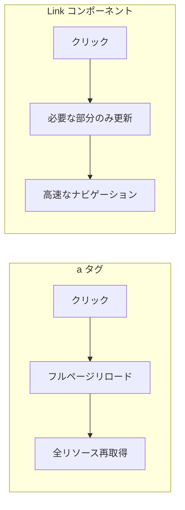
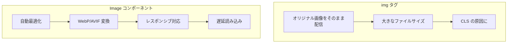

# Link と Image コンポーネント

## 目次

- [概要](#概要)
- [Link コンポーネント](#link-コンポーネント)
  - [基本的な使い方](#基本的な使い方)
  - [`<a>` タグとの違い](#a-タグとの違い)
  - [プリフェッチ](#プリフェッチ)
  - [動的ルートへのリンク](#動的ルートへのリンク)
  - [スタイリング](#スタイリング)
  - [アクティブリンクの判定](#アクティブリンクの判定)
  - [プログラマティックナビゲーション](#プログラマティックナビゲーション)
  - [router のメソッド](#router-のメソッド)
- [Image コンポーネント](#image-コンポーネント)
  - [基本的な使い方](#基本的な使い方-1)
  - [`` タグとの違い](#img-タグとの違い)
  - [サイズ指定の方法](#サイズ指定の方法)
  - [外部画像の使用](#外部画像の使用)
  - [プレースホルダー](#プレースホルダー)
  - [priority 属性](#priority-属性)
- [EC サイトでの活用例](#ec-サイトでの活用例)
  - [商品カードコンポーネント](#商品カードコンポーネント)
  - [商品詳細ページ](#商品詳細ページ)
- [ベストプラクティス](#ベストプラクティス)
  - [Link](#link)
  - [Image](#image)
- [まとめ](#まとめ)
- [次のステップ](#次のステップ)

## 概要

Next.js は、`<Link>` と `<Image>` という最適化されたコンポーネントを提供しています。これらを使用することで、パフォーマンスが自動的に向上し、Core Web Vitals のスコアも改善されます。

***

## Link コンポーネント

### 基本的な使い方

`next/link` の `<Link>` コンポーネントは、クライアントサイドナビゲーションを実現します。

```tsx
import Link from "next/link";

export function Navigation(): React.ReactElement {
  return (
    <nav>
      <Link href="/">ホーム</Link>
      <Link href="/products">商品一覧</Link>
      <Link href="/cart">カート</Link>
    </nav>
  );
}
```

### `<a>` タグとの違い



| 特徴      | `<a>` タグ | `<Link>`  |
| ------- | -------- | --------- |
| ナビゲーション | フルリロード   | クライアントサイド |
| 速度      | 遅い       | 高速        |
| プリフェッチ  | なし       | 自動        |
| 状態保持    | リセット     | 維持可能      |

***

### プリフェッチ

`<Link>` は、ビューポート内に入ったリンク先を自動的にプリフェッチします。

```tsx
// デフォルトでプリフェッチ有効（本番環境のみ）
<Link href="/products">商品一覧</Link>

// プリフェッチを無効化
<Link href="/products" prefetch={false}>商品一覧</Link>
```

### 動的ルートへのリンク

```tsx
import Link from "next/link";

type Product = {
  id: string;
  name: string;
};

type Props = {
  products: Product[];
};

export function ProductList({ products }: Props): React.ReactElement {
  return (
    <ul>
      {products.map((product) => (
        <li key={product.id}>
          <Link href={`/products/${product.id}`}>{product.name}</Link>
        </li>
      ))}
    </ul>
  );
}
```

### スタイリング

`<Link>` は `<a>` タグとしてレンダリングされるので、通常通りスタイリングできます。

```tsx
// className を直接指定
<Link
  href="/products"
  className="text-blue-500 hover:text-blue-700 underline"
>
  商品一覧
</Link>

// Tailwind CSS との組み合わせ
<Link
  href="/products"
  className="px-4 py-2 bg-blue-500 text-white rounded hover:bg-blue-600"
>
  商品を見る
</Link>
```

***

### アクティブリンクの判定

`usePathname` フックを使って、現在のパスを判定できます。

```tsx
"use client";

import Link from "next/link";
import { usePathname } from "next/navigation";

const navItems = [
  { href: "/", label: "ホーム" },
  { href: "/products", label: "商品一覧" },
  { href: "/cart", label: "カート" },
];

export function Navigation(): React.ReactElement {
  const pathname = usePathname();

  return (
    <nav className="flex gap-4">
      {navItems.map((item) => {
        const isActive = pathname === item.href;

        return (
          <Link
            key={item.href}
            href={item.href}
            className={isActive ? "font-bold text-blue-500" : "text-gray-600"}
          >
            {item.label}
          </Link>
        );
      })}
    </nav>
  );
}
```

***

### プログラマティックナビゲーション

`useRouter` フックを使って、プログラムからナビゲーションできます。

```tsx
"use client";

import { useRouter } from "next/navigation";

export function LoginForm(): React.ReactElement {
  const router = useRouter();

  const handleSubmit = async (e: React.FormEvent): Promise<void> => {
    e.preventDefault();
    // ログイン処理...

    // 成功したらリダイレクト
    router.push("/dashboard");
  };

  return (
    <form onSubmit={handleSubmit}>
      {/* フォームフィールド */}
      <button type="submit">ログイン</button>
    </form>
  );
}
```

### router のメソッド

| メソッド           | 説明                 |
| -------------- | ------------------ |
| `push(url)`    | 新しい URL に移動（履歴に追加） |
| `replace(url)` | 現在の履歴を置き換えて移動      |
| `back()`       | ブラウザの戻るボタンと同じ      |
| `forward()`    | ブラウザの進むボタンと同じ      |
| `refresh()`    | 現在のページを再取得         |

***

## Image コンポーネント

### 基本的な使い方

`next/image` の `<Image>` コンポーネントは、画像を自動的に最適化します。

```tsx
import Image from "next/image";

export function ProductCard(): React.ReactElement {
  return (
    <div>
      <Image
        src="/images/product.jpg"
        alt="商品画像"
        width={300}
        height={200}
      />
    </div>
  );
}
```

### `` タグとの違い



| 特徴        | `` タグ | `<Image>`      |
| --------- | ---------- | -------------- |
| フォーマット最適化 | なし         | WebP/AVIF 自動変換 |
| サイズ最適化    | なし         | デバイスに合わせて最適化   |
| 遅延読み込み    | 手動設定       | デフォルトで有効       |
| CLS 防止    | 手動設定       | 自動的にスペース確保     |
| プレースホルダー  | なし         | blur/empty 対応  |

***

### サイズ指定の方法

#### 1. 固定サイズ

```tsx
<Image
  src="/images/product.jpg"
  alt="商品画像"
  width={300}
  height={200}
/>
```

#### 2. fill モード

親要素のサイズに合わせて画像を表示します。

```tsx
<div className="relative h-64 w-full">
  <Image
    src="/images/hero.jpg"
    alt="ヒーロー画像"
    fill
    className="object-cover"
  />
</div>
```

#### 3. sizes 属性

レスポンシブ画像の場合、`sizes` を指定して最適な画像サイズを選択させます。

```tsx
<Image
  src="/images/product.jpg"
  alt="商品画像"
  fill
  sizes="(max-width: 768px) 100vw, (max-width: 1200px) 50vw, 33vw"
/>
```

***

### 外部画像の使用

外部 URL の画像を使う場合、`next.config.ts` で許可が必要です。

```typescript
// next.config.ts
import type { NextConfig } from "next";

const nextConfig: NextConfig = {
  images: {
    remotePatterns: [
      {
        protocol: "https",
        hostname: "example.com",
        pathname: "/images/**",
      },
      {
        protocol: "https",
        hostname: "cdn.example.com",
      },
    ],
  },
};

export default nextConfig;
```

```tsx
<Image
  src="https://example.com/images/product.jpg"
  alt="商品画像"
  width={300}
  height={200}
/>
```

***

### プレースホルダー

画像読み込み中のプレースホルダーを設定できます。

```tsx
// blur プレースホルダー（ローカル画像）
import productImage from "@/public/images/product.jpg";

<Image
  src={productImage}
  alt="商品画像"
  placeholder="blur"
/>

// 外部画像の場合は blurDataURL を指定
<Image
  src="https://example.com/product.jpg"
  alt="商品画像"
  width={300}
  height={200}
  placeholder="blur"
  blurDataURL="data:image/jpeg;base64,/9j/4AAQSkZJRg..."
/>
```

***

### priority 属性

ファーストビューに表示される重要な画像には `priority` を指定します。

```tsx
// ヒーロー画像など、最初に表示される画像
<Image
  src="/images/hero.jpg"
  alt="ヒーロー画像"
  width={1200}
  height={600}
  priority
/>
```

**priority を付けるべき画像:**

- ヒーロー画像
- LCP（Largest Contentful Paint）要素
- ファーストビューのメイン画像

***

## EC サイトでの活用例

### 商品カードコンポーネント

```tsx
import Image from "next/image";
import Link from "next/link";

type Product = {
  id: string;
  name: string;
  price: number;
  imageUrl: string;
};

type Props = {
  product: Product;
};

export function ProductCard({ product }: Props): React.ReactElement {
  return (
    <Link
      href={`/products/${product.id}`}
      className="group block"
    >
      <div className="relative aspect-square overflow-hidden rounded-lg">
        <Image
          src={product.imageUrl}
          alt={product.name}
          fill
          sizes="(max-width: 768px) 50vw, 25vw"
          className="object-cover transition-transform group-hover:scale-105"
        />
      </div>
      <h3 className="mt-2 text-sm font-medium">{product.name}</h3>
      <p className="text-lg font-bold">¥{product.price.toLocaleString()}</p>
    </Link>
  );
}
```

### 商品詳細ページ

```tsx
import Image from "next/image";
import Link from "next/link";

type Product = {
  id: string;
  name: string;
  price: number;
  images: string[];
  category: {
    slug: string;
    name: string;
  };
};

type Props = {
  product: Product;
};

export function ProductDetail({ product }: Props): React.ReactElement {
  return (
    <div>
      {/* パンくずリスト */}
      <nav className="mb-4 text-sm text-gray-500">
        <Link
          href="/"
          className="hover:text-gray-700"
        >
          ホーム
        </Link>
        {" > "}
        <Link
          href="/products"
          className="hover:text-gray-700"
        >
          商品一覧
        </Link>
        {" > "}
        <Link
          href={`/categories/${product.category.slug}`}
          className="hover:text-gray-700"
        >
          {product.category.name}
        </Link>
        {" > "}
        <span>{product.name}</span>
      </nav>

      {/* メイン画像 */}
      <div className="relative aspect-square w-full max-w-lg">
        <Image
          src={product.images[0]}
          alt={product.name}
          fill
          priority
          className="rounded-lg object-cover"
        />
      </div>

      {/* サムネイル */}
      <div className="mt-4 flex gap-2">
        {product.images.map((image, i) => (
          <div
            key={i}
            className="relative h-20 w-20"
          >
            <Image
              src={image}
              alt={`${product.name} - ${i + 1}`}
              fill
              className="rounded object-cover"
            />
          </div>
        ))}
      </div>
    </div>
  );
}
```

***

## ベストプラクティス

### Link

1. **常に `<Link>` を使う**: 内部リンクには必ず `<Link>` を使用
2. **外部リンクは `<a>`**: 外部サイトへのリンクは通常の `<a>` タグを使用
3. **プリフェッチの制御**: 大量のリンクがある場合は `prefetch={false}` を検討

### Image

1. **画像のサイズを指定**: `width` と `height` を必ず指定（CLS 防止）
2. **`sizes` を活用**: レスポンシブ画像には `sizes` を指定
3. **`priority` を適切に**: LCP 要素のみに使用（乱用は逆効果）
4. **`fill` と `object-fit`**: 柔軟なレイアウトには `fill` + CSS を使用

***

## まとめ

| コンポーネント   | 主な機能             | メリット             |
| --------- | ---------------- | ---------------- |
| `<Link>`  | クライアントサイドナビゲーション | 高速なページ遷移         |
| `<Image>` | 画像最適化            | パフォーマンス向上、CLS 防止 |

***

## 次のステップ

Link と Image コンポーネントを理解したら、[演習 1: レイアウト実装](./exercises/01-layout.md) で実際に EC サイトのレイアウトを作ってみましょう。
