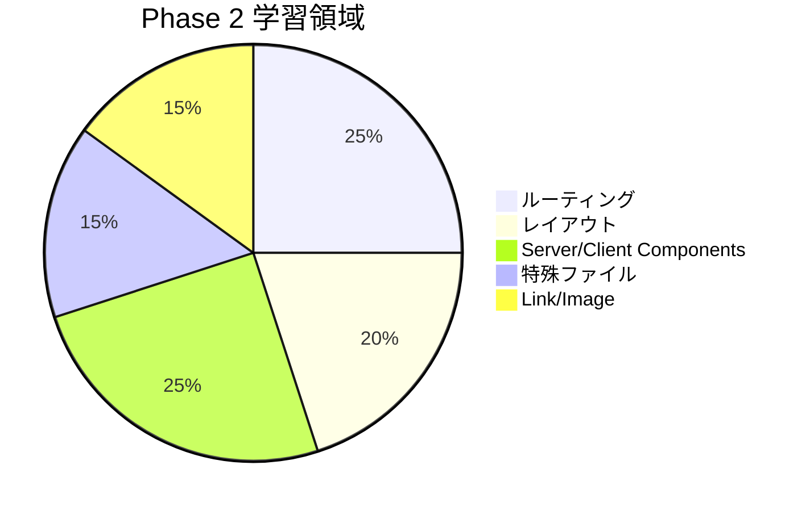

# Phase 2: 自己チェックリスト

このチェックリストを使って、Phase 2 の学習内容を振り返りましょう。

---

## 学習領域の概要



---

## 1. ファイルベースルーティング

### 理解度チェック

- [ ] `app/` ディレクトリ内のフォルダ構造が URL パスに対応することを理解した
- [ ] `page.tsx` がないとルートが作成されないことを理解した
- [ ] ルートグループ `(groupName)` の用途を理解した
- [ ] プライベートフォルダ `_folderName` の用途を理解した

### 確認質問

1. `app/products/new/page.tsx` に対応する URL は？

   **回答例:** `/products/new`

2. URL を変えずにファイルを整理するには？

   **回答例:** ルートグループ `(groupName)` を使う

3. `page.tsx` を置かずにコンポーネントを整理したい場合は？

   **回答例:** プライベートフォルダ `_components` などを使う

---

## 2. layout.tsx と page.tsx

### 理解度チェック

- [ ] `layout.tsx` と `page.tsx` の違いを説明できる
- [ ] ルートレイアウトに必須の要素（`<html>`, `<body>`）を理解した
- [ ] レイアウトがネストすることを理解した
- [ ] レイアウトがナビゲーション時に再レンダリングされないことを理解した

### 確認質問

1. `layout.tsx` と `page.tsx` の主な違いは？

   **回答例:** `layout.tsx` は複数ページで共有され、ナビゲーション時に維持される。`page.tsx` はページ固有のコンテンツで、ナビゲーション時に更新される。

2. `template.tsx` はいつ使う？

   **回答例:** ページ遷移アニメーションや、ページビューの計測など、毎回再マウントが必要な場合

---

## 3. Server Components vs Client Components

### 理解度チェック

- [ ] デフォルトで Server Components であることを理解した
- [ ] `"use client"` ディレクティブの使い方を理解した
- [ ] Server Components で使えないもの（useState, onClick など）を理解した
- [ ] Client Components にすべき場面を判断できる

### 確認質問

1. Server Components のメリットは？

   **回答例:** バンドルサイズ削減、直接データアクセス、機密情報の保護、高速な初期表示

2. `useState` を使いたい場合は？

   **回答例:** ファイルの先頭に `"use client"` を追加して Client Component にする

3. Server Components から Client Components にデータを渡すときの制約は？

   **回答例:** シリアライズ可能なデータのみ渡せる（関数や Date オブジェクトは直接渡せない）

---

## 4. 特殊ファイル (loading/error/not-found)

### 理解度チェック

- [ ] `loading.tsx` の役割と使い方を理解した
- [ ] `error.tsx` が必ず Client Component であることを理解した
- [ ] `notFound()` 関数の使い方を理解した
- [ ] `global-error.tsx` の用途を理解した

### 確認質問

1. `loading.tsx` はいつ表示される？

   **回答例:** Server Component でデータ取得中（Suspense のフォールバックとして）

2. `error.tsx` で必須のディレクティブは？

   **回答例:** `"use client"` - Error Boundary は Client Component でなければならない

3. 動的ルートで商品が見つからない場合の処理は？

   **回答例:** `notFound()` 関数を呼び出すと、`not-found.tsx` が表示される

---

## 5. 動的ルート

### 理解度チェック

- [ ] `[param]` の使い方を理解した
- [ ] `[...param]` と `[[...param]]` の違いを理解した
- [ ] `params` と `searchParams` の違いを理解した
- [ ] `generateStaticParams` の使い方を理解した

### 確認質問

1. `/products/123` の `123` を取得するには？

   **回答例:**

   ```tsx
   type Props = { params: Promise<{ id: string }> };
   const { id } = await params;
   ```

2. `[...slug]` と `[[...slug]]` の違いは？

   **回答例:** `[...slug]` は最低1つのセグメントが必要。`[[...slug]]` はルートセグメントも含めてマッチ（0個以上）

3. クエリパラメータ `?page=2` を取得するには？

   **回答例:** `searchParams` から取得: `const { page } = await searchParams;`

---

## 6. Link と Image コンポーネント

### 理解度チェック

- [ ] `<Link>` と `<a>` の違いを理解した
- [ ] `<Image>` と `` の違いを理解した
- [ ] `<Link>` のプリフェッチ機能を理解した
- [ ] `<Image>` の `fill`, `priority`, `sizes` 属性を理解した

### 確認質問

1. 内部リンクに `<a>` ではなく `<Link>` を使う理由は？

   **回答例:** クライアントサイドナビゲーションによる高速なページ遷移、プリフェッチによるパフォーマンス向上

2. LCP（Largest Contentful Paint）要素の画像に付けるべき属性は？

   **回答例:** `priority` 属性を追加して、優先的に読み込ませる

3. レスポンシブ画像でビューポート幅に応じたサイズを選択させるには？

   **回答例:** `sizes` 属性を指定する（例: `sizes="(max-width: 768px) 100vw, 50vw"`）

---

## 実践確認

### 操作チェック

- [ ] ヘッダー/フッターを含むレイアウトを実装した
- [ ] 商品一覧ページ `/products` を実装した
- [ ] 商品詳細ページ `/products/[id]` を実装した
- [ ] ローディング UI を実装した
- [ ] 404 ページを実装した
- [ ] パンくずリストを実装した

### コードチェック

- [ ] TypeScript の型チェックを通過する
- [ ] `eslint` のエラーがない
- [ ] コンポーネントが適切に分割されている
- [ ] Server/Client Components が適切に使い分けられている

---

## 総合評価

### 達成度の目安

| 達成率  | レベル   | 推奨アクション                   |
| ------- | -------- | -------------------------------- |
| 90%以上 | 完璧     | Phase 3 に進んでください         |
| 70-89%  | 良好     | 不明点を復習してから Phase 3 へ  |
| 50-69%  | 基礎理解 | もう一度演習をやり直すことを推奨 |
| 50%未満 | 要復習   | ドキュメントを読み直してください |

### 自己評価

以下のようにチェックを入れた項目数を数えてください。

- 理解度チェック: \_\_\_\_ / 20 項目
- 実践確認: \_\_\_\_ / 10 項目
- **合計: \_\_\_\_ / 30 項目 (\_\_\_\_\_%)**

---

## よくある質問

### Q: Server Components と Client Components の境界がわかりにくい

**A:** 基本的に「インタラクションが必要かどうか」で判断します。

- ボタンクリック、フォーム入力 → Client Component
- データ表示のみ → Server Component

### Q: `params` が Promise なのはなぜ？

**A:** Next.js 15 以降では、`params` と `searchParams` は非同期になりました。これにより、より柔軟なデータ取得が可能になっています。

### Q: ローディング UI がうまく表示されない

**A:** ローディング UI は Server Components のデータ取得中に表示されます。Client Components や静的データでは表示されません。

---

## 次のステップ

Phase 2 を完了したら、[Phase 3: コンポーネント設計パターン](../phase-03-component-design/README.md) に進んでください。

Phase 3 では、Atomic Design、Compound Components、カスタムフックなどの設計パターンを学び、より再利用可能で保守性の高いコンポーネントを作成します。
