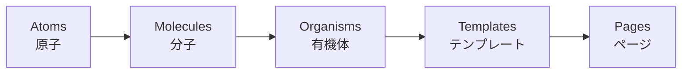
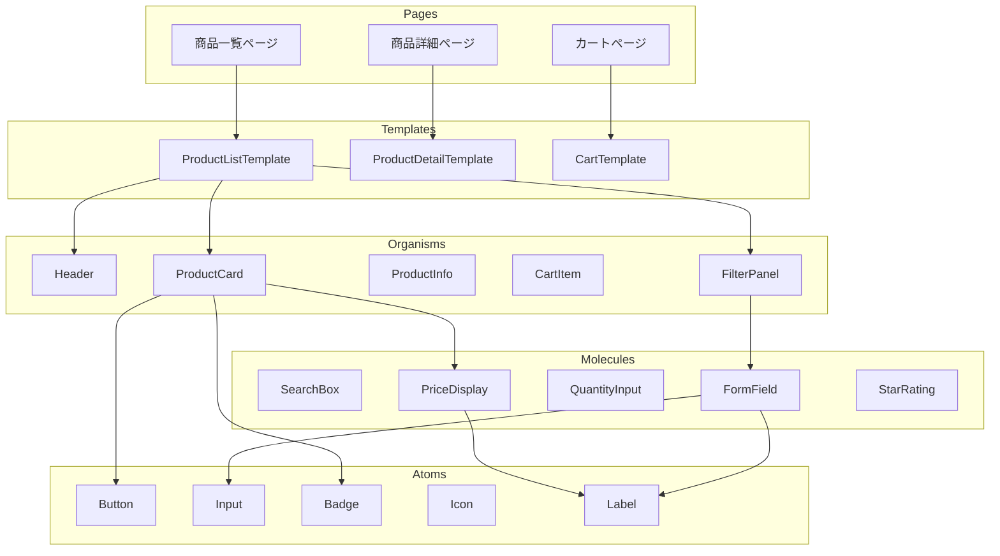

# Atomic Design パターン

## 目次

- [Atomic Design とは](#atomic-design-とは)
- [5 つの階層](#5-つの階層)
  - [1. Atoms（原子）](#1-atoms原子)
  - [2. Molecules（分子）](#2-molecules分子)
  - [3. Organisms（有機体）](#3-organisms有機体)
  - [4. Templates（テンプレート）](#4-templatesテンプレート)
  - [5. Pages（ページ）](#5-pagesページ)
- [EC サイトでのコンポーネント分類例](#ec-サイトでのコンポーネント分類例)
- [packages/ui でのディレクトリ構成](#packagesui-でのディレクトリ構成)
- [shadcn/ui との関係](#shadcnui-との関係)
- [Atomic Design の利点と注意点](#atomic-design-の利点と注意点)
  - [利点](#利点)
  - [注意点](#注意点)
- [まとめ](#まとめ)
- [次のステップ](#次のステップ)

## Atomic Design とは

Atomic Design は、Brad Frost が提唱したコンポーネント設計の方法論です。
化学の概念（原子 → 分子 → 有機体）をベースに、UI コンポーネントを 5 つの階層に分類します。



---

## 5 つの階層

### 1. Atoms（原子）

**最小単位の UI 要素**です。これ以上分解できない基本パーツ。

| コンポーネント | 説明                     |
| -------------- | ------------------------ |
| Button         | ボタン                   |
| Input          | テキスト入力             |
| Label          | ラベル                   |
| Icon           | アイコン                 |
| Badge          | バッジ（ステータス表示） |
| Checkbox       | チェックボックス         |
| Avatar         | ユーザーアバター         |

```typescript
// packages/ui/src/atoms/Button.tsx
import { type ButtonHTMLAttributes, forwardRef } from "react";
import { cn } from "@repo/ui/lib/utils";

export interface ButtonProps extends ButtonHTMLAttributes<HTMLButtonElement> {
  variant?: "default" | "outline" | "ghost";
  size?: "sm" | "md" | "lg";
}

export const Button = forwardRef<HTMLButtonElement, ButtonProps>(
  ({ className, variant = "default", size = "md", ...props }, ref) => {
    return (
      <button
        ref={ref}
        className={cn(
          "inline-flex items-center justify-center rounded-md font-medium",
          // variant styles
          variant === "default" && "bg-primary text-primary-foreground",
          variant === "outline" && "border border-input bg-background",
          variant === "ghost" && "hover:bg-accent",
          // size styles
          size === "sm" && "h-8 px-3 text-sm",
          size === "md" && "h-10 px-4",
          size === "lg" && "h-12 px-6 text-lg",
          className
        )}
        {...props}
      />
    );
  }
);
Button.displayName = "Button";
```

---

### 2. Molecules（分子）

**複数の Atoms を組み合わせた機能単位**です。単一の責務を持ちます。

| コンポーネント | 構成要素                | 用途           |
| -------------- | ----------------------- | -------------- |
| FormField      | Label + Input + Error   | フォーム入力欄 |
| SearchBox      | Input + Button (Icon)   | 検索入力       |
| PriceDisplay   | Text + Badge            | 価格表示       |
| StarRating     | Icon × 5                | 評価表示       |
| QuantityInput  | Button + Input + Button | 数量選択       |

```typescript
// packages/ui/src/molecules/FormField.tsx
import { Label } from "@repo/ui/atoms/Label";
import { Input } from "@repo/ui/atoms/Input";
import { type InputHTMLAttributes } from "react";

export interface FormFieldProps extends InputHTMLAttributes<HTMLInputElement> {
  label: string;
  error?: string;
}

export function FormField({
  label,
  error,
  id,
  ...inputProps
}: FormFieldProps): JSX.Element {
  const inputId = id ?? label.toLowerCase().replace(/\s/g, "-");

  return (
    <div className="space-y-2">
      <Label htmlFor={inputId}>{label}</Label>
      <Input
        id={inputId}
        aria-invalid={!!error}
        aria-describedby={error ? `${inputId}-error` : undefined}
        {...inputProps}
      />
      {error && (
        <p id={`${inputId}-error`} className="text-sm text-destructive">
          {error}
        </p>
      )}
    </div>
  );
}
```

---

### 3. Organisms（有機体）

**Molecules や Atoms を組み合わせた、独立して機能する UI ブロック**です。

| コンポーネント | 構成要素                          | 用途           |
| -------------- | --------------------------------- | -------------- |
| Header         | Logo + Nav + SearchBox + CartIcon | サイトヘッダー |
| ProductCard    | Image + Title + Price + Button    | 商品カード     |
| CartItem       | Image + Title + Quantity + Remove | カート内商品   |
| FilterPanel    | Title + Checkbox Group + Button   | 検索フィルター |
| ReviewCard     | Avatar + StarRating + Text + Date | レビュー表示   |

```typescript
// packages/ui/src/organisms/ProductCard.tsx
import Image from "next/image";
import { Card, CardContent, CardFooter } from "@repo/ui/atoms/Card";
import { Button } from "@repo/ui/atoms/Button";
import { Badge } from "@repo/ui/atoms/Badge";
import { PriceDisplay } from "@repo/ui/molecules/PriceDisplay";

export interface ProductCardProps {
  id: string;
  name: string;
  price: number;
  originalPrice?: number;
  imageUrl: string;
  isNew?: boolean;
  isSoldOut?: boolean;
  onAddToCart?: (id: string) => void;
}

export function ProductCard({
  id,
  name,
  price,
  originalPrice,
  imageUrl,
  isNew = false,
  isSoldOut = false,
  onAddToCart,
}: ProductCardProps): JSX.Element {
  const hasDiscount = originalPrice !== undefined && originalPrice > price;

  return (
    <Card className="group overflow-hidden">
      <div className="relative aspect-square">
        <Image
          src={imageUrl}
          alt={name}
          fill
          className="object-cover transition-transform group-hover:scale-105"
        />
        {isNew && (
          <Badge className="absolute left-2 top-2" variant="secondary">
            NEW
          </Badge>
        )}
        {hasDiscount && (
          <Badge className="absolute right-2 top-2" variant="destructive">
            SALE
          </Badge>
        )}
      </div>

      <CardContent className="p-4">
        <h3 className="font-medium line-clamp-2">{name}</h3>
        <PriceDisplay
          price={price}
          originalPrice={originalPrice}
          className="mt-2"
        />
      </CardContent>

      <CardFooter className="p-4 pt-0">
        <Button
          className="w-full"
          disabled={isSoldOut}
          onClick={() => onAddToCart?.(id)}
        >
          {isSoldOut ? "売り切れ" : "カートに追加"}
        </Button>
      </CardFooter>
    </Card>
  );
}
```

---

### 4. Templates（テンプレート）

**ページのワイヤーフレーム**です。コンテンツの配置を定義しますが、実際のデータは持ちません。

```typescript
// packages/ui/src/templates/ProductListTemplate.tsx
import { type ReactNode } from "react";

export interface ProductListTemplateProps {
  header: ReactNode;
  sidebar: ReactNode;
  products: ReactNode;
  pagination: ReactNode;
}

export function ProductListTemplate({
  header,
  sidebar,
  products,
  pagination,
}: ProductListTemplateProps): JSX.Element {
  return (
    <div className="min-h-screen">
      {header}
      <div className="container mx-auto px-4 py-8">
        <div className="grid grid-cols-1 gap-8 lg:grid-cols-4">
          <aside className="lg:col-span-1">{sidebar}</aside>
          <main className="lg:col-span-3">
            {products}
            <div className="mt-8">{pagination}</div>
          </main>
        </div>
      </div>
    </div>
  );
}
```

---

### 5. Pages（ページ）

**Templates に実際のデータを流し込んだ、最終的なページ**です。
Next.js App Router では `app/` ディレクトリ内の `page.tsx` がこれに該当します。

```typescript
// apps/web/app/products/page.tsx
import { ProductListTemplate } from "@repo/ui/templates/ProductListTemplate";
import { Header } from "@repo/ui/organisms/Header";
import { FilterPanel } from "@repo/ui/organisms/FilterPanel";
import { ProductGrid } from "@repo/ui/organisms/ProductGrid";
import { Pagination } from "@repo/ui/molecules/Pagination";
import { fetchProducts } from "@/lib/api/products";

export default async function ProductsPage(): Promise<JSX.Element> {
  const products = await fetchProducts();

  return (
    <ProductListTemplate
      header={<Header />}
      sidebar={<FilterPanel categories={products.categories} />}
      products={<ProductGrid products={products.items} />}
      pagination={
        <Pagination
          currentPage={products.currentPage}
          totalPages={products.totalPages}
        />
      }
    />
  );
}
```

---

## EC サイトでのコンポーネント分類例



---

## packages/ui でのディレクトリ構成

```text
packages/ui/
├── src/
│   ├── atoms/
│   │   ├── Button.tsx
│   │   ├── Input.tsx
│   │   ├── Label.tsx
│   │   ├── Badge.tsx
│   │   ├── Icon.tsx
│   │   └── index.ts
│   │
│   ├── molecules/
│   │   ├── FormField.tsx
│   │   ├── SearchBox.tsx
│   │   ├── PriceDisplay.tsx
│   │   ├── QuantityInput.tsx
│   │   ├── StarRating.tsx
│   │   └── index.ts
│   │
│   ├── organisms/
│   │   ├── Header.tsx
│   │   ├── ProductCard.tsx
│   │   ├── CartItem.tsx
│   │   ├── FilterPanel.tsx
│   │   └── index.ts
│   │
│   ├── templates/
│   │   ├── ProductListTemplate.tsx
│   │   ├── ProductDetailTemplate.tsx
│   │   ├── CartTemplate.tsx
│   │   └── index.ts
│   │
│   ├── lib/
│   │   └── utils.ts
│   │
│   └── index.ts
│
├── package.json
└── tsconfig.json
```

---

## shadcn/ui との関係

shadcn/ui のコンポーネントは、主に Atoms と Molecules に分類されます。

| shadcn/ui | 分類      | カスタマイズ例                      |
| --------- | --------- | ----------------------------------- |
| Button    | Atoms     | EC 用バリアント追加（add-to-cart）  |
| Input     | Atoms     | 数量入力用の number 専用版          |
| Badge     | Atoms     | NEW, SALE, 在庫なし用バリアント     |
| Card      | Molecules | ProductCard の基礎として使用        |
| Dialog    | Organisms | ConfirmDialog, QuickView として拡張 |
| Sheet     | Organisms | MobileMenu, CartDrawer として使用   |
| Tabs      | Organisms | 商品詳細の説明/レビュー切り替え     |
| Form      | Molecules | React Hook Form 統合済み            |

---

## Atomic Design の利点と注意点

### 利点

| 利点               | 説明                                                   |
| ------------------ | ------------------------------------------------------ |
| 一貫性             | 共通のコンポーネントを使うことで UI の一貫性が保たれる |
| 再利用性           | 小さな単位で作るため、様々な場面で再利用できる         |
| 保守性             | 変更箇所が明確で、影響範囲を把握しやすい               |
| Storybook との相性 | 階層ごとにストーリーを整理できる                       |

### 注意点

| 注意点                 | 説明                                                   |
| ---------------------- | ------------------------------------------------------ |
| 厳密すぎる分類は避ける | どの階層か迷ったら、チームで合意した分類に従う         |
| 早期の抽象化を避ける   | 最初は最小限の構成で始め、必要に応じてリファクタリング |
| コンテキストを考慮     | EC サイトの文脈で意味のある分類を優先                  |

---

## まとめ

- Atomic Design は **Atoms → Molecules → Organisms → Templates → Pages** の 5 階層
- **Atoms** は最小単位（Button, Input など）
- **Molecules** は Atoms の組み合わせ（FormField, SearchBox など）
- **Organisms** は独立した機能ブロック（Header, ProductCard など）
- **Templates** はレイアウトのワイヤーフレーム
- **Pages** は Templates に実データを流し込んだ最終形
- shadcn/ui は Atoms/Molecules として活用し、EC 用に拡張する

---

## 次のステップ

[02 Compound Components](./02-compound-components.md) では、より柔軟な API を持つコンポーネントの設計パターンを学びます。
