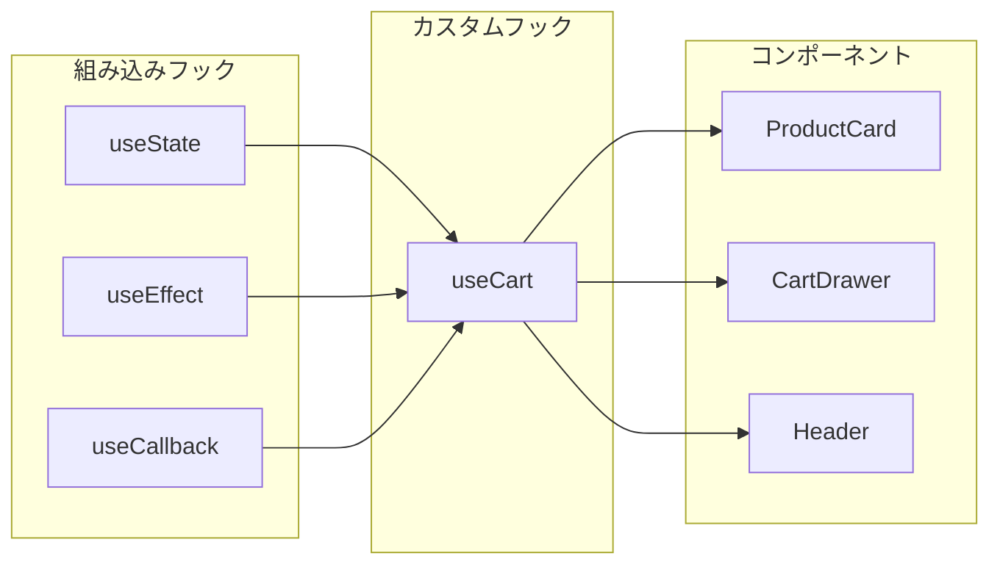

# カスタムフックパターン

## 目次

- [カスタムフックとは](#カスタムフックとは)
- [命名規則](#命名規則)
- [基本的なカスタムフック](#基本的なカスタムフック)
  - [1. useToggle](#1-usetoggle)
  - [2. useLocalStorage](#2-uselocalstorage)
  - [3. useDebounce](#3-usedebounce)
  - [4. useMediaQuery](#4-usemediaquery)
- [EC サイト向けカスタムフック](#ec-サイト向けカスタムフック)
  - [1. useCart](#1-usecart)
  - [2. useFavorites](#2-usefavorites)
  - [3. useRecentlyViewed](#3-userecentlyviewed)
- [カスタムフックのテスト](#カスタムフックのテスト)
- [カスタムフックのベストプラクティス](#カスタムフックのベストプラクティス)
- [まとめ](#まとめ)
- [次のステップ](#次のステップ)

## カスタムフックとは

カスタムフックは、**React の組み込みフック（useState, useEffect など）を組み合わせて、再利用可能なロジックを抽出する**方法です。



---

## 命名規則

カスタムフックは必ず **`use` プレフィックス**で始めます。

```typescript
// 良い例
function useCart() { ... }
function useDebounce() { ... }
function useLocalStorage() { ... }

// 悪い例
function getCart() { ... }      // use プレフィックスがない
function CartHook() { ... }     // 大文字始まり（コンポーネントと混同）
```

---

## 基本的なカスタムフック

### 1. useToggle

```typescript
// packages/shared/src/hooks/useToggle.ts
import { useState, useCallback } from "react";

interface UseToggleReturn {
  isOpen: boolean;
  open: () => void;
  close: () => void;
  toggle: () => void;
}

export function useToggle(initialValue = false): UseToggleReturn {
  const [isOpen, setIsOpen] = useState(initialValue);

  const open = useCallback(() => setIsOpen(true), []);
  const close = useCallback(() => setIsOpen(false), []);
  const toggle = useCallback(() => setIsOpen((prev) => !prev), []);

  return { isOpen, open, close, toggle };
}
```

以下は使用例です。

```tsx
function MobileMenu(): JSX.Element {
  const { isOpen, open, close } = useToggle();

  return (
    <>
      <Button onClick={open}>メニュー</Button>
      <Sheet
        open={isOpen}
        onOpenChange={(open) => (open ? open() : close())}
      >
        <SheetContent>
          <Navigation />
        </SheetContent>
      </Sheet>
    </>
  );
}
```

---

### 2. useLocalStorage

```typescript
// packages/shared/src/hooks/useLocalStorage.ts
import { useState, useEffect, useCallback } from "react";

export function useLocalStorage<T>(
  key: string,
  initialValue: T
): [T, (value: T | ((prev: T) => T)) => void] {
  // Server Side では initialValue を返す
  const [storedValue, setStoredValue] = useState<T>(initialValue);

  // クライアントサイドでのみ localStorage から読み込む
  useEffect(() => {
    try {
      const item = window.localStorage.getItem(key);
      if (item) {
        setStoredValue(JSON.parse(item) as T);
      }
    } catch (error) {
      console.warn(`Error reading localStorage key "${key}":`, error);
    }
  }, [key]);

  const setValue = useCallback(
    (value: T | ((prev: T) => T)) => {
      try {
        const valueToStore = value instanceof Function ? value(storedValue) : value;
        setStoredValue(valueToStore);
        window.localStorage.setItem(key, JSON.stringify(valueToStore));
      } catch (error) {
        console.warn(`Error setting localStorage key "${key}":`, error);
      }
    },
    [key, storedValue]
  );

  return [storedValue, setValue];
}
```

以下は使用例です。

```tsx
function ThemeToggle(): JSX.Element {
  const [theme, setTheme] = useLocalStorage<"light" | "dark">("theme", "light");

  return (
    <Button onClick={() => setTheme((prev) => (prev === "light" ? "dark" : "light"))}>
      {theme === "light" ? "🌙" : "☀️"}
    </Button>
  );
}
```

---

### 3. useDebounce

```typescript
// packages/shared/src/hooks/useDebounce.ts
import { useState, useEffect } from "react";

export function useDebounce<T>(value: T, delay: number): T {
  const [debouncedValue, setDebouncedValue] = useState<T>(value);

  useEffect(() => {
    const timer = setTimeout(() => {
      setDebouncedValue(value);
    }, delay);

    return () => {
      clearTimeout(timer);
    };
  }, [value, delay]);

  return debouncedValue;
}
```

以下は使用例です。

```tsx
function SearchBox(): JSX.Element {
  const [query, setQuery] = useState("");
  const debouncedQuery = useDebounce(query, 300);

  useEffect(() => {
    if (debouncedQuery) {
      // 300ms 後に検索 API を呼び出す
      searchProducts(debouncedQuery);
    }
  }, [debouncedQuery]);

  return (
    <Input
      value={query}
      onChange={(e) => setQuery(e.target.value)}
      placeholder="商品を検索..."
    />
  );
}
```

---

### 4. useMediaQuery

```typescript
// packages/shared/src/hooks/useMediaQuery.ts
import { useState, useEffect } from "react";

export function useMediaQuery(query: string): boolean {
  const [matches, setMatches] = useState(false);

  useEffect(() => {
    const media = window.matchMedia(query);
    setMatches(media.matches);

    const listener = (event: MediaQueryListEvent): void => {
      setMatches(event.matches);
    };

    media.addEventListener("change", listener);
    return () => media.removeEventListener("change", listener);
  }, [query]);

  return matches;
}

// 便利なプリセット
export function useIsMobile(): boolean {
  return useMediaQuery("(max-width: 768px)");
}

export function useIsDesktop(): boolean {
  return useMediaQuery("(min-width: 1024px)");
}
```

以下は使用例です。

```tsx
function ProductGrid({ products }: { products: Product[] }): JSX.Element {
  const isMobile = useIsMobile();
  const gridColsClass = isMobile ? "grid-cols-2" : "grid-cols-4";

  return (
    <div className={`grid ${gridColsClass} gap-4`}>
      {products.map((product) => (
        <ProductCard
          key={product.id}
          product={product}
        />
      ))}
    </div>
  );
}
```

---

## EC サイト向けカスタムフック

### 1. useCart

```typescript
// packages/shared/src/hooks/useCart.ts
import { useCallback } from "react";
import { useAtom } from "jotai";
import { cartAtom, type CartItem } from "@repo/store/cart";

interface UseCartReturn {
  items: CartItem[];
  totalItems: number;
  totalPrice: number;
  addItem: (productId: string, quantity?: number) => void;
  removeItem: (productId: string) => void;
  updateQuantity: (productId: string, quantity: number) => void;
  clearCart: () => void;
  isInCart: (productId: string) => boolean;
}

export function useCart(): UseCartReturn {
  const [items, setItems] = useAtom(cartAtom);

  const totalItems = items.reduce((sum, item) => sum + item.quantity, 0);
  const totalPrice = items.reduce((sum, item) => sum + item.price * item.quantity, 0);

  const addItem = useCallback(
    (productId: string, quantity = 1) => {
      setItems((prev) => {
        const existingItem = prev.find((item) => item.productId === productId);
        if (existingItem) {
          return prev.map((item) =>
            item.productId === productId ? { ...item, quantity: item.quantity + quantity } : item
          );
        }
        // 実際の実装では商品情報を取得する必要がある
        return [...prev, { productId, quantity, price: 0, name: "" }];
      });
    },
    [setItems]
  );

  const removeItem = useCallback(
    (productId: string) => {
      setItems((prev) => prev.filter((item) => item.productId !== productId));
    },
    [setItems]
  );

  const updateQuantity = useCallback(
    (productId: string, quantity: number) => {
      if (quantity <= 0) {
        removeItem(productId);
        return;
      }
      setItems((prev) =>
        prev.map((item) => (item.productId === productId ? { ...item, quantity } : item))
      );
    },
    [setItems, removeItem]
  );

  const clearCart = useCallback(() => {
    setItems([]);
  }, [setItems]);

  const isInCart = useCallback(
    (productId: string) => items.some((item) => item.productId === productId),
    [items]
  );

  return {
    items,
    totalItems,
    totalPrice,
    addItem,
    removeItem,
    updateQuantity,
    clearCart,
    isInCart,
  };
}
```

以下は使用例です。

```tsx
function AddToCartButton({ productId }: { productId: string }): JSX.Element {
  const { addItem, isInCart } = useCart();
  const isItemInCart = isInCart(productId);

  return (
    <Button
      onClick={() => addItem(productId)}
      variant={isItemInCart ? "outline" : "default"}
    >
      {isItemInCart ? "カートに追加済み" : "カートに追加"}
    </Button>
  );
}
```

---

### 2. useFavorites

```typescript
// packages/shared/src/hooks/useFavorites.ts
import { useCallback } from "react";
import { useAtom } from "jotai";
import { atomWithStorage } from "jotai/utils";

const favoritesAtom = atomWithStorage<string[]>("favorites", []);

interface UseFavoritesReturn {
  favorites: string[];
  addFavorite: (productId: string) => void;
  removeFavorite: (productId: string) => void;
  toggleFavorite: (productId: string) => void;
  isFavorite: (productId: string) => boolean;
}

export function useFavorites(): UseFavoritesReturn {
  const [favorites, setFavorites] = useAtom(favoritesAtom);

  const addFavorite = useCallback(
    (productId: string) => {
      setFavorites((prev) => (prev.includes(productId) ? prev : [...prev, productId]));
    },
    [setFavorites]
  );

  const removeFavorite = useCallback(
    (productId: string) => {
      setFavorites((prev) => prev.filter((id) => id !== productId));
    },
    [setFavorites]
  );

  const toggleFavorite = useCallback(
    (productId: string) => {
      setFavorites((prev) =>
        prev.includes(productId) ? prev.filter((id) => id !== productId) : [...prev, productId]
      );
    },
    [setFavorites]
  );

  const isFavorite = useCallback((productId: string) => favorites.includes(productId), [favorites]);

  return {
    favorites,
    addFavorite,
    removeFavorite,
    toggleFavorite,
    isFavorite,
  };
}
```

以下は使用例です。

```tsx
function FavoriteButton({ productId }: { productId: string }): JSX.Element {
  const { toggleFavorite, isFavorite } = useFavorites();
  const isFavorited = isFavorite(productId);

  return (
    <Button
      variant="ghost"
      size="icon"
      onClick={() => toggleFavorite(productId)}
      aria-label={isFavorited ? "お気に入りから削除" : "お気に入りに追加"}
    >
      <Heart className={isFavorited ? "fill-red-500 text-red-500" : ""} />
    </Button>
  );
}
```

---

### 3. useRecentlyViewed

```typescript
// packages/shared/src/hooks/useRecentlyViewed.ts
import { useCallback, useEffect } from "react";
import { useAtom } from "jotai";
import { atomWithStorage } from "jotai/utils";

const MAX_ITEMS = 10;

const recentlyViewedAtom = atomWithStorage<string[]>("recently-viewed", []);

interface UseRecentlyViewedReturn {
  recentlyViewed: string[];
  addToRecentlyViewed: (productId: string) => void;
  clearRecentlyViewed: () => void;
}

export function useRecentlyViewed(): UseRecentlyViewedReturn {
  const [recentlyViewed, setRecentlyViewed] = useAtom(recentlyViewedAtom);

  const addToRecentlyViewed = useCallback(
    (productId: string) => {
      setRecentlyViewed((prev) => {
        // 既存のアイテムを削除して先頭に追加
        const filtered = prev.filter((id) => id !== productId);
        const updated = [productId, ...filtered];
        // 最大数を超えたら古いものを削除
        return updated.slice(0, MAX_ITEMS);
      });
    },
    [setRecentlyViewed]
  );

  const clearRecentlyViewed = useCallback(() => {
    setRecentlyViewed([]);
  }, [setRecentlyViewed]);

  return {
    recentlyViewed,
    addToRecentlyViewed,
    clearRecentlyViewed,
  };
}

// 商品詳細ページで使うヘルパーフック
export function useTrackProductView(productId: string): void {
  const { addToRecentlyViewed } = useRecentlyViewed();

  useEffect(() => {
    addToRecentlyViewed(productId);
  }, [productId, addToRecentlyViewed]);
}
```

以下は使用例です。

```tsx
// 商品詳細ページ
function ProductDetailPage({ productId }: { productId: string }): JSX.Element {
  // 閲覧履歴に自動追加
  useTrackProductView(productId);

  return <ProductDetail productId={productId} />;
}

// 最近見た商品セクション
function RecentlyViewedSection(): JSX.Element {
  const { recentlyViewed } = useRecentlyViewed();

  if (recentlyViewed.length === 0) {
    return null;
  }

  return (
    <section>
      <h2>最近見た商品</h2>
      <ProductCarousel productIds={recentlyViewed} />
    </section>
  );
}
```

---

## カスタムフックのテスト

```typescript
// packages/shared/src/hooks/__tests__/useToggle.test.ts
import { renderHook, act } from "@testing-library/react";
import { describe, it, expect } from "vitest";
import { useToggle } from "../useToggle";

describe("useToggle", () => {
  it("初期値が false であること", () => {
    const { result } = renderHook(() => useToggle());
    expect(result.current.isOpen).toBe(false);
  });

  it("初期値を指定できること", () => {
    const { result } = renderHook(() => useToggle(true));
    expect(result.current.isOpen).toBe(true);
  });

  it("open() で true になること", () => {
    const { result } = renderHook(() => useToggle());

    act(() => {
      result.current.open();
    });

    expect(result.current.isOpen).toBe(true);
  });

  it("close() で false になること", () => {
    const { result } = renderHook(() => useToggle(true));

    act(() => {
      result.current.close();
    });

    expect(result.current.isOpen).toBe(false);
  });

  it("toggle() で値が反転すること", () => {
    const { result } = renderHook(() => useToggle());

    act(() => {
      result.current.toggle();
    });
    expect(result.current.isOpen).toBe(true);

    act(() => {
      result.current.toggle();
    });
    expect(result.current.isOpen).toBe(false);
  });
});
```

---

## カスタムフックのベストプラクティス

| ルール               | 説明                           |
| -------------------- | ------------------------------ |
| `use` プレフィックス | 必ず use で始める              |
| 単一責任             | 1 つのフックは 1 つの責務のみ  |
| 純粋な関数           | 副作用は useEffect 内で処理    |
| useCallback/useMemo  | 返す関数やオブジェクトをメモ化 |
| 型定義               | 戻り値の型を明示的に定義       |
| テスト可能           | renderHook でテストできる設計  |

---

## まとめ

- カスタムフックは **`use` プレフィックス**で始める
- **useState, useEffect, useCallback** などを組み合わせてロジックを抽出
- EC サイトでは **useCart, useFavorites, useRecentlyViewed** などが有用
- **renderHook** を使ってテストを書く
- **単一責任**を意識し、複雑化を避ける

---

## 次のステップ

[04 アクセシビリティ基礎](./04-accessibility.md) では、すべてのユーザーが使えるコンポーネント設計を学びます。
