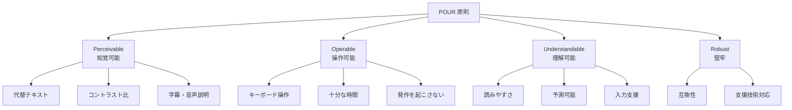

# アクセシビリティ基礎

## 目次

- [アクセシビリティ（a11y）とは](#アクセシビリティa11yとは)
- [なぜ EC サイトでアクセシビリティが重要か](#なぜ-ec-サイトでアクセシビリティが重要か)
- [WCAG 2.1 の基本原則（POUR）](#wcag-21-の基本原則pour)
  - [1. Perceivable（知覚可能）](#1-perceivable知覚可能)
  - [2. Operable（操作可能）](#2-operable操作可能)
  - [3. Understandable（理解可能）](#3-understandable理解可能)
  - [4. Robust（堅牢）](#4-robust堅牢)
- [ARIA 属性](#aria-属性)
  - [よく使う ARIA 属性](#よく使う-aria-属性)
  - [ARIA の第一原則](#aria-の第一原則)
- [キーボードナビゲーション](#キーボードナビゲーション)
  - [基本操作](#基本操作)
  - [フォーカス管理](#フォーカス管理)
  - [フォーカストラップ](#フォーカストラップ)
- [EC サイトでの実践例](#ec-サイトでの実践例)
  - [1. 商品画像の代替テキスト](#1-商品画像の代替テキスト)
  - [2. フォームのラベル](#2-フォームのラベル)
  - [3. カートへの追加通知](#3-カートへの追加通知)
  - [4. 価格表示](#4-価格表示)
  - [5. 商品フィルター](#5-商品フィルター)
- [Storybook addon-a11y](#storybook-addon-a11y)
  - [セットアップ](#セットアップ)
  - [使用方法](#使用方法)
- [チェックリスト](#チェックリスト)
  - [画像](#画像)
  - [フォーム](#フォーム)
  - [キーボード](#キーボード)
  - [色とコントラスト](#色とコントラスト)
  - [動的コンテンツ](#動的コンテンツ)
- [まとめ](#まとめ)
- [次のステップ](#次のステップ)

## アクセシビリティ（a11y）とは

アクセシビリティとは、**障害の有無にかかわらず、すべての人が Web サイトを利用できるようにすること**です。
「a11y」は「accessibility」の略で、先頭の a と末尾の y の間に 11 文字あることから名付けられました。

***

## なぜ EC サイトでアクセシビリティが重要か

| 理由          | 説明                        |
| ----------- | ------------------------- |
| **ユーザー層拡大** | 障害を持つ方も顧客になりうる            |
| **法的要件**    | 一部の国では法律で義務化（日本も合理的配慮が必要） |
| **SEO 向上**  | 適切なマークアップは検索エンジンにも有利      |
| **UX 向上**   | キーボード操作対応はパワーユーザーにも便利     |
| **ブランド価値**  | 社会的責任を果たす企業として信頼を得られる     |

***

## WCAG 2.1 の基本原則（POUR）

Web Content Accessibility Guidelines (WCAG) 2.1 は、4 つの原則に基づいています。



### 1. Perceivable（知覚可能）

情報と UI コンポーネントは、ユーザーが知覚できる方法で提示します。

- 画像には代替テキスト（`alt` 属性）を設定
- 動画には字幕を提供
- 色だけで情報を伝えない
- 十分なコントラスト比（4.5:1 以上）

### 2. Operable（操作可能）

UI コンポーネントとナビゲーションは操作可能である必要があります。

- キーボードだけで全機能を操作可能
- フォーカスが見える
- スキップリンクを提供
- 時間制限がある場合は調整可能に

### 3. Understandable（理解可能）

情報と UI の操作を理解できるようにします。

- エラーメッセージは具体的に
- 入力形式を事前に説明
- ナビゲーションは一貫性を持たせる

### 4. Robust（堅牢）

コンテンツは様々なユーザーエージェント（ブラウザ、支援技術）で解釈できる必要があります。

- 有効な HTML を使用
- ARIA 属性を適切に使用
- 支援技術との互換性を確保

***

## ARIA 属性

ARIA (Accessible Rich Internet Applications) は、HTML の意味を補完するための属性です。

### よく使う ARIA 属性

| 属性                 | 用途              | 例                                  |
| ------------------ | --------------- | ---------------------------------- |
| `aria-label`       | 要素にラベルを付ける      | `aria-label="検索"`                  |
| `aria-labelledby`  | 別要素の ID でラベルを参照 | `aria-labelledby="title"`          |
| `aria-describedby` | 追加の説明を参照        | `aria-describedby="error-message"` |
| `aria-hidden`      | 支援技術から隠す        | `aria-hidden="true"`               |
| `aria-expanded`    | 展開/折りたたみ状態      | `aria-expanded="true"`             |
| `aria-selected`    | 選択状態            | `aria-selected="true"`             |
| `aria-disabled`    | 無効状態            | `aria-disabled="true"`             |
| `aria-live`        | 動的コンテンツの更新を通知   | `aria-live="polite"`               |
| `aria-busy`        | 読み込み中           | `aria-busy="true"`                 |
| `role`             | 要素の役割を明示        | `role="dialog"`                    |

### ARIA の第一原則

> 「ネイティブ HTML 要素で実現できるなら、ARIA を使わない」

```tsx
// 悪い例: ARIA を過剰に使用
<div role="button" tabIndex={0} onClick={handleClick}>
  クリック
</div>

// 良い例: ネイティブ要素を使用
<button onClick={handleClick}>
  クリック
</button>
```

***

## キーボードナビゲーション

### 基本操作

| キー          | 操作              |
| ----------- | --------------- |
| `Tab`       | 次のフォーカス可能な要素へ移動 |
| `Shift+Tab` | 前のフォーカス可能な要素へ移動 |
| `Enter`     | ボタンやリンクの実行      |
| `Space`     | ボタンの実行、チェックボックス |
| `Escape`    | モーダルを閉じる        |
| `↑` `↓`     | リスト内の移動         |

### フォーカス管理

```typescript
// packages/ui/src/organisms/Dialog/Dialog.tsx
"use client";

import { useEffect, useRef, type ReactNode } from "react";
import { createPortal } from "react-dom";

interface DialogProps {
  isOpen: boolean;
  onClose: () => void;
  children: ReactNode;
}

export function Dialog({ isOpen, onClose, children }: DialogProps): JSX.Element | null {
  const dialogRef = useRef<HTMLDivElement>(null);
  const previousActiveElement = useRef<HTMLElement | null>(null);

  useEffect(() => {
    if (isOpen) {
      // 開く前のフォーカス位置を保存
      previousActiveElement.current = document.activeElement as HTMLElement;
      // ダイアログにフォーカスを移動
      dialogRef.current?.focus();
    } else {
      // 閉じたら元の位置にフォーカスを戻す
      previousActiveElement.current?.focus();
    }
  }, [isOpen]);

  useEffect(() => {
    const handleKeyDown = (event: KeyboardEvent): void => {
      if (event.key === "Escape") {
        onClose();
      }
    };

    if (isOpen) {
      document.addEventListener("keydown", handleKeyDown);
      return () => document.removeEventListener("keydown", handleKeyDown);
    }
  }, [isOpen, onClose]);

  if (!isOpen) {
    return null;
  }

  return createPortal(
    <div
      className="fixed inset-0 z-50 flex items-center justify-center"
      role="dialog"
      aria-modal="true"
    >
      <div
        className="fixed inset-0 bg-black/50"
        aria-hidden="true"
        onClick={onClose}
      />
      <div
        ref={dialogRef}
        className="relative z-10 rounded-lg bg-white p-6"
        tabIndex={-1}
      >
        {children}
      </div>
    </div>,
    document.body
  );
}
```

### フォーカストラップ

モーダルが開いている間、フォーカスをモーダル内に閉じ込めます。

```typescript
// packages/shared/src/hooks/useFocusTrap.ts
import { useEffect, useRef, type RefObject } from "react";

export function useFocusTrap<T extends HTMLElement>(isActive: boolean): RefObject<T> {
  const containerRef = useRef<T>(null);

  useEffect(() => {
    if (!isActive || !containerRef.current) return;

    const container = containerRef.current;
    const focusableElements = container.querySelectorAll<HTMLElement>(
      'button, [href], input, select, textarea, [tabindex]:not([tabindex="-1"])'
    );
    const firstElement = focusableElements[0];
    const lastElement = focusableElements[focusableElements.length - 1];

    const handleKeyDown = (event: KeyboardEvent): void => {
      if (event.key !== "Tab") return;

      if (event.shiftKey) {
        // Shift+Tab: 最初の要素で前に戻ろうとしたら最後へ
        if (document.activeElement === firstElement) {
          event.preventDefault();
          lastElement?.focus();
        }
      } else {
        // Tab: 最後の要素で次へ進もうとしたら最初へ
        if (document.activeElement === lastElement) {
          event.preventDefault();
          firstElement?.focus();
        }
      }
    };

    container.addEventListener("keydown", handleKeyDown);
    return () => container.removeEventListener("keydown", handleKeyDown);
  }, [isActive]);

  return containerRef;
}
```

***

## EC サイトでの実践例

### 1. 商品画像の代替テキスト

```tsx
// 良い例: 具体的な代替テキスト
<Image
  src={product.imageUrl}
  alt={`${product.name} - ${product.color}カラー`}
  width={400}
  height={400}
/>

// 悪い例: 意味のない代替テキスト
<Image
  src={product.imageUrl}
  alt="商品画像"
  width={400}
  height={400}
/>

// 装飾的な画像は空の alt
<Image
  src="/decorative-pattern.png"
  alt=""
  aria-hidden="true"
/>
```

### 2. フォームのラベル

```tsx
// 良い例: ラベルと入力欄を関連付け
<div>
  <Label htmlFor="email">メールアドレス</Label>
  <Input
    id="email"
    type="email"
    aria-describedby="email-hint email-error"
  />
  <p
    id="email-hint"
    className="text-muted-foreground text-sm"
  >
    注文確認メールをお送りします
  </p>
  {error && (
    <p
      id="email-error"
      className="text-destructive text-sm"
      role="alert"
    >
      {error}
    </p>
  )}
</div>
```

### 3. カートへの追加通知

```tsx
function AddToCartButton({ product }: { product: Product }): JSX.Element {
  const { addItem } = useCart();
  const [message, setMessage] = useState("");

  const handleClick = (): void => {
    addItem(product.id);
    setMessage(`${product.name} をカートに追加しました`);
    // 3秒後にメッセージをクリア
    setTimeout(() => setMessage(""), 3000);
  };

  return (
    <>
      <Button onClick={handleClick}>カートに追加</Button>
      {/* スクリーンリーダーへの通知 */}
      <div
        role="status"
        aria-live="polite"
        className="sr-only"
      >
        {message}
      </div>
    </>
  );
}
```

### 4. 価格表示

```tsx
function PriceDisplay({
  price,
  originalPrice,
}: {
  price: number;
  originalPrice?: number;
}): JSX.Element {
  const hasDiscount = originalPrice !== undefined && originalPrice > price;
  const discountPercent = hasDiscount ? Math.round((1 - price / originalPrice) * 100) : 0;

  return (
    <div className="flex items-center gap-2">
      <span className="text-lg font-bold">
        <span className="sr-only">現在の価格:</span>¥{price.toLocaleString()}
      </span>
      {hasDiscount && (
        <>
          <span className="text-muted-foreground text-sm line-through">
            <span className="sr-only">元の価格:</span>¥{originalPrice.toLocaleString()}
          </span>
          <Badge variant="destructive">
            <span className="sr-only">割引率:</span>
            {discountPercent}%OFF
          </Badge>
        </>
      )}
    </div>
  );
}
```

### 5. 商品フィルター

```tsx
function FilterCheckbox({
  label,
  checked,
  count,
  onChange,
}: {
  label: string;
  checked: boolean;
  count: number;
  onChange: (checked: boolean) => void;
}): JSX.Element {
  const id = `filter-${label.toLowerCase().replace(/\s/g, "-")}`;

  return (
    <div className="flex items-center gap-2">
      <Checkbox
        id={id}
        checked={checked}
        onCheckedChange={onChange}
        aria-describedby={`${id}-count`}
      />
      <Label htmlFor={id}>{label}</Label>
      <span
        id={`${id}-count`}
        className="text-muted-foreground text-sm"
        aria-label={`${count}件の商品`}
      >
        ({count})
      </span>
    </div>
  );
}
```

***

## Storybook addon-a11y

Storybook の addon-a11y を使うと、コンポーネント単位でアクセシビリティをチェックできます。

### セットアップ

```bash
# すでにインストール済みの場合は不要
pnpm add -D @storybook/addon-a11y
```

```typescript
// .storybook/main.ts
import type { StorybookConfig } from "@storybook/nextjs-vite";

const config: StorybookConfig = {
  // ...
  addons: [
    "@storybook/addon-a11y",
    // 他のアドオン
  ],
};

export default config;
```

### 使用方法

Storybook を起動すると、各コンポーネントの「Accessibility」タブで問題を確認できます。

```tsx
// stories/ProductCard.stories.tsx
import type { Meta, StoryObj } from "@storybook/react";
import { ProductCard } from "@repo/ui/organisms/ProductCard";

const meta: Meta<typeof ProductCard> = {
  component: ProductCard,
  parameters: {
    a11y: {
      // axe のルールをカスタマイズ
      config: {
        rules: [
          { id: "color-contrast", enabled: true },
          { id: "image-alt", enabled: true },
        ],
      },
    },
  },
};

export default meta;
type Story = StoryObj<typeof ProductCard>;

export const Default: Story = {
  args: {
    id: "1",
    name: "サンプル商品",
    price: 1000,
    imageUrl: "/sample.jpg",
  },
};
```

***

## チェックリスト

EC サイトのアクセシビリティを確認するためのチェックリストです。

### 画像

- [ ] すべての商品画像に意味のある `alt` テキストがある
- [ ] 装飾的な画像は `alt=""` と `aria-hidden="true"`

### フォーム

- [ ] すべての入力欄に `<label>` が関連付けられている
- [ ] エラーメッセージは `role="alert"` で通知される
- [ ] 必須項目は `aria-required="true"` でマーク

### キーボード

- [ ] Tab キーですべての機能にアクセスできる
- [ ] フォーカスが視覚的にわかる
- [ ] Escape でモーダルが閉じる
- [ ] フォーカストラップがモーダルに実装されている

### 色とコントラスト

- [ ] 文字のコントラスト比は 4.5:1 以上
- [ ] 色だけで情報を伝えていない（在庫状態など）

### 動的コンテンツ

- [ ] カート追加などの操作結果が `aria-live` で通知される
- [ ] ローディング状態が `aria-busy` でマークされている

***

## まとめ

- アクセシビリティは**すべてのユーザーが使えるようにする**こと
- **WCAG 2.1 の POUR 原則**を基準に設計
- **ネイティブ HTML 要素を優先**し、意味を補完する場合のみ ARIA を使用
- **キーボード操作**と**フォーカス管理**は必須
- **Storybook addon-a11y** で継続的にチェック

***

## 次のステップ

[演習 1: デザインシステム構築](./exercises/01-design-system.md) では、ここまで学んだパターンを組み合わせて、EC サイト向けのデザインシステムを構築します。
