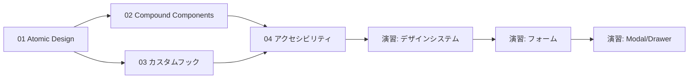
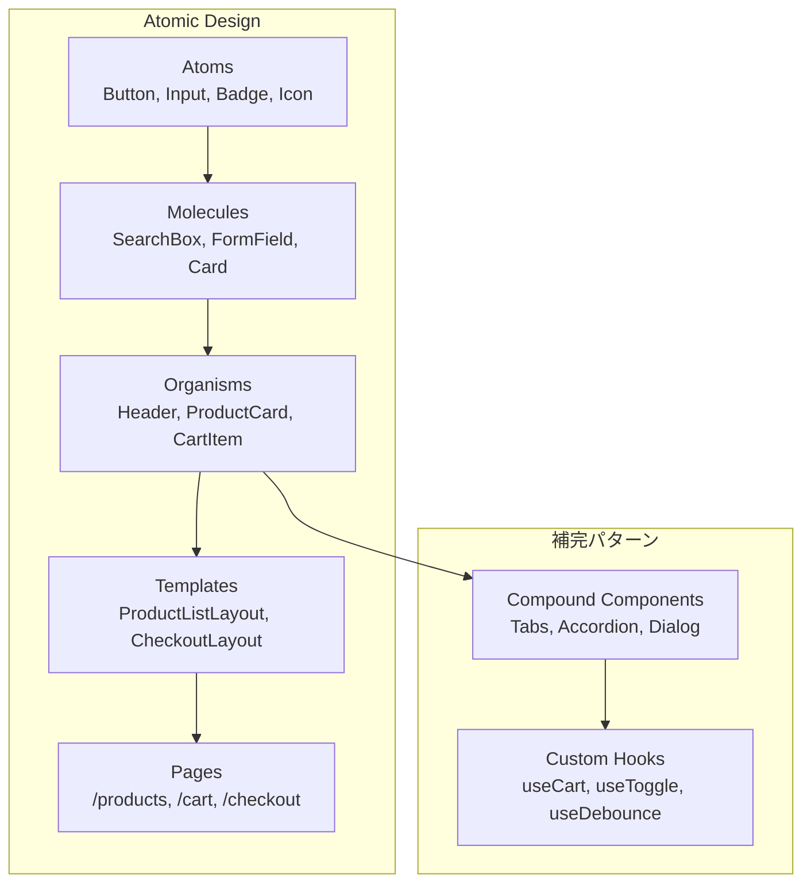

# Phase 3: コンポーネント設計パターン

## 目次

- [概要](#概要)
- [難易度](#難易度)
- [所要時間目安](#所要時間目安)
- [前提知識](#前提知識)
- [学習目標](#学習目標)
- [目次](#目次-1)
  - [学習フロー](#学習フロー)
- [演習問題](#演習問題)
- [コンポーネント階層の全体像](#コンポーネント階層の全体像)
- [作業場所](#作業場所)
- [使用する shadcn/ui コンポーネント](#使用する-shadcnui-コンポーネント)
- [関連する EC サイト機能](#関連する-ec-サイト機能)
- [推奨学習リソース](#推奨学習リソース)
  - [公式ドキュメント](#公式ドキュメント)
  - [参考記事・書籍](#参考記事書籍)
  - [Storybook Addons](#storybook-addons)
- [自己チェックリスト](#自己チェックリスト)
  - [Atomic Design](#atomic-design)
  - [Compound Components](#compound-components)
  - [カスタムフック](#カスタムフック)
  - [アクセシビリティ](#アクセシビリティ)
- [次のフェーズ](#次のフェーズ)

## 概要

再利用可能で保守性の高いコンポーネント設計を習得するフェーズです。
Atomic Design、Compound Components、カスタムフックなどのパターンを学び、ECサイトで使えるデザインシステムを構築します。

***

## 難易度

難易度: 3/5（中）

コンポーネント設計の概念理解と実践が中心です。抽象的な考え方が多いため、Phase 1・2のReact/Next.js基礎をしっかり理解していることが重要です。

***

## 所要時間目安

約8〜12時間です。

***

## 前提知識

- Phase 1（React基礎 + Storybook入門）を完了していること
- Phase 2（Next.js App Router基礎）を完了していること
- Reactコンポーネントの基本（props, state, hooks）
- TypeScriptの基本的な型定義

***

## 学習目標

このフェーズを完了すると、以下ができるようになります。

- [ ] Atomic Designの5つの階層を説明できる
- [ ] ECサイトのコンポーネントをAtomic Designの各階層に分類できる
- [ ] Compound Componentsパターンを使って柔軟なAPIを設計できる
- [ ] カスタムフックを作成してロジックを再利用できる
- [ ] アクセシビリティ（a11y）の基本原則を説明できる
- [ ] Storybook addon-a11yでアクセシビリティをチェックできる
- [ ] デザインシステムの基礎を構築できる
- [ ] フォームコンポーネント群を実装できる
- [ ] Modal/DrawerをCompound Componentsパターンで実装できる

***

## 目次

1. [Atomic Design パターン](./01-atomic-design.md)
2. [Compound Components](./02-compound-components.md)
3. [カスタムフックパターン](./03-custom-hooks.md)
4. [アクセシビリティ基礎](./04-accessibility.md)

### 学習フロー



***

## 演習問題

- [演習 1: デザインシステム構築](./exercises/01-design-system.md)
- [演習 2: フォームコンポーネント群](./exercises/02-form-components.md)
- [演習 3: Modal/Drawer 実装](./exercises/03-modal-drawer.md)

***

## コンポーネント階層の全体像



***

## 作業場所

```text
packages/
├── ui/                      # 共有 UI コンポーネント
│   └── src/
│       ├── atoms/           # Atoms（Button, Input など）
│       ├── molecules/       # Molecules（SearchBox など）
│       ├── organisms/       # Organisms（Header など）
│       └── index.ts
│
apps/
├── web/                     # メイン EC サイト
│   └── app/                 # Pages（ルーティング）
└── storybook/               # コンポーネントカタログ
    └── stories/
```

***

## 使用する shadcn/ui コンポーネント

| コンポーネント    | 分類        | EC サイトでの用途      |
| ---------- | --------- | --------------- |
| Button     | Atoms     | CTA、フォーム送信      |
| Input      | Atoms     | 検索、フォーム入力       |
| Label      | Atoms     | フォームラベル         |
| Badge      | Atoms     | ステータス表示、タグ      |
| Card       | Molecules | 商品カード           |
| Dialog     | Organisms | 確認ダイアログ         |
| Sheet      | Organisms | モバイルメニュー、Drawer |
| Tabs       | Organisms | 商品詳細のタブ切り替え     |
| Accordion  | Organisms | FAQ、フィルター       |
| Form       | Molecules | フォーム全般          |
| Select     | Atoms     | ドロップダウン選択       |
| Checkbox   | Atoms     | フィルター、同意チェック    |
| RadioGroup | Molecules | 配送方法選択          |

***

## 関連する EC サイト機能

このフェーズで実装するコンポーネントは、以下のEC機能で活用されます。

| EC 機能     | 使用コンポーネント                               |
| --------- | --------------------------------------- |
| 商品一覧      | ProductCard, Pagination, FilterPanel    |
| 商品詳細      | Tabs, ImageGallery, AddToCartButton     |
| ショッピングカート | CartItem, QuantitySelector, CartSummary |
| 検索        | SearchBox, SearchResults, FilterChips   |
| フォーム      | Input, Select, Checkbox, FormField      |
| モーダル      | Dialog, ConfirmDialog, QuickView        |
| ナビゲーション   | Header, MobileMenu (Sheet), Footer      |

***

## 推奨学習リソース

### 公式ドキュメント

- [shadcn/ui ドキュメント](https://ui.shadcn.com/)
- [Radix UI Primitives](https://www.radix-ui.com/primitives)
- [React パターン](https://react.dev/learn/reusing-logic-with-custom-hooks)
- [WAI-ARIA 仕様](https://www.w3.org/WAI/ARIA/apg/)

### 参考記事・書籍

- [Atomic Design by Brad Frost](https://atomicdesign.bradfrost.com/)
- [Storybook Design Systems](https://storybook.js.org/tutorials/design-systems-for-developers/)
- [React Patterns](https://reactpatterns.com/)

### Storybook Addons

- [addon-a11y](https://storybook.js.org/addons/@storybook/addon-a11y) - アクセシビリティチェック
- [addon-designs](https://storybook.js.org/addons/@storybook/addon-designs) - Figma連携

***

## 自己チェックリスト

Phase 3を完了する前に、以下を確認してください。

### Atomic Design

- [ ] Atoms・Molecules・Organisms・Templates・Pagesの違いを説明できる
- [ ] ECサイトのコンポーネントをAtomic Designの各階層に分類できる

### Compound Components

- [ ] Compound Componentsパターンの利点を説明できる
- [ ] Contextを使った状態共有を実装できる
- [ ] shadcn/uiのTabs, Accordionを活用できる

### カスタムフック

- [ ] `use` プレフィックスの命名規則を守っている
- [ ] 再利用可能なカスタムフックを作成できる
- [ ] フックのテストを書ける

### アクセシビリティ

- [ ] WCAG 2.1の基本原則（POUR）を説明できる
- [ ] ARIA属性 (aria-label、aria-describedbyなど) を使用できる
- [ ] キーボードナビゲーションに対応できる
- [ ] Storybook addon-a11yでチェックを実行できる

***

## 次のフェーズ

Phase 3を完了したら、[Phase 4: 状態管理（Jotai）](../phase-04-state-management/README.md) に進みましょう。
