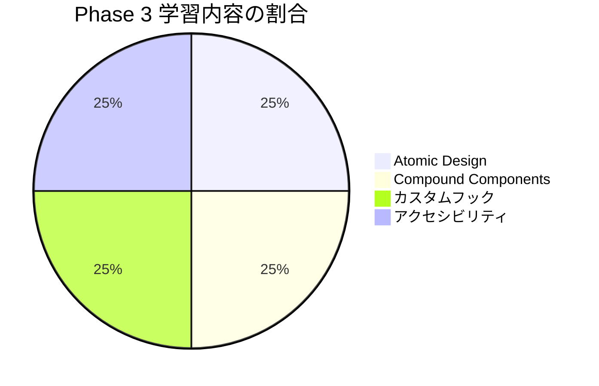

# Phase 3: 自己チェックリスト

## 目次

- [学習領域の概要](#学習領域の概要)
- [Atomic Design 理解度チェック](#atomic-design-理解度チェック)
  - [理解度チェック](#理解度チェック)
  - [確認質問](#確認質問)
- [Compound Components 理解度チェック](#compound-components-理解度チェック)
  - [理解度チェック](#理解度チェック-1)
  - [確認質問](#確認質問-1)
- [カスタムフック 理解度チェック](#カスタムフック-理解度チェック)
  - [理解度チェック](#理解度チェック-2)
  - [確認質問](#確認質問-2)
- [アクセシビリティ 理解度チェック](#アクセシビリティ-理解度チェック)
  - [理解度チェック](#理解度チェック-3)
  - [確認質問](#確認質問-3)
- [実践確認](#実践確認)
  - [実装確認](#実装確認)
- [総合評価](#総合評価)
- [次のステップ](#次のステップ)

## 学習領域の概要



***

## Atomic Design 理解度チェック

### 理解度チェック

- [ ] Atoms・Molecules・Organisms・Templates・Pagesの5階層を説明できる
- [ ] ECサイトのコンポーネント（Button, ProductCard, Headerなど）をAtomic Designの階層に分類できる
- [ ] shadcn/uiコンポーネントがどの階層に属するか判断できる
- [ ] packages/uiのディレクトリ構成を設計できる

### 確認質問

1. **Atoms と Molecules の違いは？**

   AtomsはButton, Input, Iconなど、これ以上分解できない最小単位のUI要素である。MoleculesはFormField (Label + Input + Error) のように、複数のAtomsを組み合わせて単一の機能を持つコンポーネントである。

2. **ProductCard は Organisms に分類される理由は？**

   ProductCardはImage, Title, Price, Buttonなど複数のMoleculesやAtomsを組み合わせた、独立して機能するUIブロックだからである。単体でも意味を持ち、さまざまなページで再利用できる。

3. **Templates と Pages の違いは？**

   Templatesはページのワイヤーフレーム（構造）を定義し、実際のデータは持たない。PagesはTemplatesに実データを流し込んだ最終的なページで、Next.jsではapp/ ディレクトリ内のpage.tsxがこれに該当する。

***

## Compound Components 理解度チェック

### 理解度チェック

- [ ] Compound Componentsパターンの目的と利点を説明できる
- [ ] React Contextを使った状態共有を実装できる
- [ ] Tabs, Accordion, DialogをCompound Componentsパターンで使用できる
- [ ] Props地獄を避ける設計ができる

### 確認質問

1. **Compound Components パターンを使う利点は何か**

   **回答例**:

   - (1) 柔軟性: 子コンポーネントの順序や構成を自由に変更できる
   - (2) 可読性: JSXの構造がHTMLのように直感的
   - (3) カスタマイズ性: 各子コンポーネントに個別のスタイルを適用できる
   - (4) 状態の隠蔽: 内部状態がContextで管理され、利用者は意識しない

2. **Context を使った状態共有の実装手順は？**

   **回答例**:

   - (1) createContextでContextを作成する
   - (2) Providerコンポーネントで値を提供する
   - (3) 子コンポーネントでuseContextを使って値を取得する
   - (4) カスタムフック (useXxxContext) でエラーハンドリングを追加する

3. **shadcn/ui で Compound Components パターンを採用しているコンポーネントは？**

   **回答例**:

   - Accordion (Root・Item・Trigger・Content)
   - Tabs (Root・List・Trigger・Content)
   - Dialog (Root・Trigger・Portal・Content・Close)
   - DropdownMenuなど

***

## カスタムフック 理解度チェック

### 理解度チェック

- [ ] `use` プレフィックスの命名規則を理解している
- [ ] useState, useEffect, useCallbackを組み合わせてカスタムフックを作成できる
- [ ] useToggle, useLocalStorage, useDebounceを実装できる
- [ ] ECサイト向けフック (useCart, useFavorites) を設計できる
- [ ] renderHookを使ってカスタムフックをテストできる

### 確認質問

1. **カスタムフックの命名規則は？**

   **回答例**: 必ず `use` プレフィックスで始める。例: useCart, useToggle, useDebounce。これによりReactがフックとして認識し、フックのルール（条件分岐内で呼ばないなど）を適用できる。

2. **useLocalStorage の実装で注意すべき点は？**

   **回答例**:

   - (1) SSR対応: サーバーサイドではwindowが存在しないため初期値を返す
   - (2) useEffect内でのみlocalStorageにアクセスする
   - (3) JSON.parse/stringifyでシリアライズする
   - (4) エラーハンドリングを行う

3. **カスタムフックのテストはどう書くか**

   **回答例**: `@testing-library/react` の `renderHook` を使用。`act` でステート更新をラップし、`result.current` で現在の値を取得。例: `const { result } = renderHook(() => useToggle())`

***

## アクセシビリティ 理解度チェック

### 理解度チェック

- [ ] WCAG 2.1のPOUR原則を説明できる
- [ ] ARIA属性 (aria-label, aria-describedby, aria-expandedなど) を正しく使用できる
- [ ] キーボードナビゲーション (Tab, Escape, Enter) に対応できる
- [ ] フォーカストラップを実装できる
- [ ] Storybook addon-a11yでアクセシビリティをチェックできる

### 確認質問

1. **POUR 原則とは何か**

   **回答例**: WCAG 2.1の4つの原則である。

   - Perceivable (知覚可能): 情報を認識できる
   - Operable (操作可能): キーボードで操作できる
   - Understandable (理解可能): 内容を理解できる
   - Robust (堅牢): さまざまな技術で解釈できる

2. **aria-describedby と aria-labelledby の違いは？**

   **回答例**: aria-labelledbyは要素の「名前」を指定（フォーム入力のラベルなど）。aria-describedbyは要素の「追加説明」を指定（エラーメッセージ、ヒントなど）。どちらも他の要素のIDを参照する。

3. **モーダルのフォーカストラップとは？**

   **回答例**: モーダルが開いている間、Tabキーでのフォーカス移動をモーダル内に閉じ込めること。最後の要素でTabを押すと最初の要素に戻り、最初の要素でShift+Tabを押すと最後の要素に移動する。

***

## 実践確認

以下のコマンドが成功することを確認してください。

```bash
# packages/ui のビルド
cd packages/ui && pnpm build

# Storybook の起動
pnpm storybook

# addon-a11y でのアクセシビリティチェック
# Storybook の Accessibility タブで確認
```

### 実装確認

- [ ] packages/ui/src/atoms/ にButton, Input, Badgeなどが存在する
- [ ] packages/ui/src/molecules/ にFormField, SearchBoxなどが存在する
- [ ] packages/ui/src/organisms/ にDialog, Drawer, Accordionなどが存在する
- [ ] Storybookで各コンポーネントのストーリーが表示される
- [ ] addon-a11yでエラーが出ていない

***

## 総合評価

| 達成率     | 評価          | 次のアクション                  |
| ------- | ----------- | ------------------------ |
| 90-100% | Phase 4 へ進む | 次のフェーズに進みましょう            |
| 70-89%  | ほぼ完了        | 未達成項目を復習してから次へ           |
| 50-69%  | 追加学習が必要     | 該当セクションのドキュメントを再読        |
| 50% 未満  | 基礎から復習      | Phase 1, 2 の理解が不足している可能性 |

***

## 次のステップ

Phase 3を完了したら、[Phase 4: 状態管理（Jotai）](../phase-04-state-management/README.md) に進みましょう。

Phase 4では、以下の内容を学びます。

- JotaiのAtomの基本
- 派生Atomと永続化
- ショッピングカート機能の実装
- お気に入り機能の実装
