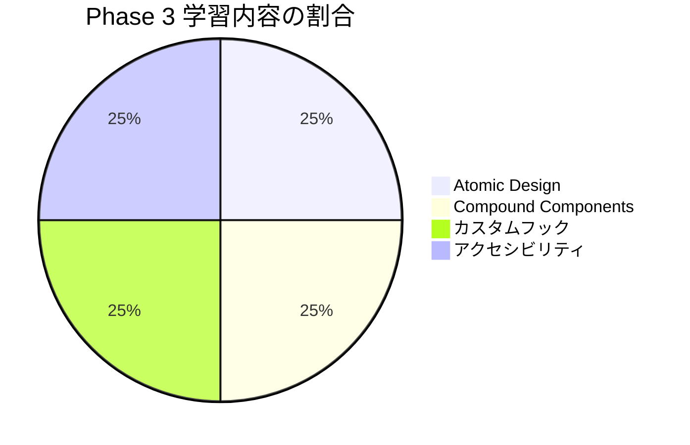

# Phase 3: 自己チェックリスト

## 目次

- [学習領域の概要](#学習領域の概要)
- [Atomic Design 理解度チェック](#atomic-design-理解度チェック)
  - [理解度チェック](#理解度チェック)
  - [確認質問](#確認質問)
- [Compound Components 理解度チェック](#compound-components-理解度チェック)
  - [理解度チェック](#理解度チェック-1)
  - [確認質問](#確認質問-1)
- [カスタムフック 理解度チェック](#カスタムフック-理解度チェック)
  - [理解度チェック](#理解度チェック-2)
  - [確認質問](#確認質問-2)
- [アクセシビリティ 理解度チェック](#アクセシビリティ-理解度チェック)
  - [理解度チェック](#理解度チェック-3)
  - [確認質問](#確認質問-3)
- [実践確認](#実践確認)
  - [実装確認](#実装確認)
- [総合評価](#総合評価)
- [次のステップ](#次のステップ)

## 学習領域の概要



---

## Atomic Design 理解度チェック

### 理解度チェック

- [ ] Atoms・Molecules・Organisms・Templates・Pages の 5 階層を説明できる
- [ ] EC サイトのコンポーネント（Button, ProductCard, Header など）を Atomic Design の階層に分類できる
- [ ] shadcn/ui コンポーネントがどの階層に属するか判断できる
- [ ] packages/ui のディレクトリ構成を設計できる

### 確認質問

1. **Atoms と Molecules の違いは？**

   Atoms は Button, Input, Icon など、これ以上分解できない最小単位の UI 要素である。Molecules は FormField (Label + Input + Error) のように、複数の Atoms を組み合わせて単一の機能を持つコンポーネントである。

2. **ProductCard は Organisms に分類される理由は？**

   ProductCard は Image, Title, Price, Button など複数の Molecules や Atoms を組み合わせた、独立して機能する UI ブロックだからである。単体でも意味を持ち、様々なページで再利用できる。

3. **Templates と Pages の違いは？**

   Templates はページのワイヤーフレーム（構造）を定義し、実際のデータは持たない。Pages は Templates に実データを流し込んだ最終的なページで、Next.js では app/ ディレクトリ内の page.tsx がこれに該当する。

---

## Compound Components 理解度チェック

### 理解度チェック

- [ ] Compound Components パターンの目的と利点を説明できる
- [ ] React Context を使った状態共有を実装できる
- [ ] Tabs, Accordion, Dialog を Compound Components パターンで使用できる
- [ ] Props 地獄を避ける設計ができる

### 確認質問

1. **Compound Components パターンを使う利点は何か**

   **回答例**:
   - (1) 柔軟性: 子コンポーネントの順序や構成を自由に変更できる
   - (2) 可読性: JSX の構造が HTML のように直感的
   - (3) カスタマイズ性: 各子コンポーネントに個別のスタイルを適用できる
   - (4) 状態の隠蔽: 内部状態が Context で管理され、利用者は意識しない

2. **Context を使った状態共有の実装手順は？**

   **回答例**:
   - (1) createContext で Context を作成する
   - (2) Provider コンポーネントで値を提供する
   - (3) 子コンポーネントで useContext を使って値を取得する
   - (4) カスタムフック (useXxxContext) でエラーハンドリングを追加する

3. **shadcn/ui で Compound Components パターンを採用しているコンポーネントは？**

   **回答例**:
   - Accordion (Root・Item・Trigger・Content)
   - Tabs (Root・List・Trigger・Content)
   - Dialog (Root・Trigger・Portal・Content・Close)
   - DropdownMenu など

---

## カスタムフック 理解度チェック

### 理解度チェック

- [ ] `use` プレフィックスの命名規則を理解している
- [ ] useState, useEffect, useCallback を組み合わせてカスタムフックを作成できる
- [ ] useToggle, useLocalStorage, useDebounce を実装できる
- [ ] EC サイト向けフック (useCart, useFavorites) を設計できる
- [ ] renderHook を使ってカスタムフックをテストできる

### 確認質問

1. **カスタムフックの命名規則は？**

   **回答例**: 必ず `use` プレフィックスで始める。例: useCart, useToggle, useDebounce。これにより React がフックとして認識し、フックのルール（条件分岐内で呼ばない等）を適用できる。

2. **useLocalStorage の実装で注意すべき点は？**

   **回答例**:
   - (1) SSR 対応: サーバーサイドでは window が存在しないため初期値を返す
   - (2) useEffect 内でのみ localStorage にアクセスする
   - (3) JSON.parse/stringify でシリアライズする
   - (4) エラーハンドリングを行う

3. **カスタムフックのテストはどう書くか**

   **回答例**: `@testing-library/react` の `renderHook` を使用。`act` でステート更新をラップし、`result.current` で現在の値を取得。例: `const { result } = renderHook(() => useToggle())`

---

## アクセシビリティ 理解度チェック

### 理解度チェック

- [ ] WCAG 2.1 の POUR 原則を説明できる
- [ ] ARIA 属性 (aria-label, aria-describedby, aria-expanded 等) を正しく使用できる
- [ ] キーボードナビゲーション (Tab, Escape, Enter) に対応できる
- [ ] フォーカストラップを実装できる
- [ ] Storybook addon-a11y でアクセシビリティをチェックできる

### 確認質問

1. **POUR 原則とは何か**

   **回答例**: WCAG 2.1 の 4 つの原則である。
   - Perceivable (知覚可能): 情報を認識できる
   - Operable (操作可能): キーボードで操作できる
   - Understandable (理解可能): 内容を理解できる
   - Robust (堅牢): 様々な技術で解釈できる

2. **aria-describedby と aria-labelledby の違いは？**

   **回答例**: aria-labelledby は要素の「名前」を指定（フォーム入力のラベル等）。aria-describedby は要素の「追加説明」を指定（エラーメッセージ、ヒント等）。どちらも他の要素の ID を参照する。

3. **モーダルのフォーカストラップとは？**

   **回答例**: モーダルが開いている間、Tab キーでのフォーカス移動をモーダル内に閉じ込めること。最後の要素で Tab を押すと最初の要素に戻り、最初の要素で Shift+Tab を押すと最後の要素に移動する。

---

## 実践確認

以下のコマンドが成功することを確認してください。

```bash
# packages/ui のビルド
cd packages/ui && pnpm build

# Storybook の起動
pnpm storybook

# addon-a11y でのアクセシビリティチェック
# Storybook の Accessibility タブで確認
```

### 実装確認

- [ ] packages/ui/src/atoms/ に Button, Input, Badge などが存在する
- [ ] packages/ui/src/molecules/ に FormField, SearchBox などが存在する
- [ ] packages/ui/src/organisms/ に Dialog, Drawer, Accordion などが存在する
- [ ] Storybook で各コンポーネントのストーリーが表示される
- [ ] addon-a11y でエラーが出ていない

---

## 総合評価

| 達成率   | 評価           | 次のアクション                        |
| -------- | -------------- | ------------------------------------- |
| 90-100%  | Phase 4 へ進む | 次のフェーズに進みましょう            |
| 70-89%   | ほぼ完了       | 未達成項目を復習してから次へ          |
| 50-69%   | 追加学習が必要 | 該当セクションのドキュメントを再読    |
| 50% 未満 | 基礎から復習   | Phase 1, 2 の理解が不足している可能性 |

---

## 次のステップ

Phase 3 を完了したら、[Phase 4: 状態管理（Jotai）](../phase-04-state-management/README.md) に進みましょう。

Phase 4 では、以下の内容を学びます。

- Jotai の Atom の基本
- 派生 Atom と永続化
- ショッピングカート機能の実装
- お気に入り機能の実装
