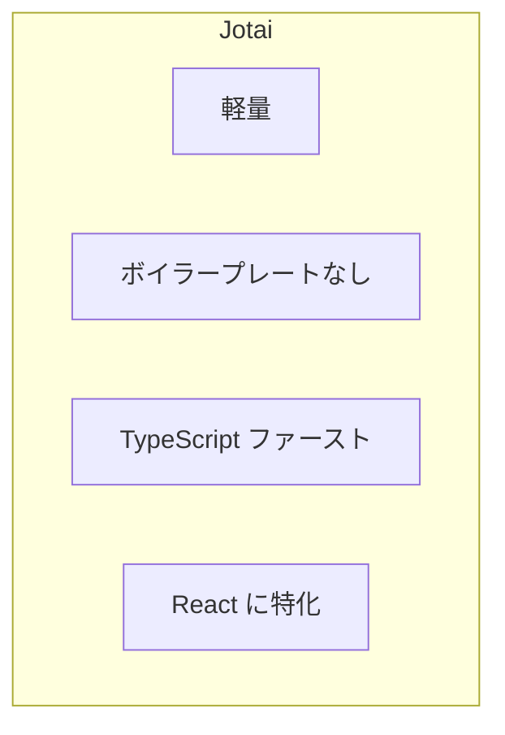
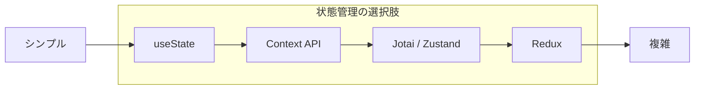
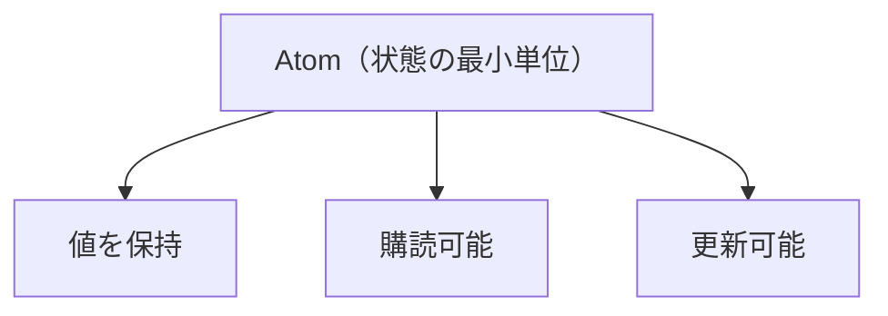

# Atom の基本

## 目次

- [Jotai とは](#jotai-とは)
  - [名前の由来](#名前の由来)
  - [特徴](#特徴)
- [なぜ Jotai を選ぶのか](#なぜ-jotai-を選ぶのか)
  - [状態管理ライブラリの比較](#状態管理ライブラリの比較)
  - [Context API の問題点](#context-api-の問題点)
  - [Jotai の解決策](#jotai-の解決策)
- [Atom の概念](#atom-の概念)
  - [Atom とは](#atom-とは)
  - [Atom の特徴](#atom-の特徴)
- [Atom の作成](#atom-の作成)
  - [基本的な Atom の作成](#基本的な-atom-の作成)
  - [TypeScript での型付け](#typescript-での型付け)
- [Atom の使用](#atom-の使用)
  - [useAtom フック](#useatom-フック)
  - [useState との類似性](#usestate-との類似性)
- [実践例：カウンター](#実践例カウンター)
  - [ファイル構成](#ファイル構成)
  - [Atom の定義](#atom-の定義)
  - [コンポーネントでの使用](#コンポーネントでの使用)
- [EC サイトでの使用例](#ec-サイトでの使用例)
  - [カート内の商品数を管理](#カート内の商品数を管理)
  - [ヘッダーでカート数を表示](#ヘッダーでカート数を表示)
- [Provider について](#provider-について)
  - [Provider は必要？](#provider-は必要)
  - [Provider を使う場合](#provider-を使う場合)
- [よくある間違い](#よくある間違い)
  - [1. コンポーネント内で Atom を作成する](#1-コンポーネント内で-atom-を作成する)
  - [2. Atom の値を直接変更する](#2-atom-の値を直接変更する)
  - [3. 不要な再レンダリングを引き起こす](#3-不要な再レンダリングを引き起こす)
- [まとめ](#まとめ)
  - [Atom の基本](#atom-の基本-1)
  - [メリット](#メリット)
- [次のステップ](#次のステップ)

## Jotai とは

**Jotai（状態）** は、React 用の軽量な状態管理ライブラリです。

### 名前の由来

- **Jotai** = 日本語の「状態（じょうたい）」
- 状態管理を簡潔に行うことを目的としている

### 特徴



- **軽量** - バンドルサイズが非常に小さい（約 3KB）
- **ボイラープレートなし** - Redux のような定型コードが不要
- **TypeScript ファースト** - 型推論が優れている
- **React に特化** - React の思想に沿った設計

---

## なぜ Jotai を選ぶのか

### 状態管理ライブラリの比較



| 特徴             | useState   | Context API | Jotai      | Redux      |
| ---------------- | ---------- | ----------- | ---------- | ---------- |
| 学習コスト       | 低い       | 低い        | 低い       | 高い       |
| ボイラープレート | なし       | 少ない      | なし       | 多い       |
| パフォーマンス   | 良好       | 要注意      | 優秀       | 優秀       |
| 状態の共有       | 親子間のみ | アプリ全体  | アプリ全体 | アプリ全体 |
| DevTools         | なし       | なし        | あり       | 充実       |

### Context API の問題点

```typescript
// Context API では、値が変わると全ての Consumer が再レンダリングされる
const AppContext = createContext<{
  cart: CartItem[];
  favorites: string[];
  user: User | null;
}>({
  cart: [],
  favorites: [],
  user: null,
});

// favorites が変わっても、cart だけを使うコンポーネントも再レンダリングされる
```

### Jotai の解決策

```typescript
// Jotai では、各 Atom が独立している
const cartAtom = atom<CartItem[]>([]);
const favoritesAtom = atom<string[]>([]);
const userAtom = atom<User | null>(null);

// cartAtom が変わっても、favoritesAtom を使うコンポーネントは再レンダリングされない
```

---

## Atom の概念

### Atom とは

**Atom** は、Jotai における状態の最小単位です。



### Atom の特徴

1. **不可分（Atomic）** - これ以上分割できない状態の単位
2. **独立している** - 各 Atom は他の Atom に依存しない（派生 Atom を除く）
3. **購読可能** - コンポーネントが Atom を購読し、変更を検知できる

---

## Atom の作成

### 基本的な Atom の作成

```typescript
import { atom } from "jotai";

// 数値の Atom
const countAtom = atom(0);

// 文字列の Atom
const nameAtom = atom("");

// 配列の Atom
const itemsAtom = atom<string[]>([]);

// オブジェクトの Atom
const userAtom = atom<User | null>(null);
```

### TypeScript での型付け

```typescript
// 型を明示的に指定する場合
const countAtom = atom<number>(0);

// 型を推論させる場合（初期値から推論）
const countAtom = atom(0); // number と推論される

// null を許容する場合
type User = {
  id: string;
  name: string;
  email: string;
};

const userAtom = atom<User | null>(null);

// 配列の場合
type CartItem = {
  productId: string;
  quantity: number;
};

const cartAtom = atom<CartItem[]>([]);
```

---

## Atom の使用

### useAtom フック

`useAtom` は、Atom の値を読み取りと書き込みの両方を行うフックです。

```typescript
import { useAtom } from "jotai";

function Counter(): JSX.Element {
  // [現在の値, 更新関数] = useAtom(atom)
  const [count, setCount] = useAtom(countAtom);

  return (
    <div>
      <p>カウント: {count}</p>
      <button onClick={() => setCount(count + 1)}>増やす</button>
      <button onClick={() => setCount((c) => c - 1)}>減らす</button>
    </div>
  );
}
```

### useState との類似性

```typescript
// useState の場合
const [count, setCount] = useState(0);

// useAtom の場合
const [count, setCount] = useAtom(countAtom);
```

API は `useState` とほぼ同じですが、状態がコンポーネントの外部（Atom）で管理されるため、複数のコンポーネント間で共有できます。

---

## 実践例：カウンター

### ファイル構成

```text
packages/store/
  src/
    counter.ts    # Atom 定義
apps/web/
  app/
    counter/
      page.tsx    # カウンターページ
```

### Atom の定義

```typescript
// packages/store/src/counter.ts
import { atom } from "jotai";

export const countAtom = atom(0);
```

### コンポーネントでの使用

```tsx
// apps/web/app/counter/page.tsx
"use client";

import { useAtom } from "jotai";
import { countAtom } from "@ec/store/counter";

export default function CounterPage(): JSX.Element {
  const [count, setCount] = useAtom(countAtom);

  return (
    <div className="p-4">
      <h1 className="text-2xl font-bold">カウンター</h1>
      <p className="mt-4 text-4xl">{count}</p>
      <div className="mt-4 flex gap-2">
        <button
          onClick={() => setCount((c) => c - 1)}
          className="rounded bg-red-500 px-4 py-2 text-white"
        >
          -1
        </button>
        <button
          onClick={() => setCount((c) => c + 1)}
          className="rounded bg-blue-500 px-4 py-2 text-white"
        >
          +1
        </button>
        <button
          onClick={() => setCount(0)}
          className="rounded bg-gray-500 px-4 py-2 text-white"
        >
          リセット
        </button>
      </div>
    </div>
  );
}
```

---

## EC サイトでの使用例

### カート内の商品数を管理

```typescript
// packages/store/src/cart.ts
import { atom } from "jotai";

export type CartItem = {
  productId: string;
  name: string;
  price: number;
  quantity: number;
  imageUrl: string;
};

// カートアイテムの配列を管理する Atom
export const cartItemsAtom = atom<CartItem[]>([]);
```

### ヘッダーでカート数を表示

```tsx
// apps/web/components/Header.tsx
"use client";

import { useAtom } from "jotai";
import { cartItemsAtom } from "@ec/store/cart";

export function Header(): JSX.Element {
  const [cartItems] = useAtom(cartItemsAtom);

  // カート内の合計アイテム数を計算
  const totalItems = cartItems.reduce((sum, item) => sum + item.quantity, 0);

  return (
    <header className="flex items-center justify-between p-4">
      <h1>EC サイト</h1>
      <a
        href="/cart"
        className="relative"
      >
        🛒 カート
        {totalItems > 0 && (
          <span className="absolute -top-2 -right-2 rounded-full bg-red-500 px-2 text-xs text-white">
            {totalItems}
          </span>
        )}
      </a>
    </header>
  );
}
```

---

## Provider について

### Provider は必要？

Jotai v2 以降、**Provider は基本的に不要**です。

```tsx
// Provider なしで動作する
function App(): JSX.Element {
  return (
    <div>
      <Counter />
      <AnotherComponent />
    </div>
  );
}
```

### Provider を使う場合

以下の場合は Provider を使用します。

1. **テスト時に状態を分離したい場合**
2. **SSR で初期値を注入したい場合**
3. **複数の独立した状態スコープが必要な場合**

```tsx
import { Provider } from "jotai";

function App(): JSX.Element {
  return (
    <Provider>
      <Counter />
    </Provider>
  );
}
```

---

## よくある間違い

### 1. コンポーネント内で Atom を作成する

```typescript
// ❌ 悪い例：レンダリングのたびに新しい Atom が作成される
function Counter(): JSX.Element {
  const countAtom = atom(0); // 毎回新しい Atom が作成される
  const [count, setCount] = useAtom(countAtom);
  // ...
}

// ✅ 良い例：コンポーネントの外で Atom を作成
const countAtom = atom(0);

function Counter(): JSX.Element {
  const [count, setCount] = useAtom(countAtom);
  // ...
}
```

### 2. Atom の値を直接変更する

```typescript
// ❌ 悪い例：配列を直接変更
const [items, setItems] = useAtom(itemsAtom);
items.push("new item"); // 直接変更は NG

// ✅ 良い例：新しい配列を作成
setItems([...items, "new item"]);
```

### 3. 不要な再レンダリングを引き起こす

```typescript
// ❌ 悪い例：オブジェクトを毎回作成
const [_, setItem] = useAtom(itemAtom);
setItem({ name, price }); // 毎回新しいオブジェクト

// ✅ 良い例：関数形式で更新
setItem((prev) => ({ ...prev, name }));
```

---

## まとめ

### Atom の基本

- Atom は Jotai における状態の最小単位
- `atom()` 関数で作成
- `useAtom()` フックで読み書き
- コンポーネントの外部で定義する

### メリット

- シンプルな API（useState に似ている）
- TypeScript との相性が良い
- 不要な再レンダリングを防げる
- ボイラープレートが少ない

---

## 次のステップ

Atom の基本を理解したら、[派生 Atom](./02-derived-atoms.md) に進んで、Atom 同士を組み合わせる方法を学びましょう。
