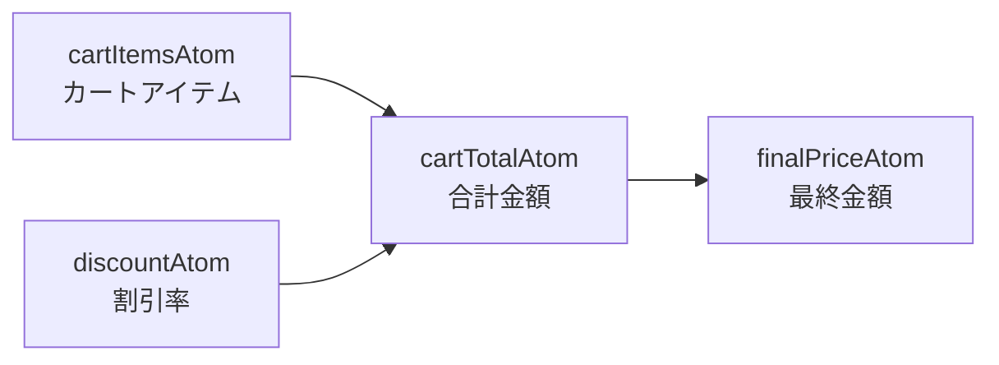
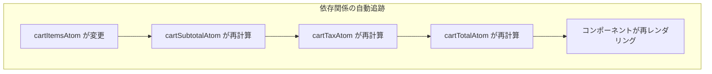

# 派生 Atom（Derived Atoms）

## 目次

- [派生 Atom とは](#派生-atom-とは)
- [読み取り専用の派生 Atom](#読み取り専用の派生-atom)
  - [基本的な派生 Atom](#基本的な派生-atom)
  - [get 関数](#get-関数)
- [EC サイトでの実践例](#ec-サイトでの実践例)
  - [カート合計金額の計算](#カート合計金額の計算)
  - [コンポーネントでの使用](#コンポーネントでの使用)
- [派生 Atom の依存関係](#派生-atom-の依存関係)
  - [自動追跡](#自動追跡)
  - [最適化](#最適化)
- [書き込み可能な派生 Atom](#書き込み可能な派生-atom)
  - [基本構文](#基本構文)
  - [カートアイテムの数量変更](#カートアイテムの数量変更)
  - [コンポーネントでの使用](#コンポーネントでの使用-1)
- [非同期派生 Atom](#非同期派生-atom)
  - [非同期派生 Atom の作成](#非同期派生-atom-の作成)
  - [Suspense との連携](#suspense-との連携)
- [フィルタリングの例](#フィルタリングの例)
  - [商品フィルター](#商品フィルター)
- [ベストプラクティス](#ベストプラクティス)
  - [1. 派生 Atom は細かく分割する](#1-派生-atom-は細かく分割する)
  - [2. 命名規則を統一する](#2-命名規則を統一する)
  - [3. 副作用は書き込み専用 Atom で](#3-副作用は書き込み専用-atom-で)
- [まとめ](#まとめ)
  - [派生 Atom のポイント](#派生-atom-のポイント)
  - [使いどころ](#使いどころ)
- [次のステップ](#次のステップ)

## 派生 Atom とは

**派生 Atom（Derived Atom）** は、他の Atom の値から計算される Atom です。
Excel のセル参照のように、元の Atom が変更されると自動的に再計算されます。



***

## 読み取り専用の派生 Atom

### 基本的な派生 Atom

`atom()` に関数を渡すと、派生 Atom になります。

```typescript
import { atom } from "jotai";

// 元となる Atom
const countAtom = atom(0);

// 派生 Atom（countAtom の値を 2 倍にする）
const doubledCountAtom = atom((get) => get(countAtom) * 2);
```

### get 関数

`get` 関数は他の Atom の現在の値を取得します。

```typescript
const derivedAtom = atom((get) => {
  const count = get(countAtom); // countAtom の値を取得
  const multiplier = get(multiplierAtom); // multiplierAtom の値を取得
  return count * multiplier;
});
```

***

## EC サイトでの実践例

### カート合計金額の計算

```typescript
// packages/store/src/cart.ts
import { atom } from "jotai";

export type CartItem = {
  productId: string;
  name: string;
  price: number;
  quantity: number;
  imageUrl: string;
};

// 基本の Atom：カートアイテム
export const cartItemsAtom = atom<CartItem[]>([]);

// 派生 Atom：カート内の合計アイテム数
export const cartItemCountAtom = atom((get) => {
  const items = get(cartItemsAtom);
  return items.reduce((sum, item) => sum + item.quantity, 0);
});

// 派生 Atom：カートの小計（税抜）
export const cartSubtotalAtom = atom((get) => {
  const items = get(cartItemsAtom);
  return items.reduce((sum, item) => sum + item.price * item.quantity, 0);
});

// 基本の Atom：消費税率
export const taxRateAtom = atom(0.1); // 10%

// 派生 Atom：消費税額
export const cartTaxAtom = atom((get) => {
  const subtotal = get(cartSubtotalAtom);
  const taxRate = get(taxRateAtom);
  return Math.floor(subtotal * taxRate);
});

// 派生 Atom：合計金額（税込）
export const cartTotalAtom = atom((get) => {
  const subtotal = get(cartSubtotalAtom);
  const tax = get(cartTaxAtom);
  return subtotal + tax;
});
```

### コンポーネントでの使用

```tsx
// apps/web/app/cart/page.tsx
"use client";

import { useAtomValue } from "jotai";
import {
  cartItemsAtom,
  cartItemCountAtom,
  cartSubtotalAtom,
  cartTaxAtom,
  cartTotalAtom,
} from "@ec/store/cart";

export default function CartPage(): JSX.Element {
  const items = useAtomValue(cartItemsAtom);
  const itemCount = useAtomValue(cartItemCountAtom);
  const subtotal = useAtomValue(cartSubtotalAtom);
  const tax = useAtomValue(cartTaxAtom);
  const total = useAtomValue(cartTotalAtom);

  return (
    <div className="p-4">
      <h1 className="text-2xl font-bold">ショッピングカート</h1>
      <p>アイテム数: {itemCount}</p>

      <ul className="mt-4">
        {items.map((item) => (
          <li
            key={item.productId}
            className="flex justify-between py-2"
          >
            <span>{item.name}</span>
            <span>
              ¥{item.price.toLocaleString()} × {item.quantity}
            </span>
          </li>
        ))}
      </ul>

      <div className="mt-4 border-t pt-4">
        <p className="flex justify-between">
          <span>小計</span>
          <span>¥{subtotal.toLocaleString()}</span>
        </p>
        <p className="flex justify-between">
          <span>消費税（10%）</span>
          <span>¥{tax.toLocaleString()}</span>
        </p>
        <p className="flex justify-between text-xl font-bold">
          <span>合計</span>
          <span>¥{total.toLocaleString()}</span>
        </p>
      </div>
    </div>
  );
}
```

***

## 派生 Atom の依存関係

### 自動追跡

Jotai は `get()` で呼び出された Atom を自動的に追跡します。



### 最適化

派生 Atom を使うと、必要な部分だけが再計算されます。

```typescript
// taxRateAtom が変更された場合
// → cartSubtotalAtom は再計算されない（依存していないから）
// → cartTaxAtom と cartTotalAtom は再計算される
```

***

## 書き込み可能な派生 Atom

派生 Atom に書き込み機能を追加できます。

### 基本構文

```typescript
const writableDerivedAtom = atom(
  (get) => {
    // 読み取りロジック
    return get(someAtom);
  },
  (get, set, newValue) => {
    // 書き込みロジック
    set(someAtom, newValue);
  }
);
```

### カートアイテムの数量変更

```typescript
// packages/store/src/cart.ts
import { atom } from "jotai";
import { type CartItem, cartItemsAtom } from "./cart";

// 特定商品の数量を変更する Atom
export const updateQuantityAtom = atom(
  null, // 読み取りは不要
  (get, set, { productId, quantity }: { productId: string; quantity: number }) => {
    const items = get(cartItemsAtom);
    const updatedItems = items.map((item) =>
      item.productId === productId ? { ...item, quantity } : item
    );
    set(cartItemsAtom, updatedItems);
  }
);

// カートに商品を追加する Atom
export const addToCartAtom = atom(null, (get, set, newItem: CartItem) => {
  const items = get(cartItemsAtom);
  const existingItem = items.find((item) => item.productId === newItem.productId);

  if (existingItem) {
    // 既存アイテムの数量を増やす
    const updatedItems = items.map((item) =>
      item.productId === newItem.productId
        ? { ...item, quantity: item.quantity + newItem.quantity }
        : item
    );
    set(cartItemsAtom, updatedItems);
  } else {
    // 新しいアイテムを追加
    set(cartItemsAtom, [...items, newItem]);
  }
});

// カートから商品を削除する Atom
export const removeFromCartAtom = atom(null, (get, set, productId: string) => {
  const items = get(cartItemsAtom);
  const filteredItems = items.filter((item) => item.productId !== productId);
  set(cartItemsAtom, filteredItems);
});

// カートをクリアする Atom
export const clearCartAtom = atom(null, (_get, set) => {
  set(cartItemsAtom, []);
});
```

### コンポーネントでの使用

```tsx
// apps/web/components/CartItemRow.tsx
"use client";

import { useSetAtom } from "jotai";
import { updateQuantityAtom, removeFromCartAtom } from "@ec/store/cart";
import { type CartItem } from "@ec/store/cart";

type CartItemRowProps = {
  item: CartItem;
};

export function CartItemRow({ item }: CartItemRowProps): JSX.Element {
  const updateQuantity = useSetAtom(updateQuantityAtom);
  const removeFromCart = useSetAtom(removeFromCartAtom);

  const handleQuantityChange = (e: React.ChangeEvent<HTMLSelectElement>): void => {
    const quantity = parseInt(e.target.value, 10);
    updateQuantity({ productId: item.productId, quantity });
  };

  const handleRemove = (): void => {
    removeFromCart(item.productId);
  };

  return (
    <div className="flex items-center justify-between border-b py-4">
      <div className="flex items-center gap-4">
        
        <div>
          <h3 className="font-bold">{item.name}</h3>
          <p className="text-gray-600">¥{item.price.toLocaleString()}</p>
        </div>
      </div>
      <div className="flex items-center gap-4">
        <select
          value={item.quantity}
          onChange={handleQuantityChange}
          className="rounded border px-2 py-1"
        >
          {[1, 2, 3, 4, 5, 6, 7, 8, 9, 10].map((n) => (
            <option
              key={n}
              value={n}
            >
              {n}
            </option>
          ))}
        </select>
        <button
          onClick={handleRemove}
          className="text-red-500 hover:text-red-700"
        >
          削除
        </button>
      </div>
    </div>
  );
}
```

***

## 非同期派生 Atom

派生 Atom は非同期処理もサポートしています。

### 非同期派生 Atom の作成

```typescript
// 商品詳細を取得する非同期 Atom
const productIdAtom = atom<string | null>(null);

const productDetailAtom = atom(async (get) => {
  const productId = get(productIdAtom);
  if (!productId) return null;

  const response = await fetch(`/api/products/${productId}`);
  const product = await response.json();
  return product;
});
```

### Suspense との連携

非同期 Atom は React の Suspense と連携できます。

```tsx
import { Suspense } from "react";
import { useAtomValue } from "jotai";

function ProductDetail(): JSX.Element {
  const product = useAtomValue(productDetailAtom);

  if (!product) return <p>商品を選択してください</p>;

  return (
    <div>
      <h2>{product.name}</h2>
      <p>¥{product.price.toLocaleString()}</p>
    </div>
  );
}

function ProductPage(): JSX.Element {
  return (
    <Suspense fallback={<p>読み込み中...</p>}>
      <ProductDetail />
    </Suspense>
  );
}
```

***

## フィルタリングの例

### 商品フィルター

```typescript
// packages/store/src/products.ts
import { atom } from "jotai";

type Product = {
  id: string;
  name: string;
  price: number;
  category: string;
  inStock: boolean;
};

// 全商品
export const productsAtom = atom<Product[]>([]);

// フィルター条件
export const categoryFilterAtom = atom<string | null>(null);
export const priceRangeAtom = atom<{ min: number; max: number }>({
  min: 0,
  max: Infinity,
});
export const inStockOnlyAtom = atom(false);

// フィルタリングされた商品（派生 Atom）
export const filteredProductsAtom = atom((get) => {
  const products = get(productsAtom);
  const category = get(categoryFilterAtom);
  const priceRange = get(priceRangeAtom);
  const inStockOnly = get(inStockOnlyAtom);

  return products.filter((product) => {
    // カテゴリフィルター
    if (category && product.category !== category) {
      return false;
    }

    // 価格範囲フィルター
    if (product.price < priceRange.min || product.price > priceRange.max) {
      return false;
    }

    // 在庫ありフィルター
    if (inStockOnly && !product.inStock) {
      return false;
    }

    return true;
  });
});

// フィルター結果の件数（派生 Atom）
export const filteredCountAtom = atom((get) => {
  return get(filteredProductsAtom).length;
});
```

***

## ベストプラクティス

### 1. 派生 Atom は細かく分割する

```typescript
// ✅ 良い例：細かく分割
const cartSubtotalAtom = atom((get) => /* 小計計算 */);
const cartTaxAtom = atom((get) => /* 税額計算 */);
const cartTotalAtom = atom((get) => /* 合計計算 */);

// ❌ 悪い例：すべてを 1 つに
const cartSummaryAtom = atom((get) => {
  // 小計、税額、合計をすべて計算
  return { subtotal, tax, total };
});
```

### 2. 命名規則を統一する

```typescript
// 派生 Atom は何を計算しているか明確に
const cartItemCountAtom = atom((get) => /* ... */);
const cartTotalPriceAtom = atom((get) => /* ... */);
const filteredProductsAtom = atom((get) => /* ... */);
```

### 3. 副作用は書き込み専用 Atom で

```typescript
// ✅ 良い例
const logActionAtom = atom(null, (get, set, action: string) => {
  console.log(`Action: ${action}`);
  // API 呼び出しなど
});

// ❌ 悪い例：読み取り Atom 内で副作用
const badAtom = atom((get) => {
  console.log("This is a side effect"); // NG
  return get(someAtom);
});
```

***

## まとめ

### 派生 Atom のポイント

- 他の Atom の値から計算される Atom
- `get` 関数で依存する Atom を参照
- 依存関係は自動追跡される
- 書き込み機能も追加可能

### 使いどころ

- 合計金額の計算
- フィルタリング
- データの変換
- 複数の Atom を組み合わせた状態

***

## 次のステップ

派生 Atom を理解したら、[永続化（atomWithStorage）](./03-atom-with-storage.md) に進んで、状態を localStorage に保存する方法を学びましょう。
