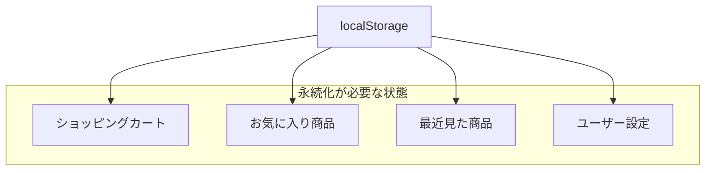
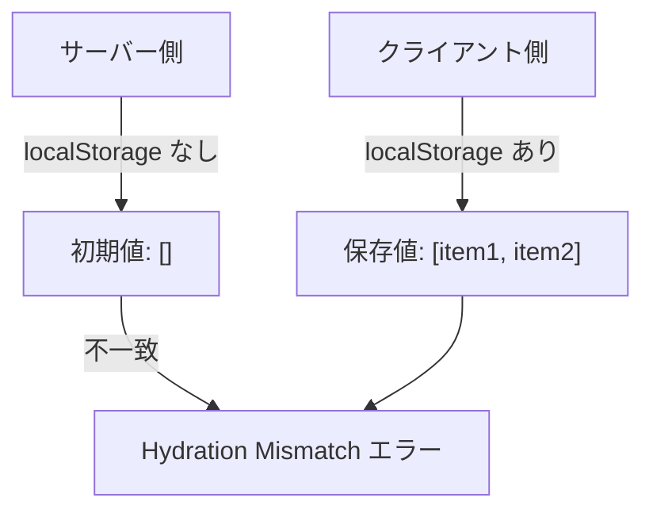
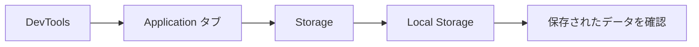

# 永続化（atomWithStorage）

## なぜ永続化が必要か

通常の Atom は、ページをリロードすると値が失われます。
EC サイトでは、以下のような状態を永続化します。



### ユーザー体験の向上

- ページをリロードしてもカートの中身が消えない
- ブラウザを閉じても後でカートを確認できる
- お気に入りが消えない

---

## atomWithStorage の基本

### インポート

`atomWithStorage` は `jotai/utils` からインポートします。

```typescript
import { atomWithStorage } from "jotai/utils";
```

### 基本的な使い方

```typescript
import { atomWithStorage } from "jotai/utils";

// localStorage に "cart" というキーで保存される
const cartAtom = atomWithStorage<CartItem[]>("cart", []);

// 使い方は通常の Atom と同じ
const [cart, setCart] = useAtom(cartAtom);
```

### 引数

```typescript
atomWithStorage<T>(key: string, initialValue: T, storage?: Storage)
```

| 引数         | 説明                                 |
| ------------ | ------------------------------------ |
| key          | localStorage に保存するキー名        |
| initialValue | 初期値（保存されたデータがない場合） |
| storage      | 使用するストレージ（省略可能）       |

---

## EC サイトでの実装例

### ショッピングカートの永続化

```typescript
// packages/store/src/cart.ts
import { atom } from "jotai";
import { atomWithStorage } from "jotai/utils";

export type CartItem = {
  productId: string;
  name: string;
  price: number;
  quantity: number;
  imageUrl: string;
};

// localStorage に永続化されるカート
export const cartItemsAtom = atomWithStorage<CartItem[]>("ec-cart", []);

// 派生 Atom：カート合計金額
export const cartTotalAtom = atom((get) => {
  const items = get(cartItemsAtom);
  return items.reduce((sum, item) => sum + item.price * item.quantity, 0);
});

// カートに追加
export const addToCartAtom = atom(null, (get, set, newItem: CartItem) => {
  const items = get(cartItemsAtom);
  const existingItem = items.find((item) => item.productId === newItem.productId);

  if (existingItem) {
    const updatedItems = items.map((item) =>
      item.productId === newItem.productId
        ? { ...item, quantity: item.quantity + newItem.quantity }
        : item
    );
    set(cartItemsAtom, updatedItems);
  } else {
    set(cartItemsAtom, [...items, newItem]);
  }
});
```

### お気に入りの永続化

```typescript
// packages/store/src/favorites.ts
import { atom } from "jotai";
import { atomWithStorage } from "jotai/utils";

// お気に入りの商品 ID を永続化
export const favoriteIdsAtom = atomWithStorage<string[]>("ec-favorites", []);

// お気に入りに追加/削除するトグル Atom
export const toggleFavoriteAtom = atom(null, (get, set, productId: string) => {
  const favorites = get(favoriteIdsAtom);
  const isFavorite = favorites.includes(productId);

  if (isFavorite) {
    set(
      favoriteIdsAtom,
      favorites.filter((id) => id !== productId)
    );
  } else {
    set(favoriteIdsAtom, [...favorites, productId]);
  }
});

// 特定の商品がお気に入りかどうかを確認する派生 Atom
export const isFavoriteAtom = atom((get) => {
  const favorites = get(favoriteIdsAtom);
  return (productId: string): boolean => favorites.includes(productId);
});
```

---

## localStorage vs sessionStorage

### 違い

| 特徴     | localStorage         | sessionStorage       |
| -------- | -------------------- | -------------------- |
| 有効期限 | なし（永続）         | タブを閉じると消える |
| 共有範囲 | 同一オリジンの全タブ | 開いたタブのみ       |
| 容量     | 約 5MB               | 約 5MB               |
| 用途     | カート、お気に入り   | フォーム一時保存     |

### sessionStorage を使う場合

```typescript
import { atomWithStorage, createJSONStorage } from "jotai/utils";

// sessionStorage を使用
const sessionCartAtom = atomWithStorage<CartItem[]>(
  "session-cart",
  [],
  createJSONStorage(() => sessionStorage)
);
```

### 使い分けの例

```typescript
// localStorage（永続化）
const cartAtom = atomWithStorage("cart", []); // カートは永続化
const favoritesAtom = atomWithStorage("favorites", []); // お気に入りも永続化

// sessionStorage（一時保存）
const checkoutFormAtom = atomWithStorage(
  "checkout-form",
  {},
  createJSONStorage(() => sessionStorage)
); // チェックアウトフォームは一時的
```

---

## SSR での注意点

### 問題：Hydration Mismatch

Server Side Rendering (SSR) では、サーバーとクライアントで localStorage の値が異なるため、
Hydration Mismatch が発生する可能性があります。



### 解決策 1: クライアントコンポーネントを分離

```tsx
// apps/web/components/CartCount.tsx
"use client";

import { useAtomValue } from "jotai";
import { cartItemsAtom } from "@ec/store/cart";

export function CartCount(): JSX.Element {
  const items = useAtomValue(cartItemsAtom);
  const count = items.reduce((sum, item) => sum + item.quantity, 0);

  return <span className="badge">{count}</span>;
}
```

```tsx
// apps/web/components/Header.tsx
import { Suspense } from "react";
import { CartCount } from "./CartCount";

export function Header(): JSX.Element {
  return (
    <header>
      <nav>
        <a href="/cart">
          🛒 カート
          <Suspense fallback={<span className="badge">-</span>}>
            <CartCount />
          </Suspense>
        </a>
      </nav>
    </header>
  );
}
```

### 解決策 2: useHydrateAtoms を使用

```tsx
import { useHydrateAtoms } from "jotai/utils";

function CartProvider({ children }: { children: React.ReactNode }): JSX.Element {
  // サーバーから渡された初期値で Atom を初期化
  useHydrateAtoms([[cartItemsAtom, []]]);

  return <>{children}</>;
}
```

### 解決策 3: クライアントサイドのみで表示

```tsx
"use client";

import { useEffect, useState } from "react";
import { useAtomValue } from "jotai";
import { cartItemsAtom } from "@ec/store/cart";

export function CartCount(): JSX.Element {
  const items = useAtomValue(cartItemsAtom);
  const [isMounted, setIsMounted] = useState(false);

  useEffect(() => {
    setIsMounted(true);
  }, []);

  if (!isMounted) {
    return <span className="badge">-</span>;
  }

  const count = items.reduce((sum, item) => sum + item.quantity, 0);
  return <span className="badge">{count}</span>;
}
```

---

## カスタムストレージ

### 独自のストレージを作成

```typescript
import { atomWithStorage, createJSONStorage } from "jotai/utils";

// カスタムストレージの例：有効期限付き localStorage
const createExpiringStorage = <T>(expirationMs: number) =>
  createJSONStorage<T>(() => ({
    getItem: (key: string): T | null => {
      const item = localStorage.getItem(key);
      if (!item) return null;

      const { value, expiry } = JSON.parse(item);
      if (Date.now() > expiry) {
        localStorage.removeItem(key);
        return null;
      }
      return value;
    },
    setItem: (key: string, value: T): void => {
      const item = {
        value,
        expiry: Date.now() + expirationMs,
      };
      localStorage.setItem(key, JSON.stringify(item));
    },
    removeItem: (key: string): void => {
      localStorage.removeItem(key);
    },
  }));

// 24 時間で期限切れになるカート
const expiringCartAtom = atomWithStorage<CartItem[]>(
  "expiring-cart",
  [],
  createExpiringStorage(24 * 60 * 60 * 1000)
);
```

### 暗号化ストレージ

```typescript
// 簡易的な暗号化の例（実際は crypto-js などを使用）
const createEncryptedStorage = <T>(secret: string) =>
  createJSONStorage<T>(() => ({
    getItem: (key: string): T | null => {
      const encrypted = localStorage.getItem(key);
      if (!encrypted) return null;
      // 復号化処理
      return decrypt(encrypted, secret);
    },
    setItem: (key: string, value: T): void => {
      // 暗号化処理
      const encrypted = encrypt(value, secret);
      localStorage.setItem(key, encrypted);
    },
    removeItem: (key: string): void => {
      localStorage.removeItem(key);
    },
  }));
```

---

## デバッグ

### localStorage の確認

ブラウザの DevTools で localStorage の内容を確認できます。

1. DevTools を開く（F12 または Cmd+Option+I）
2. Application タブを選択
3. Storage → Local Storage を確認



### キー名の命名規則

プロジェクト名やプレフィックスを付けて、他のサイトと衝突を避けます。

```typescript
// ✅ 良い例：プレフィックス付き
const cartAtom = atomWithStorage("ec-site-cart", []);
const favoritesAtom = atomWithStorage("ec-site-favorites", []);

// ❌ 悪い例：一般的な名前
const cartAtom = atomWithStorage("cart", []); // 他サイトと衝突の可能性
```

---

## よくある問題と解決策

### 1. 古いデータ構造との互換性

アプリのアップデートでデータ構造が変わった場合の対処法。

```typescript
type CartItemV1 = {
  id: string;
  qty: number;
};

type CartItemV2 = {
  productId: string;
  quantity: number;
  price: number;
};

// マイグレーション処理
const migrateCartData = (stored: unknown): CartItemV2[] => {
  if (!Array.isArray(stored)) return [];

  return stored.map((item: CartItemV1 | CartItemV2) => {
    // V1 形式を V2 に変換
    if ("id" in item && "qty" in item) {
      return {
        productId: item.id,
        quantity: item.qty,
        price: 0, // デフォルト値
      };
    }
    return item as CartItemV2;
  });
};

const cartAtom = atomWithStorage<CartItemV2[]>("cart", [], {
  ...createJSONStorage<CartItemV2[]>(),
  getItem: (key, initialValue) => {
    const stored = localStorage.getItem(key);
    if (!stored) return initialValue;
    return migrateCartData(JSON.parse(stored));
  },
});
```

### 2. ストレージ容量の上限

```typescript
// 保存前に容量をチェック
const safeSetItem = (key: string, value: string): boolean => {
  try {
    localStorage.setItem(key, value);
    return true;
  } catch (e) {
    if (e instanceof DOMException && e.code === 22) {
      console.error("localStorage の容量が上限に達しました");
      // 古いデータを削除するなどの対処
    }
    return false;
  }
};
```

---

## まとめ

### atomWithStorage のポイント

- `jotai/utils` からインポート
- 自動的に localStorage に保存される
- 通常の Atom と同じ API で使用可能
- SSR 時は Hydration Mismatch に注意

### 使いどころ

| 用途             | ストレージ     |
| ---------------- | -------------- |
| カート           | localStorage   |
| お気に入り       | localStorage   |
| 閲覧履歴         | localStorage   |
| フォーム一時保存 | sessionStorage |
| ユーザー設定     | localStorage   |

---

## 次のステップ

永続化を理解したら、[動的 Atom（atomFamily）](./04-atom-family.md) に進んで、パラメータに応じた Atom を動的に作成する方法を学びましょう。
