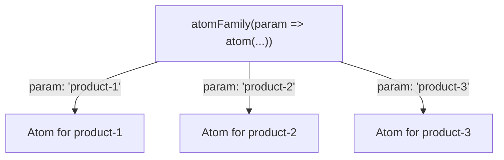
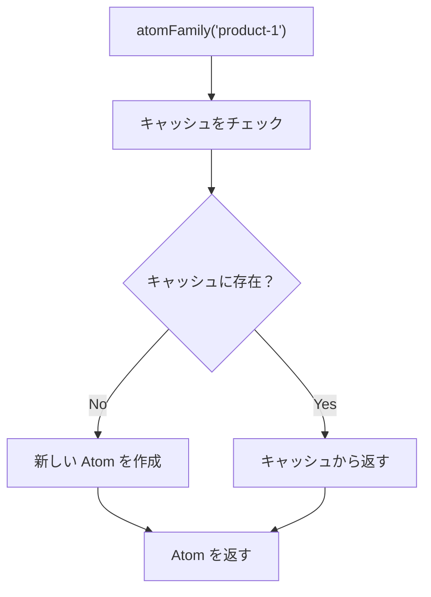

# 動的 Atom（atomFamily）

## atomFamily とは

**atomFamily** は、パラメータに応じて Atom を動的に生成する関数です。
同じ構造の Atom を複数作成する必要がある場合に便利です。



### 使いどころ

- 商品ごとの数量管理
- ユーザーごとの設定
- 動的なフォームフィールド
- リストの各アイテムの状態

---

## 基本的な使い方

### インポート

```typescript
import { atomFamily } from "jotai/utils";
```

### 基本構文

```typescript
import { atomFamily } from "jotai/utils";

// パラメータを受け取って Atom を返す関数を定義
const itemQuantityFamily = atomFamily((productId: string) => atom(1));

// 使用時にパラメータを渡す
const quantity = useAtom(itemQuantityFamily("product-123"));
```

---

## EC サイトでの実装例

### 商品ごとの数量管理

```typescript
// packages/store/src/quantity.ts
import { atom } from "jotai";
import { atomFamily } from "jotai/utils";

// 商品 ID ごとに個別の数量 Atom を作成
export const productQuantityFamily = atomFamily((productId: string) => atom(1));

// 数量を増減する Atom
export const incrementQuantityAtom = atomFamily((productId: string) =>
  atom(null, (get, set) => {
    const quantityAtom = productQuantityFamily(productId);
    const current = get(quantityAtom);
    set(quantityAtom, current + 1);
  })
);

export const decrementQuantityAtom = atomFamily((productId: string) =>
  atom(null, (get, set) => {
    const quantityAtom = productQuantityFamily(productId);
    const current = get(quantityAtom);
    if (current > 1) {
      set(quantityAtom, current - 1);
    }
  })
);
```

### コンポーネントでの使用

```tsx
// apps/web/components/QuantitySelector.tsx
"use client";

import { useAtom, useSetAtom } from "jotai";
import {
  productQuantityFamily,
  incrementQuantityAtom,
  decrementQuantityAtom,
} from "@ec/store/quantity";

type QuantitySelectorProps = {
  productId: string;
};

export function QuantitySelector({ productId }: QuantitySelectorProps): JSX.Element {
  const [quantity] = useAtom(productQuantityFamily(productId));
  const increment = useSetAtom(incrementQuantityAtom(productId));
  const decrement = useSetAtom(decrementQuantityAtom(productId));

  return (
    <div className="flex items-center gap-2">
      <button
        onClick={decrement}
        className="rounded border px-3 py-1 hover:bg-gray-100"
        disabled={quantity <= 1}
      >
        -
      </button>
      <span className="min-w-8 text-center">{quantity}</span>
      <button
        onClick={increment}
        className="rounded border px-3 py-1 hover:bg-gray-100"
      >
        +
      </button>
    </div>
  );
}
```

### 商品カードでの使用

```tsx
// apps/web/components/ProductCard.tsx
"use client";

import { useAtomValue, useSetAtom } from "jotai";
import { productQuantityFamily } from "@ec/store/quantity";
import { addToCartAtom } from "@ec/store/cart";
import { QuantitySelector } from "./QuantitySelector";

type Product = {
  id: string;
  name: string;
  price: number;
  imageUrl: string;
};

type ProductCardProps = {
  product: Product;
};

export function ProductCard({ product }: ProductCardProps): JSX.Element {
  const quantity = useAtomValue(productQuantityFamily(product.id));
  const addToCart = useSetAtom(addToCartAtom);

  const handleAddToCart = (): void => {
    addToCart({
      productId: product.id,
      name: product.name,
      price: product.price,
      quantity,
      imageUrl: product.imageUrl,
    });
  };

  return (
    <div className="rounded border p-4">
      
      <h3 className="mt-2 font-bold">{product.name}</h3>
      <p className="text-lg">¥{product.price.toLocaleString()}</p>
      <div className="mt-4 flex items-center justify-between">
        <QuantitySelector productId={product.id} />
        <button
          onClick={handleAddToCart}
          className="rounded bg-blue-500 px-4 py-2 text-white hover:bg-blue-600"
        >
          カートに追加
        </button>
      </div>
    </div>
  );
}
```

---

## パラメータの等価性

### デフォルトの等価性チェック

atomFamily はパラメータの等価性を厳密に（`===`）比較します。

```typescript
// 同じ文字列なら同じ Atom を返す
const atom1 = productQuantityFamily("product-1");
const atom2 = productQuantityFamily("product-1");
atom1 === atom2; // true

// オブジェクトは参照が異なると別の Atom になる
const atomA = someFamily({ id: 1 });
const atomB = someFamily({ id: 1 });
atomA === atomB; // false（参照が異なるため）
```

### カスタム等価性関数

オブジェクトをパラメータにする場合は、カスタム等価性関数を使用します。

```typescript
import { atomFamily } from "jotai/utils";
import { atom } from "jotai";

type FilterParams = {
  category: string;
  minPrice: number;
  maxPrice: number;
};

// カスタム等価性関数を使用
const filterResultFamily = atomFamily(
  (params: FilterParams) => atom(/* フィルタ処理 */),
  (a: FilterParams, b: FilterParams) =>
    a.category === b.category && a.minPrice === b.minPrice && a.maxPrice === b.maxPrice
);
```

### 安定した参照を使用

```typescript
// ❌ 悪い例：毎回新しいオブジェクトを渡す
function ProductList(): JSX.Element {
  // 毎レンダリングで新しいオブジェクトが作られる
  const result = useAtomValue(filterFamily({ category: "electronics" }));
  return <div>{/* ... */}</div>;
}

// ✅ 良い例：useMemo で参照を安定させる
function ProductList(): JSX.Element {
  const params = useMemo(() => ({ category: "electronics" }), []);
  const result = useAtomValue(filterFamily(params));
  return <div>{/* ... */}</div>;
}

// ✅ 別の良い例：プリミティブ値を使う
const filterByCategoryFamily = atomFamily((category: string) =>
  atom(/* ... */)
);

function ProductList(): JSX.Element {
  const result = useAtomValue(filterByCategoryFamily("electronics"));
  return <div>{/* ... */}</div>;
}
```

---

## メモ化とキャッシュ

### Atom のキャッシュ

atomFamily は作成した Atom をキャッシュします。
同じパラメータで呼び出すと、同じ Atom インスタンスが返されます。



### キャッシュのクリア

メモリ使用量を削減したい場合や、状態をリセットしたい場合にキャッシュをクリアできます。

```typescript
import { atomFamily } from "jotai/utils";
import { atom } from "jotai";

const myFamily = atomFamily((id: string) => atom(0));

// 特定のパラメータのキャッシュをクリア
myFamily.remove("product-1");

// すべてのキャッシュをクリア（setShouldRemove を使用）
myFamily.setShouldRemove(() => true);
```

---

## 派生 Atom との組み合わせ

### 商品ごとの小計を計算

```typescript
// packages/store/src/cart-detail.ts
import { atom } from "jotai";
import { atomFamily } from "jotai/utils";

// 商品データを保持する Atom
const productFamily = atomFamily((productId: string) =>
  atom<{ price: number; name: string } | null>(null)
);

// 商品ごとの数量
const quantityFamily = atomFamily((productId: string) => atom(1));

// 商品ごとの小計（派生 Atom）
const subtotalFamily = atomFamily((productId: string) =>
  atom((get) => {
    const product = get(productFamily(productId));
    const quantity = get(quantityFamily(productId));

    if (!product) return 0;
    return product.price * quantity;
  })
);
```

### カート全体の合計

```typescript
// カート内の商品 ID リスト
const cartProductIdsAtom = atom<string[]>([]);

// カート全体の合計金額
const cartTotalAtom = atom((get) => {
  const productIds = get(cartProductIdsAtom);

  return productIds.reduce((total, productId) => {
    const subtotal = get(subtotalFamily(productId));
    return total + subtotal;
  }, 0);
});
```

---

## 実践例：お気に入りボタン

### 商品ごとのお気に入り状態

```typescript
// packages/store/src/favorites.ts
import { atom } from "jotai";
import { atomFamily, atomWithStorage } from "jotai/utils";

// お気に入りの商品 ID セット（永続化）
export const favoriteIdsAtom = atomWithStorage<Set<string>>("favorites", new Set());

// 商品ごとのお気に入り状態（派生 Atom）
export const isFavoriteFamily = atomFamily((productId: string) =>
  atom((get) => {
    const favorites = get(favoriteIdsAtom);
    return favorites.has(productId);
  })
);

// お気に入りをトグルする Atom
export const toggleFavoriteFamily = atomFamily((productId: string) =>
  atom(null, (get, set) => {
    const favorites = get(favoriteIdsAtom);
    const newFavorites = new Set(favorites);

    if (newFavorites.has(productId)) {
      newFavorites.delete(productId);
    } else {
      newFavorites.add(productId);
    }

    set(favoriteIdsAtom, newFavorites);
  })
);
```

### お気に入りボタンコンポーネント

```tsx
// apps/web/components/FavoriteButton.tsx
"use client";

import { useAtomValue, useSetAtom } from "jotai";
import { isFavoriteFamily, toggleFavoriteFamily } from "@ec/store/favorites";

type FavoriteButtonProps = {
  productId: string;
};

export function FavoriteButton({ productId }: FavoriteButtonProps): JSX.Element {
  const isFavorite = useAtomValue(isFavoriteFamily(productId));
  const toggleFavorite = useSetAtom(toggleFavoriteFamily(productId));

  return (
    <button
      onClick={toggleFavorite}
      className={`rounded p-2 ${isFavorite ? "text-red-500" : "text-gray-400"}`}
      aria-label={isFavorite ? "お気に入りから削除" : "お気に入りに追加"}
    >
      {isFavorite ? "❤️" : "🤍"}
    </button>
  );
}
```

---

## ベストプラクティス

### 1. プリミティブなパラメータを使う

```typescript
// ✅ 良い例：文字列や数値を使う
const productFamily = atomFamily((productId: string) => atom(null));

// ❌ 避ける：オブジェクトをパラメータにする
const productFamily = atomFamily((params: { id: string; type: string }) => atom(null));
```

### 2. 命名規則を統一する

```typescript
// Family を suffix に付ける
const productQuantityFamily = atomFamily((id) => atom(1));
const isFavoriteFamily = atomFamily((id) => atom(false));
const productDetailFamily = atomFamily((id) => atom(null));
```

### 3. 不要になった Atom を削除する

```typescript
// コンポーネントのアンマウント時に削除
useEffect(() => {
  return () => {
    productQuantityFamily.remove(productId);
  };
}, [productId]);
```

---

## よくある間違い

### 1. 毎レンダリングで新しい Atom を作成

```typescript
// ❌ 悪い例：atomFamily を直接定義
function ProductCard({ id }: { id: string }): JSX.Element {
  // 毎レンダリングで新しい atomFamily が作成される
  const quantityFamily = atomFamily((pid: string) => atom(1));
  const [quantity] = useAtom(quantityFamily(id));
  // ...
}

// ✅ 良い例：モジュールレベルで定義
const quantityFamily = atomFamily((pid: string) => atom(1));

function ProductCard({ id }: { id: string }): JSX.Element {
  const [quantity] = useAtom(quantityFamily(id));
  // ...
}
```

### 2. 等価性チェックを忘れる

```typescript
// ❌ 悪い例：オブジェクトパラメータで等価性チェックなし
const family = atomFamily((params: { a: number; b: number }) => atom(0));

// 毎回新しい Atom が作成される
family({ a: 1, b: 2 });
family({ a: 1, b: 2 }); // 別の Atom

// ✅ 良い例：等価性チェックを追加
const family = atomFamily(
  (params: { a: number; b: number }) => atom(0),
  (a, b) => a.a === b.a && a.b === b.b
);
```

---

## まとめ

### atomFamily のポイント

- パラメータに応じて Atom を動的に生成
- 同じパラメータには同じ Atom を返す（キャッシュ）
- オブジェクトパラメータには等価性関数が必要
- 不要になった Atom は削除可能

### 使いどころ

- 商品ごとの状態（数量、お気に入り）
- リストの各アイテムの状態
- 動的なフォームフィールド
- パラメータ付きのデータ取得

---

## 次のステップ

atomFamily を理解したら、[フックの使い分け](./05-hooks-comparison.md) に進んで、useAtom / useAtomValue / useSetAtom の最適な使い分けを学びましょう。
