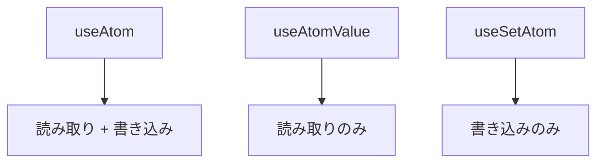
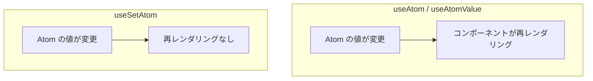
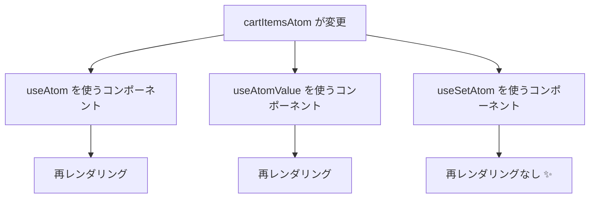
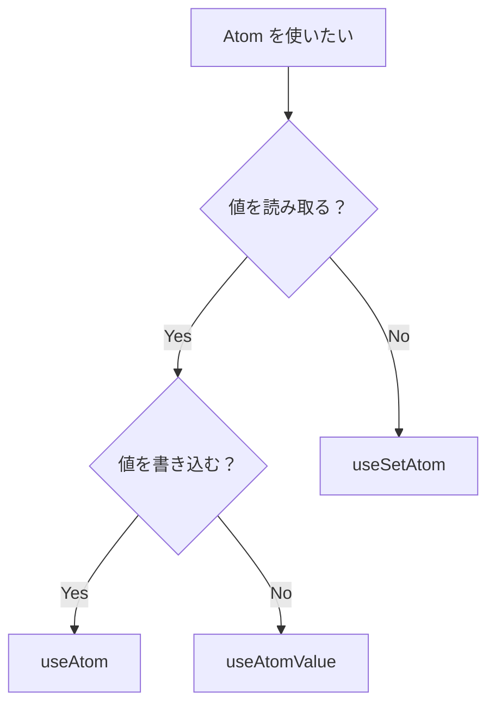

# Jotai フックの使い分け

## 概要

Jotai には 3 つの主要なフックがあります。
それぞれの特徴を理解し、適切に使い分けることでパフォーマンスを最適化できます。



---

## 3 つのフックの比較

| フック       | 読み取り | 書き込み | 再レンダリング   |
| ------------ | -------- | -------- | ---------------- |
| useAtom      | ✅       | ✅       | 値が変わると発生 |
| useAtomValue | ✅       | ❌       | 値が変わると発生 |
| useSetAtom   | ❌       | ✅       | 発生しない       |

---

## useAtom

### 基本的な使い方

`useAtom` は読み取りと書き込みの両方を行う場合に使用します。

```typescript
import { useAtom } from "jotai";

function Counter(): JSX.Element {
  const [count, setCount] = useAtom(countAtom);

  return (
    <div>
      <p>カウント: {count}</p>
      <button onClick={() => setCount((c) => c + 1)}>増やす</button>
    </div>
  );
}
```

### 戻り値

```typescript
const [value, setValue] = useAtom(someAtom);
// value: Atom の現在の値
// setValue: 値を更新する関数
```

### 使いどころ

- 値の表示と更新の両方が必要な場合
- フォームの入力フィールド
- トグルボタン（状態を表示しつつ切り替える）

---

## useAtomValue

### 基本的な使い方

`useAtomValue` は読み取りのみを行う場合に使用します。

```typescript
import { useAtomValue } from "jotai";

function CartTotal(): JSX.Element {
  const total = useAtomValue(cartTotalAtom);

  return <p>合計: ¥{total.toLocaleString()}</p>;
}
```

### 戻り値

```typescript
const value = useAtomValue(someAtom);
// value: Atom の現在の値
```

### 使いどころ

- 値を表示するだけで更新しないコンポーネント
- 派生 Atom の値を読み取る場合
- ヘッダーのカート数表示など

### パフォーマンス上のメリット

```typescript
// useAtom を使うと、setValue が不要でも関数オブジェクトが作成される
const [value, _setValue] = useAtom(someAtom);

// useAtomValue を使うと、余分な関数オブジェクトが作成されない
const value = useAtomValue(someAtom);
```

---

## useSetAtom

### 基本的な使い方

`useSetAtom` は書き込みのみを行う場合に使用します。

```typescript
import { useSetAtom } from "jotai";

function AddToCartButton({ product }: { product: Product }): JSX.Element {
  const addToCart = useSetAtom(addToCartAtom);

  return (
    <button onClick={() => addToCart(product)}>
      カートに追加
    </button>
  );
}
```

### 戻り値

```typescript
const setValue = useSetAtom(someAtom);
// setValue: 値を更新する関数
```

### 使いどころ

- イベントハンドラーで状態を更新するだけのコンポーネント
- 「カートに追加」ボタン
- 「お気に入りに追加」ボタン

### パフォーマンス上のメリット

`useSetAtom` は Atom の値が変わっても**再レンダリングされません**。



---

## 実践例：EC サイトでの使い分け

### ヘッダーのカート表示

```tsx
// apps/web/components/Header.tsx
"use client";

import { useAtomValue } from "jotai";
import { cartItemCountAtom } from "@ec/store/cart";

export function Header(): JSX.Element {
  // 読み取りのみなので useAtomValue
  const itemCount = useAtomValue(cartItemCountAtom);

  return (
    <header className="flex items-center justify-between p-4">
      <h1>EC サイト</h1>
      <a
        href="/cart"
        className="relative"
      >
        🛒 カート
        {itemCount > 0 && (
          <span className="absolute -top-2 -right-2 rounded-full bg-red-500 px-2 text-xs text-white">
            {itemCount}
          </span>
        )}
      </a>
    </header>
  );
}
```

### 商品カードの「カートに追加」ボタン

```tsx
// apps/web/components/AddToCartButton.tsx
"use client";

import { useSetAtom } from "jotai";
import { addToCartAtom } from "@ec/store/cart";
import { type Product } from "@ec/shared/types";

type AddToCartButtonProps = {
  product: Product;
  quantity?: number;
};

export function AddToCartButton({ product, quantity = 1 }: AddToCartButtonProps): JSX.Element {
  // 書き込みのみなので useSetAtom（再レンダリングされない）
  const addToCart = useSetAtom(addToCartAtom);

  const handleClick = (): void => {
    addToCart({
      productId: product.id,
      name: product.name,
      price: product.price,
      quantity,
      imageUrl: product.imageUrl,
    });
  };

  return (
    <button
      onClick={handleClick}
      className="rounded bg-blue-500 px-4 py-2 text-white hover:bg-blue-600"
    >
      カートに追加
    </button>
  );
}
```

### カートアイテムの数量変更

```tsx
// apps/web/components/CartItem.tsx
"use client";

import { useAtom, useSetAtom } from "jotai";
import { cartItemsAtom, updateQuantityAtom, removeFromCartAtom } from "@ec/store/cart";
import { type CartItem } from "@ec/store/cart";

type CartItemRowProps = {
  item: CartItem;
};

export function CartItemRow({ item }: CartItemRowProps): JSX.Element {
  // 書き込みのみなので useSetAtom を使う（値は item props から取得）
  const updateQuantity = useSetAtom(updateQuantityAtom);
  const removeFromCart = useSetAtom(removeFromCartAtom);

  return (
    <div className="flex items-center justify-between border-b py-4">
      <div className="flex items-center gap-4">
        
        <div>
          <h3 className="font-bold">{item.name}</h3>
          <p>¥{item.price.toLocaleString()}</p>
        </div>
      </div>
      <div className="flex items-center gap-4">
        <select
          value={item.quantity}
          onChange={(e) =>
            updateQuantity({
              productId: item.productId,
              quantity: parseInt(e.target.value, 10),
            })
          }
          className="rounded border px-2 py-1"
        >
          {[1, 2, 3, 4, 5, 6, 7, 8, 9, 10].map((n) => (
            <option
              key={n}
              value={n}
            >
              {n}
            </option>
          ))}
        </select>
        <button
          onClick={() => removeFromCart(item.productId)}
          className="text-red-500 hover:text-red-700"
        >
          削除
        </button>
      </div>
    </div>
  );
}
```

---

## パフォーマンス最適化

### 問題：不要な再レンダリング



### 最適化の例

```tsx
// ❌ 悪い例：useAtom で書き込みしか使わない
function AddButton(): JSX.Element {
  const [_, setCount] = useAtom(countAtom);
  // countAtom が変わるたびに再レンダリングされる
  return <button onClick={() => setCount((c) => c + 1)}>追加</button>;
}

// ✅ 良い例：useSetAtom を使う
function AddButton(): JSX.Element {
  const setCount = useSetAtom(countAtom);
  // countAtom が変わっても再レンダリングされない
  return <button onClick={() => setCount((c) => c + 1)}>追加</button>;
}
```

---

## 使い分けのフローチャート



### 判断基準

| 質問                     | はい                 | いいえ               |
| ------------------------ | -------------------- | -------------------- |
| 値を表示する必要がある？ | useAtom/useAtomValue | useSetAtom           |
| 値を更新する必要がある？ | useAtom/useSetAtom   | useAtomValue         |
| 両方必要？               | useAtom              | 読み取り or 書き込み |

---

## よくあるパターン

### パターン 1: 表示専用コンポーネント

```typescript
// カート合計金額を表示するだけ
function CartSummary(): JSX.Element {
  const subtotal = useAtomValue(cartSubtotalAtom);
  const tax = useAtomValue(cartTaxAtom);
  const total = useAtomValue(cartTotalAtom);

  return (
    <div>
      <p>小計: ¥{subtotal.toLocaleString()}</p>
      <p>税: ¥{tax.toLocaleString()}</p>
      <p>合計: ¥{total.toLocaleString()}</p>
    </div>
  );
}
```

### パターン 2: アクション専用コンポーネント

```typescript
// カートをクリアするボタン
function ClearCartButton(): JSX.Element {
  const clearCart = useSetAtom(clearCartAtom);

  return (
    <button onClick={clearCart} className="text-red-500">
      カートを空にする
    </button>
  );
}
```

### パターン 3: 入力フォーム

```typescript
// 検索キーワード入力
function SearchInput(): JSX.Element {
  const [keyword, setKeyword] = useAtom(searchKeywordAtom);

  return (
    <input
      type="text"
      value={keyword}
      onChange={(e) => setKeyword(e.target.value)}
      placeholder="検索..."
    />
  );
}
```

---

## アンチパターン

### 1. すべてに useAtom を使う

```typescript
// ❌ 悪い例
function BadComponent(): JSX.Element {
  const [value, _] = useAtom(someAtom); // 書き込みを使っていない
  const [_, setValue] = useAtom(someAtom); // 読み取りを使っていない

  return <div>{value}</div>;
}

// ✅ 良い例
function GoodComponent(): JSX.Element {
  const value = useAtomValue(someAtom);
  const setValue = useSetAtom(someAtom);

  return <div>{value}</div>;
}
```

### 2. 読み取り専用 Atom に useAtom を使う

```typescript
// ❌ 悪い例：派生 Atom に書き込みはできない
const [total, setTotal] = useAtom(cartTotalAtom);
// setTotal は使えないが、コードからはわかりにくい

// ✅ 良い例：読み取り専用であることが明確
const total = useAtomValue(cartTotalAtom);
```

### 3. コンポーネントの責務が不明確

```typescript
// ❌ 悪い例：1 つのコンポーネントで複数の責務
function CartItem(): JSX.Element {
  const [items, setItems] = useAtom(cartItemsAtom);
  const [favorites, setFavorites] = useAtom(favoritesAtom);
  // カートとお気に入り両方を管理

  return (/* ... */);
}

// ✅ 良い例：責務を分割
function CartItemList(): JSX.Element {
  const items = useAtomValue(cartItemsAtom);
  return (/* カート表示のみ */);
}

function CartActions(): JSX.Element {
  const updateCart = useSetAtom(updateCartAtom);
  return (/* カート操作のみ */);
}
```

---

## まとめ

### フックの選択基準

| 状況                     | 使用するフック |
| ------------------------ | -------------- |
| 値の表示と更新が必要     | useAtom        |
| 値の表示のみ             | useAtomValue   |
| 値の更新のみ             | useSetAtom     |
| 派生 Atom の読み取り     | useAtomValue   |
| イベントハンドラーで更新 | useSetAtom     |

### パフォーマンスのポイント

- `useSetAtom` は再レンダリングを引き起こさない
- 必要なフックを選ぶことで不要な再レンダリングを防げる
- コンポーネントの責務を明確にすることで最適なフックを選びやすくなる

---

## 次のステップ

フックの使い分けを理解したら、[演習 1: ショッピングカート](./exercises/01-cart.md) に進んで、学んだ知識を実践しましょう。
