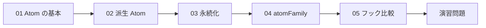
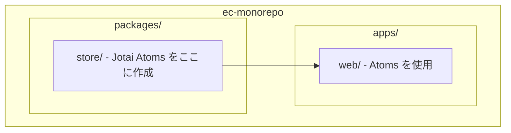

# Phase 4: 状態管理（Jotai）

## 目次

- [概要](#概要)
- [難易度](#難易度)
- [所要時間目安](#所要時間目安)
- [前提知識](#前提知識)
- [学習目標](#学習目標)
- [目次](#目次-1)
  - [学習フロー](#学習フロー)
- [演習問題](#演習問題)
- [作業場所](#作業場所)
- [使用ツール](#使用ツール)
- [関連する EC サイト機能](#関連する-ec-サイト機能)
- [推奨学習リソース](#推奨学習リソース)
  - [公式ドキュメント](#公式ドキュメント)
  - [参考記事](#参考記事)
  - [動画教材](#動画教材)
- [自己チェックリスト](#自己チェックリスト)
- [次のフェーズ](#次のフェーズ)

## 概要

Jotai を使ったグローバル状態管理をマスターするフェーズです。
EC サイトに必須のショッピングカート、お気に入り、閲覧履歴などの機能を、Jotai を使って実装します。

---

## 難易度

難易度: 3/5（中級）

React の基本（useState / useEffect）を理解していれば、比較的スムーズに習得できます。

---

## 所要時間目安

約 6〜8 時間です。

---

## 前提知識

- Phase 1〜3 を完了していること
- React の useState / useEffect を理解していること
- TypeScript の基本を理解していること
- コンポーネント間のデータの流れを理解していること

---

## 学習目標

このフェーズを完了すると、以下ができるようになります。

- [ ] Jotai の基本概念（Atom）を説明できる
- [ ] primitive atom と derived atom の違いを理解している
- [ ] atomWithStorage で状態を localStorage に永続化できる
- [ ] atomFamily で動的な Atom を作成できる
- [ ] useAtom / useAtomValue / useSetAtom を適切に使い分けられる
- [ ] ショッピングカート機能を Jotai で実装できる

---

## 目次

1. [Atom の基本](./01-jotai-basics.md)
2. [派生 Atom](./02-derived-atoms.md)
3. [永続化（atomWithStorage）](./03-atom-with-storage.md)
4. [動的 Atom（atomFamily）](./04-atom-family.md)
5. [フックの使い分け](./05-hooks-comparison.md)

### 学習フロー

---

## 演習問題

- [演習 1: ショッピングカート](./exercises/01-cart.md)
- [演習 2: お気に入り機能](./exercises/02-favorites.md)
- [演習 3: 最近見た商品](./exercises/03-recently-viewed.md)

---

## 作業場所

このフェーズでは主に以下のディレクトリで作業します。

- `packages/store` - Jotai の Atom を定義
- `apps/web` - Atom を使用するコンポーネント

---

## 使用ツール

| ツール | バージョン | 用途                           |
| ------ | ---------- | ------------------------------ |
| Jotai  | 2.x        | 状態管理ライブラリ             |
| React  | 19+        | UI ライブラリ                  |
| Zod    | 4.x        | 型定義とバリデーション（任意） |

---

## 関連する EC サイト機能

このフェーズで学ぶ内容は、以下の EC 機能に直接関連します。

| EC 機能            | 使用する Jotai 機能 | 説明                       |
| ------------------ | ------------------- | -------------------------- |
| ショッピングカート | atomWithStorage     | カート内容を永続化         |
| お気に入り         | atomWithStorage     | お気に入り商品を永続化     |
| 最近見た商品       | atomWithStorage     | 閲覧履歴を永続化           |
| カート合計金額     | derived atom        | カート内容から自動計算     |
| 商品数量変更       | atomFamily          | 商品ごとに個別の状態を管理 |

---

## 推奨学習リソース

### 公式ドキュメント

- [Jotai 公式ドキュメント](https://jotai.org/)
- [Jotai GitHub](https://github.com/pmndrs/jotai)

### 参考記事

- [Jotai 入門 - シンプルで強力な状態管理](https://zenn.dev/topics/jotai)
- [React 状態管理ライブラリ比較](https://zenn.dev/topics/react)

### 動画教材

- [Jotai 公式 YouTube チャンネル](https://www.youtube.com/@jotaijs)

---

## 自己チェックリスト

Phase 4 を完了する前に、以下を確認してください。

- [ ] Atom の作成と使用方法を理解している
- [ ] primitive atom と derived atom の違いを説明できる
- [ ] atomWithStorage を使って状態を永続化できる
- [ ] atomFamily でパラメータ付き Atom を作成できる
- [ ] useAtom / useAtomValue / useSetAtom の使い分けを理解している
- [ ] ショッピングカート機能が動作している
- [ ] お気に入り機能が動作している
- [ ] 最近見た商品機能が動作している

---

## 次のフェーズ

Phase 4 を完了したら、[Phase 5: データ取得 + MSW モック](../phase-05-data-fetching/README.md) に進みましょう。
