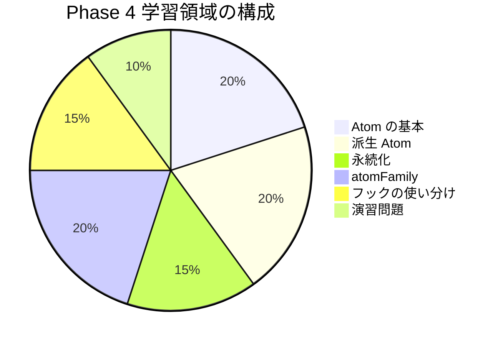

# Phase 4: 自己チェックリスト

Phase 4 の理解度を確認するためのチェックリストです。
各項目を確認し、自信を持って「はい」と答えられるか確認してください。

## 目次

- [学習領域の概要](#学習領域の概要)
- [Jotai の基本](#jotai-の基本)
  - [理解度チェック](#理解度チェック)
  - [確認質問](#確認質問)
- [派生 Atom](#派生-atom)
  - [理解度チェック](#理解度チェック-1)
  - [確認質問](#確認質問-1)
- [永続化（atomWithStorage）](#永続化atomwithstorage)
  - [理解度チェック](#理解度チェック-2)
  - [確認質問](#確認質問-2)
- [atomFamily](#atomfamily)
  - [理解度チェック](#理解度チェック-3)
  - [確認質問](#確認質問-3)
- [フックの使い分け](#フックの使い分け)
  - [理解度チェック](#理解度チェック-4)
  - [確認質問](#確認質問-4)
- [演習問題](#演習問題)
  - [実装チェック](#実装チェック)
  - [コードレビュー](#コードレビュー)
- [総合評価](#総合評価)
  - [達成度の目安](#達成度の目安)
  - [特に重要なポイント](#特に重要なポイント)
- [振り返りチェック](#振り返りチェック)
- [次のステップ](#次のステップ)

## 学習領域の概要



---

## Jotai の基本

### 理解度チェック

- [ ] Jotai の特徴を 3 つ以上挙げられる
- [ ] Atom の概念を説明できる
- [ ] `atom()` 関数で Atom を作成できる
- [ ] `useAtom` フックの使い方を理解している
- [ ] Atom をコンポーネントの外で定義する理由を説明できる

### 確認質問

1. Jotai と Redux の違いは何ですか？

   **回答例**: Jotai はボイラープレートが少なく、Action や Reducer を定義する必要がない。Atom 単位で状態を管理し、必要な Atom だけを購読できる。

2. Atom をコンポーネントの外で定義する理由は？

   **回答例**: コンポーネント内で定義すると、レンダリングのたびに新しい Atom が作成されてしまい、状態が共有されないため。

---

## 派生 Atom

### 理解度チェック

- [ ] 派生 Atom の概念を説明できる
- [ ] `get` 関数の使い方を理解している
- [ ] 読み取り専用の派生 Atom を作成できる
- [ ] 書き込み可能な派生 Atom を作成できる
- [ ] 派生 Atom の依存関係の自動追跡を理解している

### 確認質問

1. 派生 Atom はどのような場合に使いますか？

   **回答例**: 他の Atom の値から計算される値を管理したい場合。例えば、カートアイテムから合計金額を計算する場合。

2. `atom((get) => ...)` と `atom(null, (get, set, ...) => ...)` の違いは？

   **回答例**: 前者は読み取り専用の派生 Atom、後者は書き込み専用の Action Atom。両方を組み合わせて読み書き可能な派生 Atom も作成できる。

---

## 永続化（atomWithStorage）

### 理解度チェック

- [ ] `atomWithStorage` の使い方を理解している
- [ ] localStorage と sessionStorage の違いを説明できる
- [ ] SSR での Hydration Mismatch 問題を理解している
- [ ] カスタムストレージの作成方法を知っている

### 確認質問

1. `atomWithStorage` はどこからインポートしますか？

   **回答例**: `jotai/utils`

2. SSR で Hydration Mismatch が発生する原因と対策は？

   **回答例**: サーバー側では localStorage にアクセスできないため、サーバーとクライアントで値が異なる。対策として、`"use client"` を使う、Suspense でラップする、クライアントサイドでのみ表示するなど。

---

## atomFamily

### 理解度チェック

- [ ] atomFamily の概念を説明できる
- [ ] パラメータ付き Atom を作成できる
- [ ] 等価性関数の必要性を理解している
- [ ] Atom のキャッシュについて理解している

### 確認質問

1. atomFamily はどのような場合に使いますか？

   **回答例**: 同じ構造の Atom を動的に複数作成したい場合。例えば、商品 ID ごとに個別の数量を管理する場合。

2. オブジェクトをパラメータにする場合、なぜ等価性関数が必要ですか？

   **回答例**: JavaScript では `{a: 1} !== {a: 1}` なので、毎回新しい Atom が作成されてしまう。等価性関数を使って、値が同じなら同じ Atom を返すようにする。

---

## フックの使い分け

### 理解度チェック

- [ ] `useAtom` の使いどころを理解している
- [ ] `useAtomValue` の使いどころを理解している
- [ ] `useSetAtom` の使いどころを理解している
- [ ] 各フックのパフォーマンス特性を説明できる

### 確認質問

1. `useSetAtom` を使うメリットは何ですか？

   **回答例**: Atom の値が変わっても再レンダリングされないため、パフォーマンスが向上する。イベントハンドラーで状態を更新するだけのコンポーネントに適している。

2. 以下のコードの問題点は？

   ```typescript
   function Button(): JSX.Element {
     const [_, setCount] = useAtom(countAtom);
     return <button onClick={() => setCount((c) => c + 1)}>+</button>;
   }
   ```

   **回答例**: 値を使っていないのに `useAtom` を使っているため、`countAtom` が変わるたびに再レンダリングされる。`useSetAtom` を使うべき。

---

## 演習問題

### 実装チェック

- [ ] ショッピングカート機能が動作する
- [ ] お気に入り機能が動作する
- [ ] 最近見た商品機能が動作する
- [ ] すべての機能でリロードしてもデータが保持される

### コードレビュー

自分のコードを以下の観点で確認してください。

- [ ] Atom はコンポーネントの外で定義している
- [ ] 読み取りのみは useAtomValue、書き込みのみは useSetAtom を使用している
- [ ] 派生 Atom を使って計算ロジックを分離している
- [ ] TypeScript の型が正しく設定されている

---

## 総合評価

### 達成度の目安

| 達成率    | 評価                                   |
| --------- | -------------------------------------- |
| 90% 以上  | 素晴らしい！Phase 5 に進みましょう     |
| 70% - 89% | 良好。不安な部分を復習してから進む     |
| 50% - 69% | 該当するドキュメントを再読してください |
| 50% 未満  | 最初からもう一度取り組みましょう       |

### 特に重要なポイント

1. **Atom の作成場所**
   - コンポーネントの外で定義すること

2. **フックの選択**
   - 読み取りのみ → `useAtomValue`
   - 書き込みのみ → `useSetAtom`
   - 両方 → `useAtom`

3. **永続化**
   - `atomWithStorage` で localStorage に保存
   - SSR 時の注意点を理解

4. **派生 Atom**
   - 計算ロジックを Atom に分離
   - 依存関係の自動追跡

---

## 振り返りチェック

以下の質問に答えられますか？

1. **Jotai を選んだ理由を説明できるか**

2. **カート機能の実装で、どのような Atom を作成したか**

3. **パフォーマンス最適化のために、どのような工夫をしたか**

4. **実装中に遭遇した問題と、その解決方法**

---

## 次のステップ

チェックリストを確認して理解度に自信が持てたら、[Phase 5: データ取得 + MSW モック](../phase-05-data-fetching/README.md) に進みましょう。

Phase 5 では、Server Components でのデータ取得と MSW を使った API モックを学びます。
Phase 4 で学んだ状態管理と組み合わせることで、より実践的なアプリケーションを構築できるようになります。
