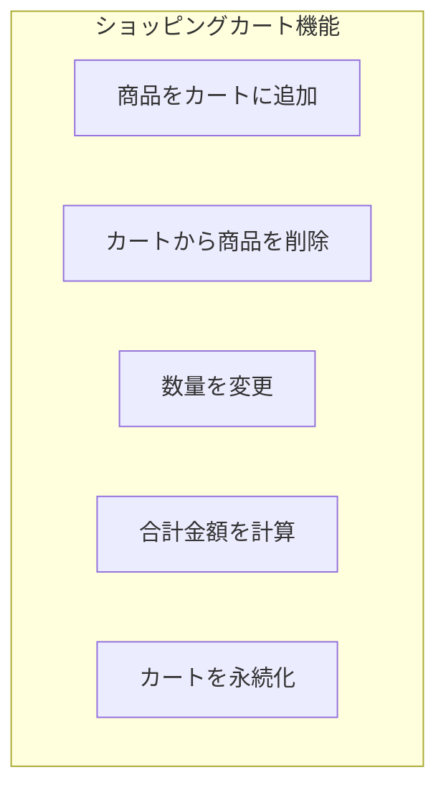

# 演習 1: ショッピングカート

## 目次

- [目標](#目標)
- [実装する機能](#実装する機能)
- [前提条件](#前提条件)
- [ステップ 1: 型定義を作成](#ステップ-1-型定義を作成)
  - [1.1 商品の型を定義](#11-商品の型を定義)
  - [1.2 カートアイテムの型を定義](#12-カートアイテムの型を定義)
- [ステップ 2: Jotai をインストール](#ステップ-2-jotai-をインストール)
  - [2.1 パッケージに Jotai を追加](#21-パッケージに-jotai-を追加)
  - [2.2 package.json を確認](#22-packagejson-を確認)
- [ステップ 3: カート Atom を作成](#ステップ-3-カート-atom-を作成)
  - [3.1 基本の Atom を作成](#31-基本の-atom-を作成)
  - [3.2 派生 Atom を作成](#32-派生-atom-を作成)
  - [3.3 アクション Atom を作成](#33-アクション-atom-を作成)
- [ステップ 4: エクスポート設定](#ステップ-4-エクスポート設定)
  - [4.1 インデックスファイルを作成](#41-インデックスファイルを作成)
- [ステップ 5: コンポーネントを作成](#ステップ-5-コンポーネントを作成)
  - [5.1 カートに追加ボタン](#51-カートに追加ボタン)
  - [5.2 カートアイコン（ヘッダー用）](#52-カートアイコンヘッダー用)
  - [5.3 カートアイテム行](#53-カートアイテム行)
  - [5.4 カートサマリー](#54-カートサマリー)
- [ステップ 6: カートページを作成](#ステップ-6-カートページを作成)
- [確認チェックリスト](#確認チェックリスト)
- [トラブルシューティング](#トラブルシューティング)
  - [localStorage が動作しない](#localstorage-が動作しない)
  - [Hydration Mismatch エラー](#hydration-mismatch-エラー)
- [発展課題](#発展課題)
- [完了条件](#完了条件)

## 目標

Jotaiを使ってショッピングカート機能を実装します。
このエクササイズでは、Atomの基本、派生Atom、永続化の知識を総合的に活用します。

***

## 実装する機能



- カートへの商品追加
- カートから商品を削除
- 商品の数量変更
- カート内の合計金額計算
- カート内容をlocalStorageに永続化

***

## 前提条件

以下の環境が整っていることを確認してください。

```bash
# Node.js 24+
node --version

# pnpm 10+
pnpm --version

# 開発サーバーが起動できること
pnpm dev
```

***

## ステップ 1: 型定義を作成

### 1.1 商品の型を定義

```typescript
// packages/shared/src/types/product.ts
export type Product = {
  id: string;
  name: string;
  price: number;
  description: string;
  imageUrl: string;
  categoryId: string;
};
```

### 1.2 カートアイテムの型を定義

```typescript
// packages/store/src/types/cart.ts
export type CartItem = {
  productId: string;
  name: string;
  price: number;
  quantity: number;
  imageUrl: string;
};
```

***

## ステップ 2: Jotai をインストール

### 2.1 パッケージに Jotai を追加

```bash
# packages/store に Jotai をインストール
cd packages/store
pnpm add jotai
```

### 2.2 package.json を確認

```json
// packages/store/package.json
{
  "name": "@ec/store",
  "version": "0.0.1",
  "private": true,
  "exports": {
    ".": "./src/index.ts",
    "./cart": "./src/cart.ts"
  },
  "dependencies": {
    "jotai": "^2.0.0"
  },
  "devDependencies": {
    "@ec/typescript-config": "workspace:*",
    "typescript": "^5.9.0"
  }
}
```

***

## ステップ 3: カート Atom を作成

### 3.1 基本の Atom を作成

```typescript
// packages/store/src/cart.ts
import { atom } from "jotai";
import { atomWithStorage } from "jotai/utils";

// カートアイテムの型
export type CartItem = {
  productId: string;
  name: string;
  price: number;
  quantity: number;
  imageUrl: string;
};

// カートアイテムを管理する Atom（localStorage に永続化）
export const cartItemsAtom = atomWithStorage<CartItem[]>("ec-cart", []);
```

### 3.2 派生 Atom を作成

```typescript
// packages/store/src/cart.ts（続き）

// カート内の合計アイテム数
export const cartItemCountAtom = atom((get) => {
  const items = get(cartItemsAtom);
  return items.reduce((sum, item) => sum + item.quantity, 0);
});

// カートの小計（税抜）
export const cartSubtotalAtom = atom((get) => {
  const items = get(cartItemsAtom);
  return items.reduce((sum, item) => sum + item.price * item.quantity, 0);
});

// 消費税率
export const taxRateAtom = atom(0.1);

// 消費税額
export const cartTaxAtom = atom((get) => {
  const subtotal = get(cartSubtotalAtom);
  const taxRate = get(taxRateAtom);
  return Math.floor(subtotal * taxRate);
});

// 合計金額（税込）
export const cartTotalAtom = atom((get) => {
  const subtotal = get(cartSubtotalAtom);
  const tax = get(cartTaxAtom);
  return subtotal + tax;
});
```

### 3.3 アクション Atom を作成

```typescript
// packages/store/src/cart.ts（続き）

// カートに商品を追加
export const addToCartAtom = atom(null, (get, set, newItem: CartItem) => {
  const items = get(cartItemsAtom);
  const existingItem = items.find((item) => item.productId === newItem.productId);

  if (existingItem) {
    // 既存アイテムの数量を増やす
    const updatedItems = items.map((item) =>
      item.productId === newItem.productId
        ? { ...item, quantity: item.quantity + newItem.quantity }
        : item
    );
    set(cartItemsAtom, updatedItems);
  } else {
    // 新しいアイテムを追加
    set(cartItemsAtom, [...items, newItem]);
  }
});

// カートから商品を削除
export const removeFromCartAtom = atom(null, (get, set, productId: string) => {
  const items = get(cartItemsAtom);
  const filteredItems = items.filter((item) => item.productId !== productId);
  set(cartItemsAtom, filteredItems);
});

// 商品の数量を更新
export const updateQuantityAtom = atom(
  null,
  (get, set, { productId, quantity }: { productId: string; quantity: number }) => {
    if (quantity <= 0) {
      // 0 以下の場合は削除
      const items = get(cartItemsAtom);
      set(
        cartItemsAtom,
        items.filter((item) => item.productId !== productId)
      );
      return;
    }

    const items = get(cartItemsAtom);
    const updatedItems = items.map((item) =>
      item.productId === productId ? { ...item, quantity } : item
    );
    set(cartItemsAtom, updatedItems);
  }
);

// カートをクリア
export const clearCartAtom = atom(null, (_get, set) => {
  set(cartItemsAtom, []);
});
```

***

## ステップ 4: エクスポート設定

### 4.1 インデックスファイルを作成

```typescript
// packages/store/src/index.ts
export * from "./cart";
```

***

## ステップ 5: コンポーネントを作成

### 5.1 カートに追加ボタン

```tsx
// apps/web/components/AddToCartButton.tsx
"use client";

import { useSetAtom } from "jotai";
import { addToCartAtom, type CartItem } from "@ec/store/cart";

type AddToCartButtonProps = {
  product: {
    id: string;
    name: string;
    price: number;
    imageUrl: string;
  };
  quantity?: number;
};

export function AddToCartButton({ product, quantity = 1 }: AddToCartButtonProps): JSX.Element {
  const addToCart = useSetAtom(addToCartAtom);

  const handleClick = (): void => {
    const cartItem: CartItem = {
      productId: product.id,
      name: product.name,
      price: product.price,
      quantity,
      imageUrl: product.imageUrl,
    };
    addToCart(cartItem);
  };

  return (
    <button
      onClick={handleClick}
      className="rounded bg-blue-500 px-4 py-2 text-white hover:bg-blue-600"
    >
      カートに追加
    </button>
  );
}
```

### 5.2 カートアイコン（ヘッダー用）

```tsx
// apps/web/components/CartIcon.tsx
"use client";

import { useAtomValue } from "jotai";
import { cartItemCountAtom } from "@ec/store/cart";
import Link from "next/link";

export function CartIcon(): JSX.Element {
  const itemCount = useAtomValue(cartItemCountAtom);

  return (
    <Link
      href="/cart"
      className="relative"
    >
      <span className="text-2xl">🛒</span>
      {itemCount > 0 && (
        <span className="absolute -top-2 -right-2 flex h-5 w-5 items-center justify-center rounded-full bg-red-500 text-xs text-white">
          {itemCount > 99 ? "99+" : itemCount}
        </span>
      )}
    </Link>
  );
}
```

### 5.3 カートアイテム行

```tsx
// apps/web/components/CartItemRow.tsx
"use client";

import { useSetAtom } from "jotai";
import { updateQuantityAtom, removeFromCartAtom, type CartItem } from "@ec/store/cart";

type CartItemRowProps = {
  item: CartItem;
};

export function CartItemRow({ item }: CartItemRowProps): JSX.Element {
  const updateQuantity = useSetAtom(updateQuantityAtom);
  const removeFromCart = useSetAtom(removeFromCartAtom);

  const handleQuantityChange = (e: React.ChangeEvent<HTMLSelectElement>): void => {
    const quantity = parseInt(e.target.value, 10);
    updateQuantity({ productId: item.productId, quantity });
  };

  const handleRemove = (): void => {
    removeFromCart(item.productId);
  };

  return (
    <div className="flex items-center justify-between border-b py-4">
      <div className="flex items-center gap-4">
        
        <div>
          <h3 className="font-bold">{item.name}</h3>
          <p className="text-gray-600">¥{item.price.toLocaleString()}</p>
        </div>
      </div>
      <div className="flex items-center gap-4">
        <select
          value={item.quantity}
          onChange={handleQuantityChange}
          className="rounded border px-3 py-1"
        >
          {Array.from({ length: 10 }, (_, i) => i + 1).map((n) => (
            <option
              key={n}
              value={n}
            >
              {n}
            </option>
          ))}
        </select>
        <p className="min-w-24 text-right font-bold">
          ¥{(item.price * item.quantity).toLocaleString()}
        </p>
        <button
          onClick={handleRemove}
          className="text-red-500 hover:text-red-700"
          aria-label="削除"
        >
          🗑️
        </button>
      </div>
    </div>
  );
}
```

### 5.4 カートサマリー

```tsx
// apps/web/components/CartSummary.tsx
"use client";

import { useAtomValue, useSetAtom } from "jotai";
import { cartSubtotalAtom, cartTaxAtom, cartTotalAtom, clearCartAtom } from "@ec/store/cart";

export function CartSummary(): JSX.Element {
  const subtotal = useAtomValue(cartSubtotalAtom);
  const tax = useAtomValue(cartTaxAtom);
  const total = useAtomValue(cartTotalAtom);
  const clearCart = useSetAtom(clearCartAtom);

  return (
    <div className="rounded bg-gray-100 p-4">
      <h2 className="mb-4 text-xl font-bold">注文概要</h2>
      <div className="space-y-2">
        <div className="flex justify-between">
          <span>小計</span>
          <span>¥{subtotal.toLocaleString()}</span>
        </div>
        <div className="flex justify-between">
          <span>消費税（10%）</span>
          <span>¥{tax.toLocaleString()}</span>
        </div>
        <div className="flex justify-between border-t pt-2 text-xl font-bold">
          <span>合計</span>
          <span>¥{total.toLocaleString()}</span>
        </div>
      </div>
      <button className="mt-4 w-full rounded bg-green-500 py-3 text-white hover:bg-green-600">
        購入手続きへ
      </button>
      <button
        onClick={clearCart}
        className="mt-2 w-full rounded border py-2 text-gray-600 hover:bg-gray-50"
      >
        カートを空にする
      </button>
    </div>
  );
}
```

***

## ステップ 6: カートページを作成

```tsx
// apps/web/app/cart/page.tsx
"use client";

import { useAtomValue } from "jotai";
import { cartItemsAtom } from "@ec/store/cart";
import { CartItemRow } from "@/components/CartItemRow";
import { CartSummary } from "@/components/CartSummary";
import Link from "next/link";

export default function CartPage(): JSX.Element {
  const items = useAtomValue(cartItemsAtom);

  if (items.length === 0) {
    return (
      <div className="flex flex-col items-center justify-center py-20">
        <p className="mb-4 text-xl text-gray-600">カートは空です</p>
        <Link
          href="/products"
          className="rounded bg-blue-500 px-6 py-2 text-white hover:bg-blue-600"
        >
          商品を見る
        </Link>
      </div>
    );
  }

  return (
    <div className="container mx-auto px-4 py-8">
      <h1 className="mb-8 text-2xl font-bold">ショッピングカート</h1>
      <div className="grid gap-8 lg:grid-cols-3">
        <div className="lg:col-span-2">
          {items.map((item) => (
            <CartItemRow
              key={item.productId}
              item={item}
            />
          ))}
        </div>
        <div>
          <CartSummary />
        </div>
      </div>
    </div>
  );
}
```

***

## 確認チェックリスト

以下を確認してください。

- [ ] 商品をカートに追加できる
- [ ] カートページで商品一覧が表示される
- [ ] 商品の数量を変更できる
- [ ] 商品を削除できる
- [ ] 小計、消費税、合計金額が正しく計算される
- [ ] ページをリロードしてもカートの内容が保持される
- [ ] カートを空にできる
- [ ] カートが空のときに「カートは空です」のメッセージが表示される

***

## トラブルシューティング

### localStorage が動作しない

SSR環境ではlocalStorageにアクセスできません。
`"use client"` ディレクティブが付いているか確認してください。

### Hydration Mismatch エラー

サーバーとクライアントで値が異なる場合に発生します。
Suspenseでラップするか、クライアントサイドでのみ表示するようにしてください。

```tsx
"use client";

import { useEffect, useState } from "react";

export function ClientOnly({ children }: { children: React.ReactNode }): JSX.Element | null {
  const [isMounted, setIsMounted] = useState(false);

  useEffect(() => {
    setIsMounted(true);
  }, []);

  if (!isMounted) return null;

  return <>{children}</>;
}
```

***

## 発展課題

1. **数量制限の追加**
   - 在庫数を超えて追加できないようにする

2. **カート追加時のアニメーション**
   - トーストやモーダルで追加完了を表示

3. **undo 機能**
   - 削除した商品を元へ戻せる機能の追加

4. **クーポン適用機能**
   - クーポンコードを入力して割引を適用

***

## 完了条件

以下がすべて動作すれば、この演習は完了です。

- カートへの追加/削除が動作する
- 数量変更が動作する
- 合計金額が正しく計算される
- リロードしてもカートが保持される

次は [演習 2: お気に入り機能](./02-favorites.md) に進みましょう。
