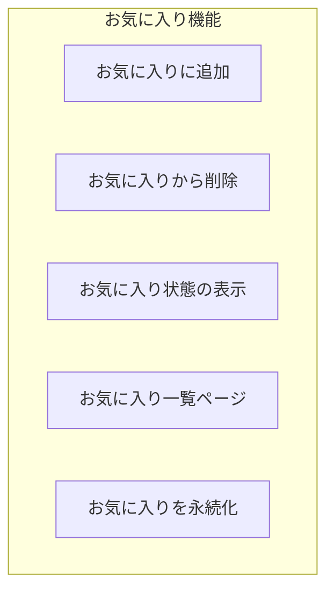

# 演習 2: お気に入り機能

## 目標

Jotai を使ってお気に入り機能を実装します。
atomFamily を活用して、商品ごとのお気に入り状態を効率的に管理します。

---

## 実装する機能



- 商品をお気に入りに追加/削除（トグル）
- お気に入り状態をハートアイコンで表示
- お気に入り一覧ページの作成
- お気に入りデータを localStorage に永続化

---

## 前提条件

- 演習 1（ショッピングカート）を完了していること
- `packages/store` に Jotai がインストールされていること

---

## ステップ 1: お気に入り Atom を作成

### 1.1 基本の Atom を作成

```typescript
// packages/store/src/favorites.ts
import { atom } from "jotai";
import { atomWithStorage } from "jotai/utils";

// お気に入りの商品 ID リストを永続化
export const favoriteIdsAtom = atomWithStorage<string[]>("ec-favorites", []);

// お気に入りの件数
export const favoriteCountAtom = atom((get) => {
  return get(favoriteIdsAtom).length;
});
```

### 1.2 アクション Atom を作成

```typescript
// packages/store/src/favorites.ts（続き）

// お気に入りをトグル（追加/削除）
export const toggleFavoriteAtom = atom(null, (get, set, productId: string) => {
  const favorites = get(favoriteIdsAtom);
  const isFavorite = favorites.includes(productId);

  if (isFavorite) {
    // 削除
    set(
      favoriteIdsAtom,
      favorites.filter((id) => id !== productId)
    );
  } else {
    // 追加
    set(favoriteIdsAtom, [...favorites, productId]);
  }
});

// お気に入りに追加
export const addToFavoritesAtom = atom(null, (get, set, productId: string) => {
  const favorites = get(favoriteIdsAtom);
  if (!favorites.includes(productId)) {
    set(favoriteIdsAtom, [...favorites, productId]);
  }
});

// お気に入りから削除
export const removeFromFavoritesAtom = atom(null, (get, set, productId: string) => {
  const favorites = get(favoriteIdsAtom);
  set(
    favoriteIdsAtom,
    favorites.filter((id) => id !== productId)
  );
});

// すべてのお気に入りをクリア
export const clearFavoritesAtom = atom(null, (_get, set) => {
  set(favoriteIdsAtom, []);
});
```

### 1.3 atomFamily を使った個別チェック

```typescript
// packages/store/src/favorites.ts（続き）
import { atomFamily } from "jotai/utils";

// 商品ごとのお気に入り状態を取得する派生 Atom
export const isFavoriteFamily = atomFamily((productId: string) =>
  atom((get) => {
    const favorites = get(favoriteIdsAtom);
    return favorites.includes(productId);
  })
);

// 商品ごとのトグルアクション
export const toggleFavoriteFamily = atomFamily((productId: string) =>
  atom(null, (get, set) => {
    const favorites = get(favoriteIdsAtom);
    const isFavorite = favorites.includes(productId);

    if (isFavorite) {
      set(
        favoriteIdsAtom,
        favorites.filter((id) => id !== productId)
      );
    } else {
      set(favoriteIdsAtom, [...favorites, productId]);
    }
  })
);
```

---

## ステップ 2: エクスポート設定

```typescript
// packages/store/src/index.ts
export * from "./cart";
export * from "./favorites";
```

---

## ステップ 3: コンポーネントを作成

### 3.1 お気に入りボタン

```tsx
// apps/web/components/FavoriteButton.tsx
"use client";

import { useAtomValue, useSetAtom } from "jotai";
import { isFavoriteFamily, toggleFavoriteFamily } from "@ec/store/favorites";

type FavoriteButtonProps = {
  productId: string;
  size?: "sm" | "md" | "lg";
};

export function FavoriteButton({ productId, size = "md" }: FavoriteButtonProps): JSX.Element {
  const isFavorite = useAtomValue(isFavoriteFamily(productId));
  const toggleFavorite = useSetAtom(toggleFavoriteFamily(productId));

  const sizeClasses = {
    sm: "text-lg",
    md: "text-2xl",
    lg: "text-3xl",
  };

  return (
    <button
      onClick={toggleFavorite}
      className={`transition-transform hover:scale-110 ${sizeClasses[size]}`}
      aria-label={isFavorite ? "お気に入りから削除" : "お気に入りに追加"}
    >
      {isFavorite ? (
        <span className="text-red-500">❤️</span>
      ) : (
        <span className="text-gray-400">🤍</span>
      )}
    </button>
  );
}
```

### 3.2 お気に入り数アイコン（ヘッダー用）

```tsx
// apps/web/components/FavoriteIcon.tsx
"use client";

import { useAtomValue } from "jotai";
import { favoriteCountAtom } from "@ec/store/favorites";
import Link from "next/link";

export function FavoriteIcon(): JSX.Element {
  const count = useAtomValue(favoriteCountAtom);

  return (
    <Link
      href="/favorites"
      className="relative"
    >
      <span className="text-2xl">❤️</span>
      {count > 0 && (
        <span className="absolute -top-2 -right-2 flex h-5 w-5 items-center justify-center rounded-full bg-red-500 text-xs text-white">
          {count > 99 ? "99+" : count}
        </span>
      )}
    </Link>
  );
}
```

### 3.3 お気に入り商品カード

```tsx
// apps/web/components/FavoriteProductCard.tsx
"use client";

import { useSetAtom } from "jotai";
import { removeFromFavoritesAtom } from "@ec/store/favorites";
import { addToCartAtom, type CartItem } from "@ec/store/cart";
import Link from "next/link";

type Product = {
  id: string;
  name: string;
  price: number;
  imageUrl: string;
};

type FavoriteProductCardProps = {
  product: Product;
};

export function FavoriteProductCard({ product }: FavoriteProductCardProps): JSX.Element {
  const removeFromFavorites = useSetAtom(removeFromFavoritesAtom);
  const addToCart = useSetAtom(addToCartAtom);

  const handleRemove = (): void => {
    removeFromFavorites(product.id);
  };

  const handleAddToCart = (): void => {
    const cartItem: CartItem = {
      productId: product.id,
      name: product.name,
      price: product.price,
      quantity: 1,
      imageUrl: product.imageUrl,
    };
    addToCart(cartItem);
  };

  return (
    <div className="rounded border p-4">
      <div className="relative">
        <Link href={`/products/${product.id}`}>
          
        </Link>
        <button
          onClick={handleRemove}
          className="absolute top-2 right-2 rounded-full bg-white p-2 shadow hover:bg-gray-100"
          aria-label="お気に入りから削除"
        >
          ✕
        </button>
      </div>
      <div className="mt-4">
        <Link href={`/products/${product.id}`}>
          <h3 className="font-bold hover:underline">{product.name}</h3>
        </Link>
        <p className="mt-1 text-lg">¥{product.price.toLocaleString()}</p>
        <button
          onClick={handleAddToCart}
          className="mt-4 w-full rounded bg-blue-500 py-2 text-white hover:bg-blue-600"
        >
          カートに追加
        </button>
      </div>
    </div>
  );
}
```

---

## ステップ 4: お気に入り一覧ページを作成

```tsx
// apps/web/app/favorites/page.tsx
"use client";

import { useAtomValue, useSetAtom } from "jotai";
import { favoriteIdsAtom, clearFavoritesAtom } from "@ec/store/favorites";
import { FavoriteProductCard } from "@/components/FavoriteProductCard";
import Link from "next/link";

// モックの商品データ（実際は API から取得）
const mockProducts: Record<string, { id: string; name: string; price: number; imageUrl: string }> =
  {
    "product-1": {
      id: "product-1",
      name: "商品 A",
      price: 1000,
      imageUrl: "/images/product-1.jpg",
    },
    "product-2": {
      id: "product-2",
      name: "商品 B",
      price: 2000,
      imageUrl: "/images/product-2.jpg",
    },
    "product-3": {
      id: "product-3",
      name: "商品 C",
      price: 3000,
      imageUrl: "/images/product-3.jpg",
    },
  };

export default function FavoritesPage(): JSX.Element {
  const favoriteIds = useAtomValue(favoriteIdsAtom);
  const clearFavorites = useSetAtom(clearFavoritesAtom);

  // お気に入りの商品データを取得
  const favoriteProducts = favoriteIds
    .map((id) => mockProducts[id])
    .filter((product): product is NonNullable<typeof product> => Boolean(product));

  if (favoriteProducts.length === 0) {
    return (
      <div className="flex flex-col items-center justify-center py-20">
        <p className="mb-4 text-xl text-gray-600">お気に入りの商品がありません</p>
        <Link
          href="/products"
          className="rounded bg-blue-500 px-6 py-2 text-white hover:bg-blue-600"
        >
          商品を見る
        </Link>
      </div>
    );
  }

  return (
    <div className="container mx-auto px-4 py-8">
      <div className="mb-8 flex items-center justify-between">
        <h1 className="text-2xl font-bold">お気に入り ({favoriteProducts.length})</h1>
        <button
          onClick={clearFavorites}
          className="text-red-500 hover:text-red-700"
        >
          すべて削除
        </button>
      </div>
      <div className="grid gap-6 sm:grid-cols-2 lg:grid-cols-3 xl:grid-cols-4">
        {favoriteProducts.map((product) => (
          <FavoriteProductCard
            key={product.id}
            product={product}
          />
        ))}
      </div>
    </div>
  );
}
```

---

## ステップ 5: 商品カードに統合

```tsx
// apps/web/components/ProductCard.tsx
"use client";

import { FavoriteButton } from "./FavoriteButton";
import { AddToCartButton } from "./AddToCartButton";
import Link from "next/link";

type Product = {
  id: string;
  name: string;
  price: number;
  imageUrl: string;
};

type ProductCardProps = {
  product: Product;
};

export function ProductCard({ product }: ProductCardProps): JSX.Element {
  return (
    <div className="rounded border p-4">
      <div className="relative">
        <Link href={`/products/${product.id}`}>
          
        </Link>
        <div className="absolute top-2 right-2">
          <FavoriteButton productId={product.id} />
        </div>
      </div>
      <div className="mt-4">
        <Link href={`/products/${product.id}`}>
          <h3 className="font-bold hover:underline">{product.name}</h3>
        </Link>
        <p className="mt-1 text-lg">¥{product.price.toLocaleString()}</p>
        <div className="mt-4">
          <AddToCartButton product={product} />
        </div>
      </div>
    </div>
  );
}
```

---

## 確認チェックリスト

以下を確認してください。

- [ ] 商品をお気に入りに追加できる
- [ ] お気に入りから削除できる
- [ ] お気に入り状態がハートアイコンで表示される
- [ ] お気に入り一覧ページが表示される
- [ ] お気に入り一覧からカートに追加できる
- [ ] ページをリロードしてもお気に入りが保持される
- [ ] お気に入りをすべて削除できる

---

## トラブルシューティング

### atomFamily が毎回新しい Atom を返す

パラメータがオブジェクトの場合、参照が異なると別の Atom として扱われます。
プリミティブ値（文字列、数値）を使用してください。

```typescript
// ✅ 良い例：プリミティブ値
const isFavoriteFamily = atomFamily((productId: string) => atom(...));

// ❌ 悪い例：オブジェクト
const isFavoriteFamily = atomFamily((params: { id: string }) => atom(...));
```

### 再レンダリングが多い

`useSetAtom` を使って、値を読み取らないコンポーネントでは再レンダリングを防ぎましょう。

---

## 発展課題

1. **お気に入りの並び替え**
   - 追加日順、名前順で並び替え

2. **お気に入りのカテゴリ分け**
   - カテゴリごとにグループ化して表示

3. **お気に入りの共有**
   - URL でお気に入りリストを共有

4. **お気に入り上限**
   - 最大件数を設定し、超えたら警告

---

## 完了条件

以下がすべて動作すれば、この演習は完了です。

- お気に入りの追加/削除が動作する
- お気に入り状態が正しく表示される
- お気に入り一覧ページが動作する
- リロードしてもお気に入りが保持される

次は [演習 3: 最近見た商品](./03-recently-viewed.md) に進みましょう。
