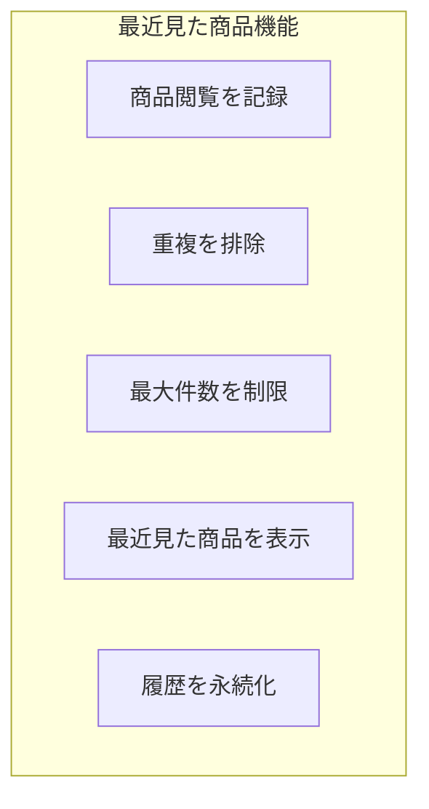

# 演習 3: 最近見た商品

## 目次

- [目標](#目標)
- [実装する機能](#実装する機能)
- [前提条件](#前提条件)
- [ステップ 1: 閲覧履歴 Atom を作成](#ステップ-1-閲覧履歴-atom-を作成)
  - [1.1 型定義](#11-型定義)
  - [1.2 基本の Atom を作成](#12-基本の-atom-を作成)
  - [1.3 アクション Atom を作成](#13-アクション-atom-を作成)
  - [1.4 特定商品を除外する派生 Atom](#14-特定商品を除外する派生-atom)
- [ステップ 2: エクスポート設定](#ステップ-2-エクスポート設定)
- [ステップ 3: 閲覧記録用のフックを作成](#ステップ-3-閲覧記録用のフックを作成)
- [ステップ 4: コンポーネントを作成](#ステップ-4-コンポーネントを作成)
  - [4.1 最近見た商品リスト](#41-最近見た商品リスト)
  - [4.2 最近見た商品カード](#42-最近見た商品カード)
  - [4.3 閲覧履歴を消すボタン](#43-閲覧履歴を消すボタン)
- [ステップ 5: 商品詳細ページに統合](#ステップ-5-商品詳細ページに統合)
- [ステップ 6: トップページに表示](#ステップ-6-トップページに表示)
- [確認チェックリスト](#確認チェックリスト)
- [トラブルシューティング](#トラブルシューティング)
  - [useEffect が 2 回実行される](#useeffect-が-2-回実行される)
  - [タイムスタンプがずれる](#タイムスタンプがずれる)
- [発展課題](#発展課題)
- [完了条件](#完了条件)

## 目標

Jotaiを使って「最近見た商品」機能を実装します。
閲覧履歴の管理、重複排除、最大件数の制限を学びます。

***

## 実装する機能



- 商品詳細ページ閲覧時に履歴を記録
- 同じ商品を見た場合は先頭に移動（重複排除）
- 最大10件に制限
- 最近見た商品をサイドバーやトップページに表示
- 閲覧履歴をlocalStorageに永続化

***

## 前提条件

- 演習1, 2を完了していること
- `packages/store` にJotaiがインストールされていること

***

## ステップ 1: 閲覧履歴 Atom を作成

### 1.1 型定義

```typescript
// packages/store/src/recently-viewed.ts
import { atom } from "jotai";
import { atomWithStorage } from "jotai/utils";

// 閲覧履歴に保存する商品情報
export type RecentlyViewedItem = {
  productId: string;
  name: string;
  price: number;
  imageUrl: string;
  viewedAt: number; // タイムスタンプ
};

// 最大保存件数
const MAX_RECENTLY_VIEWED = 10;
```

### 1.2 基本の Atom を作成

```typescript
// packages/store/src/recently-viewed.ts（続き）

// 閲覧履歴を永続化（新しい順）
export const recentlyViewedItemsAtom = atomWithStorage<RecentlyViewedItem[]>(
  "ec-recently-viewed",
  []
);

// 閲覧履歴の件数
export const recentlyViewedCountAtom = atom((get) => {
  return get(recentlyViewedItemsAtom).length;
});
```

### 1.3 アクション Atom を作成

```typescript
// packages/store/src/recently-viewed.ts（続き）

// 商品を閲覧履歴に追加
export const addToRecentlyViewedAtom = atom(
  null,
  (get, set, product: { productId: string; name: string; price: number; imageUrl: string }) => {
    const items = get(recentlyViewedItemsAtom);

    // 既に存在する場合は削除（後で先頭に追加するため）
    const filteredItems = items.filter((item) => item.productId !== product.productId);

    // 新しいアイテムを作成
    const newItem: RecentlyViewedItem = {
      ...product,
      viewedAt: Date.now(),
    };

    // 先頭に追加し、最大件数に制限
    const updatedItems = [newItem, ...filteredItems].slice(0, MAX_RECENTLY_VIEWED);

    set(recentlyViewedItemsAtom, updatedItems);
  }
);

// 閲覧履歴から削除
export const removeFromRecentlyViewedAtom = atom(null, (get, set, productId: string) => {
  const items = get(recentlyViewedItemsAtom);
  set(
    recentlyViewedItemsAtom,
    items.filter((item) => item.productId !== productId)
  );
});

// 閲覧履歴をクリア
export const clearRecentlyViewedAtom = atom(null, (_get, set) => {
  set(recentlyViewedItemsAtom, []);
});
```

### 1.4 特定商品を除外する派生 Atom

```typescript
// packages/store/src/recently-viewed.ts（続き）

// 現在表示中の商品を除外した閲覧履歴
export const recentlyViewedExceptAtom = atom((get) => {
  const items = get(recentlyViewedItemsAtom);
  return (currentProductId: string): RecentlyViewedItem[] =>
    items.filter((item) => item.productId !== currentProductId);
});
```

***

## ステップ 2: エクスポート設定

```typescript
// packages/store/src/index.ts
export * from "./cart";
export * from "./favorites";
export * from "./recently-viewed";
```

***

## ステップ 3: 閲覧記録用のフックを作成

商品詳細ページで自動的に閲覧履歴を記録するカスタムフックを作成します。

```typescript
// apps/web/hooks/useTrackProductView.ts
"use client";

import { useEffect } from "react";
import { useSetAtom } from "jotai";
import { addToRecentlyViewedAtom } from "@ec/store/recently-viewed";

type Product = {
  id: string;
  name: string;
  price: number;
  imageUrl: string;
};

export function useTrackProductView(product: Product | null): void {
  const addToRecentlyViewed = useSetAtom(addToRecentlyViewedAtom);

  useEffect(() => {
    if (product) {
      addToRecentlyViewed({
        productId: product.id,
        name: product.name,
        price: product.price,
        imageUrl: product.imageUrl,
      });
    }
  }, [product, addToRecentlyViewed]);
}
```

***

## ステップ 4: コンポーネントを作成

### 4.1 最近見た商品リスト

```tsx
// apps/web/components/RecentlyViewedList.tsx
"use client";

import { useAtomValue } from "jotai";
import { recentlyViewedItemsAtom } from "@ec/store/recently-viewed";
import { RecentlyViewedCard } from "./RecentlyViewedCard";

type RecentlyViewedListProps = {
  excludeProductId?: string;
  maxItems?: number;
};

export function RecentlyViewedList({
  excludeProductId,
  maxItems = 5,
}: RecentlyViewedListProps): JSX.Element | null {
  const items = useAtomValue(recentlyViewedItemsAtom);

  // 除外する商品をフィルタリング
  const filteredItems = excludeProductId
    ? items.filter((item) => item.productId !== excludeProductId)
    : items;

  // 表示件数を制限
  const displayItems = filteredItems.slice(0, maxItems);

  if (displayItems.length === 0) {
    return null;
  }

  return (
    <div>
      <h2 className="mb-4 text-lg font-bold">最近見た商品</h2>
      <div className="flex gap-4 overflow-x-auto pb-4">
        {displayItems.map((item) => (
          <RecentlyViewedCard
            key={item.productId}
            item={item}
          />
        ))}
      </div>
    </div>
  );
}
```

### 4.2 最近見た商品カード

```tsx
// apps/web/components/RecentlyViewedCard.tsx
"use client";

import Link from "next/link";
import { type RecentlyViewedItem } from "@ec/store/recently-viewed";

type RecentlyViewedCardProps = {
  item: RecentlyViewedItem;
};

export function RecentlyViewedCard({ item }: RecentlyViewedCardProps): JSX.Element {
  return (
    <Link
      href={`/products/${item.productId}`}
      className="group w-32 flex-shrink-0"
    >
      
      <h3 className="mt-2 truncate text-sm group-hover:underline">{item.name}</h3>
      <p className="text-sm font-bold">¥{item.price.toLocaleString()}</p>
    </Link>
  );
}
```

### 4.3 閲覧履歴を消すボタン

```tsx
// apps/web/components/ClearHistoryButton.tsx
"use client";

import { useSetAtom } from "jotai";
import { clearRecentlyViewedAtom } from "@ec/store/recently-viewed";

export function ClearHistoryButton(): JSX.Element {
  const clearHistory = useSetAtom(clearRecentlyViewedAtom);

  const handleClear = (): void => {
    if (window.confirm("閲覧履歴を削除しますか？")) {
      clearHistory();
    }
  };

  return (
    <button
      onClick={handleClear}
      className="text-sm text-gray-500 hover:text-gray-700"
    >
      履歴をクリア
    </button>
  );
}
```

***

## ステップ 5: 商品詳細ページに統合

```tsx
// apps/web/app/products/[id]/page.tsx
"use client";

import { useParams } from "next/navigation";
import { useEffect, useState } from "react";
import { useTrackProductView } from "@/hooks/useTrackProductView";
import { RecentlyViewedList } from "@/components/RecentlyViewedList";
import { FavoriteButton } from "@/components/FavoriteButton";
import { AddToCartButton } from "@/components/AddToCartButton";

type Product = {
  id: string;
  name: string;
  price: number;
  description: string;
  imageUrl: string;
};

// モックデータ（実際は API から取得）
const mockProducts: Record<string, Product> = {
  "product-1": {
    id: "product-1",
    name: "商品 A",
    price: 1000,
    description: "商品 A の説明です。",
    imageUrl: "/images/product-1.jpg",
  },
  "product-2": {
    id: "product-2",
    name: "商品 B",
    price: 2000,
    description: "商品 B の説明です。",
    imageUrl: "/images/product-2.jpg",
  },
};

export default function ProductDetailPage(): JSX.Element {
  const params = useParams();
  const productId = params.id as string;
  const [product, setProduct] = useState<Product | null>(null);

  // 商品データを取得
  useEffect(() => {
    const fetchedProduct = mockProducts[productId];
    setProduct(fetchedProduct ?? null);
  }, [productId]);

  // 閲覧履歴に記録
  useTrackProductView(product);

  if (!product) {
    return <div className="p-8">商品が見つかりません</div>;
  }

  return (
    <div className="container mx-auto px-4 py-8">
      <div className="grid gap-8 lg:grid-cols-2">
        <div>
          
        </div>
        <div>
          <div className="flex items-start justify-between">
            <h1 className="text-2xl font-bold">{product.name}</h1>
            <FavoriteButton
              productId={product.id}
              size="lg"
            />
          </div>
          <p className="mt-4 text-3xl font-bold">¥{product.price.toLocaleString()}</p>
          <p className="mt-4 text-gray-600">{product.description}</p>
          <div className="mt-8">
            <AddToCartButton product={product} />
          </div>
        </div>
      </div>

      {/* 最近見た商品（現在の商品を除外） */}
      <div className="mt-12">
        <RecentlyViewedList excludeProductId={product.id} />
      </div>
    </div>
  );
}
```

***

## ステップ 6: トップページに表示

```tsx
// apps/web/app/page.tsx
"use client";

import { RecentlyViewedList } from "@/components/RecentlyViewedList";

export default function HomePage(): JSX.Element {
  return (
    <div className="container mx-auto px-4 py-8">
      <h1 className="mb-8 text-3xl font-bold">ようこそ</h1>

      {/* 最近見た商品 */}
      <section className="mt-8">
        <RecentlyViewedList maxItems={5} />
      </section>

      {/* その他のコンテンツ */}
    </div>
  );
}
```

***

## 確認チェックリスト

以下を確認してください。

- [ ] 商品詳細ページを開くと閲覧履歴に追加される
- [ ] 同じ商品を見ると先頭に移動する（重複しない）
- [ ] 最大10件に制限される
- [ ] 商品詳細ページで「最近見た商品」が表示される
- [ ] 現在表示中の商品は「最近見た商品」から除外される
- [ ] ページをリロードしても履歴が保持される
- [ ] 履歴をクリアできる

***

## トラブルシューティング

### useEffect が 2 回実行される

React 18のStrict Modeでは、開発環境でuseEffectが2回実行されます。
これは正常な動作であり、本番環境では1回のみ実行されます。

重複追加を防ぐため、Atom側で重複排除の処理を実装しています。

### タイムスタンプがずれる

サーバーとクライアントで `Date.now()` の値は異なります。
SSRを使用する場合は、クライアントサイドでのみタイムスタンプを設定してください。

***

## 発展課題

1. **閲覧日時の表示**
   - 「1時間前に閲覧」などの相対時間を表示

2. **カテゴリ別の閲覧履歴**
   - カテゴリごとに分けて表示

3. **閲覧履歴からのレコメンド**
   - 閲覧履歴に基づいて関連商品を表示

4. **プライバシー設定**
   - 閲覧履歴の記録をオン/オフできる設定

5. **有効期限の設定**
   - 1週間以上前の履歴を自動削除

```typescript
// 有効期限付きの例
const ONE_WEEK = 7 * 24 * 60 * 60 * 1000;

export const recentlyViewedValidItemsAtom = atom((get) => {
  const items = get(recentlyViewedItemsAtom);
  const now = Date.now();
  return items.filter((item) => now - item.viewedAt < ONE_WEEK);
});
```

***

## 完了条件

以下がすべて動作すれば、この演習は完了です。

- 商品閲覧時に履歴が記録される
- 重複が排除され、最新が先頭に来る
- 最大件数が制限される
- リロードしても履歴が保持される

これでPhase 4の演習はすべて完了です。
[チェックリスト](../checklist.md) で理解度を確認しましょう。
