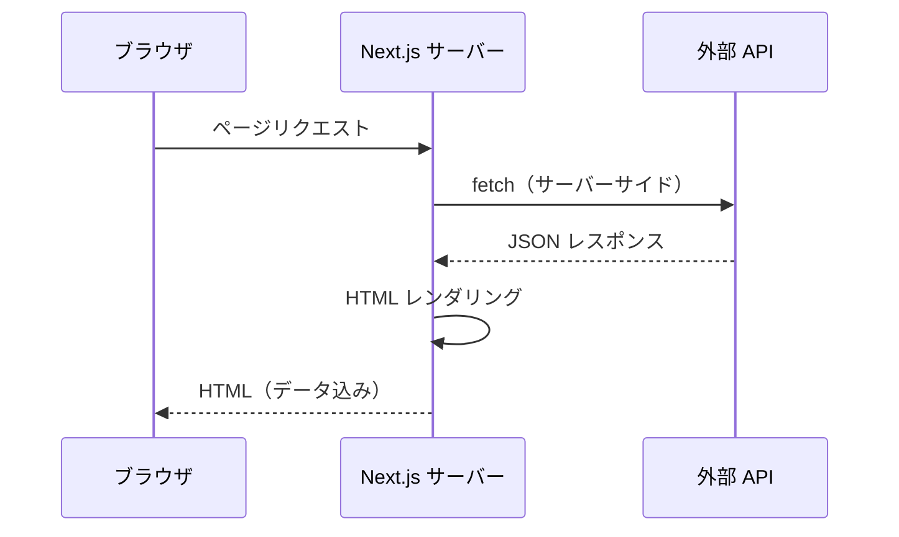

# Server Components での fetch

## 目次

- [Server Components での fetch とは](#server-components-での-fetch-とは)
  - [特徴](#特徴)
- [基本的な fetch の書き方](#基本的な-fetch-の書き方)
  - [シンプルな例](#シンプルな例)
  - [ポイント](#ポイント)
- [Client fetch との比較](#client-fetch-との比較)
  - [いつ Client fetch を使うか](#いつ-client-fetch-を使うか)
- [データ取得関数の分離](#データ取得関数の分離)
  - [分離のメリット](#分離のメリット)
- [Zod による型安全なデータ取得](#zod-による型安全なデータ取得)
  - [バリデーションのメリット](#バリデーションのメリット)
- [エラーハンドリング](#エラーハンドリング)
  - [try/catch パターン](#trycatch-パターン)
  - [error.tsx との連携](#errortsx-との連携)
  - [not-found.tsx との連携](#not-foundtsx-との連携)
- [EC サイトでの活用例](#ec-サイトでの活用例)
  - [商品一覧ページ](#商品一覧ページ)
  - [商品詳細ページ](#商品詳細ページ)
- [まとめ](#まとめ)
- [次のステップ](#次のステップ)

## Server Components での fetch とは

Next.js の App Router では、Server Components がデフォルトです。Server Components は Node.js 環境で実行されるため、コンポーネント内で直接 `async/await` を使ってデータを取得できます。



### 特徴

- サーバーサイド実行 - fetch はサーバーで実行されるため、API キーなどの機密情報をブラウザに露出しない
- 直接 async/await - コンポーネント関数を async にして、await で結果を待てる
- SEO に有利 - データ込みの HTML が返されるため、クローラーがコンテンツを認識しやすい
- 初期表示が速い - ブラウザでの追加リクエストが不要

***

## 基本的な fetch の書き方

### シンプルな例

```typescript
// app/products/page.tsx
import type { Product } from "@/types/product";

export default async function ProductsPage(): Promise<React.ReactElement> {
  const response = await fetch("https://api.example.com/products");
  const products: Product[] = await response.json();

  return (
    <main>
      <h1>商品一覧</h1>
      <ul>
        {products.map((product) => (
          <li key={product.id}>
            {product.name} - ¥{product.price.toLocaleString()}
          </li>
        ))}
      </ul>
    </main>
  );
}
```

### ポイント

1. コンポーネント関数に `async` キーワードを付ける
2. 戻り値の型は `Promise<React.ReactElement>` にする
3. `await` でレスポンスを待つ
4. `response.json()` も Promise なので `await` が必要

***

## Client fetch との比較

| 項目        | Server fetch  | Client fetch（useEffect） |
| --------- | ------------- | ----------------------- |
| 実行場所      | Node.js（サーバー） | ブラウザ                    |
| 初期表示      | データ込み HTML    | ローディング → データ表示          |
| SEO       | 有利            | 不利（クローラーが待たない）          |
| API キーの露出 | なし（安全）        | あり（公開 API のみ可）          |
| ユーザー固有データ | Cookie で対応    | トークンで対応                 |
| リアルタイム更新  | 再リクエストが必要     | WebSocket 等で可能          |
| バンドルサイズ   | 小さい           | 大きくなりがち                 |

### いつ Client fetch を使うか

- ユーザー操作に応じたデータ取得（検索のリアルタイム表示など）
- WebSocket によるリアルタイム更新
- ブラウザ API が必要な処理

***

## データ取得関数の分離

実際のプロジェクトでは、fetch ロジックを別ファイルに分離することを推奨します。

```typescript
// lib/api/products.ts
import type { Product } from "@/types/product";

const API_BASE_URL = process.env.API_BASE_URL || "http://localhost:3000";

export async function getProducts(): Promise<Product[]> {
  const response = await fetch(`${API_BASE_URL}/api/products`);

  if (!response.ok) {
    throw new Error(`Failed to fetch products: ${response.status}`);
  }

  return response.json() as Promise<Product[]>;
}

export async function getProduct(id: string): Promise<Product> {
  const response = await fetch(`${API_BASE_URL}/api/products/${id}`);

  if (!response.ok) {
    throw new Error(`Failed to fetch product: ${response.status}`);
  }

  return response.json() as Promise<Product>;
}
```

```typescript
// app/products/page.tsx
import { getProducts } from "@/lib/api/products";

export default async function ProductsPage(): Promise<React.ReactElement> {
  const products = await getProducts();

  return (
    <main>
      <h1>商品一覧</h1>
      {/* 商品リストの表示 */}
    </main>
  );
}
```

### 分離のメリット

- テストが書きやすい
- 複数のページで再利用できる
- 型定義を一元管理できる
- エラーハンドリングを統一できる

***

## Zod による型安全なデータ取得

外部 API のレスポンスは信頼できません。Zod でバリデーションすることで、実行時の型安全性を確保できます。

```typescript
// lib/api/products.ts
import { z } from "zod/v4";

// スキーマ定義
const productSchema = z.object({
  id: z.string(),
  name: z.string(),
  description: z.string(),
  price: z.number().positive(),
  imageUrl: z.url(),
  categoryId: z.string(),
  stock: z.number().int().nonnegative(),
  createdAt: z.string().datetime(),
});

const productsArraySchema = z.array(productSchema);

// 型を自動生成
export type Product = z.infer<typeof productSchema>;

export async function getProducts(): Promise<Product[]> {
  const response = await fetch(`${API_BASE_URL}/api/products`);

  if (!response.ok) {
    throw new Error(`Failed to fetch products: ${response.status}`);
  }

  const data: unknown = await response.json();

  // バリデーション（失敗時は ZodError をスロー）
  return productsArraySchema.parse(data);
}
```

### バリデーションのメリット

- API の変更を早期に検出できる
- 不正なデータによるランタイムエラーを防げる
- スキーマから型を自動生成できる

***

## エラーハンドリング

### try/catch パターン

```typescript
// app/products/page.tsx
import { getProducts } from "@/lib/api/products";

export default async function ProductsPage(): Promise<React.ReactElement> {
  try {
    const products = await getProducts();

    return (
      <main>
        <h1>商品一覧</h1>
        {products.map((product) => (
          <div key={product.id}>{product.name}</div>
        ))}
      </main>
    );
  } catch (error) {
    // エラーを error.tsx に委譲
    throw error;
  }
}
```

### error.tsx との連携

```typescript
// app/products/error.tsx
"use client";

type ErrorProps = {
  error: Error & { digest?: string };
  reset: () => void;
};

export default function ProductsError({
  error,
  reset,
}: ErrorProps): React.ReactElement {
  return (
    <div className="p-4 bg-red-50 rounded-lg">
      <h2 className="text-red-800 font-bold">エラーが発生しました</h2>
      <p className="text-red-600">{error.message}</p>
      <button
        onClick={reset}
        className="mt-4 px-4 py-2 bg-red-600 text-white rounded"
      >
        再試行
      </button>
    </div>
  );
}
```

### not-found.tsx との連携

```typescript
// app/products/[id]/page.tsx
import { notFound } from "next/navigation";
import { getProduct } from "@/lib/api/products";

type Props = {
  params: Promise<{ id: string }>;
};

export default async function ProductDetailPage({
  params,
}: Props): Promise<React.ReactElement> {
  const { id } = await params;

  try {
    const product = await getProduct(id);

    return (
      <main>
        <h1>{product.name}</h1>
        {/* 商品詳細の表示 */}
      </main>
    );
  } catch (error) {
    // 404 エラーの場合は not-found.tsx を表示
    if (error instanceof Error && error.message.includes("404")) {
      notFound();
    }
    throw error;
  }
}
```

```typescript
// app/products/[id]/not-found.tsx
export default function ProductNotFound(): React.ReactElement {
  return (
    <div className="p-8 text-center">
      <h2 className="text-2xl font-bold">商品が見つかりません</h2>
      <p className="mt-2 text-gray-600">
        お探しの商品は存在しないか、削除された可能性があります。
      </p>
    </div>
  );
}
```

***

## EC サイトでの活用例

### 商品一覧ページ

```typescript
// app/products/page.tsx
import { getProducts } from "@/lib/api/products";
import { ProductCard } from "@/components/ProductCard";

export default async function ProductsPage(): Promise<React.ReactElement> {
  const products = await getProducts();

  return (
    <main className="container mx-auto px-4 py-8">
      <h1 className="text-3xl font-bold mb-8">商品一覧</h1>

      <div className="grid grid-cols-1 md:grid-cols-2 lg:grid-cols-4 gap-6">
        {products.map((product) => (
          <ProductCard key={product.id} product={product} />
        ))}
      </div>
    </main>
  );
}
```

### 商品詳細ページ

```typescript
// app/products/[id]/page.tsx
import Image from "next/image";
import { getProduct } from "@/lib/api/products";
import { AddToCartButton } from "@/components/AddToCartButton";

type Props = {
  params: Promise<{ id: string }>;
};

export default async function ProductDetailPage({
  params,
}: Props): Promise<React.ReactElement> {
  const { id } = await params;
  const product = await getProduct(id);

  return (
    <main className="container mx-auto px-4 py-8">
      <div className="grid grid-cols-1 md:grid-cols-2 gap-8">
        <div className="aspect-square relative">
          <Image
            src={product.imageUrl}
            alt={product.name}
            fill
            className="object-cover rounded-lg"
          />
        </div>

        <div>
          <h1 className="text-3xl font-bold">{product.name}</h1>
          <p className="text-2xl font-bold text-primary mt-4">
            ¥{product.price.toLocaleString()}
          </p>
          <p className="mt-4 text-gray-600">{product.description}</p>

          <div className="mt-8">
            <AddToCartButton product={product} />
          </div>
        </div>
      </div>
    </main>
  );
}
```

***

## まとめ

| ポイント              | 内容                          |
| ----------------- | --------------------------- |
| Server Components | async/await でデータ取得可能        |
| 実行環境              | Node.js（サーバーサイド）            |
| SEO               | データ込み HTML で有利              |
| セキュリティ            | API キーを隠せる                  |
| 型安全性              | Zod でレスポンスをバリデーション          |
| エラーハンドリング         | error.tsx、not-found.tsx と連携 |
| コード分離             | lib/api/ にデータ取得関数を分離        |

***

## 次のステップ

データ取得の基本を理解したら、[キャッシュ戦略](./02-cache-strategies.md) でパフォーマンス最適化を学びましょう。
