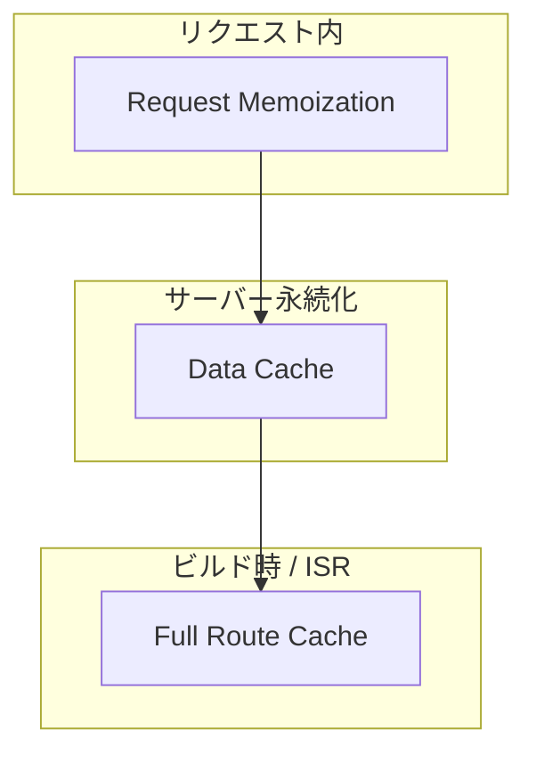
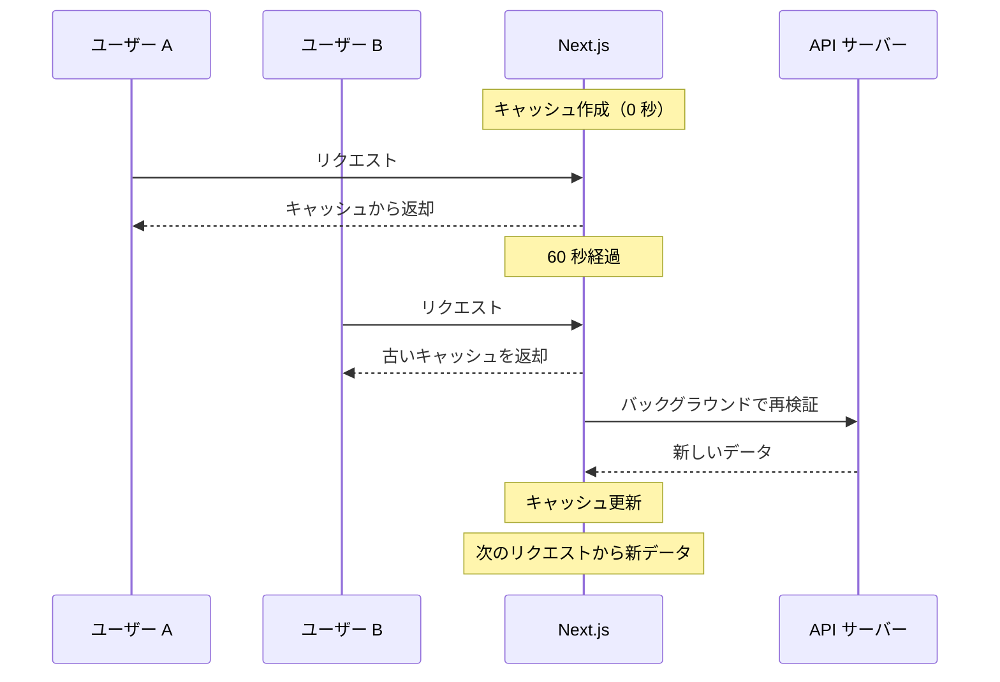
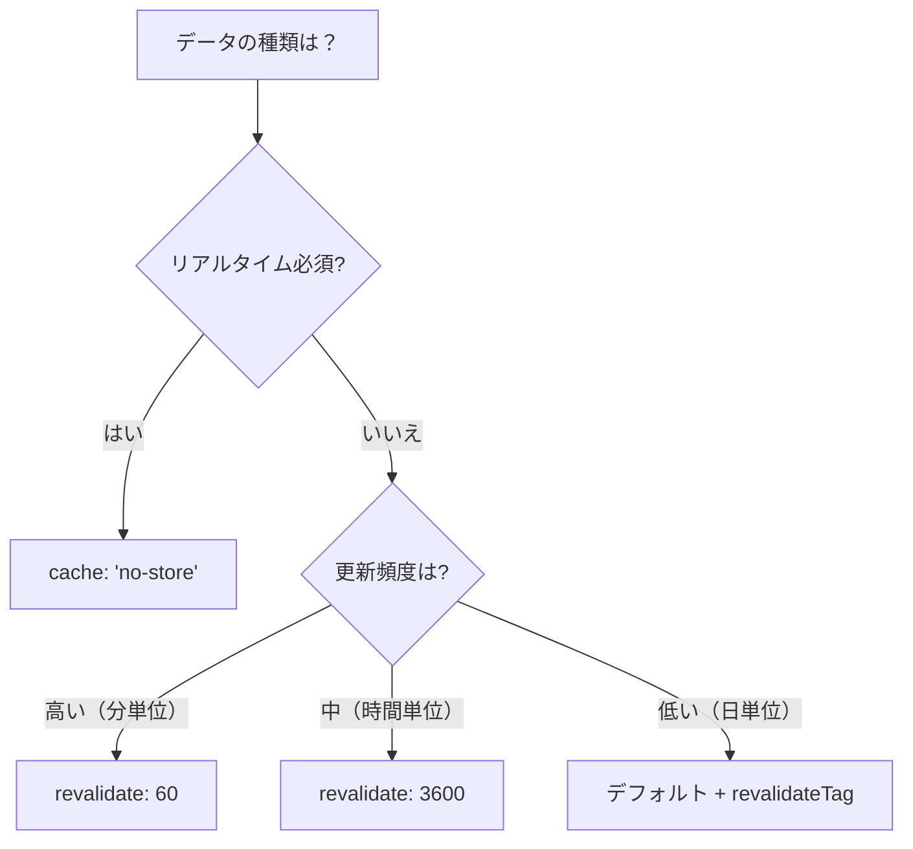

# キャッシュ戦略

## 目次

- [Next.js のキャッシュ概念](#nextjs-のキャッシュ概念)
  - [キャッシュレイヤーの説明](#キャッシュレイヤーの説明)
- [fetch オプション](#fetch-オプション)
  - [オプション一覧](#オプション一覧)
- [cache: 'force-cache'（デフォルト）](#cache-force-cacheデフォルト)
  - [適用例](#適用例)
- [cache: 'no-store'](#cache-no-store)
  - [適用例](#適用例-1)
- [next: { revalidate: N }（ISR）](#next--revalidate-n-isr)
  - [動作フロー](#動作フロー)
  - [適用例](#適用例-2)
- [next: { tags: \[...\] }（タグベース再検証）](#next--tags--タグベース再検証)
- [revalidatePath と revalidateTag](#revalidatepath-と-revalidatetag)
  - [revalidatePath](#revalidatepath)
  - [revalidateTag](#revalidatetag)
  - [使い分け](#使い分け)
- [EC サイトでのキャッシュ戦略](#ec-サイトでのキャッシュ戦略)
  - [データ別の推奨設定](#データ別の推奨設定)
- [実装例: 商品一覧と詳細](#実装例-商品一覧と詳細)
  - [商品一覧（ISR）](#商品一覧isr)
  - [商品詳細（タグベース）](#商品詳細タグベース)
  - [商品更新後の再検証](#商品更新後の再検証)
- [実装例: カテゴリ（長期キャッシュ）](#実装例-カテゴリ長期キャッシュ)
- [実装例: 在庫状況（リアルタイム）](#実装例-在庫状況リアルタイム)
- [キャッシュのデバッグ](#キャッシュのデバッグ)
  - [開発時のキャッシュ確認](#開発時のキャッシュ確認)
  - [キャッシュヘッダーの確認](#キャッシュヘッダーの確認)
- [まとめ](#まとめ)
- [次のステップ](#次のステップ)

## Next.js のキャッシュ概念

Next.js App Routerには複数のキャッシュレイヤーがあります。これらを理解することで、パフォーマンスを最適化できます。



### キャッシュレイヤーの説明

| レイヤー                | スコープ       | 用途                    |
| ------------------- | ---------- | --------------------- |
| Request Memoization | 1 リクエスト内   | 同じ fetch の重複を排除       |
| Data Cache          | サーバー永続     | fetch 結果をサーバーに保存      |
| Full Route Cache    | ビルド時 / ISR | ページ全体の HTML/RSC ペイロード |

***

## fetch オプション

Next.jsのfetchは拡張されており、キャッシュ動作を細かく制御できます。

### オプション一覧

| オプション                     | 動作          | ユースケース        |
| ------------------------- | ----------- | ------------- |
| `cache: 'force-cache'`    | 永続キャッシュ（既定） | 静的コンテンツ       |
| `cache: 'no-store'`       | キャッシュなし     | リアルタイムデータ     |
| `next: { revalidate: N }` | N 秒後に再検証    | ISR（増分・静的再生成） |
| `next: { tags: [...] }`   | タグベース再検証    | オンデマンド再検証     |

***

## cache: 'force-cache'（デフォルト）

データを無期限にキャッシュします。ビルド時に取得したデータは、次のビルドまで変わりません。

```typescript
// デフォルト動作（明示的に書く必要はない）
const response = await fetch("https://api.example.com/categories", {
  cache: "force-cache",
});
```

### 適用例

- サイト設定
- カテゴリマスター
- 利用規約など静的コンテンツ

***

## cache: 'no-store'

リクエストごとに必ずAPIを呼び出します。キャッシュは一切行いません。

```typescript
const response = await fetch("https://api.example.com/stock", {
  cache: "no-store",
});
```

### 適用例

- 在庫状況
- カート内容
- ユーザー固有データ
- 検索結果

***

## next: { revalidate: N }（ISR）

指定秒数が経過すると、バックグラウンドで再検証します。これをISR（Incremental Static Regeneration）と呼びます。

```typescript
const response = await fetch("https://api.example.com/products", {
  next: { revalidate: 60 }, // 60 秒後に再検証
});
```

### 動作フロー



### 適用例

- 商品一覧（1分ごと更新）
- ランキング（5分ごと更新）
- ニュース（10分ごと更新）

***

## next: { tags: \[...] }（タグベース再検証）

タグを付けておくと、`revalidateTag` で明示的に再検証できます。

```typescript
// データ取得時にタグを付与
const response = await fetch("https://api.example.com/products", {
  next: { tags: ["products"] },
});

// 商品詳細にもタグを付与
const response = await fetch(`https://api.example.com/products/${id}`, {
  next: { tags: ["products", `product-${id}`] },
});
```

```typescript
// Server Action で再検証
"use server";

import { revalidateTag } from "next/cache";

export async function updateProduct(id: string): Promise<void> {
  // API 更新処理...

  // タグベースで再検証
  revalidateTag("products"); // 商品一覧を再検証
  revalidateTag(`product-${id}`); // 特定商品を再検証
}
```

***

## revalidatePath と revalidateTag

### revalidatePath

パス単位でキャッシュを再検証します。

```typescript
import { revalidatePath } from "next/cache";

// 商品一覧ページを再検証
revalidatePath("/products");

// 特定の商品詳細ページを再検証
revalidatePath(`/products/${id}`);

// レイアウトを含めて再検証
revalidatePath("/products", "layout");
```

### revalidateTag

タグ単位でキャッシュを再検証します。

```typescript
import { revalidateTag } from "next/cache";

// products タグが付いた全ての fetch を再検証
revalidateTag("products");
```

### 使い分け

| 方法             | 適用範囲          | ユースケース   |
| -------------- | ------------- | -------- |
| revalidatePath | 特定のパス         | ページ単位の更新 |
| revalidateTag  | タグが付いた全 fetch | データ単位の更新 |

***

## EC サイトでのキャッシュ戦略



### データ別の推奨設定

| データ     | キャッシュ設定                 | 理由          |
| ------- | ----------------------- | ----------- |
| カテゴリ一覧  | `revalidate: 3600`      | 変更頻度が低い     |
| 商品一覧    | `revalidate: 60`        | 在庫切れを早く反映   |
| 商品詳細    | `revalidate: 60` + tags | 更新時に即座に反映可能 |
| 在庫状況    | `cache: 'no-store'`     | リアルタイム必須    |
| ユーザーカート | `cache: 'no-store'`     | ユーザー固有データ   |
| 検索結果    | `cache: 'no-store'`     | 毎回異なるクエリ    |
| ランキング   | `revalidate: 300`       | 5 分ごとで十分    |
| お知らせ    | `revalidate: 3600`      | 時間単位で更新     |

***

## 実装例: 商品一覧と詳細

### 商品一覧（ISR）

```typescript
// lib/api/products.ts
export async function getProducts(): Promise<Product[]> {
  const response = await fetch(`${API_BASE_URL}/api/products`, {
    next: {
      revalidate: 60, // 60 秒ごとに再検証
      tags: ["products"],
    },
  });

  if (!response.ok) {
    throw new Error("Failed to fetch products");
  }

  return response.json() as Promise<Product[]>;
}
```

### 商品詳細（タグベース）

```typescript
// lib/api/products.ts
export async function getProduct(id: string): Promise<Product> {
  const response = await fetch(`${API_BASE_URL}/api/products/${id}`, {
    next: {
      tags: ["products", `product-${id}`],
    },
  });

  if (!response.ok) {
    throw new Error("Failed to fetch product");
  }

  return response.json() as Promise<Product>;
}
```

### 商品更新後の再検証

```typescript
// app/actions/product.ts
"use server";

import { revalidateTag } from "next/cache";

export async function updateProduct(id: string, data: ProductUpdateData): Promise<void> {
  // API で商品を更新
  await fetch(`${API_BASE_URL}/api/products/${id}`, {
    method: "PUT",
    body: JSON.stringify(data),
  });

  // キャッシュを再検証
  revalidateTag("products"); // 一覧を再検証
  revalidateTag(`product-${id}`); // 詳細を再検証
}
```

***

## 実装例: カテゴリ（長期キャッシュ）

```typescript
// lib/api/categories.ts
export async function getCategories(): Promise<Category[]> {
  const response = await fetch(`${API_BASE_URL}/api/categories`, {
    next: {
      revalidate: 3600, // 1 時間ごとに再検証
      tags: ["categories"],
    },
  });

  if (!response.ok) {
    throw new Error("Failed to fetch categories");
  }

  return response.json() as Promise<Category[]>;
}
```

***

## 実装例: 在庫状況（リアルタイム）

```typescript
// lib/api/stock.ts
export async function getStock(productId: string): Promise<StockInfo> {
  const response = await fetch(`${API_BASE_URL}/api/products/${productId}/stock`, {
    cache: "no-store", // キャッシュなし
  });

  if (!response.ok) {
    throw new Error("Failed to fetch stock");
  }

  return response.json() as Promise<StockInfo>;
}
```

***

## キャッシュのデバッグ

### 開発時のキャッシュ確認

```typescript
// 開発環境ではキャッシュを無効化したい場合
const response = await fetch(url, {
  cache: process.env.NODE_ENV === "development" ? "no-store" : "force-cache",
});
```

### キャッシュヘッダーの確認

```typescript
const response = await fetch(url);
console.log("Cache-Control:", response.headers.get("cache-control"));
console.log("X-Vercel-Cache:", response.headers.get("x-vercel-cache"));
```

***

## まとめ

| 戦略        | オプション                     | 適用シーン       |
| --------- | ------------------------- | ----------- |
| 永続キャッシュ   | デフォルト                     | 静的コンテンツ     |
| キャッシュなし   | `cache: 'no-store'`       | リアルタイムデータ   |
| 時間ベース ISR | `next: { revalidate: N }` | 定期的に更新するデータ |
| オンデマンド再検証 | `next: { tags: [...] }`   | 更新時に即座に反映   |

***

## 次のステップ

キャッシュ戦略を理解したら、[Suspense と loading](./03-suspense-loading.md) でローディング状態の実装を学びましょう。
