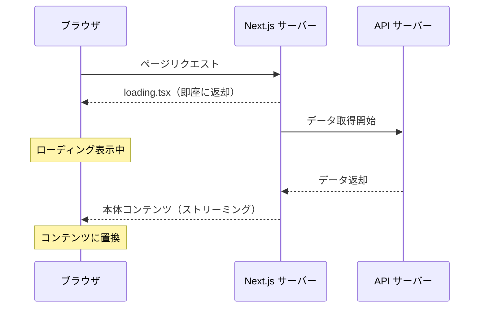
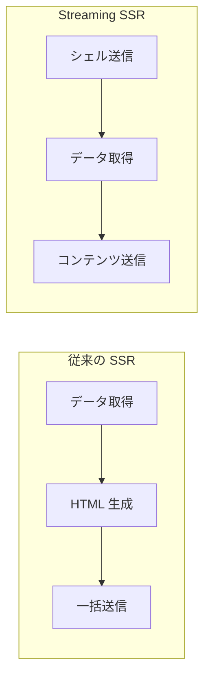

# Suspense と loading

## 目次

- [Suspense とは](#suspense-とは)
  - [メリット](#メリット)
- [loading.tsx の使い方](#loadingtsx-の使い方)
  - [基本的な使い方](#基本的な使い方)
  - [ディレクトリ構造](#ディレクトリ構造)
- [Suspense 境界のパターン](#suspense-境界のパターン)
  - [複数の Suspense 境界](#複数の-suspense-境界)
  - [並列データ取得](#並列データ取得)
- [Skeleton コンポーネントの設計](#skeleton-コンポーネントの設計)
  - [商品カード Skeleton](#商品カード-skeleton)
  - [商品リスト Skeleton](#商品リスト-skeleton)
  - [商品詳細 Skeleton](#商品詳細-skeleton)
- [Streaming SSR](#streaming-ssr)
  - [動作の仕組み](#動作の仕組み)
  - [利点](#利点)
- [ErrorBoundary との組み合わせ](#errorboundary-との組み合わせ)
  - [error.tsx の配置](#errortsx-の配置)
  - [error.tsx の実装](#errortsx-の実装)
  - [Suspense 内でのエラー処理](#suspense-内でのエラー処理)
- [EC サイトでの活用例](#ec-サイトでの活用例)
  - [商品一覧ページ](#商品一覧ページ)
  - [商品詳細ページ](#商品詳細ページ)
- [ベストプラクティス](#ベストプラクティス)
  - [1. loading.tsx はルート全体に使う](#1-loadingtsx-はルート全体に使う)
  - [2. 細かい制御は Suspense で](#2-細かい制御は-suspense-で)
  - [3. Skeleton はコンテンツのレイアウトを模倣](#3-skeleton-はコンテンツのレイアウトを模倣)
  - [4. 並列データ取得を活用](#4-並列データ取得を活用)
- [まとめ](#まとめ)
- [次のステップ](#次のステップ)

## Suspense とは

ReactのSuspenseは、コンポーネントがデータを待っている間にフォールバックUIを表示する仕組みです。Next.js App Routerでは、この仕組みを活用してストリーミングSSRを実現しています。



### メリット

- 初期表示が速い - シェルをすぐに返せる
- UX向上 - ローディング状態を明示できる
- 段階的表示 - 準備できた部分から順次表示

***

## loading.tsx の使い方

App Routerでは、`loading.tsx` ファイルを配置するだけで、自動的にSuspense境界が作られます。

### 基本的な使い方

```typescript
// app/products/loading.tsx
export default function ProductsLoading(): React.ReactElement {
  return (
    <div className="container mx-auto px-4 py-8">
      <div className="h-8 w-48 bg-gray-200 rounded animate-pulse mb-8" />
      <div className="grid grid-cols-1 md:grid-cols-2 lg:grid-cols-4 gap-6">
        {Array.from({ length: 8 }).map((_, i) => (
          <div key={i} className="animate-pulse">
            <div className="aspect-square bg-gray-200 rounded-lg" />
            <div className="h-4 bg-gray-200 rounded mt-2 w-3/4" />
            <div className="h-4 bg-gray-200 rounded mt-1 w-1/2" />
          </div>
        ))}
      </div>
    </div>
  );
}
```

### ディレクトリ構造

```text
app/
├── products/
│   ├── page.tsx          # 商品一覧ページ
│   ├── loading.tsx       # ローディング状態
│   ├── error.tsx         # エラー状態
│   └── [id]/
│       ├── page.tsx      # 商品詳細ページ
│       └── loading.tsx   # 詳細のローディング
```

***

## Suspense 境界のパターン

`loading.tsx` はルート全体に適用されます。より細かい制御が必要な場合は、`<Suspense>` を直接使用します。

### 複数の Suspense 境界

```tsx
// app/products/page.tsx
import { Suspense } from "react";
import { ProductList } from "@/components/ProductList";
import { ProductListSkeleton } from "@/components/ProductListSkeleton";
import { Recommendations } from "@/components/Recommendations";
import { RecommendationsSkeleton } from "@/components/RecommendationsSkeleton";

export default function ProductsPage(): React.ReactElement {
  return (
    <main className="container mx-auto px-4 py-8">
      <h1 className="mb-8 text-3xl font-bold">商品一覧</h1>

      {/* 商品一覧は優先的に表示 */}
      <Suspense fallback={<ProductListSkeleton />}>
        <ProductList />
      </Suspense>

      {/* おすすめは後から表示されても OK */}
      <section className="mt-12">
        <h2 className="mb-4 text-2xl font-bold">おすすめ商品</h2>
        <Suspense fallback={<RecommendationsSkeleton />}>
          <Recommendations />
        </Suspense>
      </section>
    </main>
  );
}
```

### 並列データ取得

```tsx
// components/ProductList.tsx
import { getProducts } from "@/lib/api/products";
import { ProductCard } from "./ProductCard";

export async function ProductList(): Promise<React.ReactElement> {
  const products = await getProducts();

  return (
    <div className="grid grid-cols-1 gap-6 md:grid-cols-2 lg:grid-cols-4">
      {products.map((product) => (
        <ProductCard
          key={product.id}
          product={product}
        />
      ))}
    </div>
  );
}
```

```tsx
// components/Recommendations.tsx
import { getRecommendations } from "@/lib/api/recommendations";
import { ProductCard } from "./ProductCard";

export async function Recommendations(): Promise<React.ReactElement> {
  const recommendations = await getRecommendations();

  return (
    <div className="flex gap-4 overflow-x-auto">
      {recommendations.map((product) => (
        <ProductCard
          key={product.id}
          product={product}
        />
      ))}
    </div>
  );
}
```

***

## Skeleton コンポーネントの設計

Skeletonは、コンテンツのレイアウトを模したプレースホルダーです。Tailwind CSSの `animate-pulse` クラスで簡単に実装できます。

### 商品カード Skeleton

```tsx
// components/ProductCardSkeleton.tsx
export function ProductCardSkeleton(): React.ReactElement {
  return (
    <div className="animate-pulse">
      {/* 画像部分 */}
      <div className="aspect-square rounded-lg bg-gray-200" />

      {/* 商品名 */}
      <div className="mt-3 h-4 w-3/4 rounded bg-gray-200" />

      {/* 価格 */}
      <div className="mt-2 h-5 w-1/3 rounded bg-gray-200" />

      {/* ボタン */}
      <div className="mt-4 h-10 rounded bg-gray-200" />
    </div>
  );
}
```

### 商品リスト Skeleton

```tsx
// components/ProductListSkeleton.tsx
import { ProductCardSkeleton } from "./ProductCardSkeleton";

type Props = {
  count?: number;
};

export function ProductListSkeleton({ count = 8 }: Props): React.ReactElement {
  return (
    <div className="grid grid-cols-1 gap-6 md:grid-cols-2 lg:grid-cols-4">
      {Array.from({ length: count }).map((_, i) => (
        <ProductCardSkeleton key={i} />
      ))}
    </div>
  );
}
```

### 商品詳細 Skeleton

```tsx
// components/ProductDetailSkeleton.tsx
export function ProductDetailSkeleton(): React.ReactElement {
  return (
    <div className="animate-pulse">
      <div className="grid grid-cols-1 gap-8 md:grid-cols-2">
        {/* 画像 */}
        <div className="aspect-square rounded-lg bg-gray-200" />

        {/* 詳細情報 */}
        <div>
          {/* 商品名 */}
          <div className="h-8 w-3/4 rounded bg-gray-200" />

          {/* 価格 */}
          <div className="mt-4 h-6 w-1/4 rounded bg-gray-200" />

          {/* 説明文 */}
          <div className="mt-6 space-y-2">
            <div className="h-4 rounded bg-gray-200" />
            <div className="h-4 rounded bg-gray-200" />
            <div className="h-4 w-2/3 rounded bg-gray-200" />
          </div>

          {/* ボタン */}
          <div className="mt-8 h-12 rounded bg-gray-200" />
        </div>
      </div>
    </div>
  );
}
```

***

## Streaming SSR

Next.js App Routerは、Suspenseを活用したStreaming SSRをサポートしています。



### 動作の仕組み

1. サーバーは `<Suspense>` で囲まれていない部分を即座にHTMLとして送信
2. データ取得が完了したら、その部分を追加で送信（ストリーミング）
3. ブラウザは受け取ったHTMLを順次レンダリング

### 利点

- TTFB（Time To First Byte）の短縮 - シェルをすぐに返せる
- FCP（First Contentful Paint）の改善 - ローディングUIがすぐに表示される
- 並列処理 - 複数のSuspense境界が並列でデータを取得

***

## ErrorBoundary との組み合わせ

SuspenseとErrorBoundaryを組み合わせることで、ローディングとエラーの両方を適切に処理できます。

### error.tsx の配置

```text
app/
├── products/
│   ├── page.tsx
│   ├── loading.tsx   # ローディング
│   ├── error.tsx     # エラー
│   └── not-found.tsx # 404
```

### error.tsx の実装

```tsx
// app/products/error.tsx
"use client";

type Props = {
  error: Error & { digest?: string };
  reset: () => void;
};

export default function ProductsError({ error, reset }: Props): React.ReactElement {
  return (
    <div className="container mx-auto px-4 py-8">
      <div className="rounded-lg border border-red-200 bg-red-50 p-6">
        <h2 className="text-xl font-bold text-red-800">商品の読み込みに失敗しました</h2>
        <p className="mt-2 text-red-600">{error.message}</p>
        <button
          onClick={reset}
          className="mt-4 rounded bg-red-600 px-4 py-2 text-white hover:bg-red-700"
        >
          再試行
        </button>
      </div>
    </div>
  );
}
```

### Suspense 内でのエラー処理

```tsx
// 独自の ErrorBoundary を使う場合
import { Suspense } from "react";
import { ErrorBoundary } from "@/components/ErrorBoundary";

export default function ProductsPage(): React.ReactElement {
  return (
    <main>
      <ErrorBoundary fallback={<ErrorMessage />}>
        <Suspense fallback={<ProductListSkeleton />}>
          <ProductList />
        </Suspense>
      </ErrorBoundary>
    </main>
  );
}
```

***

## EC サイトでの活用例

### 商品一覧ページ

```tsx
// app/products/page.tsx
import { Suspense } from "react";
import { ProductList } from "@/components/ProductList";
import { ProductListSkeleton } from "@/components/ProductListSkeleton";
import { CategoryNav } from "@/components/CategoryNav";
import { CategoryNavSkeleton } from "@/components/CategoryNavSkeleton";

export default function ProductsPage(): React.ReactElement {
  return (
    <main className="container mx-auto px-4 py-8">
      {/* カテゴリナビゲーション */}
      <Suspense fallback={<CategoryNavSkeleton />}>
        <CategoryNav />
      </Suspense>

      {/* 商品一覧 */}
      <section className="mt-8">
        <h1 className="mb-6 text-3xl font-bold">商品一覧</h1>
        <Suspense fallback={<ProductListSkeleton />}>
          <ProductList />
        </Suspense>
      </section>
    </main>
  );
}
```

### 商品詳細ページ

```tsx
// app/products/[id]/page.tsx
import { Suspense } from "react";
import { ProductDetail } from "@/components/ProductDetail";
import { ProductDetailSkeleton } from "@/components/ProductDetailSkeleton";
import { RelatedProducts } from "@/components/RelatedProducts";
import { ProductListSkeleton } from "@/components/ProductListSkeleton";

type Props = {
  params: Promise<{ id: string }>;
};

export default async function ProductDetailPage({ params }: Props): Promise<React.ReactElement> {
  const { id } = await params;

  return (
    <main className="container mx-auto px-4 py-8">
      {/* 商品詳細（優先） */}
      <Suspense fallback={<ProductDetailSkeleton />}>
        <ProductDetail id={id} />
      </Suspense>

      {/* 関連商品（後から OK） */}
      <section className="mt-12">
        <h2 className="mb-6 text-2xl font-bold">関連商品</h2>
        <Suspense fallback={<ProductListSkeleton count={4} />}>
          <RelatedProducts productId={id} />
        </Suspense>
      </section>
    </main>
  );
}
```

***

## ベストプラクティス

### 1. loading.tsx はルート全体に使う

```text
app/products/loading.tsx → /products 全体のローディング
```

### 2. 細かい制御は Suspense で

```tsx
<Suspense fallback={<Skeleton />}>
  <AsyncComponent />
</Suspense>
```

### 3. Skeleton はコンテンツのレイアウトを模倣

実際のコンテンツと同じサイズ感にすることで、レイアウトシフトを防ぐ。

### 4. 並列データ取得を活用

複数のSuspense境界を配置し、準備できたものから表示。

***

## まとめ

| 機能          | 用途              | 配置場所                |
| ----------- | --------------- | ------------------- |
| loading.tsx | ルート全体のローディング    | app/xxx/loading.tsx |
| Suspense    | 細かい Suspense 境界 | コンポーネント内            |
| Skeleton    | プレースホルダー UI     | components/         |
| error.tsx   | エラー時のフォールバック    | app/xxx/error.tsx   |

***

## 次のステップ

Suspenseとloadingを理解したら、[MSW セットアップ](./04-msw-setup.md) でAPIモックの環境を構築しましょう。
