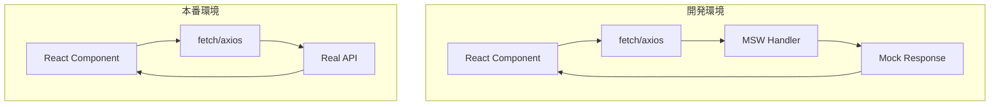

# MSW セットアップ

## MSW（Mock Service Worker）とは

MSW は、Service Worker を使って API リクエストをインターセプトし、モックレスポンスを返すライブラリです。バックエンド API がなくてもフロントエンド開発を進められます。



### MSW のメリット

| メリット            | 説明                                        |
| ------------------- | ------------------------------------------- |
| バックエンド不要    | API が完成していなくても開発できる          |
| 実際の fetch を使用 | コードを変更せずにモック/本番を切り替え     |
| テストで再利用      | 同じハンドラーをテストでも使える            |
| 型安全              | TypeScript で型付きレスポンスを定義         |
| DevTools で確認可能 | ブラウザの Network タブでリクエストが見える |

---

## インストール

```bash
# MSW をインストール
pnpm add -D msw
```

---

## 初期設定

### Service Worker の生成

MSW はブラウザで動作する場合、Service Worker を使用します。

```bash
# public ディレクトリに Service Worker を生成
pnpm dlx msw init public/ --save
```

これにより `public/mockServiceWorker.js` が生成されます。

### 生成されるファイル

```text
public/
└── mockServiceWorker.js  # MSW の Service Worker
```

---

## ハンドラーファイル構成

プロジェクトで使うモックハンドラーを管理するディレクトリ構成を作成します。

```text
mocks/
├── browser.ts          # ブラウザ用設定
├── server.ts           # Node.js 用設定
├── handlers/
│   ├── index.ts        # ハンドラー集約
│   ├── products.ts     # 商品関連ハンドラー
│   ├── categories.ts   # カテゴリ関連ハンドラー
│   └── search.ts       # 検索ハンドラー
└── data/
    ├── products.ts     # 商品モックデータ
    └── categories.ts   # カテゴリモックデータ
```

---

## ハンドラーの作成

### ハンドラー集約ファイル

```typescript
// mocks/handlers/index.ts
import { productHandlers } from "./products";
import { categoryHandlers } from "./categories";
import { searchHandlers } from "./search";

export const handlers = [...productHandlers, ...categoryHandlers, ...searchHandlers];
```

### 商品ハンドラー（例）

```typescript
// mocks/handlers/products.ts
import { http, HttpResponse } from "msw";
import { products } from "../data/products";

export const productHandlers = [
  // 商品一覧
  http.get("/api/products", () => {
    return HttpResponse.json(products);
  }),

  // 商品詳細
  http.get("/api/products/:id", ({ params }) => {
    const product = products.find((p) => p.id === params.id);

    if (!product) {
      return new HttpResponse(null, { status: 404 });
    }

    return HttpResponse.json(product);
  }),
];
```

---

## ブラウザ用設定

ブラウザで MSW を動作させる設定です。

```typescript
// mocks/browser.ts
import { setupWorker } from "msw/browser";
import { handlers } from "./handlers";

export const worker = setupWorker(...handlers);
```

---

## Node.js 用設定

Server Components やテストで使用する設定です。

```typescript
// mocks/server.ts
import { setupServer } from "msw/node";
import { handlers } from "./handlers";

export const server = setupServer(...handlers);
```

---

## Next.js App Router での初期化

### 方法 1: instrumentation.ts を使用（推奨）

Next.js の instrumentation hook を使って、サーバー起動時に MSW を初期化します。

```typescript
// instrumentation.ts（プロジェクトルート）
export async function register(): Promise<void> {
  if (process.env.NEXT_RUNTIME === "nodejs") {
    // 開発環境のみ MSW を有効化
    if (process.env.NODE_ENV === "development") {
      const { server } = await import("./mocks/server");
      server.listen({
        onUnhandledRequest: "bypass", // 未処理リクエストは通過
      });
    }
  }
}
```

`next.config.ts` で instrumentation を有効化します。

```typescript
// next.config.ts
import type { NextConfig } from "next";

const nextConfig: NextConfig = {
  experimental: {
    instrumentationHook: true,
  },
};

export default nextConfig;
```

### 方法 2: ブラウザでの初期化

Client Components でブラウザ用 MSW を初期化する場合は以下のようにします。

```typescript
// components/MSWProvider.tsx
"use client";

import { useEffect, useState, type ReactNode } from "react";

type Props = {
  children: ReactNode;
};

export function MSWProvider({ children }: Props): React.ReactElement | null {
  const [isMockingEnabled, setIsMockingEnabled] = useState(false);

  useEffect(() => {
    async function enableMocking(): Promise<void> {
      if (process.env.NODE_ENV !== "development") {
        setIsMockingEnabled(true);
        return;
      }

      const { worker } = await import("../mocks/browser");

      await worker.start({
        onUnhandledRequest: "bypass",
      });

      setIsMockingEnabled(true);
    }

    enableMocking();
  }, []);

  if (!isMockingEnabled) {
    return null;
  }

  return <>{children}</>;
}
```

```tsx
// app/layout.tsx
import { MSWProvider } from "@/components/MSWProvider";

export default function RootLayout({
  children,
}: {
  children: React.ReactNode;
}): React.ReactElement {
  return (
    <html lang="ja">
      <body>
        <MSWProvider>{children}</MSWProvider>
      </body>
    </html>
  );
}
```

---

## モックデータの作成

### 商品データ

```typescript
// mocks/data/products.ts
import type { Product } from "@/types/product";

export const products: Product[] = [
  {
    id: "1",
    name: "プレミアムコーヒー豆",
    description: "厳選された高品質なアラビカ種のコーヒー豆",
    price: 2500,
    imageUrl: "/images/products/coffee.jpg",
    categoryId: "food",
    stock: 50,
    createdAt: "2024-01-01T00:00:00Z",
  },
  {
    id: "2",
    name: "オーガニック緑茶",
    description: "無農薬栽培の一番茶を使用した緑茶",
    price: 1800,
    imageUrl: "/images/products/tea.jpg",
    categoryId: "food",
    stock: 30,
    createdAt: "2024-01-02T00:00:00Z",
  },
  // 他の商品...
];
```

### カテゴリデータ

```typescript
// mocks/data/categories.ts
import type { Category } from "@/types/category";

export const categories: Category[] = [
  {
    id: "food",
    name: "食品・飲料",
    slug: "food",
    description: "コーヒー、お茶、スナックなど",
    imageUrl: "/images/categories/food.jpg",
  },
  {
    id: "electronics",
    name: "電子機器",
    slug: "electronics",
    description: "スマートフォン、タブレット、アクセサリなど",
    imageUrl: "/images/categories/electronics.jpg",
  },
  // 他のカテゴリ...
];
```

---

## 環境変数による切り替え

### .env.development

```bash
# MSW を有効化
NEXT_PUBLIC_API_MOCKING=enabled
```

### .env.production

```bash
# 本番では無効化
NEXT_PUBLIC_API_MOCKING=disabled
```

### 条件分岐

```typescript
// instrumentation.ts
export async function register(): Promise<void> {
  if (process.env.NEXT_RUNTIME === "nodejs") {
    if (process.env.NEXT_PUBLIC_API_MOCKING === "enabled") {
      const { server } = await import("./mocks/server");
      server.listen({
        onUnhandledRequest: "bypass",
      });
    }
  }
}
```

---

## Storybook との統合

MSW は Storybook でも使用できます。

### インストール

```bash
pnpm add -D msw-storybook-addon
```

### 設定

```typescript
// .storybook/preview.ts
import type { Preview } from "@storybook/react";
import { initialize, mswLoader } from "msw-storybook-addon";
import { handlers } from "../mocks/handlers";

// MSW を初期化
initialize();

const preview: Preview = {
  loaders: [mswLoader],
  parameters: {
    msw: {
      handlers,
    },
  },
};

export default preview;
```

### ストーリーごとのハンドラー上書き

```typescript
// stories/ProductList.stories.tsx
import type { Meta, StoryObj } from "@storybook/react";
import { http, HttpResponse } from "msw";
import { ProductList } from "@/components/ProductList";

const meta: Meta<typeof ProductList> = {
  component: ProductList,
};

export default meta;

type Story = StoryObj<typeof ProductList>;

// デフォルトのハンドラーを使用
export const Default: Story = {};

// 空の商品リスト
export const Empty: Story = {
  parameters: {
    msw: {
      handlers: [
        http.get("/api/products", () => {
          return HttpResponse.json([]);
        }),
      ],
    },
  },
};

// エラー状態
export const Error: Story = {
  parameters: {
    msw: {
      handlers: [
        http.get("/api/products", () => {
          return new HttpResponse(null, { status: 500 });
        }),
      ],
    },
  },
};
```

---

## トラブルシューティング

### Service Worker が登録されない

```bash
# Service Worker を再生成
pnpm dlx msw init public/ --save
```

### ハンドラーが呼ばれない

1. URL パスが正しいか確認
2. `onUnhandledRequest: "warn"` に変更してログを確認

```typescript
server.listen({
  onUnhandledRequest: "warn", // 未処理リクエストを警告
});
```

### Next.js でエラーが発生する

`instrumentation.ts` が正しく設定されているか確認してください。

```typescript
// next.config.ts
experimental: {
  instrumentationHook: true,
}
```

---

## まとめ

| 設定                | ファイル                    | 用途              |
| ------------------- | --------------------------- | ----------------- |
| Service Worker 生成 | public/mockServiceWorker.js | ブラウザ用        |
| ブラウザ設定        | mocks/browser.ts            | Client Components |
| Node.js 設定        | mocks/server.ts             | Server Components |
| ハンドラー          | mocks/handlers/             | API モック定義    |
| モックデータ        | mocks/data/                 | テストデータ      |
| 初期化              | instrumentation.ts          | サーバー起動時    |

---

## 次のステップ

MSW のセットアップが完了したら、[MSW ハンドラー作成](./05-msw-handlers.md) で具体的なハンドラーの書き方を学びましょう。
