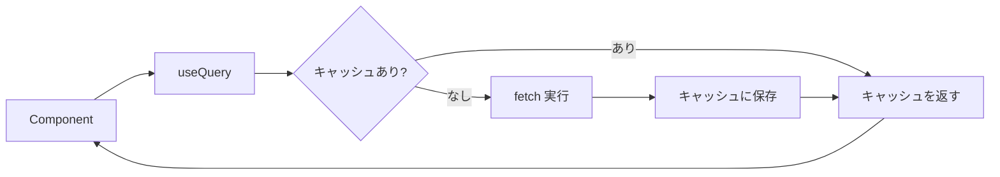
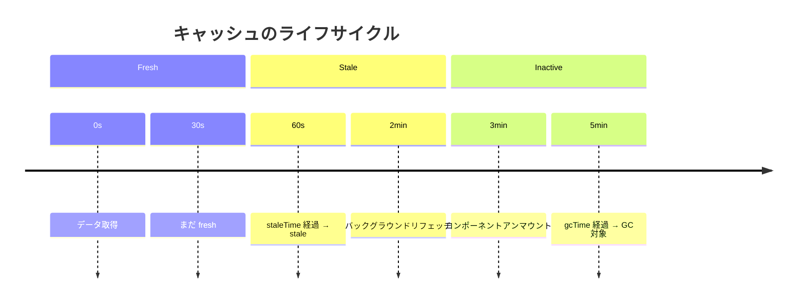

# @tanstack/react-query 基礎

## 目次

- [概要](#概要)
  - [React Query とは](#react-query-とは)
  - [なぜ React Query を使うのか](#なぜ-react-query-を使うのか)
- [インストール](#インストール)
- [セットアップ](#セットアップ)
  - [QueryClient の設定](#queryclient-の設定)
  - [Provider の設置](#provider-の設置)
- [基本的な使い方](#基本的な使い方)
  - [useQuery でデータを取得](#usequery-でデータを取得)
  - [useMutation でデータを更新](#usemutation-でデータを更新)
- [キャッシュの仕組み](#キャッシュの仕組み)
  - [staleTime と gcTime](#staletime-と-gctime)
  - [キャッシュの無効化](#キャッシュの無効化)
- [EC サイトでの活用例](#ec-サイトでの活用例)
  - [商品一覧の取得](#商品一覧の取得)
  - [カートへの追加](#カートへの追加)
  - [楽観的更新](#楽観的更新)
- [DevTools](#devtools)
- [まとめ](#まとめ)
- [次のステップ](#次のステップ)

## 概要

### React Query とは

TanStack Query（旧React Query）は、クライアントサイドでのデータフェッチング、キャッシュ、同期、更新を簡単に行うためのライブラリです。



### なぜ React Query を使うのか

| 課題                 | React Query の解決策              |
| ------------------ | ----------------------------- |
| ローディング状態の管理        | `isLoading`, `isFetching`     |
| エラーハンドリング          | `isError`, `error`            |
| キャッシュ管理            | 自動キャッシュ + `staleTime`         |
| 重複リクエストの防止         | 自動デデュープ                       |
| バックグラウンドでのリフェッチ    | `refetchOnWindowFocus`        |
| 楽観的更新              | `onMutate` + `onError` ロールバック |
| ページネーション / 無限スクロール | `useInfiniteQuery`            |

***

## インストール

```bash
pnpm add @tanstack/react-query
```

開発時にDevToolsを使う場合は、以下も追加します。

```bash
pnpm add -D @tanstack/react-query-devtools
```

***

## セットアップ

### QueryClient の設定

```typescript
// lib/query-client.ts
import { QueryClient } from "@tanstack/react-query";

export function makeQueryClient(): QueryClient {
  return new QueryClient({
    defaultOptions: {
      queries: {
        // デフォルトで 1 分間はキャッシュを fresh とみなす
        staleTime: 60 * 1000,
        // ガベージコレクションまでの時間（5 分）
        gcTime: 5 * 60 * 1000,
        // エラー時のリトライ回数
        retry: 1,
        // ウィンドウフォーカス時のリフェッチ
        refetchOnWindowFocus: false,
      },
    },
  });
}
```

### Provider の設置

```typescript
// app/providers.tsx
"use client";

import { QueryClient, QueryClientProvider } from "@tanstack/react-query";
import { ReactQueryDevtools } from "@tanstack/react-query-devtools";
import { useState, type ReactNode } from "react";
import { makeQueryClient } from "@/lib/query-client";

// サーバーでは毎回新規作成、クライアントでは再利用
let browserQueryClient: QueryClient | undefined;

function getQueryClient(): QueryClient {
  if (typeof window === "undefined") {
    // サーバー: 常に新規作成
    return makeQueryClient();
  }
  // ブラウザ: 既存があれば再利用
  if (!browserQueryClient) {
    browserQueryClient = makeQueryClient();
  }
  return browserQueryClient;
}

type Props = {
  children: ReactNode;
};

export function Providers({ children }: Props): React.ReactElement {
  const queryClient = getQueryClient();

  return (
    <QueryClientProvider client={queryClient}>
      {children}
      <ReactQueryDevtools initialIsOpen={false} />
    </QueryClientProvider>
  );
}
```

```typescript
// app/layout.tsx
import { Providers } from "./providers";

export default function RootLayout({
  children,
}: {
  children: React.ReactNode;
}): React.ReactElement {
  return (
    <html lang="ja">
      <body>
        <Providers>{children}</Providers>
      </body>
    </html>
  );
}
```

***

## 基本的な使い方

### useQuery でデータを取得

```typescript
// hooks/use-products.ts
"use client";

import { useQuery } from "@tanstack/react-query";
import type { Product } from "@/types/product";

async function fetchProducts(): Promise<Product[]> {
  const response = await fetch("/api/products");
  if (!response.ok) {
    throw new Error("Failed to fetch products");
  }
  return response.json();
}

export function useProducts() {
  return useQuery({
    queryKey: ["products"],
    queryFn: fetchProducts,
  });
}
```

```typescript
// components/product-list.tsx
"use client";

import { useProducts } from "@/hooks/use-products";

export function ProductList(): React.ReactElement {
  const { data: products, isLoading, isError, error } = useProducts();

  if (isLoading) {
    return <div>読み込み中...</div>;
  }

  if (isError) {
    return <div>エラー: {error.message}</div>;
  }

  return (
    <ul>
      {products?.map((product) => (
        <li key={product.id}>{product.name}</li>
      ))}
    </ul>
  );
}
```

### useMutation でデータを更新

```typescript
// hooks/use-add-to-cart.ts
"use client";

import { useMutation, useQueryClient } from "@tanstack/react-query";

type AddToCartInput = {
  productId: string;
  quantity: number;
};

async function addToCart(input: AddToCartInput): Promise<void> {
  const response = await fetch("/api/cart", {
    method: "POST",
    headers: { "Content-Type": "application/json" },
    body: JSON.stringify(input),
  });

  if (!response.ok) {
    throw new Error("Failed to add to cart");
  }
}

export function useAddToCart() {
  const queryClient = useQueryClient();

  return useMutation({
    mutationFn: addToCart,
    onSuccess: () => {
      // カートのキャッシュを無効化
      queryClient.invalidateQueries({ queryKey: ["cart"] });
    },
  });
}
```

***

## キャッシュの仕組み

### staleTime と gcTime



| オプション       | デフォルト | 説明                  |
| ----------- | ----- | ------------------- |
| `staleTime` | 0     | データを fresh とみなす時間   |
| `gcTime`    | 5 分   | 非アクティブなキャッシュを保持する時間 |

### キャッシュの無効化

```typescript
const queryClient = useQueryClient();

// 特定のクエリを無効化
queryClient.invalidateQueries({ queryKey: ["products"] });

// プレフィックスで一括無効化
queryClient.invalidateQueries({ queryKey: ["products"], exact: false });

// すべてのクエリを無効化
queryClient.invalidateQueries();
```

***

## EC サイトでの活用例

### 商品一覧の取得

```typescript
// hooks/use-products.ts
import { useQuery } from "@tanstack/react-query";
import type { Product } from "@/types/product";

type UseProductsOptions = {
  category?: string;
  page?: number;
  limit?: number;
};

export function useProducts(options: UseProductsOptions = {}) {
  const { category, page = 1, limit = 20 } = options;

  return useQuery({
    queryKey: ["products", { category, page, limit }],
    queryFn: async () => {
      const params = new URLSearchParams();
      if (category) params.set("category", category);
      params.set("page", String(page));
      params.set("limit", String(limit));

      const response = await fetch(`/api/products?${params}`);
      if (!response.ok) throw new Error("Failed to fetch");
      return response.json() as Promise<Product[]>;
    },
    // カテゴリページでは 5 分キャッシュ
    staleTime: 5 * 60 * 1000,
  });
}
```

### カートへの追加

```typescript
// hooks/use-cart.ts
import { useMutation, useQuery, useQueryClient } from "@tanstack/react-query";
import type { Cart, CartItem } from "@/types/cart";

export function useCart() {
  return useQuery({
    queryKey: ["cart"],
    queryFn: async () => {
      const response = await fetch("/api/cart");
      if (!response.ok) throw new Error("Failed to fetch cart");
      return response.json() as Promise<Cart>;
    },
    // カートは常に最新を取得
    staleTime: 0,
  });
}

export function useAddToCart() {
  const queryClient = useQueryClient();

  return useMutation({
    mutationFn: async (item: CartItem) => {
      const response = await fetch("/api/cart/items", {
        method: "POST",
        headers: { "Content-Type": "application/json" },
        body: JSON.stringify(item),
      });
      if (!response.ok) throw new Error("Failed to add item");
      return response.json();
    },
    onSuccess: () => {
      queryClient.invalidateQueries({ queryKey: ["cart"] });
    },
  });
}
```

### 楽観的更新

```typescript
// hooks/use-update-cart-item.ts
import { useMutation, useQueryClient } from "@tanstack/react-query";
import type { Cart, CartItem } from "@/types/cart";

export function useUpdateCartItem() {
  const queryClient = useQueryClient();

  return useMutation({
    mutationFn: async (item: CartItem) => {
      const response = await fetch(`/api/cart/items/${item.productId}`, {
        method: "PATCH",
        headers: { "Content-Type": "application/json" },
        body: JSON.stringify({ quantity: item.quantity }),
      });
      if (!response.ok) throw new Error("Failed to update");
      return response.json();
    },

    // 楽観的更新: API 応答前に UI を更新
    onMutate: async (newItem) => {
      // 進行中のフェッチをキャンセル
      await queryClient.cancelQueries({ queryKey: ["cart"] });

      // 現在のキャッシュを保存（ロールバック用）
      const previousCart = queryClient.getQueryData<Cart>(["cart"]);

      // キャッシュを楽観的に更新
      queryClient.setQueryData<Cart>(["cart"], (old) => {
        if (!old) return old;
        return {
          ...old,
          items: old.items.map((item) =>
            item.productId === newItem.productId
              ? { ...item, quantity: newItem.quantity }
              : item
          ),
        };
      });

      return { previousCart };
    },

    // エラー時にロールバック
    onError: (_err, _newItem, context) => {
      if (context?.previousCart) {
        queryClient.setQueryData(["cart"], context.previousCart);
      }
    },

    // 成功/失敗に関わらず再フェッチ
    onSettled: () => {
      queryClient.invalidateQueries({ queryKey: ["cart"] });
    },
  });
}
```

***

## DevTools

開発中はReact Query DevToolsを使うと、キャッシュの状態を可視化できます。

```typescript
import { ReactQueryDevtools } from "@tanstack/react-query-devtools";

// Provider 内に配置
<ReactQueryDevtools initialIsOpen={false} />
```

DevToolsで確認できること。

- 現在のクエリ一覧とその状態（fresh, stale, fetching, inactive）
- キャッシュされているデータの中身
- リフェッチの手動トリガー
- キャッシュの手動無効化

***

## まとめ

- React Queryはクライアントサイドのデータフェッチングを簡潔に書ける
- `useQuery` で取得、`useMutation` で更新
- `queryKey` でキャッシュを識別し、`staleTime` で鮮度を管理
- 楽観的更新でユーザー体験を向上できる

***

## 次のステップ

React Queryの基礎を理解したら、[Server Components との使い分け](./07-query-vs-server.md) で、どちらを使うべきか判断基準を学びましょう。
