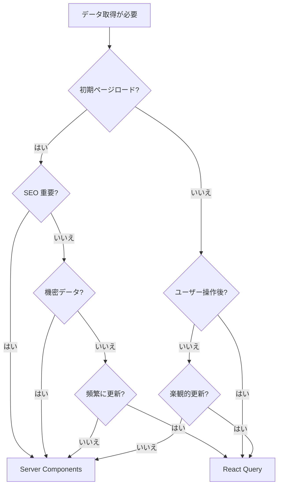

# Server Components vs React Query の使い分け

## 目次

- [概要](#概要)
- [比較表](#比較表)
- [判断フローチャート](#判断フローチャート)
- [Server Components を使うべきケース](#server-components-を使うべきケース)
  - [1. 初期ページロード](#1-初期ページロード)
  - [2. SEO が重要なコンテンツ](#2-seo-が重要なコンテンツ)
  - [3. 機密データへのアクセス](#3-機密データへのアクセス)
- [React Query を使うべきケース](#react-query-を使うべきケース)
  - [1. ユーザーインタラクション後のデータ取得](#1-ユーザーインタラクション後のデータ取得)
  - [2. リアルタイム性が求められるデータ](#2-リアルタイム性が求められるデータ)
  - [3. ページ遷移なしのデータ更新](#3-ページ遷移なしのデータ更新)
  - [4. 楽観的更新が必要な操作](#4-楽観的更新が必要な操作)
- [ハイブリッドパターン](#ハイブリッドパターン)
  - [Server Components + React Query の組み合わせ](#server-components--react-query-の組み合わせ)
  - [Prefetch パターン](#prefetch-パターン)
- [EC サイトでの具体例](#ec-サイトでの具体例)
  - [商品一覧ページ](#商品一覧ページ)
  - [商品詳細ページ](#商品詳細ページ)
  - [カート](#カート)
  - [お気に入り](#お気に入り)
  - [検索](#検索)
- [アンチパターン](#アンチパターン)
  - [1. すべてを React Query で取得](#1-すべてを-react-query-で取得)
  - [2. すべてを Server Components で取得](#2-すべてを-server-components-で取得)
  - [3. 同じデータを二重取得](#3-同じデータを二重取得)
- [まとめ](#まとめ)
- [次のステップ](#次のステップ)

## 概要

Next.js App Router では、Server Components でのデータ取得がデフォルトですが、すべてのケースで最適というわけではありません。
React Query（TanStack Query）と組み合わせることで、より良いユーザー体験を実現できます。

***

## 比較表

| 観点           | Server Components       | React Query       |
| ------------ | ----------------------- | ----------------- |
| 実行場所         | サーバー                    | ブラウザ              |
| 初期表示         | 速い（HTML に含まれる）          | ローディング状態あり        |
| SEO          | 有利                      | 追加対応が必要           |
| 機密データ        | 安全                      | 公開 API のみ         |
| インタラクション後の更新 | ページ遷移 or revalidate が必要 | その場で更新            |
| リアルタイム性      | ポーリングが難しい               | 簡単に実装可能           |
| 楽観的更新        | 実装が複雑                   | 組み込みサポート          |
| キャッシュ制御      | Next.js キャッシュ           | React Query キャッシュ |
| バンドルサイズ      | 小さい                     | ライブラリ分増加          |
| 開発者体験        | シンプル                    | DevTools で可視化     |

***

## 判断フローチャート



***

## Server Components を使うべきケース

### 1. 初期ページロード

商品一覧や商品詳細など、ページ表示時に最初から必要なデータ。

```typescript
// app/products/page.tsx
import { ProductList } from "@/components/product-list";

async function getProducts() {
  const response = await fetch("https://api.example.com/products", {
    next: { revalidate: 60 }, // 60秒キャッシュ
  });
  return response.json();
}

export default async function ProductsPage() {
  const products = await getProducts();

  return <ProductList products={products} />;
}
```

### 2. SEO が重要なコンテンツ

商品情報、ブログ記事、ランディングページなど。

```typescript
// app/products/[id]/page.tsx
import type { Metadata } from "next";

type Props = {
  params: Promise<{ id: string }>;
};

export async function generateMetadata({ params }: Props): Promise<Metadata> {
  const { id } = await params;
  const product = await getProduct(id);

  return {
    title: product.name,
    description: product.description,
    openGraph: {
      images: [product.image],
    },
  };
}
```

### 3. 機密データへのアクセス

データベース直接アクセスや、API シークレットが必要なリクエスト。

```typescript
// app/admin/orders/page.tsx
import { db } from "@/lib/db";

export default async function AdminOrdersPage() {
  // サーバーでのみ実行されるため、DB 接続情報は露出しない
  const orders = await db.order.findMany({
    include: { user: true, items: true },
  });

  return <OrderList orders={orders} />;
}
```

***

## React Query を使うべきケース

### 1. ユーザーインタラクション後のデータ取得

検索、フィルタリング、ソートなど。

```typescript
// components/product-search.tsx
"use client";

import { useQuery } from "@tanstack/react-query";
import { useState } from "react";

export function ProductSearch() {
  const [query, setQuery] = useState("");

  const { data, isLoading } = useQuery({
    queryKey: ["products", "search", query],
    queryFn: () => fetch(`/api/products/search?q=${query}`).then((r) => r.json()),
    enabled: query.length > 2, // 3文字以上で検索開始
  });

  return (
    <div>
      <input
        value={query}
        onChange={(e) => setQuery(e.target.value)}
        placeholder="商品を検索..."
      />
      {isLoading && <div>検索中...</div>}
      {data && <SearchResults products={data} />}
    </div>
  );
}
```

### 2. リアルタイム性が求められるデータ

在庫状況、カート内容、通知など。

```typescript
// hooks/use-stock.ts
"use client";

import { useQuery } from "@tanstack/react-query";

export function useStock(productId: string) {
  return useQuery({
    queryKey: ["stock", productId],
    queryFn: async () => {
      const response = await fetch(`/api/products/${productId}/stock`);
      return response.json();
    },
    // 30秒ごとにポーリング
    refetchInterval: 30 * 1000,
    // ウィンドウフォーカス時にも更新
    refetchOnWindowFocus: true,
  });
}
```

### 3. ページ遷移なしのデータ更新

モーダル内での操作、無限スクロール、タブ切り替えなど。

```typescript
// components/load-more-products.tsx
"use client";

import { useInfiniteQuery } from "@tanstack/react-query";

export function LoadMoreProducts() {
  const {
    data,
    fetchNextPage,
    hasNextPage,
    isFetchingNextPage,
  } = useInfiniteQuery({
    queryKey: ["products", "infinite"],
    queryFn: ({ pageParam = 1 }) =>
      fetch(`/api/products?page=${pageParam}`).then((r) => r.json()),
    getNextPageParam: (lastPage, pages) =>
      lastPage.hasMore ? pages.length + 1 : undefined,
  });

  return (
    <div>
      {data?.pages.map((page) =>
        page.products.map((product) => (
          <ProductCard key={product.id} product={product} />
        ))
      )}
      <button
        onClick={() => fetchNextPage()}
        disabled={!hasNextPage || isFetchingNextPage}
      >
        {isFetchingNextPage ? "読み込み中..." : "もっと見る"}
      </button>
    </div>
  );
}
```

### 4. 楽観的更新が必要な操作

カートへの追加、お気に入り登録など、即座に UI へ反映したい操作。

```typescript
// hooks/use-toggle-favorite.ts
"use client";

import { useMutation, useQueryClient } from "@tanstack/react-query";

export function useToggleFavorite() {
  const queryClient = useQueryClient();

  return useMutation({
    mutationFn: (productId: string) =>
      fetch(`/api/favorites/${productId}`, { method: "POST" }),

    onMutate: async (productId) => {
      await queryClient.cancelQueries({ queryKey: ["favorites"] });

      const previous = queryClient.getQueryData(["favorites"]);

      // 楽観的に UI を更新
      queryClient.setQueryData(["favorites"], (old: string[]) => {
        const isFavorite = old.includes(productId);
        return isFavorite
          ? old.filter((id) => id !== productId)
          : [...old, productId];
      });

      return { previous };
    },

    onError: (_err, _productId, context) => {
      queryClient.setQueryData(["favorites"], context?.previous);
    },
  });
}
```

***

## ハイブリッドパターン

### Server Components + React Query の組み合わせ

初期データは Server Components で取得し、クライアントサイドでの更新は React Query で行う。

```typescript
// app/cart/page.tsx
import { CartClient } from "./cart-client";

async function getCart() {
  const response = await fetch("https://api.example.com/cart", {
    cache: "no-store",
  });
  return response.json();
}

export default async function CartPage() {
  const initialCart = await getCart();

  // 初期データを Client Component に渡す
  return <CartClient initialCart={initialCart} />;
}
```

```typescript
// app/cart/cart-client.tsx
"use client";

import { useQuery } from "@tanstack/react-query";
import type { Cart } from "@/types/cart";

type Props = {
  initialCart: Cart;
};

export function CartClient({ initialCart }: Props) {
  const { data: cart } = useQuery({
    queryKey: ["cart"],
    queryFn: () => fetch("/api/cart").then((r) => r.json()),
    // Server Components から受け取った初期データ
    initialData: initialCart,
    // 常に最新を取得
    staleTime: 0,
  });

  return <CartContents cart={cart} />;
}
```

### Prefetch パターン

Server Components で React Query のキャッシュをプリフェッチする。

```typescript
// app/products/page.tsx
import {
  dehydrate,
  HydrationBoundary,
  QueryClient,
} from "@tanstack/react-query";
import { ProductListClient } from "./product-list-client";

async function getProducts() {
  const response = await fetch("https://api.example.com/products");
  return response.json();
}

export default async function ProductsPage() {
  const queryClient = new QueryClient();

  // サーバーでプリフェッチ
  await queryClient.prefetchQuery({
    queryKey: ["products"],
    queryFn: getProducts,
  });

  return (
    <HydrationBoundary state={dehydrate(queryClient)}>
      <ProductListClient />
    </HydrationBoundary>
  );
}
```

***

## EC サイトでの具体例

### 商品一覧ページ

| 機能       | 推奨          | 理由               |
| -------- | ----------- | ---------------- |
| 初期表示     | Server      | SEO、初期表示速度       |
| フィルタリング  | React Query | URL 変更なしで即座に反映   |
| ソート      | React Query | 同上               |
| ページネーション | Server      | URL に反映、SEO      |
| 無限スクロール  | React Query | useInfiniteQuery |

### 商品詳細ページ

| 機能      | 推奨          | 理由          |
| ------- | ----------- | ----------- |
| 商品情報    | Server      | SEO、OG 画像生成 |
| 在庫状況    | React Query | リアルタイム更新    |
| レビュー一覧  | Server      | SEO、初期表示    |
| レビュー投稿後 | React Query | 即座に反映       |

### カート

| 機能    | 推奨          | 理由                   |
| ----- | ----------- | -------------------- |
| カート取得 | ハイブリッド      | 初期は Server、更新は Query |
| 数量変更  | React Query | 楽観的更新                |
| 商品削除  | React Query | 楽観的更新                |

### お気に入り

| 機能      | 推奨          | 理由                |
| ------- | ----------- | ----------------- |
| お気に入り一覧 | Server      | 初期表示              |
| 追加/削除   | React Query | 楽観的更新、ハートアイコン即時反映 |

### 検索

| 機能    | 推奨          | 理由          |
| ----- | ----------- | ----------- |
| 検索結果  | React Query | インクリメンタルサーチ |
| サジェスト | React Query | 入力中に即時表示    |

***

## アンチパターン

### 1. すべてを React Query で取得

```typescript
// Bad: 初期表示が遅くなり、SEO も不利
export default function ProductsPage() {
  const { data, isLoading } = useProducts();

  if (isLoading) return <Loading />;
  return <ProductList products={data} />;
}
```

### 2. すべてを Server Components で取得

```typescript
// Bad: ユーザー操作後の更新でページ遷移が必要
export default async function CartPage() {
  const cart = await getCart();
  return <CartContents cart={cart} />;
}

// 数量変更するたびにページリロードが必要
```

### 3. 同じデータを二重取得

```typescript
// Bad: Server と Client で同じデータを取得
export default async function Page() {
  const data = await fetch("/api/data"); // Server で取得

  return <ClientComponent />; // Client でも同じデータを取得
}
```

***

## まとめ

| シナリオ                  | 推奨                |
| --------------------- | ----------------- |
| 初期ページロード + SEO 重要     | Server Components |
| ユーザー操作後の更新            | React Query       |
| リアルタイム性が必要            | React Query       |
| 楽観的更新が必要              | React Query       |
| 機密データへのアクセス           | Server Components |
| 初期表示 + クライアント更新の両方が必要 | ハイブリッド            |

***

## 次のステップ

Server Components と React Query の使い分けを理解したら、[演習 1: 商品データ API](./exercises/01-product-api.md) で実際に API を実装してみましょう。
