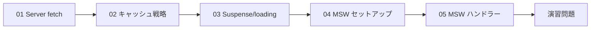
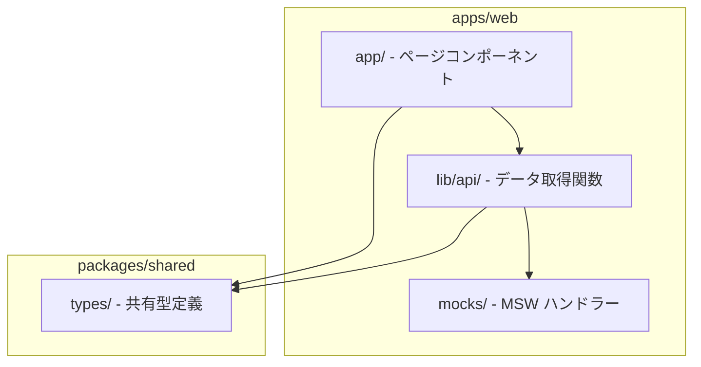

# Phase 5: データ取得 + MSW モック

## 目次

- [概要](#概要)
- [難易度](#難易度)
- [所要時間目安](#所要時間目安)
- [前提知識](#前提知識)
- [学習目標](#学習目標)
- [目次](#目次-1)
  - [学習フロー](#学習フロー)
- [演習問題](#演習問題)
- [作業場所](#作業場所)
- [使用ツール](#使用ツール)
- [関連する EC サイト機能](#関連する-ec-サイト機能)
- [推奨学習リソース](#推奨学習リソース)
  - [公式ドキュメント](#公式ドキュメント)
  - [参考記事](#参考記事)
- [自己チェックリスト](#自己チェックリスト)
- [次のフェーズ](#次のフェーズ)

## 概要

Server Components でのデータ取得と、MSW（Mock Service Worker）を使った API モックを習得するフェーズです。
バックエンド API がなくても開発を進められるよう、フロントエンド単体で動作するモック環境を構築します。

***

## 難易度

難易度: 3/5（中級）

Server Components での非同期処理とキャッシュの概念理解が必要です。MSW の設定は初めてだと戸惑いやすいですが、一度理解すれば再利用しやすいパターンです。

***

## 所要時間目安

約 8〜10 時間です。

***

## 前提知識

- Phase 1〜4 を完了していること
- Server Components と Client Components の違いを理解していること
- async/await の基本的な使い方を知っていること
- TypeScript の基本を理解していること

***

## 学習目標

このフェーズを完了すると、以下ができるようになります。

- [ ] Server Components で fetch を使ってデータを取得できる
- [ ] キャッシュ戦略（force-cache, no-store, revalidate）を使い分けられる
- [ ] Suspense と loading.tsx でローディング状態を実装できる
- [ ] MSW をプロジェクトにセットアップできる
- [ ] MSW ハンドラーで API モックを作成できる
- [ ] 商品一覧・詳細・検索の API モックを実装できる

***

## 目次

1. [Server Components での fetch](./01-server-fetch.md)
2. [キャッシュ戦略](./02-cache-strategies.md)
3. [Suspense と loading](./03-suspense-loading.md)
4. [MSW セットアップ](./04-msw-setup.md)
5. [MSW ハンドラー作成](./05-msw-handlers.md)

### 学習フロー

***

## 演習問題

- [演習 1: 商品データ API](./exercises/01-product-api.md)
- [演習 2: カテゴリ API](./exercises/02-category-api.md)
- [演習 3: 検索 API](./exercises/03-search-api.md)

***

## 作業場所

***

## 使用ツール

| ツール        | バージョン | 用途                           |
| ---------- | ----- | ---------------------------- |
| Next.js    | 16+   | App Router、Server Components |
| MSW        | 2.x   | API モック                      |
| Zod        | 4.x   | レスポンスバリデーション                 |
| TypeScript | 5.9+  | 型安全なデータ取得                    |

***

## 関連する EC サイト機能

| EC 機能  | 対応トピック       | 実装内容          |
| ------ | ------------ | ------------- |
| 商品一覧表示 | Server fetch | 商品データの取得と表示   |
| 商品詳細   | 動的ルート        | 商品 ID による詳細取得 |
| カテゴリ   | キャッシュ戦略      | 長期キャッシュで高速表示  |
| 商品検索   | MSW ハンドラー    | 検索 API のモック   |
| 在庫状況   | no-store     | リアルタイムデータ取得   |

***

## 推奨学習リソース

### 公式ドキュメント

- [Next.js Data Fetching](https://nextjs.org/docs/app/building-your-application/data-fetching)
- [Next.js Caching](https://nextjs.org/docs/app/building-your-application/caching)
- [React Suspense](https://react.dev/reference/react/Suspense)
- [MSW ドキュメント](https://mswjs.io/docs/)

### 参考記事

- [Next.js App Router でのデータ取得パターン](https://zenn.dev/topics/nextjs)
- [MSW でフロントエンド開発を加速する](https://zenn.dev/topics/msw)

***

## 自己チェックリスト

Phase 5 を完了する前に、以下を確認してください。

- [ ] Server Components で async/await を使ってデータ取得できる
- [ ] cache オプションの違い（force-cache, no-store, revalidate）を説明できる
- [ ] revalidatePath と revalidateTag の使い分けを理解している
- [ ] loading.tsx と Suspense の関係を説明できる
- [ ] MSW のブラウザ用と Node.js 用の設定を理解している
- [ ] パスパラメータとクエリパラメータを含むハンドラーを書ける
- [ ] 商品一覧・詳細・検索の API モックが動作している

***

## 次のフェーズ

Phase 5 を完了したら、[Phase 6: テスト駆動開発](../phase-06-testing/README.md) に進みましょう。
