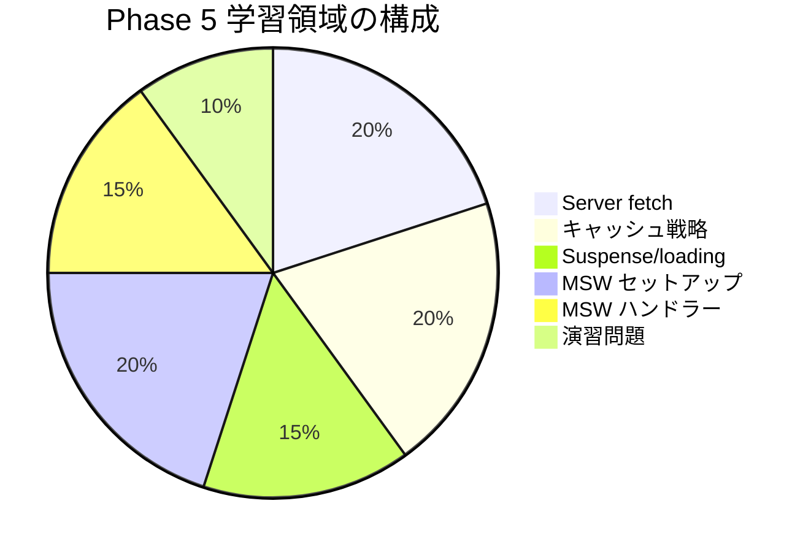

# Phase 5: 自己チェックリスト

Phase 5 の理解度を確認するためのチェックリストです。
各項目を確認し、自信を持って「はい」と答えられるか確認してください。

## 目次

- [学習領域の概要](#学習領域の概要)
- [Server Components での fetch](#server-components-での-fetch)
  - [理解度チェック](#理解度チェック)
  - [確認質問](#確認質問)
- [キャッシュ戦略](#キャッシュ戦略)
  - [理解度チェック](#理解度チェック-1)
  - [確認質問](#確認質問-1)
- [Suspense と loading](#suspense-と-loading)
  - [理解度チェック](#理解度チェック-2)
  - [確認質問](#確認質問-2)
- [MSW セットアップ](#msw-セットアップ)
  - [理解度チェック](#理解度チェック-3)
  - [確認質問](#確認質問-3)
- [MSW ハンドラー](#msw-ハンドラー)
  - [理解度チェック](#理解度チェック-4)
  - [確認質問](#確認質問-4)
- [演習問題](#演習問題)
  - [実装チェック](#実装チェック)
  - [コードレビュー観点](#コードレビュー観点)
- [実践確認](#実践確認)
  - [操作チェック](#操作チェック)
- [総合評価](#総合評価)
  - [達成度の目安](#達成度の目安)
- [振り返りチェック](#振り返りチェック)
- [次のステップ](#次のステップ)

## 学習領域の概要

---

## Server Components での fetch

### 理解度チェック

- [ ] Server Components で async/await を使ってデータ取得できる
- [ ] Server fetch と Client fetch の違いを説明できる
- [ ] fetch ロジックを別ファイルに分離するメリットを理解している
- [ ] Zod でレスポンスをバリデーションできる
- [ ] notFound() を使って 404 ページを表示できる

### 確認質問

1. Server Components で fetch するメリットは何ですか？

   **回答例**: API キーを隠せる、データ込み HTML で SEO に有利、初期表示が速い

2. `response.json()` の戻り値の型を保証するにはどうしますか？

   **回答例**: Zod でスキーマを定義し、`schema.parse(data)` でバリデーションする

---

## キャッシュ戦略

### 理解度チェック

- [ ] `cache: 'force-cache'` の動作を説明できる
- [ ] `cache: 'no-store'` をいつ使うか判断できる
- [ ] `next: { revalidate: N }` で ISR を設定できる
- [ ] `next: { tags: [...] }` でタグベース再検証を設定できる
- [ ] revalidatePath と revalidateTag の違いを説明できる

### 確認質問

1. 在庫状況を取得する API にはどのキャッシュ設定を使いますか？

   **回答例**: `cache: 'no-store'`。在庫はリアルタイム性が必要なため

2. 商品を更新した後、一覧と詳細のキャッシュを更新するにはどうしますか？

   **回答例**: `revalidateTag('products')` と `revalidateTag('product-${id}')` を呼び出す

---

## Suspense と loading

### 理解度チェック

- [ ] loading.tsx の役割を説明できる
- [ ] Suspense 境界を自分で設定できる
- [ ] Skeleton コンポーネントを設計できる
- [ ] 複数の Suspense 境界を配置して並列ロードを実現できる

### 確認質問

1. loading.tsx と Suspense の違いは何ですか？

   **回答例**: loading.tsx はルート全体、Suspense は任意の範囲に境界を設定できる

2. Streaming SSR のメリットは何ですか？

   **回答例**: シェルを先に返せるため TTFB が短縮し、FCP が改善する

---

## MSW セットアップ

### 理解度チェック

- [ ] MSW をインストールできる
- [ ] Service Worker を生成できる（`msw init`）
- [ ] mocks/ ディレクトリ構成を理解している
- [ ] Node.js 用（setupServer）とブラウザ用（setupWorker）の違いを説明できる
- [ ] instrumentation.ts で MSW を初期化できる

### 確認質問

1. Server Components で MSW を使うにはどちらを使いますか？

   **回答例**: `setupServer`（msw/node）を使う

2. 開発環境でのみ MSW を有効にするにはどうしますか？

   **回答例**: `process.env.NODE_ENV === 'development'` で条件分岐する

---

## MSW ハンドラー

### 理解度チェック

- [ ] http.get / http.post / http.put / http.delete の使い分けができる
- [ ] パスパラメータ（:id）を取得できる
- [ ] クエリパラメータ（?key=value）を取得できる
- [ ] リクエストボディを処理できる
- [ ] エラーレスポンス（404, 500）を返せる
- [ ] delay() で遅延レスポンスを設定できる

### 確認質問

1. `/api/products/:id` の `:id` を取得するにはどうしますか？

   **回答例**: `({ params }) => { const { id } = params; ... }`

2. 検索クエリ `/api/search?q=keyword` の `q` を取得するにはどうしますか？

   **回答例**: `const url = new URL(request.url); const q = url.searchParams.get('q');`

---

## 演習問題

### 実装チェック

- [ ] 商品一覧・詳細 API のモックを作成した
- [ ] カテゴリ一覧 API のモックを作成した
- [ ] 検索 API のモックを作成した
- [ ] 各ページのキャッシュ戦略をデータ特性に応じて設定した
- [ ] loading.tsx で Skeleton を表示した
- [ ] not-found.tsx で 404 ページを表示した

### コードレビュー観点

- [ ] 型定義が適切か（Product, Category, SearchResult など）
- [ ] データ取得関数が lib/api/ に分離されているか
- [ ] キャッシュ戦略がデータの特性に合っているか
- [ ] エラーハンドリングが適切か

---

## 実践確認

### 操作チェック

- [ ] `pnpm dev` で開発サーバーが起動し、MSW が有効になる
- [ ] 商品一覧ページで商品が表示される
- [ ] 商品詳細ページで詳細情報が表示される
- [ ] カテゴリナビゲーションが動作する
- [ ] 検索フォームで商品を検索できる
- [ ] 存在しない ID/スラッグで 404 ページが表示される
- [ ] ローディング中に Skeleton が表示される

---

## 総合評価

### 達成度の目安

| 達成率    | 評価                                   |
| --------- | -------------------------------------- |
| 90% 以上  | 完璧！Phase 6 に進みましょう           |
| 70% - 89% | 良好。不安な部分を復習してから進む     |
| 50% - 69% | 該当するドキュメントを再読してください |
| 50% 未満  | 最初からもう一度取り組みましょう       |

---

## 振り返りチェック

以下の質問に自分の言葉で答えられますか？

1. **なぜ Server Components でデータを取得するのか**
   - API キーの保護
   - SEO 対策
   - パフォーマンス

2. **キャッシュ戦略をどのように決めるか**
   - データの更新頻度
   - リアルタイム性の必要性
   - パフォーマンス要件

3. **MSW を使うメリットは何か**
   - バックエンド不要で開発
   - 実際の fetch を使うためコード変更不要
   - テストでも再利用可能

4. **Suspense を使う利点は何か**
   - 宣言的なローディング状態管理
   - 並列データ取得
   - Streaming SSR の活用

---

## 次のステップ

チェックリストを確認して理解度に自信が持てたら、[Phase 6: テスト駆動開発](../phase-06-testing/README.md) に進みましょう。
