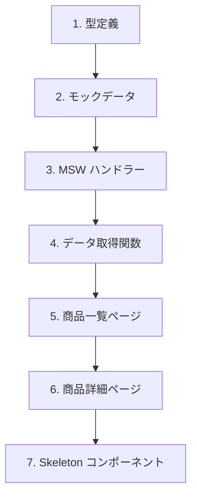

# 演習 1: 商品データ API

## 目次

- [目標](#目標)
- [前提条件](#前提条件)
- [実装する機能](#実装する機能)
- [ステップ 1: 型定義](#ステップ-1-型定義)
  - [1.1 商品の型を定義](#11-商品の型を定義)
- [ステップ 2: モックデータ](#ステップ-2-モックデータ)
  - [2.1 ディレクトリ作成](#21-ディレクトリ作成)
  - [2.2 商品データを作成](#22-商品データを作成)
- [ステップ 3: MSW ハンドラー](#ステップ-3-msw-ハンドラー)
  - [3.1 商品ハンドラーを作成](#31-商品ハンドラーを作成)
  - [3.2 ハンドラーを集約](#32-ハンドラーを集約)
  - [3.3 サーバー設定を作成](#33-サーバー設定を作成)
  - [3.4 instrumentation.ts を設定](#34-instrumentationts-を設定)
  - [3.5 next.config.ts を更新](#35-nextconfigts-を更新)
- [ステップ 4: データ取得関数](#ステップ-4-データ取得関数)
  - [4.1 API クライアントを作成](#41-api-クライアントを作成)
- [ステップ 5: 商品一覧ページ](#ステップ-5-商品一覧ページ)
  - [5.1 商品カードコンポーネント](#51-商品カードコンポーネント)
  - [5.2 商品一覧ページ](#52-商品一覧ページ)
- [ステップ 6: 商品詳細ページ](#ステップ-6-商品詳細ページ)
  - [6.1 商品詳細ページを作成](#61-商品詳細ページを作成)
  - [6.2 not-found.tsx を作成](#62-not-foundtsx-を作成)
- [ステップ 7: Skeleton コンポーネント](#ステップ-7-skeleton-コンポーネント)
  - [7.1 商品カード Skeleton](#71-商品カード-skeleton)
  - [7.2 商品一覧 loading.tsx](#72-商品一覧-loadingtsx)
  - [7.3 商品詳細 loading.tsx](#73-商品詳細-loadingtsx)
- [確認チェックリスト](#確認チェックリスト)
- [トラブルシューティング](#トラブルシューティング)
  - [MSW が動作しない](#msw-が動作しない)
  - [画像が表示されない](#画像が表示されない)
- [発展課題](#発展課題)
- [完了条件](#完了条件)

## 目標

商品一覧・詳細 API のモックを作成し、Server Components でデータを取得して表示します。

***

## 前提条件

以下が完了していることを確認してください。

```bash
# MSW がインストールされている
pnpm list msw

# Service Worker が生成されている
ls public/mockServiceWorker.js
```

***

## 実装する機能



***

## ステップ 1: 型定義

### 1.1 商品の型を定義

```typescript
// types/product.ts
export type Product = {
  id: string;
  name: string;
  description: string;
  price: number;
  imageUrl: string;
  categoryId: string;
  stock: number;
  createdAt: string;
};
```

***

## ステップ 2: モックデータ

### 2.1 ディレクトリ作成

```bash
mkdir -p mocks/data
mkdir -p mocks/handlers
```

### 2.2 商品データを作成

```typescript
// mocks/data/products.ts
import type { Product } from "@/types/product";

export const products: Product[] = [
  {
    id: "1",
    name: "プレミアムコーヒー豆 200g",
    description:
      "厳選されたアラビカ種100%のコーヒー豆。深煎りで香り高く、酸味と苦味のバランスが絶妙です。",
    price: 2500,
    imageUrl: "/images/products/coffee.jpg",
    categoryId: "food",
    stock: 50,
    createdAt: "2024-01-01T00:00:00Z",
  },
  {
    id: "2",
    name: "オーガニック緑茶 100g",
    description: "無農薬栽培の一番茶を使用した緑茶。豊かな甘みと深い味わいが特徴です。",
    price: 1800,
    imageUrl: "/images/products/tea.jpg",
    categoryId: "food",
    stock: 30,
    createdAt: "2024-01-02T00:00:00Z",
  },
  {
    id: "3",
    name: "ワイヤレスイヤホン Pro",
    description: "ノイズキャンセリング機能搭載のワイヤレスイヤホン。最大24時間の連続再生が可能。",
    price: 15800,
    imageUrl: "/images/products/earphone.jpg",
    categoryId: "electronics",
    stock: 20,
    createdAt: "2024-01-03T00:00:00Z",
  },
  {
    id: "4",
    name: "スマートウォッチ X1",
    description: "健康管理機能が充実したスマートウォッチ。心拍数、睡眠、歩数を24時間モニタリング。",
    price: 29800,
    imageUrl: "/images/products/watch.jpg",
    categoryId: "electronics",
    stock: 15,
    createdAt: "2024-01-04T00:00:00Z",
  },
  {
    id: "5",
    name: "オーガニックハンドクリーム",
    description: "天然由来成分100%のハンドクリーム。しっとりとした使い心地で手荒れを防ぎます。",
    price: 1200,
    imageUrl: "/images/products/cream.jpg",
    categoryId: "beauty",
    stock: 100,
    createdAt: "2024-01-05T00:00:00Z",
  },
  {
    id: "6",
    name: "アロマディフューザー",
    description: "超音波式のアロマディフューザー。LEDライト付きでインテリアとしても。",
    price: 4500,
    imageUrl: "/images/products/diffuser.jpg",
    categoryId: "lifestyle",
    stock: 40,
    createdAt: "2024-01-06T00:00:00Z",
  },
  {
    id: "7",
    name: "レザートートバッグ",
    description: "本革を使用した上質なトートバッグ。A4サイズが入るビジネスにも使える大きさ。",
    price: 18000,
    imageUrl: "/images/products/bag.jpg",
    categoryId: "fashion",
    stock: 10,
    createdAt: "2024-01-07T00:00:00Z",
  },
  {
    id: "8",
    name: "ステンレスタンブラー 500ml",
    description: "真空断熱構造のタンブラー。保温保冷効果が長時間持続します。",
    price: 3200,
    imageUrl: "/images/products/tumbler.jpg",
    categoryId: "lifestyle",
    stock: 80,
    createdAt: "2024-01-08T00:00:00Z",
  },
];
```

***

## ステップ 3: MSW ハンドラー

### 3.1 商品ハンドラーを作成

```typescript
// mocks/handlers/products.ts
import { http, HttpResponse } from "msw";
import { products } from "../data/products";

export const productHandlers = [
  // 商品一覧
  http.get("/api/products", ({ request }) => {
    const url = new URL(request.url);
    const categoryId = url.searchParams.get("categoryId");

    let filteredProducts = [...products];

    if (categoryId) {
      filteredProducts = filteredProducts.filter((p) => p.categoryId === categoryId);
    }

    return HttpResponse.json(filteredProducts);
  }),

  // 商品詳細
  http.get("/api/products/:id", ({ params }) => {
    const product = products.find((p) => p.id === params.id);

    if (!product) {
      return HttpResponse.json({ error: "Product not found" }, { status: 404 });
    }

    return HttpResponse.json(product);
  }),
];
```

### 3.2 ハンドラーを集約

```typescript
// mocks/handlers/index.ts
import { productHandlers } from "./products";

export const handlers = [...productHandlers];
```

### 3.3 サーバー設定を作成

```typescript
// mocks/server.ts
import { setupServer } from "msw/node";
import { handlers } from "./handlers";

export const server = setupServer(...handlers);
```

### 3.4 instrumentation.ts を設定

```typescript
// instrumentation.ts
export async function register(): Promise<void> {
  if (process.env.NEXT_RUNTIME === "nodejs") {
    if (process.env.NODE_ENV === "development") {
      const { server } = await import("./mocks/server");
      server.listen({
        onUnhandledRequest: "bypass",
      });
      console.log("🔶 MSW server started");
    }
  }
}
```

### 3.5 next.config.ts を更新

```typescript
// next.config.ts
import type { NextConfig } from "next";

const nextConfig: NextConfig = {
  experimental: {
    instrumentationHook: true,
  },
};

export default nextConfig;
```

***

## ステップ 4: データ取得関数

### 4.1 API クライアントを作成

```typescript
// lib/api/products.ts
import type { Product } from "@/types/product";

const API_BASE_URL = process.env.API_BASE_URL || "http://localhost:3000";

export async function getProducts(categoryId?: string): Promise<Product[]> {
  const url = new URL(`${API_BASE_URL}/api/products`);

  if (categoryId) {
    url.searchParams.set("categoryId", categoryId);
  }

  const response = await fetch(url.toString(), {
    next: { revalidate: 60, tags: ["products"] },
  });

  if (!response.ok) {
    throw new Error(`Failed to fetch products: ${response.status}`);
  }

  return response.json() as Promise<Product[]>;
}

export async function getProduct(id: string): Promise<Product> {
  const response = await fetch(`${API_BASE_URL}/api/products/${id}`, {
    next: { tags: ["products", `product-${id}`] },
  });

  if (!response.ok) {
    if (response.status === 404) {
      throw new Error("Product not found");
    }
    throw new Error(`Failed to fetch product: ${response.status}`);
  }

  return response.json() as Promise<Product>;
}
```

***

## ステップ 5: 商品一覧ページ

### 5.1 商品カードコンポーネント

```tsx
// components/ProductCard.tsx
import Image from "next/image";
import Link from "next/link";
import type { Product } from "@/types/product";

type Props = {
  product: Product;
};

export function ProductCard({ product }: Props): React.ReactElement {
  return (
    <Link
      href={`/products/${product.id}`}
      className="group block overflow-hidden rounded-lg border border-gray-200 transition-shadow hover:shadow-lg"
    >
      <div className="relative aspect-square bg-gray-100">
        <Image
          src={product.imageUrl}
          alt={product.name}
          fill
          className="object-cover transition-transform group-hover:scale-105"
        />
      </div>
      <div className="p-4">
        <h3 className="font-medium text-gray-900 transition-colors group-hover:text-blue-600">
          {product.name}
        </h3>
        <p className="mt-1 text-lg font-bold text-gray-900">¥{product.price.toLocaleString()}</p>
        {product.stock === 0 && <p className="mt-1 text-sm text-red-600">在庫切れ</p>}
      </div>
    </Link>
  );
}
```

### 5.2 商品一覧ページ

```tsx
// app/products/page.tsx
import { getProducts } from "@/lib/api/products";
import { ProductCard } from "@/components/ProductCard";

export default async function ProductsPage(): Promise<React.ReactElement> {
  const products = await getProducts();

  return (
    <main className="container mx-auto px-4 py-8">
      <h1 className="mb-8 text-3xl font-bold">商品一覧</h1>

      <div className="grid grid-cols-1 gap-6 sm:grid-cols-2 lg:grid-cols-4">
        {products.map((product) => (
          <ProductCard
            key={product.id}
            product={product}
          />
        ))}
      </div>
    </main>
  );
}
```

***

## ステップ 6: 商品詳細ページ

### 6.1 商品詳細ページを作成

```tsx
// app/products/[id]/page.tsx
import Image from "next/image";
import { notFound } from "next/navigation";
import { getProduct } from "@/lib/api/products";

type Props = {
  params: Promise<{ id: string }>;
};

export default async function ProductDetailPage({ params }: Props): Promise<React.ReactElement> {
  const { id } = await params;

  let product;
  try {
    product = await getProduct(id);
  } catch (error) {
    if (error instanceof Error && error.message === "Product not found") {
      notFound();
    }
    throw error;
  }

  return (
    <main className="container mx-auto px-4 py-8">
      <div className="grid grid-cols-1 gap-8 md:grid-cols-2">
        <div className="relative aspect-square overflow-hidden rounded-lg bg-gray-100">
          <Image
            src={product.imageUrl}
            alt={product.name}
            fill
            className="object-cover"
            priority
          />
        </div>

        <div>
          <h1 className="text-3xl font-bold">{product.name}</h1>

          <p className="mt-4 text-3xl font-bold text-blue-600">¥{product.price.toLocaleString()}</p>

          <p className="mt-6 leading-relaxed text-gray-600">{product.description}</p>

          <div className="mt-6">
            {product.stock > 0 ? (
              <p className="text-green-600">在庫あり（残り {product.stock} 個）</p>
            ) : (
              <p className="text-red-600">在庫切れ</p>
            )}
          </div>

          <button
            className="mt-8 w-full rounded-lg bg-blue-600 px-6 py-3 font-medium text-white transition-colors hover:bg-blue-700 disabled:cursor-not-allowed disabled:bg-gray-300"
            disabled={product.stock === 0}
          >
            カートに追加
          </button>
        </div>
      </div>
    </main>
  );
}
```

### 6.2 not-found.tsx を作成

```tsx
// app/products/[id]/not-found.tsx
import Link from "next/link";

export default function ProductNotFound(): React.ReactElement {
  return (
    <main className="container mx-auto px-4 py-16 text-center">
      <h1 className="text-2xl font-bold text-gray-900">商品が見つかりません</h1>
      <p className="mt-4 text-gray-600">お探しの商品は存在しないか、削除された可能性があります。</p>
      <Link
        href="/products"
        className="mt-8 inline-block rounded-lg bg-blue-600 px-6 py-3 text-white transition-colors hover:bg-blue-700"
      >
        商品一覧に戻る
      </Link>
    </main>
  );
}
```

***

## ステップ 7: Skeleton コンポーネント

### 7.1 商品カード Skeleton

```tsx
// components/ProductCardSkeleton.tsx
export function ProductCardSkeleton(): React.ReactElement {
  return (
    <div className="animate-pulse overflow-hidden rounded-lg border border-gray-200">
      <div className="aspect-square bg-gray-200" />
      <div className="p-4">
        <div className="h-5 w-3/4 rounded bg-gray-200" />
        <div className="mt-2 h-6 w-1/3 rounded bg-gray-200" />
      </div>
    </div>
  );
}
```

### 7.2 商品一覧 loading.tsx

```tsx
// app/products/loading.tsx
import { ProductCardSkeleton } from "@/components/ProductCardSkeleton";

export default function ProductsLoading(): React.ReactElement {
  return (
    <main className="container mx-auto px-4 py-8">
      <div className="mb-8 h-9 w-32 animate-pulse rounded bg-gray-200" />

      <div className="grid grid-cols-1 gap-6 sm:grid-cols-2 lg:grid-cols-4">
        {Array.from({ length: 8 }).map((_, i) => (
          <ProductCardSkeleton key={i} />
        ))}
      </div>
    </main>
  );
}
```

### 7.3 商品詳細 loading.tsx

```tsx
// app/products/[id]/loading.tsx
export default function ProductDetailLoading(): React.ReactElement {
  return (
    <main className="container mx-auto px-4 py-8">
      <div className="grid animate-pulse grid-cols-1 gap-8 md:grid-cols-2">
        <div className="aspect-square rounded-lg bg-gray-200" />

        <div>
          <div className="h-9 w-3/4 rounded bg-gray-200" />
          <div className="mt-4 h-9 w-1/4 rounded bg-gray-200" />
          <div className="mt-6 space-y-2">
            <div className="h-4 rounded bg-gray-200" />
            <div className="h-4 rounded bg-gray-200" />
            <div className="h-4 w-2/3 rounded bg-gray-200" />
          </div>
          <div className="mt-6 h-5 w-1/3 rounded bg-gray-200" />
          <div className="mt-8 h-12 rounded bg-gray-200" />
        </div>
      </div>
    </main>
  );
}
```

***

## 確認チェックリスト

以下を確認してください。

- [ ] `pnpm dev` で開発サーバーが起動する
- [ ] `/products` で商品一覧が表示される
- [ ] `/products/1` で商品詳細が表示される
- [ ] 存在しない ID でアクセスすると 404 ページが表示される
- [ ] ローディング中に Skeleton が表示される
- [ ] コンソールに「🔶 MSW server started」が表示される

***

## トラブルシューティング

### MSW が動作しない

1. `instrumentation.ts` が正しく設定されているか確認
2. `next.config.ts` で `instrumentationHook: true` が設定されているか確認
3. 開発サーバーを再起動

### 画像が表示されない

`next.config.ts` で画像ドメインを許可します。

```typescript
const nextConfig: NextConfig = {
  images: {
    remotePatterns: [
      {
        protocol: "https",
        hostname: "example.com",
      },
    ],
  },
};
```

またはプレースホルダー画像を使用します。

```typescript
imageUrl: "https://via.placeholder.com/400",
```

***

## 発展課題

1. **ページネーション**: 商品一覧にページネーションを追加
2. **ソート機能**: 価格順、新着順のソート
3. **関連商品**: 商品詳細ページに同じカテゴリの関連商品を表示

***

## 完了条件

以下がすべて動作すれば、この演習は完了です。

- 商品一覧ページで 8 件の商品が表示される
- 商品カードをクリックすると詳細ページに遷移
- 存在しない ID で 404 ページが表示される
- ローディング中に Skeleton が表示される

次は [演習 2: カテゴリ API](./02-category-api.md) に進みましょう。
